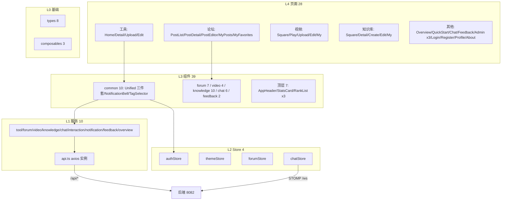

# 前端应用

## 模块概述

前端是 Vue 3.4 + TypeScript 5.4 + Vite 5.2 构建的 SPA（端口 5173），特性：

- **严格分层**：types/composables (L0) → services (L1) → stores (L2) → components (L3) → pages (L4)，禁止反向依赖
- **双主题设计系统**：Cyberpunk Dark（#0D0D0D 底 + Cyan/Magenta/Matrix Green 强调）/ Glassmorphism Light，`themeStore` 切换，规范见 `design-system/`
- **统一交互组件**：UnifiedLikeButton / UnifiedFavoriteButton / UnifiedCommentSection 三件套对接后端统一互动 API，跨工具/帖子/视频复用
- **JWT 自动续期**：axios 拦截器 401 时静默 refresh 并重放请求（并发请求去重）
- **图标**：统一 @lucide/vue-next，禁止 emoji 图标

## 架构总览

## 路由结构 (`router/index.ts`)

| 路径 | 页面 | 说明 |
|------|------|------|
| `/` / `/tools/:id` / `/tools/upload` / `/me/tools/:id/edit` | 工具广场 | 首页列表、详情、发布、编辑 |
| `/forum` / `/forum/posts/:id` / `/forum/editor` / `/forum/my-*` | 论坛 | 帖子列表、详情、编辑器、我的帖子/收藏 |
| `/videos` / `/videos/:id` / `/videos/upload` / `/videos/my-*` | 微课 | 视频广场、播放、上传、我的 |
| `/knowledge` / `/knowledge/:id` / `/knowledge/create|edit|my` | 知识库 | 知识库广场、详情、管理 |
| `/chat` | 聊天室 | 全局实时聊天 |
| `/overview` / `/quickstart` / `/about` / `/feedback` | 平台 | 数据大屏、快速上手、关于、留言板 |
| `/admin/approvals|users|categories` | 管理后台 | 审批、用户、分类管理（ADMIN 路由守卫） |
| `/login` / `/register` / `/me/profile` | 账号 | 登录、注册、个人中心 |

## 分层组件详解

### L1 服务层 (services/)

- `api.ts` — axios 单例：`baseURL` 指向后端；请求拦截器注入 `Authorization: Bearer`；响应拦截器处理 401 → 静默 refresh（`refreshSubscribers` 队列防并发重复刷新）→ 重放原请求，刷新失败跳登录
- 领域服务：`tool.ts`、`forum.ts`（注意论坛前缀 `/api/forum` 不含 /v1）、`video.ts`、`knowledge.ts`、`interaction.ts`（统一互动）、`notification.ts`、`feedback.ts`、`overview.ts`、`chat.ts`（REST 历史消息 + STOMP 连接管理）

### L2 状态层 (stores/)

| Store | 职责 |
|-------|------|
| `authStore` | 用户信息、双令牌持久化（localStorage）、登录/登出、角色判定 |
| `themeStore` | 双主题切换（dark/light），CSS 变量驱动 |
| `forumStore` | 论坛列表筛选状态（分类/排序/关键词）跨页保持 |
| `chatStore` | STOMP 连接生命周期、消息列表、在线人数、typing 状态 |

### L3 关键组件

- **统一互动三件套**（common/）：`UnifiedLikeButton`、`UnifiedFavoriteButton`、`UnifiedCommentSection` —— 传入 `targetType + targetId` 即可用于任何内容类型；配套 `useInteraction` composable
- **NotificationBell**：未读数轮询 + 通知下拉列表
- **DanmakuPlayer / VideoPlayer**（video/）：HTML5 视频 + 弹幕轨道渲染（滚动/顶部/底部）
- **chat/ 6 组件**：ChatRoom（消息流 + 发送框）、MessageMarkdown（Markdown 渲染）、MessageReactions（emoji 回应）、ReplyQuote、TypingIndicator、ChatLauncher（全局悬浮入口）
- **knowledge/ 10 组件**：DocumentUpload（批量上传 + 状态轮询）、ChunkingPreviewPanel（分块预览）、ConfigPanel（检索参数配置）、KnowledgeSearch（语义搜索）等
- **GeneralizedSidebar**：工具/视频/知识库广场共用的分类+标签过滤侧栏

### L0 基础层

- `types/`（8 文件）：与后端 DTO 一一对应的 TypeScript 接口（tool/forum/video/knowledge/chat/feedback/overview/index）
- `composables/`：`useInteraction`（互动状态封装）、`useContentPermissions`（isOwner/isAdmin 权限判定）、`downloadBus`（下载事件总线）

## 设计系统要点

- 配色：暗色 `#0D0D0D` 底 + `#00FFFF` Cyan / `#FF00FF` Magenta / `#00FF00` Matrix Green；亮色玻璃拟态
- 字体：Fira Code（代码/数字）+ Fira Sans（正文）
- 所有新页面/组件必须适配双主题（CSS 变量），图标只用 @lucide/vue-next
- 完整规范：`design-system/CodingHub/MASTER.md`

## 关键设计决策

1. **互动组件泛化**：互动 UI 只写一次，`targetType` 参数化 —— 与后端统一互动模块一一对应
2. **静默令牌刷新**：401 拦截 + 请求队列重放，用户无感知；并发 401 只触发一次 refresh
3. **状态最小化**：仅认证/主题/论坛筛选/聊天连接入 Pinia，页面数据一律组件内 ref + service 拉取

## 与其他模块的关系

- 消费全部后端 REST API：[工具广场](工具广场.md)、[论坛社区](论坛社区.md)、[微课视频](微课视频.md)、[知识库与RAG](知识库与RAG.md)、[统一互动与通知](统一互动与通知.md)、[用户与认证](用户与认证.md)、[平台基础](平台基础.md)（overview）
- [实时聊天](实时聊天.md)：`@stomp/stompjs` 连接 `/ws`，订阅 `/topic/{roomId}`
