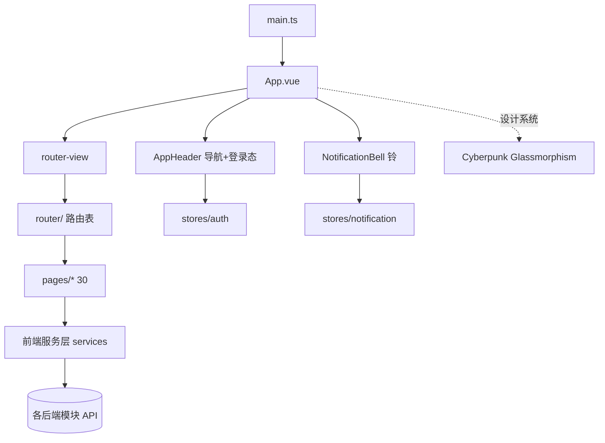
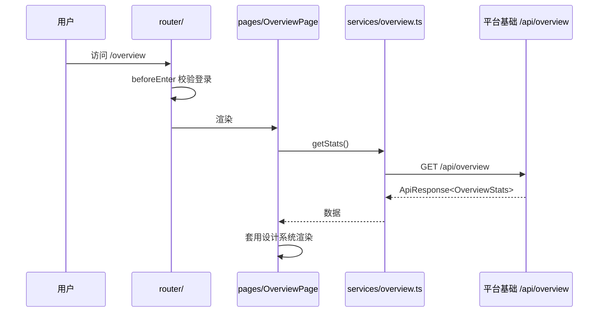

# 前端应用

前端应用是 CodingHub 的**单页应用（SPA）总装层**，对应模块树中的 **父模块**（含 [前端类型定义](前端类型定义.md) 与 [前端服务层](前端服务层.md) 两个子模块）。它以 `main.ts` 为入口，挂载 `App.vue`，由 Vue Router 驱动 `pages/` 渲染，并统一套用「Cyberpunk Glassmorphism」暗色设计系统。所有数据能力最终来自后端各模块 API。

## Component Constraint Index

| 组成 | 说明 | 依赖 |
|------|------|------|
| `main.ts` | 应用入口：挂载 App、注册 Router/Pinia、引入全局样式 | L0/L1 |
| `App.vue` | 根组件：布局壳（Header + `<router-view>` + 通知铃） | L3/L4 |
| `router/` | Vue Router：路径 ↔ 页面映射、登录守卫 | L4 |
| 设计系统 | Cyberpunk Glassmorphism 暗色（见下） | 全局 |

## 架构总览 (Architecture Overview)

## 组件职责 (Component Responsibilities)

### 入口与根组件

- `main.ts`：创建 Vue 应用，安装 Pinia（`stores/`）与 Vue Router（`router/`），引入全局 CSS（含设计系统变量、字体 `Fira Code`/`Fira Sans`）。
- `App.vue`：提供整体布局壳——顶部 `AppHeader.vue`（导航 + 登录/头像 + `NotificationBell`）、中部 `<router-view/>`、按需全局弹层；在 `onMounted` 拉取未读通知供铃铛展示。

### `router/`（路由与守卫）

- 路径映射到 `pages/`：首页 `HomePage`、概览 `OverviewPage`、上传 `UploadPage`、工具详情/编辑 `DetailPage`/`EditToolPage`、登录/注册 `LoginPage`/`RegisterPage`、个人资料 `ProfilePage`、聊天 `ChatPage`、以及 `admin/`、`forum/`、`video/`、`knowledge/`、`feedback/` 子路由。
- **登录守卫**：需鉴权页面在 `beforeEnter` 校验 `stores/auth` 是否已登录，未登录重定向 `LoginPage`。

### 设计系统（Cyberpunk Glassmorphism 暗色）

- 底色 `#0D0D0D` 深黑；强调色 `#00FFFF`(Cyan) / `#FF00FF`(Magenta) / `#00FF00`(Matrix Green)。
- 玻璃拟态卡片（半透明 + 模糊 + 霓虹描边），暗色为默认主题。
- 图标统一使用 `@lucide/vue-next`（禁 emoji 直出）；字体 `Fira Code`(等宽/代码) + `Fira Sans`(正文)。

**Business Constraints — 前端应用**

- 需鉴权路由统一由 Router 守卫拦截，页面自身不重复判登录 (confidence: 0.9)
  > Evidence: `router/` 的 `beforeEnter` 检查 `stores/auth.isLoggedIn`，未登录 `next('/login')`；页面组件不再各自判空。
- 设计系统为全局唯一视觉规范，组件不得自定义冲突配色/字体 (confidence: 0.9)
  > Evidence: 设计系统规定配色与 `Fira Code/Fira Sans` 字体、`@lucide/vue-next` 图标；组件复用 `AppHeader`/`StatsCard` 等统一件。
- 通知铃铛数据来自 `stores/notification`，与页面解耦 (confidence: 0.85)
  > Evidence: `App.vue` 在挂载时经 `notification` store 拉取未读，`NotificationBell` 仅渲染 store 状态，不直连 services。

## 数据流：一次页面访问

## 接口契约与副作用

- 页面只通过 `services/` 与后端交互，不直接 `fetch/axios`；契约由 [前端类型定义](前端类型定义.md) 约束。
- 副作用：登录态（`stores/auth`）、未读通知（`stores/notification`）、路由跳转。

## 依赖关系 (Cross-References)

- [前端类型定义](前端类型定义.md) — L0 类型根基。
- [前端服务层](前端服务层.md) — L1–L4 全部业务代码（services/stores/components/pages）。
- 后端全部模块 — 经 services 被本应用消费：
  - [工具广场](工具广场.md)、[论坛社区](论坛社区.md)、[微课视频](微课视频.md)、[知识库与RAG](知识库与RAG.md)、[留言反馈](留言反馈.md) 提供内容页；
  - [用户与认证](用户与认证.md) 支撑登录/守卫；
  - [统一互动与通知](统一互动与通知.md) 支撑点赞/收藏/通知铃；
  - [实时聊天](实时聊天.md) 支撑 `ChatPage`；
  - [平台基础](平台基础.md) 支撑 `OverviewPage` 统计与榜单。

## 约束、假设与边界情况

- SPA 下刷新会重新走 `main.ts`→Router 守卫；需后端对前端路由做 `history` 回退（或部署配置 `fallback` 到 `index.html`），否则深链刷新 404。
- 设计系统暗色为默认；若未来加亮色主题，须保持 `AppHeader`/`StatsCard` 等通用件同步适配。
- 路由懒加载（`() => import(...)`）用于按需加载 `pages/`，首屏不应一次性打包全部页面。
- `NotificationBell` 的轮询/订阅策略取决于 [统一互动与通知](统一互动与通知.md) 提供的机制（轮询或 WS），前端需与之匹配。
