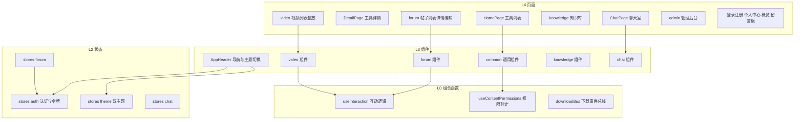
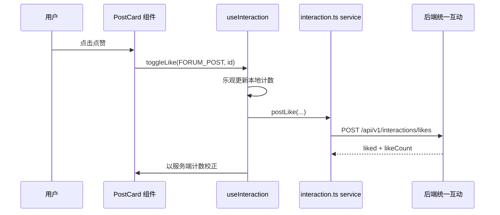

# 前端应用

## 模块概述

前端应用模块涵盖 Vue 3.4 + TypeScript 5.4 + Vite 5.2 单页应用的状态管理（Pinia stores）、组合式函数（composables）、页面（pages）与组件（components），是用户可见界面的全部实现。构建于 [前端服务层](前端服务层.md) 与 [前端类型定义](前端类型定义.md) 之上。

- **代码位置**: `frontend/src/`（stores/4、composables/3、pages/28、components/36+、router、App.vue、main.ts）
- **开发端口**: 5173（Vite dev server，`/api` 代理到后端 8082）
- **UI 体系**: Element Plus + 自研双主题设计系统（Cyberpunk Dark / Glassmorphism Light），图标 `@lucide/vue-next`，字体 Fira Code + Fira Sans

## 架构图

## 状态管理（Pinia stores）

| Store | 职责 |
|-------|------|
| `auth.ts` | accessToken / refreshToken（localStorage 持久化）、当前用户信息、login/logout/setTokens；被 [前端服务层](前端服务层.md) api.ts 拦截器读取 |
| `theme.ts` | 双主题切换（Cyberpunk Dark 默认 / Glassmorphism Light），持久化偏好，切换时挂载 CSS 变量类 |
| `forum.ts` | 论坛列表筛选状态（分类/标签/排序/页码）跨页面保持 |
| `chat.ts` | 聊天消息列表、在线人数、STOMP 连接状态、未读管理 |

## 组合式函数（composables）

| 函数 | 职责 |
|------|------|
| `useInteraction.ts` | 统一互动逻辑复用：点赞/收藏 toggle、评论提交、计数本地同步——工具/帖子/视频三域组件共用（对接 [统一互动与通知](统一互动与通知.md)） |
| `useContentPermissions.ts` | `isOwner || isAdmin` 前端判定（编辑/删除按钮显隐），与后端鉴权规则镜像 |
| `downloadBus.ts` | 跨组件下载事件总线（触发下载进度提示） |

## 页面地图（28 页）

| 路由域 | 页面 | 对应后端 |
|--------|------|---------|
| 工具 | HomePage（列表+筛选）、DetailPage、UploadPage、EditToolPage | [工具广场](工具广场.md) |
| 论坛 | forum/ PostListPage、PostDetailPage、PostEditorPage | [论坛社区](论坛社区.md) |
| 视频 | video/ 列表、播放页（弹幕层） | [微课视频](微课视频.md) |
| 知识库 | knowledge/ 列表、详情（文档管理+语义搜索） | [知识库与RAG](知识库与RAG.md) |
| 聊天 | ChatPage（STOMP 实时消息+表情回应） | [实时聊天](实时聊天.md) |
| 留言 | feedback/ 留言板 | [留言反馈](留言反馈.md) |
| 账户 | LoginPage、RegisterPage、ProfilePage（资料/头像/我的内容） | [用户与认证](用户与认证.md) |
| 管理 | admin/ 用户管理、审批 | 用户与认证（管理端） |
| 站点 | OverviewPage（统计大屏）、AboutPage、QuickStartPage、NotFoundPage | 平台基础概览 |

## 组件体系（36+）

- **全局**: `AppHeader`（导航/搜索/通知铃铛/主题切换/用户菜单）、`UserAvatar`、`AuthorBadge`
- **概览**: `StatsCard`、`ToolRankList`、`PostRankList`、`VideoRankList`
- **common/**: 通用评论列表、确认弹窗、空状态、分页等跨域复用组件
- **forum/**: `PostCard`、`CategoryFilter`、`CommentItem`、`CommentList`、`CommentEditor` 等
- **video/**: 播放器封装、弹幕输入/渲染层、视频卡片
- **knowledge/**: 知识库卡片、文档上传器（状态轮询）、搜索结果面板
- **chat/**: 消息气泡、表情回应选择器、在线列表
- **feedback/**: 留言卡片、提交表单

## 主题与设计系统

双主题通过 CSS 变量实现（`design-system/` 规范）：

| 主题 | 底色 | 强调色 |
|------|------|--------|
| Cyberpunk Dark（默认） | `#0D0D0D` | Cyan `#00FFFF` / Magenta `#FF00FF` / Matrix Green `#00FF00` |
| Glassmorphism Light | 浅色毛玻璃 | 同色系柔化 |

所有组件禁止硬编码颜色，统一引用 CSS 变量；图标统一 `@lucide/vue-next`（禁 emoji 图标）。

## 典型交互流（帖子点赞）

## 依赖关系

- **依赖 [前端服务层](前端服务层.md)**: 全部数据获取与提交
- **依赖 [前端类型定义](前端类型定义.md)**: props / 状态类型
- **分层规则**: pages(L4) → components(L3) → stores(L2) → services(L1) → types(L0)，禁止反向依赖（`scripts/lint-arch.sh` 检查）

## 设计要点

1. **互动逻辑单点复用**: `useInteraction` 让三个内容域的点赞/收藏行为完全一致，新增内容类型只需扩展 targetType
2. **乐观 UI**: 互动先本地更新再服务端校正，弱网体验流畅
3. **筛选状态入 store**: 论坛/工具列表筛选存 Pinia，详情页返回列表不丢上下文
4. **权限镜像**: 前端 `useContentPermissions` 仅控制 UI 显隐，真实鉴权始终在后端
