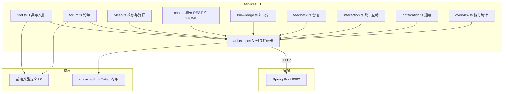
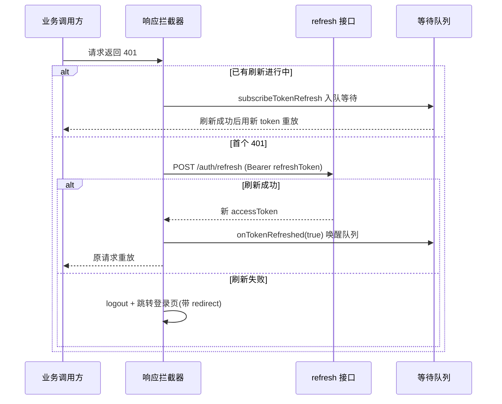

# 前端服务层

## 模块概述

前端服务层（`frontend/src/services/`，10 个文件）是前端 L1 层，封装全部后端 HTTP 通信：统一的 axios 实例（认证注入、401 自动刷新重放、错误提示）+ 按领域拆分的 API 函数集。上层（stores / 组件 / 页面）不直接触碰 axios。

- **组件数量**: 98 个（含各 service 导出的 API 函数）
- **基础地址**: `VITE_API_BASE_URL` 环境变量，默认 `/api/v1`（Vite dev 代理转发到 `localhost:8082`）

## 架构图

## 核心：api.ts（axios 基础设施）

### 请求拦截器

每个请求自动附加 `Authorization: Bearer {accessToken}`（从 auth store 读取，无 token 则匿名请求）。

### 响应拦截器 —— 401 自动刷新与请求重放

关键设计：

1. **并发去重**: `isRefreshing` 标志 + 订阅者队列，多个请求同时 401 只发一次 refresh，其余排队等结果
2. **`_retry` 防环**: 重放请求再 401 不再刷新，直接登出
3. **错误统一提示**: 403/404/500 等经 `ElMessage` 弹出后端 message，业务代码无需重复处理
4. **上传进度**: 暴露 `AxiosProgressEvent` 回调支持文件/视频上传进度条

## 领域 Service 一览

| 文件 | 后端前缀 | 要点 |
|------|---------|------|
| `tool.ts` | `/api/v1/tools`、`/api/v1/categories` | 工具 CRUD、multipart 附件上传（进度回调）、下载、Logo、置顶 |
| `forum.ts` | **`/api/forum/...`**（不含 /v1，全站唯一例外） | 帖子 CRUD、分类、标签、置顶；直连裸 `Page` 响应 |
| `video.ts` | `/api/v1/videos` | 上传（进度）、列表/详情、stream URL 构造、弹幕收发、封面 |
| `chat.ts` | `/api/v1/chat` + WS `/ws` | 历史消息 REST；STOMP 连接管理（token 挂 URL 参数）、订阅/发送封装 |
| `knowledge.ts` | `/api/v1/knowledge` | 知识库 CRUD、文档上传、状态轮询、语义搜索 |
| `interaction.ts` | `/api/v1/interactions` | 统一点赞/评论/收藏（targetType 参数化），配合 `useInteraction` composable |
| `notification.ts` | `/api/v1/notifications` | 列表、未读数轮询、已读标记 |
| `feedback.ts` | `/api/v1/feedback` | 留言列表/提交/回复/删除 |
| `overview.ts` | `/api/overview` | 统计与三类排行 |

## 约定与陷阱

1. **forum.ts 路径特殊**: 论坛接口**不含 `/v1`**，该 service 内使用完整路径覆盖 baseURL 前缀——修改时切勿"顺手统一"加 /v1（后端就是这样注册的）
2. **双响应形状**: 多数接口解包 `ApiResponse.data`；论坛接口直接消费裸对象——各 service 内部处理差异，调用方拿到的始终是干净的类型化数据
3. **WS 认证方式**: STOMP 无法带 Authorization 头，chat.ts 将 token 作为 `/ws?token=` URL 参数传递（后端握手拦截器解析）
4. **刷新接口绕过实例**: refresh 调用使用裸 `axios`（非 api 实例），避免拦截器递归

## 依赖关系

- **依赖 [前端类型定义](前端类型定义.md)**: 全部请求/响应类型签名
- **向上例外**: `api.ts` import 了 `stores/auth`（L2）与 `router`——分层上的已知妥协（拦截器需要 token 与跳转能力），除此之外 L1 不依赖上层
- **被依赖**: [前端应用](前端应用.md) 的 stores、composables（`useInteraction`）、全部页面组件
- **对端**: 各后端领域模块（[工具广场](工具广场.md)、[论坛社区](论坛社区.md)、[微课视频](微课视频.md)、[知识库与RAG](知识库与RAG.md)、[统一互动与通知](统一互动与通知.md)、[实时聊天](实时聊天.md)、[留言反馈](留言反馈.md)、[用户与认证](用户与认证.md)）
