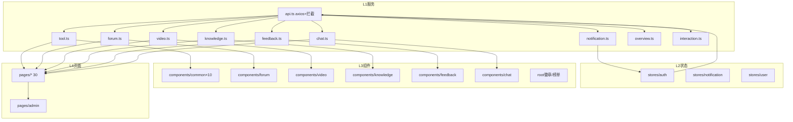
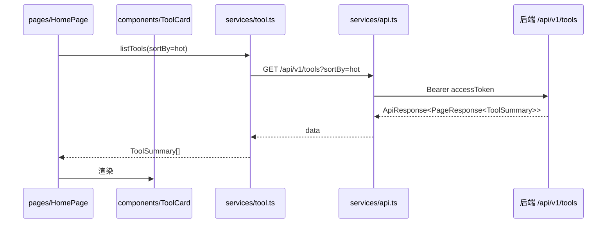

# 前端服务层

前端服务层涵盖 `frontend/src/` 下除 `types/`（见 [前端类型定义](前端类型定义.md)）之外的全部代码，对应前端分层的 **L1–L4**：`services/`(L1) → `stores/`(L2) → `components/`(L3) → `pages/`(L4)，另有 `composables/`、`router/`、`utils/` 与入口 `main.ts`/`App.vue`。它是整个前端“能动”的部分，负责调后端、管状态、渲染页面。

## Component Constraint Index

| 层 | 目录 | 文件数 | 依赖规则 |
|------|------|--------|----------|
| L1 | `services/`(10) | 10 `.ts` | 仅依赖 L0(types) |
| L2 | `stores/`(3) | 3(Pinia) | 依赖 L0,L1 |
| L3 | `components/`(46) | 46 `.vue` | 依赖 L0,L1,L2 |
| L4 | `pages/`(30) | 30 `.vue` | 依赖 L3 |

> `composables/`(2)、`router/`、`utils/`、`main.ts`、`App.vue` 为横切支撑，不计入主四层但被 L3/L4 引用。

## 架构总览 (Architecture Overview)

## 组件职责 (Component Responsibilities)

### `services/api.ts`（L1 基础）

- 创建 `axios` 实例，统一 `baseURL` 指向后端（`:8082`）；
- **请求拦截器**：自动附加 `Authorization: Bearer <accessToken>`（取自 `stores/auth`）；
- **响应拦截器**：解包 `ApiResponse<T>` 取 `data`；遇 `401` 用 `refreshToken` 静默换新（调 [用户与认证](用户与认证.md) 的 `/refresh`），失败则跳登录；
- 统一错误提示（读 `message`）。

### 领域服务（L1，每个映射一个后端模块）

| 文件 | 消费的后端 | 主要方法 |
|------|-----------|----------|
| `tool.ts` | [工具广场](工具广场.md) `/api/v1/tools` | `listTools/getTool/createTool/updateTool/deleteTool/uploadFiles` |
| `forum.ts` | [论坛社区](论坛社区.md) `/api/forum/*` | `listPosts/getPost/createPost/updatePost/deletePost` |
| `video.ts` | [微课视频](微课视频.md) `/api/v1/videos` | `listVideos/getVideo/uploadVideo/streamUrl/sendDanmaku` |
| `knowledge.ts` | [知识库与RAG](知识库与RAG.md) `/api/v1/knowledge` | `listBases/search/uploadDoc` |
| `feedback.ts` | [留言反馈](留言反馈.md) `/api/v1/feedback` | `listFeedback/submitFeedback/replyFeedback` |
| `chat.ts` | [实时聊天](实时聊天.md) | STOMP 连接/收发/Reaction |
| `notification.ts` | [统一互动与通知](统一互动与通知.md) | `listNotifications/unreadCount/markRead` |
| `overview.ts` | [平台基础](平台基础.md) `/api/overview` | `getStats/getRankings` |
| `interaction.ts` | [统一互动与通知](统一互动与通知.md) | `like/favorite/share` 统一互动 |

### `stores/`（L2, Pinia）

- `auth`：当前 `User`、令牌存取、登录/登出动作（驱动 `api.ts` 拦截器）。
- `notification`：未读计数与列表（轮询/订阅 [统一互动与通知](统一互动与通知.md)）。
- `user`：资料与头像缓存。

### `components/`（L3）与 `pages/`（L4）

- `common×10`：通用 UI（按钮、模态、加载、空态等）。
- 领域组件：`forum/`(PostCard/CategoryFilter/CommentList…)、`video/`(播放器/弹幕)、`knowledge/`(检索/文档)、`feedback/`(留言板)、`chat/`(聊天室)。
- 根组件：`AppHeader.vue`、`UserAvatar.vue`、`AuthorBadge.vue`、`StatsCard.vue`、`ToolRankList/PostRankList/VideoRankList.vue`（榜单，消费 `overview.ts`）。
- 页面：`HomePage/OverviewPage/UploadPage/DetailPage/EditToolPage/LoginPage/RegisterPage/ProfilePage/ChatPage` + `admin/`、`forum/`、`video/`、`knowledge/`、`feedback/` 子目录 + `NotFoundPage`。

**Business Constraints — 前端分层**

- 严格单向依赖：pages→components→stores→services→types，禁止反向或跨层越级 (confidence: 0.95)
  > Evidence: 分层规则明确 L0→L1→L2→L3→L4 单向；`services/api.ts` 只依赖 `types`，`components` 不直连 `services` 外的更底层越级。
- 所有鉴权令牌由 `api.ts` 拦截器统一注入，页面/组件不得自行拼接 Header (confidence: 0.9)
  > Evidence: `services/api.ts` 请求拦截器读取 `stores/auth` 的 `accessToken` 注入 `Bearer`；业务服务只关心业务参数。
- 401 由拦截器统一刷新而非各调用点处理 (confidence: 0.9)
  > Evidence: 响应拦截器对 `401` 调 `/api/v1/auth/refresh` 并重发，调用方无感知。
- 论坛接口路径**不含 `/v1`**，前端 `forum.ts` 须使用 `/api/forum/...` (confidence: 0.9)
  > Evidence: 与后端一致，`forum.ts` 的基地址/路径为 `/api/forum/posts` 等，区别于其它模块的 `/api/v1/`。

## 数据流：页面 → 服务 → 后端

## 接口契约与副作用

- 前端契约全部以 [前端类型定义](前端类型定义.md) 的接口为准；`api.ts` 把后端 `ApiResponse` 解包为 `T` 返回给上层。
- 副作用集中在 `stores`（写令牌/未读态）与 `services`（网络）。组件保持“纯展示 + 事件上抛”。

## 依赖关系 (Cross-References)

- [前端类型定义](前端类型定义.md) — 全部 L1+ 层的类型根基。
- 后端各模块：服务层按上表一一对应（[工具广场](工具广场.md)、[论坛社区](论坛社区.md)、[微课视频](微课视频.md)、[知识库与RAG](知识库与RAG.md)、[留言反馈](留言反馈.md)、[实时聊天](实时聊天.md)、[用户与认证](用户与认证.md)、[平台基础](平台基础.md)、[统一互动与通知](统一互动与通知.md)）。
- [前端应用](前端应用.md) — L4 页面如何经 `router/` 组装为单页应用。

## 约束、假设与边界情况

- `services/chat.ts` 走 WebSocket（非 axios），令牌需在握手 `?token=` 传入（见 [实时聊天](实时聊天.md) 的 `ChatHandshakeInterceptor`）。
- `forum.ts` 路径不带 `/v1` 是历史约定，新增论坛前端调用切勿补 `/v1`。
- 令牌过期刷新的“静默重发”仅在队列首个 401 触发，并发请求需 `api.ts` 做去重（避免刷新风暴）。
- `stores/auth` 在刷新成功后须回写新 `accessToken`，否则后续请求仍带旧令牌。
