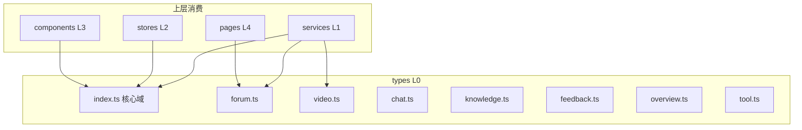

# 前端类型定义

## 模块概述

前端类型定义模块（`frontend/src/types/`，8 个文件）是前端分层架构的 L0 基础层，集中声明与后端 DTO 对齐的 TypeScript 接口。无任何内部依赖，被 [前端服务层](前端服务层.md)、stores、组件与页面全量引用，保证 API 数据在编译期类型安全。

## 架构图

## 文件与类型清单

| 文件 | 核心类型 | 对应后端 |
|------|---------|---------|
| `index.ts` | `User`、`Category`、`Tag`、`ToolSummary`、`ToolDetail`、`ToolFile`、`ApiResponse<T>`、`PageResponse<T>`、认证请求/响应 | [用户与认证](用户与认证.md) / [工具广场](工具广场.md) / [平台基础](平台基础.md) 通用 DTO |
| `tool.ts` | 工具表单、上传进度等工具域补充类型 | 工具广场 |
| `forum.ts` | `ForumPost`、`ForumCategory`、`ForumTag`、发帖/编辑请求、可见性枚举 | [论坛社区](论坛社区.md) |
| `video.ts` | `VideoListItem`、`VideoDetail`、`Danmaku`、上传请求 | [微课视频](微课视频.md) |
| `chat.ts` | `ChatMessage`、`ChatEvent`、`Reaction`、STOMP 载荷类型 | [实时聊天](实时聊天.md) |
| `knowledge.ts` | `KnowledgeBase`、`KbDocument`、`KbSearchResult`、分块配置 | [知识库与RAG](知识库与RAG.md) |
| `feedback.ts` | `FeedbackMessage`、`FeedbackCategory`、提交请求 | [留言反馈](留言反馈.md) |
| `overview.ts` | `Stats`、`ToolRank`、`PostRank`、`VideoRank` | 平台基础概览统计 |

## 类型对齐约定

1. **字段名 camelCase 直映射**: 后端 Jackson 序列化输出 camelCase，前端接口字段一一对应，无转换层
2. **可空字段显式标注**: 后端 `@JsonInclude(NON_NULL)` 会省略空字段，前端对应属性统一 `?:` 可选 + `| null`（如 `avatarUrl?: string | null`）
3. **响应信封泛型**: `ApiResponse<T>`（code/message/data）与 `PageResponse<T>`（content/totalElements/totalPages/page/size）作为泛型容器复用于全部接口
4. **论坛例外**: 论坛列表接口返回 Spring `Page` 裸结构（非 ApiResponse 包装），forum.ts 中单独声明对应分页形状
5. **枚举用字符串字面量联合**: 如 `visibility: 'PUBLIC' | 'PRIVATE'`，与后端枚举名严格一致

## 依赖关系

- **无内部依赖**（L0 层约束：types 不 import 任何项目内模块）
- **被依赖**: [前端服务层](前端服务层.md) 全部 service 的请求/响应签名；[前端应用](前端应用.md) 的 stores、组件 props、页面状态
