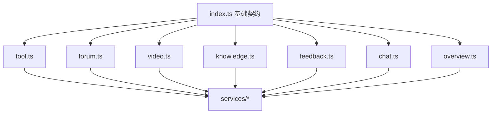
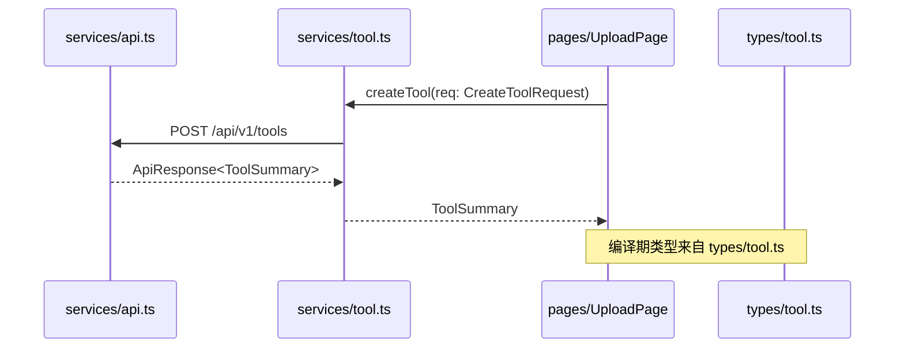

# 前端类型定义

前端类型定义模块即 `frontend/src/types/` 下的全部 `.ts`，对应前端分层中的 **L0 层**：它只定义数据结构（接口/类型别名），**不 import 任何项目内部模块**，是其它所有层（services/stores/components/pages）的根基契约。

## Component Constraint Index

| 文件 | 关键导出 | 对应后端模块 |
|------|-----------|--------------|
| `index.ts` | `ApiResponse<T>`、`PageResponse<T>`、`User`、`Role`、`AccountStatus` | [平台基础](平台基础.md)、[用户与认证](用户与认证.md) |
| `tool.ts` | `Tool`、`ToolSummary`、`CreateToolRequest`、`FileUploadResponse` | [工具广场](工具广场.md) |
| `forum.ts` | `ForumPost`、`ForumPostDTO`、`ForumCategory`、`ForumTag` | [论坛社区](论坛社区.md) |
| `video.ts` | `Video`、`VideoListItem`、`VideoResponse`、`DanmakuDTO` | [微课视频](微课视频.md) |
| `knowledge.ts` | `KnowledgeBase`、`KbDocument`、`SearchHit` | [知识库与RAG](知识库与RAG.md) |
| `feedback.ts` | `Feedback`、`FeedbackCategory` | [留言反馈](留言反馈.md) |
| `chat.ts` | `ChatMessage`、`ChatReaction` | [实时聊天](实时聊天.md) |
| `overview.ts` | `OverviewStats`、`RankItem` | [平台基础](平台基础.md) |

## 架构总览 (Architecture Overview)

类型层单向被上层依赖，自身不依赖任何业务代码（约束见下）。

## 组件职责 (Component Responsibilities)

### `index.ts` — 全局基础契约

- `ApiResponse<T> { code; message; data }`：与后端 [平台基础](平台基础.md) 的 `ApiResponse` 一一对应，`services/api.ts` 的响应拦截器据此解包。
- `PageResponse<T> { content; totalElements; totalPages; page; size }`：分页结构。
- `User` / `Role`(`USER|ADMIN|SUPER_ADMIN`) / `AccountStatus`：领域实体镜像，供 stores 与组件复用。

### 领域 DTO（`tool.ts` / `forum.ts` / `video.ts` / `knowledge.ts` / `feedback.ts` / `chat.ts` / `overview.ts`）

每个文件集中定义该领域的：

- **响应镜像**：如 `ToolSummary`、`ForumPostDTO`、`VideoListItem` — 与后端返回 JSON 同构。
- **请求体**：如 `CreateToolRequest`、`SendDanmakuRequest` — 与后端 `@RequestBody` DTO 对齐。
- **枚举/常量**：如 `ForumCategory`、`FeedbackCategory` — 与后端枚举同名。

**Business Constraints — 类型层**

- L0 类型层禁止 import 任何项目内部模块（仅允许 TS 标准库/三方库类型） (confidence: 0.95)
  > Evidence: 分层规则中 L0 的依赖约束为“无内部依赖”；所有业务 import 必须发生在 L1+ 层。`index.ts` 导出的 `ApiResponse/PageResponse` 被 services 引用，方向单向。
- 前端类型命名与后端 DTO 保持镜像，避免双份真相 (confidence: 0.9)
  > Evidence: 每个 `types/*.ts` 与后端 `dto/`、响应结构同名对应（`ToolSummary` ↔ `ToolSummaryDTO` 风格），由 `services/*.ts` 负责字段映射。
- `Role` / `AccountStatus` 等枚举在前端与后端采用相同字面量，权限判断直接复用 (confidence: 0.9)
  > Evidence: `index.ts` 中 `Role = 'USER' | 'ADMIN' | 'SUPER_ADMIN'` 与后端 `Role` 枚举字面量一致，组件内 `isAdmin` 判断可直接比较。

## 数据流：类型如何被消费

## 接口契约与副作用

- 本模块**无任何运行时副作用**，纯静态类型；所有网络/状态副作用都在 `services` 与 `stores` 层。
- 类型定义变更会触发全仓 TypeScript 编译检查（`vue-tsc`），是前端“编译即文档”的来源。

## 依赖关系 (Cross-References)

- [前端服务层](前端服务层.md) — `services/` 直接 import 本层类型；`stores/`/`components/`/`pages/` 间接依赖。
- 各后端模块（[工具广场](工具广场.md)、[论坛社区](论坛社区.md)、[微课视频](微课视频.md)、[知识库与RAG](知识库与RAG.md)、[留言反馈](留言反馈.md)、[实时聊天](实时聊天.md)）— 类型字段与之镜像对齐。

## 约束、假设与边界情况

- 类型层若意外 import 了 `services/`，会破坏 L0→L1 单向约束，应在 lint/CR 中被指出。
- 枚举字面量需与后端**严格同步**；后端改枚举值时前端类型若滞后会导致运行时权限误判。
- `index.ts` 的 `ApiResponse` 是全仓唯一响应契约，新增接口不得另起响应结构。
