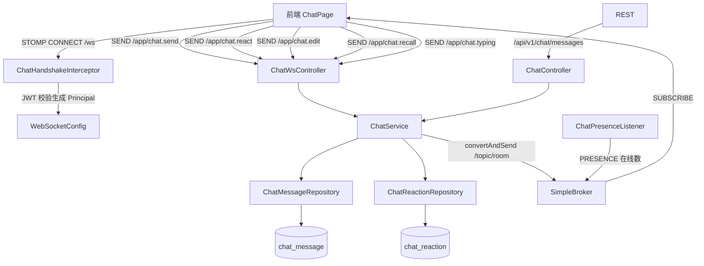

# 实时聊天

## 模块概述

实时聊天模块提供全局聊天室能力，基于 **Spring WebSocket + STOMP** 实现：

- **消息收发**：文本消息、回复引用（`replyTo`）
- **表情回应（Reaction）**：对消息添加/取消 emoji 回应
- **消息编辑与撤回**：作者可编辑（标记 `edited`）或撤回自己的消息
- **正在输入指示**：typing 事件广播
- **在线人数**：连接/断开事件实时广播 PRESENCE
- **历史消息**：REST 拉取，管理员可软删除违规消息

## 架构总览

## 通信协议

### WebSocket / STOMP

- **握手端点**: `/ws`（`ChatHandshakeInterceptor` 从查询参数/头中解析 JWT，构造 `ChatPrincipal`；未登录可只读）
- **应用前缀**: `/app`，**广播前缀**: `/topic`（SimpleBroker 内存代理）

| 客户端发送 | 载荷 | 广播目标 |
|-----------|------|---------|
| `/app/chat.send` | `ChatSendPayload`（roomId、content、replyTo） | `/topic/{roomId}` 新消息 |
| `/app/chat.react` | `ReactionActionPayload`（messageId、emoji） | `/topic/{roomId}` 回应更新 |
| `/app/chat.edit` | `EditPayload`（messageId、newContent） | `/topic/{roomId}` 编辑事件 |
| `/app/chat.recall` | `RecallPayload`（messageId） | `/topic/{roomId}` 撤回事件 |
| `/app/chat.typing` | `TypingEventDTO`（roomId、isTyping） | `/topic/{roomId}` typing 事件 |

### REST（[ChatController](../../../backend/src/main/java/com/iaihub/toolbox/controller/ChatController.java)，`/api/v1/chat`）

| 端点 | 说明 |
|------|------|
| `GET /messages?roomId&limit` | 历史消息（含回应聚合、回复引用） |
| `DELETE /messages/{id}` | 软删除消息（admin，`deletedType=ADMIN`） |

## 核心组件

### [ChatService](../../../backend/src/main/java/com/iaihub/toolbox/service/ChatService.java)

**路径**: `backend/src/main/java/com/iaihub/toolbox/service/ChatService.java`

- `handleMessage(principal, payload)` — 校验登录与内容（XSS 清洗、长度限制）→ 落库 → 返回 `Optional<ChatMessageDTO>` 广播（遵循「不返回 null」约定）
- `getHistory(roomId, limit[, ownerKey])` — 倒序拉取最近消息，聚合 reaction 计数与当前用户回应状态
- `toggleReaction` — 同一用户对同一消息同一 emoji 的回应开关，广播 `ChatReactionUpdateDTO`
- `editMessage` / `recallMessage` — 仅作者本人可操作；编辑标记 `edited=true`，撤回置 `status=RECALLED`
- `softDelete` — 管理员删除（`deletedType=ADMIN`）
- `handleTyping` — typing 状态透传广播

### 配置层（config/）

| 组件 | 职责 |
|------|------|
| `WebSocketConfig` | 启用 STOMP：`/ws` 端点、`/app` 前缀、`/topic` SimpleBroker；将握手阶段解析的 principal 绑定为会话用户 |
| `ChatHandshakeInterceptor` | 握手时解析 JWT（无效则匿名只读），生成 `ChatPrincipal` 存入 attributes |
| `ChatPrincipal` | 实现 `java.security.Principal`，携带 userId / displayName / avatarUrl |
| `ChatPresenceListener` | 监听 `SessionConnectEvent` / `SessionDisconnectEvent`，用 `ConcurrentHashMap.newKeySet()` 维护在线会话集合，变化时广播 `ChatEventDTO(type=PRESENCE, online=N)` |

## 数据模型

**[ChatMessage](../../../backend/src/main/java/com/iaihub/toolbox/model/ChatMessage.java)**（`chat_message` 表）：`roomId`（默认 `global`）、`userId`、`displayName`、`avatarUrl`（冗余存储，避免历史消息联查）、`content`、`replyTo`（回复引用）、`edited`、`status`（ACTIVE / RECALLED / DELETED）、`deletedType`（ADMIN / SELF）。

**[ChatReaction](../../../backend/src/main/java/com/iaihub/toolbox/model/ChatReaction.java)**（`chat_reaction` 表）：`messageId` + `userId` + `emoji` 唯一组合。

**DTO**：`ChatMessageDTO`（广播消息体）、`ChatEventDTO`（EDIT / RECALL / PRESENCE / TYPING 等事件信封）、`ChatReactionUpdateDTO`、`ChatSendPayload`、`EditPayload`、`RecallPayload`、`ReactionActionPayload`、`TypingEventDTO`。

## 关键设计决策

1. **冗余用户信息**：消息内冗余 `displayName`/`avatarUrl`，历史消息渲染无需联表查 user，符合「禁止循环查库」约定
2. **匿名可读**：未登录用户可建立 WebSocket 连接订阅消息，但发送/回应/编辑需登录（服务端校验 principal）
3. **SimpleBroker**：单机内存广播，无外部 MQ 依赖，符合本地裸机部署形态

## 与其他模块的关系

- [用户与认证](用户与认证.md)：握手时 JWT 校验、用户身份与头像
- [前端应用](前端应用.md)：聊天页面通过 `@stomp/stompjs` 订阅 `/topic/{roomId}`

<!-- crosslinks (auto-generated) -->
## Related Modules
- Depends on: [用户与认证](用户与认证.md)
