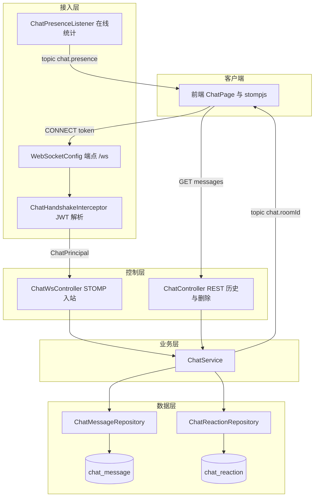
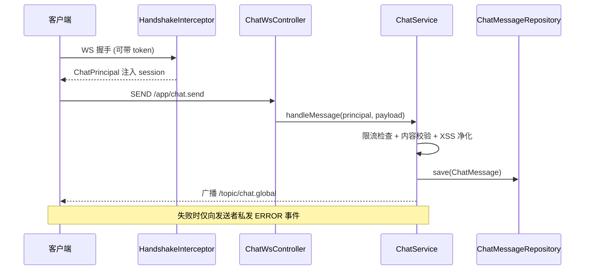

# 实时聊天

## 模块概述

实时聊天模块提供基于 STOMP over WebSocket 的全站聊天室能力，支持登录用户与游客双模式参与。功能覆盖消息发送、回复引用、表情回应（Reaction）、消息编辑/撤回、正在输入指示、在线人数广播与管理员删除消息。

- **代码位置**: 后端 `ChatController` / `ChatWsController` / `ChatService` + `config/WebSocket*`、`config/Chat*` + `model/ChatMessage`、`ChatReaction`
- **组件数量**: 66 个
- **通信端点**: WebSocket `/ws`（STOMP），REST `/api/v1/chat`

## 架构图

## 认证与身份模型

### ChatHandshakeInterceptor（握手拦截器）

WebSocket 握手阶段解析身份，**无 token 也放行**（游客模式）：

1. 从 URL 参数 `?token=` 取 JWT；用 `X-Forwarded-For` / `RemoteAddr` 计算 `ipHash`
2. token 有效且账户 `ACTIVE` → 构建登录态 `ChatPrincipal`（userId / 昵称 / 头像 / admin 标志）
3. token 无效或缺失 → 构建游客 `ChatPrincipal`（仅 ipHash + sessionId）
4. principal 存入 session attributes，供后续 STOMP 消息处理使用

### ChatPrincipal

实现 `java.security.Principal` 的轻量身份对象。关键字段：`userId`（游客为 null）、`displayName`、`avatarUrl`、`ipHash`、`admin`、`sessionId`。限流 key 规则：登录用户 `u:{userId}`，游客 `ip:{ipHash}`。

## STOMP 协议约定

| 方向 | 目的地 | 载荷 | 说明 |
|------|--------|------|------|
| 入站 | `/app/chat.send` | `ChatSendPayload` | 发送消息（content / roomId / replyTo / 游客 displayName） |
| 入站 | `/app/chat.react` | `ReactionActionPayload` | 切换表情回应 |
| 入站 | `/app/chat.edit` | `EditPayload` | 编辑自己的消息 |
| 入站 | `/app/chat.recall` | `RecallPayload` | 撤回自己的消息 |
| 入站 | `/app/chat.typing` | `TypingEventDTO` | 正在输入状态 |
| 出站 | `/topic/chat.{roomId}` | `ChatMessageDTO` / `ChatEventDTO` | 房间广播（新消息/编辑/撤回/typing） |
| 出站 | `/topic/chat.presence` | `ChatEventDTO(type=PRESENCE)` | 在线人数广播 |
| 出站 | 用户私有队列 | `ChatEventDTO(type=ERROR)` | 错误提示（限流、内容超限等） |

`WebSocketConfig` 启用 SimpleBroker（`/topic`），应用前缀 `/app`，允许所有 Origin（`*`）。

## 核心业务规则（ChatService）

| 规则 | 值 | 说明 |
|------|-----|------|
| 发送限流 | 2000ms | 按用户/IP 维度，内存 `ConcurrentHashMap` 记录上次发送时间 |
| 内容上限 | 1000 字 | 超限拒绝并私发错误 |
| 编辑窗口 | 5 分钟 | 仅本人可编辑，超时拒绝 |
| 撤回窗口 | 5 分钟 | 仅本人可撤回（`deleted_type=SELF`） |
| Typing 超时 | 4 秒 | 单线程调度器自动清除输入状态 |
| 回复预览 | 80 字 | 引用消息内容截断 |
| 历史条数 | 默认 50 | REST 拉取 |

**内容安全**: 所有消息内容与游客昵称落库前经 `XssSanitizer.sanitize()` 净化（依赖 [平台基础](平台基础.md)）。

**游客约束**: 游客发消息必须携带昵称；游客无头像；游客身份以 ipHash 追踪（限流与 Reaction 归属）。

## 消息发送时序

## 数据模型

### chat_message 表（ChatMessage 实体）

| 字段 | 说明 |
|------|------|
| `room_id` | 房间 ID，默认 `global`，联合索引 (room_id, status, created_at) |
| `user_id` | 发送者，游客为 NULL |
| `display_name` / `avatar_url` | 冗余展示字段（避免查询时 JOIN user 表） |
| `content` | text，已净化 |
| `status` | `ACTIVE` / `DELETED`（软删除） |
| `reply_to` | 被回复消息 ID |
| `edited` | 是否被编辑过 |
| `deleted_type` | `ADMIN`（管理员删）/ `SELF`（自己撤回） |

### chat_reaction 表（ChatReaction 实体）

消息表情回应，按 `(messageId, emoji, ownerKey)` 唯一。`ownerKey` 兼容双身份：登录用户为 userId 字符串，游客为 ipHash。切换语义：已存在则删除（取消回应），不存在则新增。

## REST 接口

| 端点 | 权限 | 说明 |
|------|------|------|
| `GET /api/v1/chat/messages?roomId=global&limit=50` | 匿名可访问 | 拉取历史消息（含每条消息的 reaction 聚合与"我的回应"） |
| `DELETE /api/v1/chat/messages/{id}` | ADMIN / SUPER_ADMIN | 管理员软删除（`deleted_type=ADMIN`），广播删除事件 |

## 在线人数（ChatPresenceListener）

监听 STOMP `SessionConnectEvent` / `SessionDisconnectEvent`，以 sessionId 维度维护内存在线集合，任何变化即向 `/topic/chat.presence` 广播 `PRESENCE` 事件（含 online 数）。游客与登录用户均计入。

## 依赖关系

- **依赖 [平台基础](平台基础.md)**: `XssSanitizer` 内容净化
- **依赖 [用户与认证](用户与认证.md)**: `JwtUtil` 校验 token、`UserRepository` 加载用户、`Role`/`AccountStatus` 枚举
- **被依赖**: 前端 `ChatPage` / chat 组件通过 [前端服务层](前端服务层.md) 的 chat service 与本模块交互

## 设计要点

1. **双身份统一建模**: `ChatPrincipal` + `ownerKey` 抽象让登录用户与游客共用同一套限流/Reaction/撤回逻辑
2. **冗余展示字段**: 消息表冗余 displayName/avatarUrl，历史查询零 JOIN，代价是昵称变更不回溯旧消息
3. **内存态可接受**: 限流表、typing 调度、在线集合均为单机内存实现（无 Redis），与"本地裸机部署"约束一致；重启即重置，属可接受损失
4. **软删除一致性**: 与全站软删除约定（`status=DELETED`）保持一致，删除类型区分管理员与本人撤回，前端展示不同占位文案
