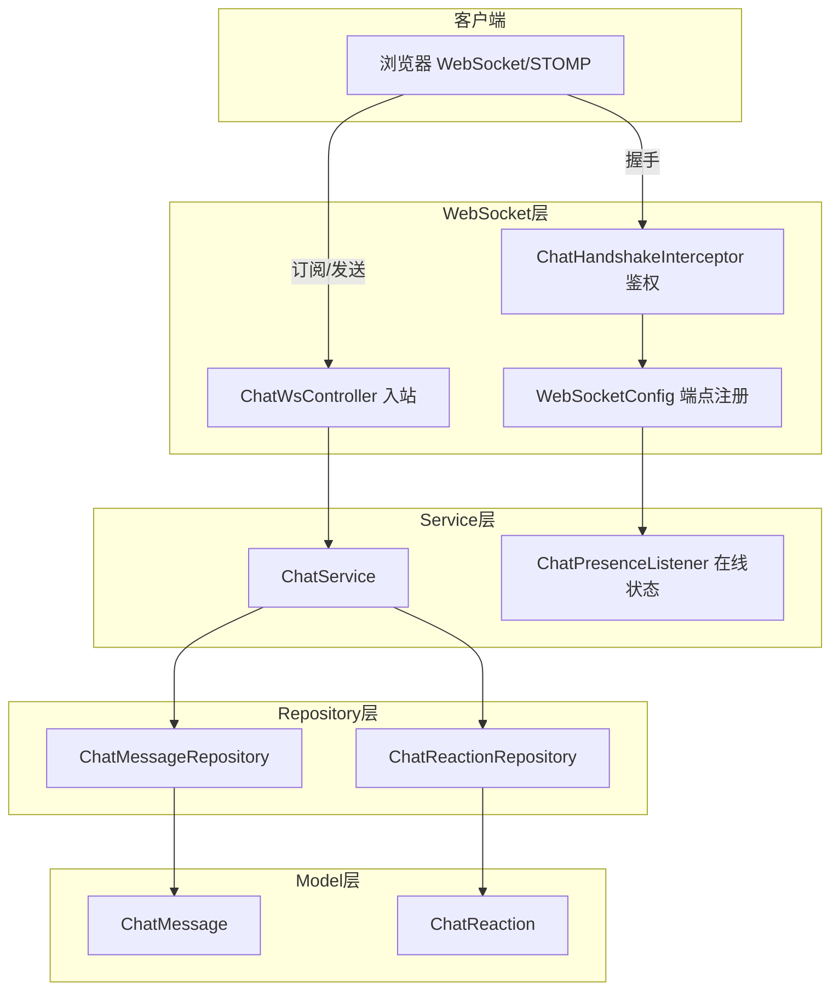
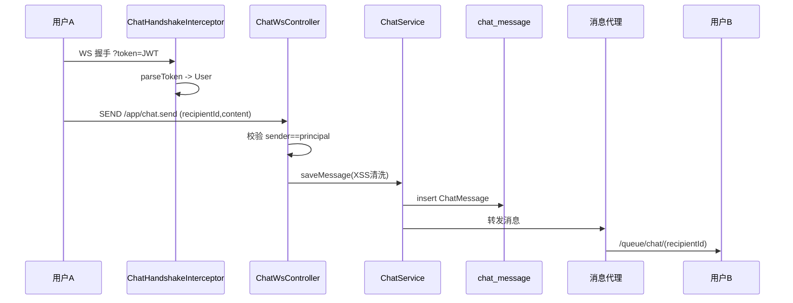

# 实时聊天

实时聊天模块为 CodingHub 提供站内即时通讯能力，基于 Spring WebSocket + STOMP 子协议实现。核心能力包括：握手阶段 JWT 鉴权、私聊/群聊消息收发、消息表情回应（Reaction）、历史消息分页、在线状态广播（Presence）。后端由 `ChatWsController`（消息入站）与 `ChatController`（REST 历史/管理）组成，业务逻辑在 `ChatService`，鉴权与状态在 `config/` 包下的 `WebSocketConfig`/`ChatHandshakeInterceptor`/`ChatPresenceListener`。

## Component Constraint Index

| Component | Constraints | Risks | Summary |
|-----------|-------------|-------|---------|
| ChatHandshakeInterceptor | 2 | 0 | 握手阶段从 URL token 解析 JWT |
| WebSocketConfig | 1 | 0 | 注册 STOMP 端点与拦截器 |
| ChatWsController | 2 | 1 | 入站消息校验 sender==principal |
| ChatService.saveMessage | 2 | 0 | 持久化前 XSS 清洗 |
| ChatService.addReaction | 1 | 0 | 同一用户对同消息单 Reaction |
| ChatPresenceListener | 1 | 0 | 连接/断开维护在线集合 |

## 架构总览 (Architecture Overview)

## 组件职责 (Component Responsibilities)

### ChatHandshakeInterceptor（鉴权）

在 WebSocket 握手阶段（`beforeHandshake`）从查询参数 `?token=` 解析 JWT（`JwtUtil.parseToken`），成功后把 `User` 放入 `attributes["user"]`，供后续 `@AuthenticationPrincipal` 或 `Principal` 取用；token 缺失/非法直接拒绝握手（返回 false，连接无法建立）。

### WebSocketConfig

注册 STOMP 端点（如 `/ws`），开启 SockJS 回退；配置 `ChatHandshakeInterceptor` 与消息代理前缀（`/app` 入站、`/topic`、`/queue` 出站）；注册 `ChatPresenceListener` 订阅连接事件。

### ChatWsController（入站消息）

`@MessageMapping` 处理客户端发来的 STOMP 消息（如 `/app/chat.send`）。从 `Principal` 取当前用户，`senderId` 必须与 principal 一致（防冒名）；构造 `ChatMessage` 经 `ChatService.saveMessage` 持久化后，通过 `SimpMessagingTemplate` 转发到目标会话频道。

### ChatService

- **saveMessage**：对 `content` 调 `XssSanitizer.sanitize()`；填充 `senderId/recipientId(或 roomId)/timestamp`；经 Repository 落库。
- **历史查询**：`getHistory` 按会话双方 + 时间分页返回 `ChatMessage`。
- **addReaction**：对 `(messageId, userId, emoji)` 建立 `ChatReaction`；同一用户对同一条消息仅保留一个 Reaction（先删后插或 upsert）。
- **删除/撤回**：软删除或撤回（按权限/时间窗）。

**Business Constraints — ChatService**

- 入站消息 sender 必须等于已鉴权 Principal，禁止冒名 (confidence: 0.9)
  > Evidence: `ChatWsController` 中 `if (!message.getSenderId().equals(principalUser.getId())) throw new ForbiddenException(...)`。
- 消息文本经 XSS 清洗后持久化 (confidence: 0.95)
  > Evidence: `message.setContent(XssSanitizer.sanitize(rawContent))` 在 `saveMessage` 内。
- 同一用户对同一消息只保留一个 Reaction (confidence: 0.85)
  > Evidence: `addReaction` 先 `deleteByMessageIdAndUserId` 再 `save(new ChatReaction(...))`。

### ChatPresenceListener

监听 `SessionConnectEvent`/`SessionDisconnectEvent`，维护进程内在线用户集合（ConcurrentHashMap），并向 `/topic/presence` 广播上下线事件，供前端显示好友在线状态。

### ChatMessage / ChatReaction（模型）

- `ChatMessage`：`senderId/recipientId` 或 `roomId`、`content(text)`、`type(TEXT/IMAGE/...)`、`status(SENT/READ/DELETED)`、`createdAt`；`@PrePersist` 补时间戳。
- `ChatReaction`：`messageId/userId/emoji` 复合唯一。

## 数据流：WebSocket 发送消息

## 接口契约与副作用

- REST 管理/历史走 `ChatController`（`/api/v1/chat/...`），返回 `ApiResponse`；实时通道走 WS，不包 `ApiResponse`。
- 副作用：新消息会触发对方在线频道推送；Reaction 变化广播到会话频道；上下线广播到 `/topic/presence`。

## 依赖关系 (Cross-References)

- [用户与认证](用户与认证.md) — `JwtUtil`、`User` 实体、Principal 注入。
- [平台基础](平台基础.md) — `XssSanitizer`、`ApiResponse`、`GlobalExceptionHandler`。
- [前端应用](前端应用.md) — `frontend/src/services/chat.ts`、聊天室组件。

## 约束、假设与边界情况

- 鉴权发生在握手阶段而非每条消息，故入站仍需二次校验 `senderId` 防冒名。
- 在线状态保存在**进程内存**，多实例部署下不共享（需接 Redis/PubSub 才能跨节点）。
- 历史消息分页默认按时间倒序返回；撤回仅允许发送者本人在时间窗内操作。
- 私聊以 `recipientId` 定位会话；群聊以 `roomId` 定位，二者互斥。
