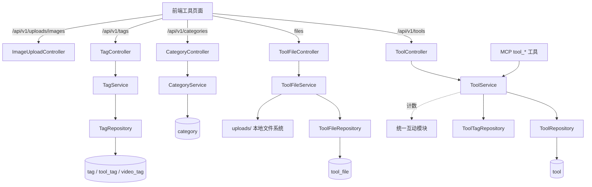

# 工具广场

## 模块概述

工具广场是 CodingHub 的核心领域模块，管理 AI 工具（Agent 技能、MCP 服务器、提示词包等）的完整生命周期：

- **工具 CRUD**：发布、编辑（版本号管理）、软删除、Logo 上传
- **多维检索**：分类 / 关键词 / 标签过滤，latest / hot 排序，置顶优先，热度 Top5
- **文件分发**：工具附件上传（multipart 多文件 + README）、文件列表、下载（下载计数）
- **统一标签系统**：`tag` 表按 `TagType`（TOOL / FORUM / VIDEO）区分作用域，供工具/视频复用
- **富文本图片**：`ImageUploadController` 支持工具描述中的图片上传

## 架构总览

## REST API

### [ToolController](../../../backend/src/main/java/com/iaihub/toolbox/controller/ToolController.java) (`/api/v1/tools`)

| 端点 | 说明 |
|------|------|
| `GET /` | 工具分页列表（categoryId / keyword / tagId / sortBy） |
| `GET /{id}` | 详情（`ToolDetailDTO`，浏览计数） |
| `POST /` | 发布工具（需登录） |
| `PUT /{id}` | 更新（owner 或 admin；可更新版本号） |
| `DELETE /{id}` | 软删除（`Status.DELETED`） |
| `POST /{id}/logo` | 更新 Logo（`UpdateLogoRequest`） |
| `POST /{id}/pin` / `DELETE /{id}/pin` | 置顶/取消（admin） |
| `GET /hot-top5` | 热度 Top5 工具 ID |

### [ToolFileController](../../../backend/src/main/java/com/iaihub/toolbox/controller/ToolFileController.java) (`/api/v1/tools/{toolId}/files`)

| 端点 | 说明 |
|------|------|
| `POST /` | 上传附件（multipart 多文件 + readme；MCP 场景允许匿名带 apiKey） |
| `GET /` | 文件列表（`FileListResponse`：文件树 + readme） |
| `GET /{fileId}/download` | 下载（流式输出 + 下载计数） |
| `DELETE /{fileId}` | 删除文件（owner 或 admin） |

### 其他控制器

- **[CategoryController](../../../backend/src/main/java/com/iaihub/toolbox/controller/CategoryController.java)** (`/api/v1/categories`)：`GET /` 分类列表（种子 6 分类）、`PUT /{id}/logo` 更新分类图标（admin）
- **[TagController](../../../backend/src/main/java/com/iaihub/toolbox/controller/tag/TagController.java)** (`/api/v1/tags`)：`GET /?type=TOOL|FORUM|VIDEO`、`GET /hot`、`POST /` 创建
- **[ImageUploadController](../../../backend/src/main/java/com/iaihub/toolbox/controller/ImageUploadController.java)** (`/api/v1/uploads/images`)：富文本图片上传与读取
- **[AvatarStaticController](../../../backend/src/main/java/com/iaihub/toolbox/controller/AvatarStaticController.java)** (`/api/v1/static/avatars/**`)：头像静态资源（归属用户模块，同属静态资源体系）

## 核心组件

### [ToolService](../../../backend/src/main/java/com/iaihub/toolbox/service/ToolService.java)

**路径**: `backend/src/main/java/com/iaihub/toolbox/service/ToolService.java`

- `getTools(categoryId, keyword, tagId, sortBy, page, size)` — 组合过滤：分类 + 关键词（名称/描述模糊）+ 标签（经 `tool_tag` 关联）；`sortBy=hot` 按 `score` 降序，置顶恒优先；返回 `PageResponse<ToolSummaryDTO>`（批量组装上传者与标签，避免循环查库）
- `createTool(request, uploaderId)` — XSS 清洗 → 建 [Tool](../../../backend/src/main/java/com/iaihub/toolbox/model/Tool.java) → `TagService.resolveOrCreateTags` 关联标签
- `updateTool(id, request, user)` — 权限 `isOwner || isAdmin`；支持版本号、内容、分类、标签全量更新
- `deleteTool` — 软删除；`updateLogo` — Logo 更新（权限同上）
- `pinTool` / `unpinTool` / `getHotTop5` — 运营能力
- `getMyTools` — 个人中心我的工具

### [ToolFileService](../../../backend/src/main/java/com/iaihub/toolbox/service/ToolFileService.java)

**路径**: `backend/src/main/java/com/iaihub/toolbox/service/ToolFileService.java`

- `uploadFiles(toolId, files, readme, userId)` — 多文件校验（类型/大小/数量）→ 落盘 `uploads/tools/{toolId}/` → 写 `tool_file` 表；README 单独存储
- `getToolFiles` — 文件清单 + readme（`FileListResponse`）
- `downloadFile` / `getFileInputStream` — 下载流 + `downloadCount` 计数
- `deleteToolFile` — 单文件删除（软删除，`ToolFile.Status`）
- `cleanupToolFiles` — 工具删除时清理全部附件

### [TagService](../../../backend/src/main/java/com/iaihub/toolbox/service/tag/TagService.java)（统一标签系统）

**路径**: `backend/src/main/java/com/iaihub/toolbox/service/tag/TagService.java`

- `Tag` 实体：`name` + `tagType`（TOOL / FORUM / VIDEO）唯一组合 + `usageCount`
- `getOrCreateTag` / `resolveOrCreateTags` — 幂等创建，供工具/视频发布时调用
- `getHotTags(type, limit)` — 按 `usageCount` 排序的热门标签
- `incrementUsage` / `decrementUsage` — 引用计数维护
- 关联表：`tool_tag`（[ToolTag](../../../backend/src/main/java/com/iaihub/toolbox/model/tag/ToolTag.java)）、`video_tag`（[VideoTag](../../../backend/src/main/java/com/iaihub/toolbox/model/tag/VideoTag.java)）；论坛使用独立的 `forum_tag`（历史原因，见 [论坛社区](论坛社区.md)）

## 数据模型

**[Tool](../../../backend/src/main/java/com/iaihub/toolbox/model/Tool.java)**（`tool` 表）：`name`、`category`（ManyToOne）、`content`（Markdown 正文）、`description`、`logoUrl`、`version`（默认 1.0.0）、`uploader`（ManyToOne [User](../../../backend/src/main/java/com/iaihub/toolbox/model/User.java)）、`status`（NORMAL / DELETED）、计数字段（view/like/comment/download/favorite）、`score` 热度分、`pinned`。

**[ToolFile](../../../backend/src/main/java/com/iaihub/toolbox/model/ToolFile.java)**（`tool_file` 表）：`toolId`、`fileName`、`filePath`、`fileSize`、`contentType`、`downloadCount`、`status`。

**[Category](../../../backend/src/main/java/com/iaihub/toolbox/model/Category.java)**（`category` 表）：`name`、`description`、`logoUrl`、`sortOrder`（种子 6 分类）。

**DTO**：`ToolSummaryDTO`、`ToolDetailDTO`、`CreateToolRequest`、`UpdateToolRequest`、`UpdateLogoRequest`、`FileUploadResponse`、`FileListResponse`、`FileInfo`、`CategoryDTO`、`TagDTO`、`CreateTagRequest`。

## 关键设计决策

1. **版本即字段**：工具版本为简单字符串字段（非独立版本表），MCP `tool_modify` 更新时由调用方递增
2. **文件本地存储**：附件存本地 `uploads/`（本地裸机部署形态），路径不入 Git
3. **标签三域复用**：`tag.tagType` 区分 TOOL/FORUM/VIDEO 作用域，同名不同域互不冲突
4. **互动委托**：点赞/评论/收藏由 [统一互动与通知](统一互动与通知.md) 实现（`targetType = TOOL`），本模块仅持有冗余计数

## 与其他模块的关系

- [MCP服务](MCP服务.md)：8 个 `tool_*` MCP 工具直接调用 `ToolService` / `ToolFileService`
- [统一互动与通知](统一互动与通知.md)：互动实现与计数回写
- [用户与认证](用户与认证.md)：上传者身份与权限
- [微课视频](微课视频.md)：共享 `TagService` 统一标签
- [前端应用](前端应用.md)：工具广场页、详情页、发布页

<!-- crosslinks (auto-generated) -->
## Related Modules
- Depends on: [MCP服务](mcp服务.md), [平台基础](平台基础.md), [用户与认证](用户与认证.md), [统一互动与通知](统一互动与通知.md)
- Used by: [MCP服务](mcp服务.md), [平台基础](平台基础.md), [微课视频](微课视频.md), [用户与认证](用户与认证.md), [统一互动与通知](统一互动与通知.md), [论坛社区](论坛社区.md)
