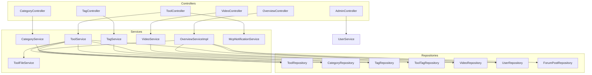

# 工具广场

## 模块概述

工具广场（Toolbox）是 CodingHub 平台的核心业务模块，承担 AI 工具资源的上传、浏览、搜索和管理职责。该模块为用户提供了一个完整的工具分享生态：用户可以上传自己开发的 AI 工具（Prompt、插件等），按分类和标签进行组织，并通过点赞、评论等互动方式形成社区热度排名。

除工具管理外，模块还集成了视频教学功能，支持视频上传、HTTP Range 流式播放、弹幕互动和封面管理。标签系统横跨工具与视频两大内容类型，提供灵活的内容分类和检索能力。总览服务（Overview）聚合全平台统计数据，为首页提供排行榜和统计面板。

模块采用经典的 Spring Boot 三层架构（Controller → Service → Repository），通过 JPA 进行数据持久化，结合 Spring Security 实现基于角色的权限控制（普通用户、管理员、超级管理员），并通过 MCP 通知服务将工具变更事件推送至 MCP Server。

## 架构总览



## 核心组件

### [ToolController](../../../backend/src/main/java/com/iaihub/toolbox/controller/ToolController.java)

**路径**: `controller/ToolController.java`  
**职责**: 工具资源的 REST API 入口，处理工具的增删改查、置顶和热度排行。

关键方法：
- `getTools()` — 分页查询工具列表，支持按分类（categoryId）、关键词（keyword）、标签（tagId）筛选，支持 hot/latest/name 三种排序
- `createTool()` — 创建工具，创建后通过 [McpNotificationService](../../../backend/src/main/java/com/iaihub/toolbox/mcp/McpNotificationService.java) 通知 MCP Server
- `updateTool()` / `deleteTool()` — 更新/删除工具（需所有者或管理员权限）
- `updateLogo()` — 更新工具 Logo URL（需所有者或管理员权限）
- `pinTool()` / `unpinTool()` — 管理员置顶/取消置顶
- `getHotTop5()` — 获取热度前 5 的工具 ID 列表

### [CategoryController](../../../backend/src/main/java/com/iaihub/toolbox/controller/CategoryController.java)

**路径**: `controller/CategoryController.java`  
**职责**: 提供工具分类列表的只读接口。

关键方法：
- `getAllCategories()` — 返回按 sortOrder 排序的全部分类，内部将 "API" 名称映射为 "插件"
- `updateCategoryLogo()` — 更新分类 Logo URL（ADMIN/SUPER_ADMIN 权限）

### [ImageUploadController](../../../backend/src/main/java/com/iaihub/toolbox/controller/ImageUploadController.java)

**路径**: `controller/ImageUploadController.java`  
**职责**: 通用图片上传服务，供工具/分类 Logo、帖子插图等场景使用。

关键方法：
- `uploadImage()` — 上传图片文件（需登录），返回可公开访问的图片 URL
- `getImage()` — 读取图片文件（公开访问，用于页面展示）

### [TagController](../../../backend/src/main/java/com/iaihub/toolbox/controller/tag/TagController.java)

**路径**: `controller/tag/TagController.java`  
**职责**: 标签管理接口，支持按类型查询标签和热门标签。

关键方法：
- `getTagsByType()` — 按标签类型（TOOL/VIDEO）获取标签列表
- `getHotTags()` — 获取使用次数最多的热门标签
- `createTag()` — 创建新标签

### [VideoController](../../../backend/src/main/java/com/iaihub/toolbox/controller/video/VideoController.java)

**路径**: `controller/video/VideoController.java`  
**职责**: 视频资源的完整生命周期管理，包括上传、流式播放、封面管理。

关键方法：
- `uploadVideo()` — 上传视频文件及元数据（标题、描述、标签）
- `streamVideo()` — 支持 HTTP Range 的流式播放，使用 RandomAccessFile 精确 seek
- `uploadCover()` / `getCoverImage()` — 视频封面上传与获取
- `pinVideo()` / `unpinVideo()` — 管理员置顶操作
- `getMyVideos()` — 获取当前用户上传的视频列表

### [OverviewController](../../../backend/src/main/java/com/iaihub/toolbox/controller/OverviewController.java)

**路径**: `controller/OverviewController.java`  
**职责**: 平台总览数据接口，为首页提供统计和排行榜。

关键方法：
- `getStats()` — 返回用户数、帖子数、工具数、视频数
- `getToolRanks()` — 工具热度 Top10
- `getPostRanks()` — 帖子热度 Top10
- `getVideoRanks()` — 视频播放量 Top10

### [AdminController](../../../backend/src/main/java/com/iaihub/toolbox/controller/AdminController.java)

**路径**: `controller/AdminController.java`  
**职责**: 后台用户管理，处理注册审批和用户状态管理。

关键方法：
- `getPendingUsers()` — 获取待审批用户列表
- `approveUser()` / `rejectUser()` — 审批通过/拒绝
- `updateUserStatus()` — 封禁/解禁用户
- `deleteUser()` — 删除用户

### [ToolService](../../../backend/src/main/java/com/iaihub/toolbox/service/ToolService.java)

**路径**: `service/ToolService.java`  
**职责**: 工具业务逻辑核心，处理 CRUD、权限校验、标签关联和热度计算。

关键逻辑：
- 创建工具时校验同一用户在同一分类下不可重名
- 更新/删除操作需验证所有者身份或管理员角色
- 标签关联通过 [ToolTag](../../../backend/src/main/java/com/iaihub/toolbox/model/tag/ToolTag.java) 中间表维护，同步更新 [Tag](../../../backend/src/main/java/com/iaihub/toolbox/model/tag/Tag.java) 的 usageCount
- 删除为软删除（status 设为 DELETED），同时清理关联文件
- 热度排序：pinned DESC, score DESC

### [CategoryService](../../../backend/src/main/java/com/iaihub/toolbox/service/CategoryService.java)

**路径**: `service/CategoryService.java`  
**职责**: 分类查询服务，将 [Category](../../../backend/src/main/java/com/iaihub/toolbox/model/Category.java) 实体转换为 DTO。

### [OverviewServiceImpl](../../../backend/src/main/java/com/iaihub/toolbox/service/OverviewServiceImpl.java)

**路径**: `service/OverviewServiceImpl.java`  
**职责**: 聚合多数据源统计信息，生成平台总览和排行榜数据。

### [DataInitializer](../../../backend/src/main/java/com/iaihub/toolbox/config/DataInitializer.java)

**路径**: `config/DataInitializer.java`  
**职责**: 应用启动时初始化超级管理员账号（默认 admin / Cloud@1234），确保系统至少有一个 SUPER_ADMIN 角色用户。

## 数据模型

### [Tool](../../../backend/src/main/java/com/iaihub/toolbox/model/Tool.java)（工具）

| 字段 | 类型 | 说明 |
|------|------|------|
| id | Long | 主键，自增 |
| name | String(100) | 工具名称 |
| category | [Category](../../../backend/src/main/java/com/iaihub/toolbox/model/Category.java) | 所属分类（多对一） |
| content | TEXT | 工具内容（Prompt/代码等） |
| description | String(200) | 工具描述 |
| version | String(50) | 版本号，默认 "1.0.0" |
| uploader | [User](../../../backend/src/main/java/com/iaihub/toolbox/model/User.java) | 上传者（多对一） |
| status | Enum | NORMAL / DELETED |
| viewCount | Integer | 浏览次数 |
| likeCount | Integer | 点赞次数 |
| commentCount | Integer | 评论次数 |
| score | BigDecimal | 热度分 = view×1 + download×2 + like×3 + favorite×4 + comment×5 |
| pinned | Boolean | 是否置顶 |
| logoUrl | String(512) | 工具 Logo 地址（可选，优先于 icon 展示） |
| downloadCount | Integer | 累计下载次数（冗余计数，由下载事件维护） |
| favoriteCount | Integer | 累计收藏次数（冗余计数，由收藏事件维护） |
| createdAt | LocalDateTime | 创建时间 |
| updatedAt | LocalDateTime | 更新时间 |

唯一约束：`(uploader_id, name, category_id, status)` 组合唯一。

### [Category](../../../backend/src/main/java/com/iaihub/toolbox/model/Category.java)（分类）

| 字段 | 类型 | 说明 |
|------|------|------|
| id | Long | 主键，自增 |
| name | String(50) | 分类名称，唯一 |
| icon | String(255) | 图标标识 |
| logoUrl | String(255) | 分类 Logo 地址（可选，优先于 icon 展示） |
| sortOrder | Integer | 排序权重 |
| createdAt | LocalDateTime | 创建时间 |

### [Tag](../../../backend/src/main/java/com/iaihub/toolbox/model/tag/Tag.java)（标签）

| 字段 | 类型 | 说明 |
|------|------|------|
| id | Long | 主键，自增 |
| name | String(50) | 标签名称 |
| tagType | Enum | 标签类型（TOOL / VIDEO） |
| usageCount | Integer | 使用次数 |
| createdAt | LocalDateTime | 创建时间 |

唯一约束：`(name, tag_type)` 组合唯一。通过 [ToolTag](../../../backend/src/main/java/com/iaihub/toolbox/model/tag/ToolTag.java) / [VideoTag](../../../backend/src/main/java/com/iaihub/toolbox/model/tag/VideoTag.java) 中间表与工具/视频建立多对多关系。

### [Video](../../../backend/src/main/java/com/iaihub/toolbox/model/video/Video.java)（视频）

| 字段 | 类型 | 说明 |
|------|------|------|
| id | Long | 主键，自增 |
| title | String(200) | 视频标题 |
| description | TEXT | 视频描述 |
| filePath | String(500) | 文件存储路径 |
| fileName | String(255) | 原始文件名 |
| fileSize | Long | 文件大小（字节） |
| duration | Integer | 时长（秒） |
| coverUrl | String(500) | 封面图路径 |
| uploaderId | Long | 上传者 ID |
| status | Enum | NORMAL / DELETED |
| viewCount | Integer | 播放次数 |
| likeCount | Integer | 点赞次数 |
| commentCount | Integer | 评论次数 |
| score | BigDecimal | 热度分（同 [Tool](../../../backend/src/main/java/com/iaihub/toolbox/model/Tool.java) 公式） |
| pinned | Boolean | 是否置顶 |
| danmakuEnabled | Boolean | 是否开启弹幕 |
| createdAt | LocalDateTime | 创建时间 |
| updatedAt | LocalDateTime | 更新时间 |

## API 端点

### 工具管理 `/api/v1/tools`

| 方法 | 路径 | 说明 | 权限 |
|------|------|------|------|
| GET | `/api/v1/tools` | 分页查询工具列表（支持 categoryId、keyword、tagId、sortBy） | 公开 |
| GET | `/api/v1/tools/{id}` | 获取工具详情 | 公开 |
| POST | `/api/v1/tools` | 创建工具 | 登录用户 |
| PUT | `/api/v1/tools/{id}` | 更新工具 | 所有者/管理员 |
| DELETE | `/api/v1/tools/{id}` | 删除工具（软删除） | 所有者/管理员 |
| POST | `/api/v1/tools/{id}/logo` | 更新工具 Logo | 所有者/管理员 |
| POST | `/api/v1/tools/{id}/pin` | 置顶工具 | ADMIN/SUPER_ADMIN |
| DELETE | `/api/v1/tools/{id}/pin` | 取消置顶 | ADMIN/SUPER_ADMIN |
| GET | `/api/v1/tools/hot-top5` | 热度 Top5 工具 ID | 公开 |

### 分类 `/api/v1/categories`

| 方法 | 路径 | 说明 | 权限 |
|------|------|------|------|
| GET | `/api/v1/categories` | 获取全部分类列表 | 公开 |
| PUT | `/api/v1/categories/{id}/logo` | 更新分类 Logo | ADMIN/SUPER_ADMIN |

### 图片上传 `/api/v1/uploads`

| 方法 | 路径 | 说明 | 权限 |
|------|------|------|------|
| POST | `/api/v1/uploads/images` | 上传图片（multipart），返回可公开访问的 URL | 登录用户 |
| GET | `/api/v1/uploads/images/**` | 读取/展示已上传图片 | 公开 |

### 标签 `/api/v1/tags`

| 方法 | 路径 | 说明 | 权限 |
|------|------|------|------|
| GET | `/api/v1/tags?type=TOOL` | 按类型获取标签列表 | 公开 |
| GET | `/api/v1/tags/hot?type=TOOL&limit=20` | 获取热门标签 | 公开 |
| POST | `/api/v1/tags` | 创建标签 | 登录用户 |

### 视频 `/api/v1/videos`

| 方法 | 路径 | 说明 | 权限 |
|------|------|------|------|
| POST | `/api/v1/videos` | 上传视频（multipart） | 登录用户 |
| GET | `/api/v1/videos` | 分页查询视频列表 | 公开 |
| GET | `/api/v1/videos/{id}` | 获取视频详情 | 公开 |
| PUT | `/api/v1/videos/{id}` | 更新视频信息 | 所有者/管理员 |
| DELETE | `/api/v1/videos/{id}` | 删除视频 | 所有者/管理员 |
| GET | `/api/v1/videos/{id}/stream` | 流式播放（支持 Range） | 公开 |
| GET | `/api/v1/videos/my` | 我的视频列表 | 登录用户 |
| POST | `/api/v1/videos/{id}/pin` | 置顶视频 | ADMIN/SUPER_ADMIN |
| DELETE | `/api/v1/videos/{id}/pin` | 取消置顶 | ADMIN/SUPER_ADMIN |
| POST | `/api/v1/videos/{id}/cover` | 上传封面 | 所有者 |
| GET | `/api/v1/videos/{id}/cover-image` | 获取封面图片 | 公开 |
| GET | `/api/v1/videos/hot-top5` | 热度 Top5 视频 ID | 公开 |

### 总览 `/api/overview`

| 方法 | 路径 | 说明 | 权限 |
|------|------|------|------|
| GET | `/api/overview/stats` | 平台统计数据 | 公开 |
| GET | `/api/overview/tool-ranks` | 工具热度排行 Top10 | 公开 |
| GET | `/api/overview/post-ranks` | 帖子热度排行 Top10 | 公开 |
| GET | `/api/overview/video-ranks` | 视频播放排行 Top10 | 公开 |

### 后台管理 `/api/v1/admin`

| 方法 | 路径 | 说明 | 权限 |
|------|------|------|------|
| GET | `/api/v1/admin/pending-users` | 待审批用户列表 | 管理员 |
| POST | `/api/v1/admin/approve/{id}` | 审批通过 | 管理员 |
| POST | `/api/v1/admin/reject/{id}` | 审批拒绝 | 管理员 |
| GET | `/api/v1/admin/users` | 用户列表（分页、筛选） | 管理员 |
| PUT | `/api/v1/admin/users/{id}/status` | 封禁/解禁用户 | 管理员 |
| DELETE | `/api/v1/admin/users/{id}` | 删除用户 | 管理员 |

## 热度算法

工具和视频共用统一的热度评分公式：

```
score = viewCount × 1 + downloadCount × 2 + likeCount × 3 + favoriteCount × 4 + commentCount × 5
```

- `downloadCount` / `favoriteCount` 为冗余计数，分别由下载事件（`ToolFileService.downloadFile` 同时累加 tool_file 与 tool 计数）和收藏事件（`UnifiedFavoriteService` 切换时增减 tool 计数）增量维护，避免实时聚合。
- 计数初始化由 Flyway 迁移 `V10__add_download_favorite_count_to_tool.sql` 完成：新增 `download_count` / `favorite_count` 列，并从 `tool_file` / `unified_favorite` 聚合回填，最后重算 `score`。
- 每次浏览、下载、点赞、收藏、评论操作触发时自动重算 `score`。

每次浏览、点赞、评论操作触发时自动重算 score。列表默认排序为 `pinned DESC, score DESC`（置顶优先，热度次之）。

## 交叉引用

- [用户与认证](用户与认证.md) — 用户注册、登录、JWT 鉴权、角色权限体系
- [统一互动](统一互动.md) — 点赞、评论、收藏的统一互动服务（[UnifiedLike](../../../backend/src/main/java/com/iaihub/toolbox/model/UnifiedLike.java)/Comment/Favorite）
- [MCP服务](MCP服务.md) — MCP Server 集成，工具变更通知（[McpNotificationService](../../../backend/src/main/java/com/iaihub/toolbox/mcp/McpNotificationService.java)）和工具搜索（[McpSearchService](../../../backend/src/main/java/com/iaihub/toolbox/service/McpSearchService.java)）
- [论坛社区](论坛社区.md) — 帖子管理，与总览排行榜共享热度数据
- [知识库](知识库与RAG.md) — RAG 知识库集成，支持语义搜索


<!-- crosslinks (auto-generated) -->
## Related Modules
- Depends on: [MCP服务](mcp服务.md), [用户与认证](用户与认证.md), [统一互动](统一互动.md), [论坛社区](论坛社区.md)
- Used by: [MCP服务](mcp服务.md), [用户与认证](用户与认证.md), [知识库与RAG](知识库与rag.md), [统一互动](统一互动.md), [论坛社区](论坛社区.md)
