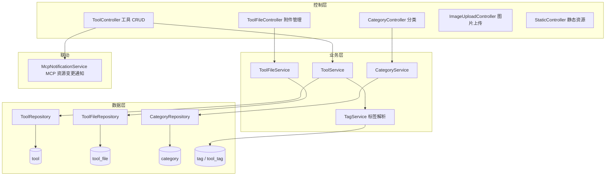
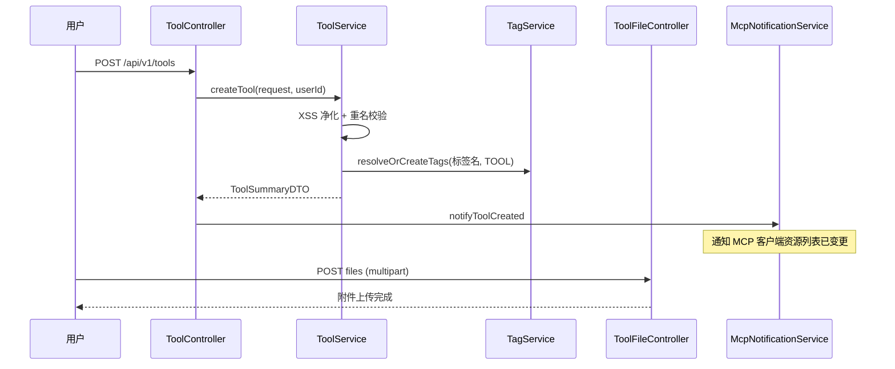

# 工具广场

## 模块概述

工具广场是 CodingHub 的核心领域模块，提供 AI 工具的发布、检索、分类、文件分发与图片托管能力。用户上传工具（Markdown 介绍 + 附件 + Logo），其他用户浏览、下载、点赞、评论、收藏。

- **代码位置**: `ToolController` / `ToolFileController` / `CategoryController` / `ImageUploadController` / `StaticController` + `ToolService` / `ToolFileService` / `CategoryService` + `Tool` / `ToolFile` / `Category` 等实体
- **组件数量**: 127 个
- **API 前缀**: `/api/v1/tools`、`/api/v1/categories`

## 架构图



## 数据模型

### tool 表（Tool 实体）

| 字段 | 说明 |
|------|------|
| `name` / `description` / `content` | 名称 / 200 字简介 / Markdown 正文 |
| `category_id` | 必填分类外键 |
| `logo_url` | Logo 图片 URL |
| `version` | 版本号，默认 `1.0.0` |
| `uploader_id` | 发布者 |
| `status` | `NORMAL` / `DELETED`（软删除） |
| `view/like/comment/download/favorite_count` | 五维计数冗余字段 |
| `score` | 综合热度分（decimal） |
| `pinned` | 管理员置顶标志 |

**唯一约束**: `(uploader_id, name, category_id, status)` —— 同一用户同一分类下不能重复发布同名工具（软删除后可重发）。

**热度公式**（`updateScore()`）:

```
score = viewCount×1 + downloadCount×2 + likeCount×3 + favoriteCount×4 + commentCount×5
```

### tool_file 表（ToolFile 实体）

工具附件元数据：原始文件名、存储路径、大小、contentType、下载计数。物理文件存储在上传目录（[平台基础](平台基础.md) UploadConfig 初始化）按 toolId 分目录。

### category 表（Category 实体）

工具分类字典（name 唯一），由管理员维护，工具必须归属一个分类。

## REST 接口

### 工具（/api/v1/tools）

| 端点 | 权限 | 说明 |
|------|------|------|
| `GET /` | 公开 | 分页列表：categoryId / keyword / tagId 筛选，sortBy=hot(score)/latest |
| `GET /{id}` | 公开 | 详情（自增 viewCount，含文件列表与标签） |
| `POST /` | 登录 | 创建（标签名经 TagService.resolveOrCreateTags 解析），触发 MCP 资源变更通知 |
| `PUT /{id}` | owner 或 admin | 更新（触发 MCP 通知） |
| `DELETE /{id}` | owner 或 admin | 软删除（status=DELETED，触发 MCP 通知） |
| `POST /{id}/logo` | owner 或 admin | 更新 Logo URL |
| `POST /{id}/pin` / `DELETE /{id}/pin` | ADMIN+ | 置顶 / 取消置顶 |
| `GET /hot-top5` | 公开 | 热度 Top5 工具 ID 列表（首页轮播用） |

### 附件（/api/v1/tools/{toolId}/files）

| 端点 | 说明 |
|------|------|
| `POST /`（multipart） | 批量上传附件 + 可选 README，校验类型与大小（FileValidationException） |
| `GET /` | 附件列表 |
| `GET /{fileId}/download` | 流式下载（InputStreamResource），自增 downloadCount |
| `DELETE /{fileId}` | 删除附件（owner） |

### 分类与图片

- `GET /api/v1/categories` 公开分类列表；管理端增删改
- `POST /api/v1/images`（ImageUploadController）: 富文本图片上传（登录），返回可访问 URL
- `StaticController`: 暴露上传图片/Logo 的静态访问路径

## 工具发布时序



## 与其他模块的边界

- **互动数据不在本模块**: 点赞/评论/收藏经 [统一互动与通知](统一互动与通知.md)（`targetType=TOOL`）；`tool` 表的计数字段由互动服务回写。历史遗留的 `tool_like` / `tool_comment` 表与 Repository 仍存在（旧数据兼容），新功能一律走统一互动
- **标签**: 标签解析复用 [统一互动与通知](统一互动与通知.md) 的 TagService（`tagType=TOOL`，`tool_tag` 关联表）
- **MCP 联动**: 工具增删改会触发 `McpNotificationService`（[MCP服务](MCP服务.md)）向已连接的 MCP 客户端推送 `resources/list_changed` 通知
- **搜索**: MCP 的 `tool_search` 工具复用本模块 Repository 做全文检索

## 依赖关系

- **依赖 [平台基础](平台基础.md)**: 响应包装、异常体系、XssSanitizer、上传目录
- **依赖 [用户与认证](用户与认证.md)**: `User` 实体与 `isOwner || isAdmin` 鉴权约定
- **被依赖**: [统一互动与通知](统一互动与通知.md) 校验目标存在性；[MCP服务](MCP服务.md) 搜索与写工具；[平台基础](平台基础.md) OverviewService 统计排行；前端 [前端服务层](前端服务层.md) `tools.ts`

## 设计要点

1. **计数冗余 + 热度分**: 五维计数直接存 `tool` 表并预计算 score，列表排序零 JOIN；一致性靠互动服务同事务回写
2. **软删除可重发**: 唯一约束包含 status 列，软删除记录不阻塞同名重新发布
3. **文件流式传输**: 下载用 `InputStreamResource` 避免大文件内存加载
4. **置顶优先**: 列表排序恒为 `pinned DESC` 前置，管理员运营位
