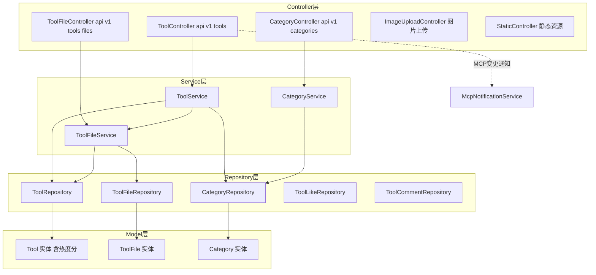
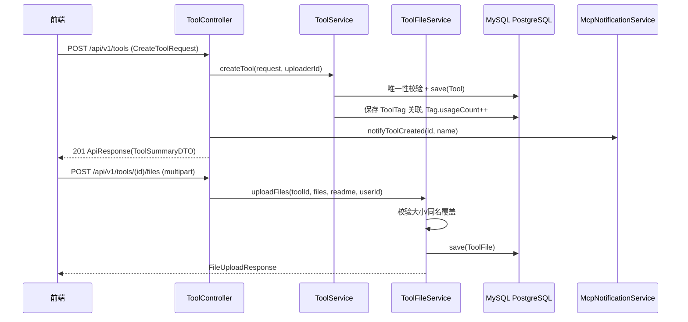

# 工具广场

工具广场是 CodingHub 的核心领域模块，提供 AI 工具的完整生命周期管理：发布（含标签关联）、多维检索（分类/关键词/标签/排序）、详情浏览（自动计浏览量）、文件附件上传/下载/删除、Logo 管理、管理员置顶与热度 Top5 排行。

后端入口为 `/api/v1/tools`（工具 CRUD）、`/api/v1/categories`（分类）与文件子资源 `/api/v1/tools/{id}/files`。模块采用标准四层结构：Controller → Service → Repository → Model，数据表为 `tool`、`tool_file`、`category`、`tool_like`、`tool_comment`。

## Component Constraint Index

| Component | Constraints | Risks | Summary |
|-----------|-------------|-------|---------|
| ToolService.createTool | 3 | 1 | 同用户同分类下工具名唯一 |
| ToolService.updateTool/deleteTool | 2 | 1 | 仅 owner 或 ADMIN 可操作 |
| ToolFileService.uploadFiles | 4 | 2 | 单文件 50MB / 总量 200MB，同名覆盖 |
| ToolFileService.downloadFile | 2 | 0 | 原子计数 + 热度分联动 |
| ToolService.getTools | 2 | 0 | 分页上限 100，默认 hot 排序 |
| Tool.updateScore | 1 | 0 | 热度分五因子加权公式 |
| ToolController.pinTool | 1 | 0 | 置顶仅限 ADMIN/SUPER_ADMIN |
| ToolFileService.deleteToolFile | 1 | 1 | 仅上传者本人可删文件 |

## 架构总览 (Architecture Overview)



工具的创建/更新/删除会通过 `McpNotificationService` 向 MCP 客户端推送资源变更通知（见 [MCP服务](MCP服务.md)）。收藏数、点赞、评论等互动数据委托给统一互动体系（见 [统一互动与通知](统一互动与通知.md)）。

## 组件职责 (Component Responsibilities)

### ToolController (`/api/v1/tools`)

| 端点 | 方法 | 说明 | 鉴权 |
|------|------|------|------|
| `GET /` | getTools | 分页列表：categoryId/keyword/tagId/sortBy(hot,latest,name) | 公开 |
| `GET /{id}` | getToolById | 详情，浏览量 +1 | 公开 |
| `POST /` | createTool | 创建工具，触发 MCP 通知 | JWT |
| `PUT /{id}` | updateTool | 更新（owner/admin） | JWT |
| `DELETE /{id}` | deleteTool | 软删除（owner/admin） | JWT |
| `POST /{id}/logo` | updateLogo | 更新 Logo URL | JWT |
| `POST /{id}/pin` `DELETE /{id}/pin` | pin/unpin | 置顶/取消置顶 | ADMIN/SUPER_ADMIN |
| `GET /hot-top5` | getHotTop5 | 热度 Top5 工具 ID | 公开 |

### ToolService

核心业务逻辑：

- **列表检索**：`getTools` 按 `tagId` 是否存在选择带标签联查的 Repository 方法；`sortBy` 支持 `name`（按名）、`latest`（按时间）、默认 `hot`（`pinned DESC, score DESC`）。分页 size 上限 100（`Math.min(size, 100)`）。
- **批量计数**：列表转 DTO 时通过 `batchFavoriteCounts`/`batchDownloadCounts` 一次性聚合收藏数与下载数（`countByTargetTypeAndTargetIdIn` / `sumDownloadCountGroupByToolId`），避免循环内逐条查询数据库。
- **创建**：校验同用户+同分类+同名（NORMAL 状态）唯一；保存后逐个建立 `ToolTag` 关联并递增标签 `usageCount`。
- **更新**：owner/admin 权限校验；名称或分类变更时重新做唯一性校验（以原上传者 ID 为准）；`tagIds` 非 null 时全量替换标签关联并同步增减 usage 计数。
- **删除**：软删除（`status = DELETED`），删除前先调 `ToolFileService.cleanupToolFiles` 清理物理文件与文件记录。

**Business Constraints — ToolService**

- 同一用户在同一分类下不允许上传同名工具 (confidence: 0.95)
  > Evidence: `existsByNameAndUploaderIdAndCategoryIdAndStatus(...) → throw new DuplicateResourceException("您已在该分类下上传过同名工具")` — 创建与更新路径均显式做该唯一性校验，且实体上有 `uk_tool_uploader_name_category` 唯一约束兜底。
- 只有上传者本人或 ADMIN/SUPER_ADMIN 可更新/删除/改 Logo (confidence: 0.95)
  > Evidence: `boolean isOwner = tool.getUploader().getId().equals(user.getId()); boolean isAdmin = user.getRole() == Role.ADMIN || ...; if (!isOwner && !isAdmin) throw new ForbiddenException("无权操作此内容")` — 三个写方法中重复出现的相同权限守卫。
- 工具删除为软删除，且必须先清理附件 (confidence: 0.9)
  > Evidence: `toolFileService.cleanupToolFiles(id); tool.setStatus(Tool.Status.DELETED); toolRepository.save(tool)` — 不物理删除工具行，仅置状态；附件物理文件与记录先行清理。
- 列表分页 size 上限 100 (confidence: 0.9)
  > Evidence: `PageRequest.of(page, Math.min(size, 100))` — 防止超大分页拖垮查询。
- 详情读取即计浏览量并联动热度分 (confidence: 0.85)
  > Evidence: `tool.incrementViewCount(); toolRepository.save(tool)`（getToolById）— 与论坛、视频详情页行为对齐。

### Tool 实体与热度分模型

`Tool` 持有反规范化计数列（viewCount/likeCount/commentCount/downloadCount/favoriteCount）与综合热度分 `score`：

```text
score = view×1 + download×2 + like×3 + favorite×4 + comment×5
```

所有 `incrementXxx/decrementXxx` 方法内部都调用 `updateScore()`，保证计数与热度分同事务更新。`pinned` 字段参与默认排序（置顶优先）。`@PrePersist/@PreUpdate` 自动维护时间戳。

**Business Constraints — Tool**

- 热度分为五因子固定权重公式，计数变更即同步重算 (confidence: 0.95)
  > Evidence: `// 综合热度分：score = viewCount×1 + downloadCount×2 + likeCount×3 + favoriteCount×4 + commentCount×5` 及 `updateScore()` 在每个 increment/decrement 方法中被调用。
- 计数递减不允许出现负数 (confidence: 0.9)
  > Evidence: `if (this.likeCount > 0) this.likeCount--;` — decrement 前显式判零。

### ToolFileService（附件管理）

文件存储在 `UploadConfig.baseDir/{toolId}/` 目录下，数据库记录 `stored_path` 相对路径。

- **上传** `uploadFiles`：单文件 ≤50MB、单请求总量 ≤200MB；同名文件先删旧物理文件与旧记录（`flush()` 释放唯一约束）再写入，实现覆盖语义；可携带 `readme` 文本落盘为 `readme.md`；`userId == null` 时跳过 owner 校验（MCP 匿名上传通道）。
- **下载** `downloadFile`：校验物理文件存在后 `incrementDownloadCount` 原子更新文件级计数，并联动工具级 `downloadCount` 与热度分。
- **删除** `deleteToolFile`：仅工具上传者本人可删（此处不含 admin 豁免）；物理删除 + 记录删除。
- **清理** `cleanupToolFiles`：删除工具全部物理文件、目录与记录，供工具删除时级联调用。

**Business Constraints — ToolFileService**

- 单文件 ≤ 50MB，单次请求总量 ≤ 200MB (confidence: 0.95)
  > Evidence: `MAX_FILE_SIZE = 50 * 1024 * 1024L; MAX_REQUEST_SIZE = 200 * 1024 * 1024L` 与对应的 `FileValidationException` 抛出点。
- 同名文件上传即覆盖（先物理删、后删记录并 flush、再插入） (confidence: 0.9)
  > Evidence: `findByToolIdAndOriginalNameAndStatus(...).ifPresent(existing -> { Files.deleteIfExists(oldPath); toolFileRepository.delete(existing); toolFileRepository.flush(); })` — flush 是为释放唯一约束。
- MCP 匿名上传时跳过所有权校验 (confidence: 0.85)
  > Evidence: `// Verify ownership (skip if userId is null, e.g. anonymous upload via MCP client) if (userId != null && !tool.getUploader().getId().equals(userId)) throw new ForbiddenException(...)`。
- 文件删除仅限工具上传者本人，无 admin 豁免 (confidence: 0.8)
  > Evidence: `if (!tool.getUploader().getId().equals(userId)) throw new ForbiddenException("无权限删除此文件")` — 与工具级操作的 owner||admin 规则不同。

### CategoryService / CategoryController

提供工具分类的只读列表（`GET /api/v1/categories`），分类含 `name/icon/logoUrl`。

### ImageUploadController / StaticController

- `ImageUploadController`：通用图片上传（工具 Logo、内容配图），返回可访问 URL。
- `StaticController`：托管上传文件的静态访问路由。

## 数据流：工具创建与文件上传



## 接口契约与副作用

- 所有响应包裹 `ApiResponse<T>`（`code/message/data`），分页用 `PageResponse<T>`（content/totalElements/totalPages/page/size），见 [平台基础](平台基础.md)。
- 写操作副作用：创建/更新/删除工具会触发 MCP `notifyToolCreated/Updated/Deleted` 通知；下载文件会同时更新文件级与工具级计数及热度分。
- 收藏数/下载数为读时聚合（收藏来自统一收藏表，下载来自 `tool_file` 求和），不在 `tool` 行内独立维护收藏计数的查询路径。

## 依赖关系 (Cross-References)

- [统一互动与通知](统一互动与通知.md) — 点赞/评论/收藏通过 `TargetType.TOOL` 走统一互动接口；`ToolService` 直接依赖 `UnifiedFavoriteRepository`、`TagRepository`、`ToolTagRepository`。
- [MCP服务](MCP服务.md) — `McpNotificationService` 推送工具变更；MCP 工具 `h3_coding_hub_tool_*` 复用本模块 Service 层。
- [用户与认证](用户与认证.md) — `@AuthenticationPrincipal User` 注入当前用户；owner/admin 权限模型。
- [平台基础](平台基础.md) — `ApiResponse/PageResponse`、异常体系（ResourceNotFoundException/ForbiddenException/DuplicateResourceException/FileValidationException）、`UploadConfig`。
- [前端应用](前端应用.md) — `frontend/src/services/tool.ts` 消费本模块 API。

## 约束、假设与边界情况

- 唯一约束 `uk_tool_uploader_name_category` 包含 `status` 列，因此软删除后可重新上传同名工具。
- 更新时若仅改 content/description 不触发唯一性校验（`nameChanged || categoryChanged` 才校验）。
- `getHotTop5` 只返回工具 ID 列表，由前端二次拉取详情。
- README 保存失败仅记日志不回滚整个上传事务（catch IOException 后继续）。
- 标签替换是全量语义：`tagIds` 传空数组会清空全部标签；传 null 则不动。
