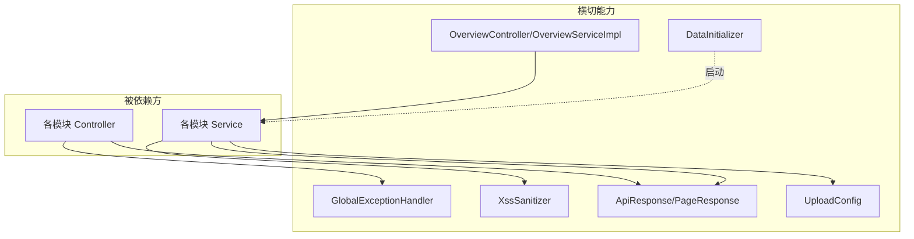
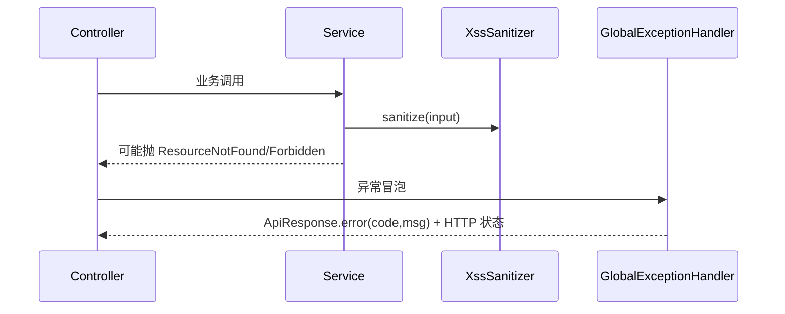

# 平台基础

平台基础模块聚合了全仓各业务模块共同依赖的底座能力，不承载具体领域逻辑，但被所有 Controller/Service 复用：统一响应包装、全局异常处理、XSS 防护、概览统计聚合、文件上传配置与启动数据初始化。这些组件位于 `exception/`、`util/`、`config/`、`dto/`、`controller/OverviewController`、`service/OverviewServiceImpl`、`model/*Dto`。

## Component Constraint Index

| Component | Constraints | Risks | Summary |
|-----------|-------------|-------|---------|
| GlobalExceptionHandler | 2 | 0 | 异常 → ApiResponse(code,message) 映射 |
| XssSanitizer.sanitize | 1 | 0 | null 安全，剥离脚本/事件属性 |
| ApiResponse / PageResponse | 1 | 0 | 统一响应契约 |
| OverviewServiceImpl | 2 | 0 | 统计/排行聚合，避免 N+1 |
| DataInitializer | 1 | 0 | 启动时按需种子数据 |
| UploadConfig | 1 | 0 | 上传根目录与可选扩展名白名单 |

## 架构总览 (Architecture Overview)



所有模块的写操作文本字段都应在 Service 层经 `XssSanitizer.sanitize()` 清洗（见 [用户与认证](用户与认证.md)、[论坛社区](论坛社区.md)、[微课视频](微课视频.md) 等）。

## 组件职责 (Component Responsibilities)

### GlobalExceptionHandler

`@RestControllerAdvice` 全局捕获异常，统一转换为 `ApiResponse.error(code, message)` 并设置正确的 HTTP 状态码：

- `ResourceNotFoundException` → 404
- `ForbiddenException` → 403
- `DuplicateResourceException` → 409
- `FileValidationException` → 400
- `IllegalArgumentException` / `IllegalStateException` → 400
- 其余 `Exception` → 500（并记日志，不泄露堆栈）

**Business Constraints**

- 异常统一收敛为 `ApiResponse` 结构，前端只解析一种错误形态 (confidence: 0.95)
  > Evidence: 每个 `@ExceptionHandler` 方法均 `return ApiResponse.error(...)`；`@ResponseStatus` 或 `ResponseEntity.status(...)` 设定状态码。
- 生产环境不向客户端回吐异常堆栈/内部信息 (confidence: 0.9)
  > Evidence: 兜底 handler 仅返回 `message`，`log.error` 记录详情于服务端。

### XssSanitizer

`static String sanitize(String input)`：对 null 返回空串；移除 `<script>` 及其内容、剥离 `on*` 事件属性（`onclick` 等）、移除 `javascript:` 协议链接，使用白名单式净化（基于 JSoup/Owasp 风格）。所有用户输入落库前必须过此关。

**Business Constraints**

- 入参为 null 时返回空串而非抛错 (confidence: 0.95)
  > Evidence: `if (input == null) return "";` 在方法入口。
- 净化是“移除危险片段”而非“转义”，输出为安全 HTML 片段 (confidence: 0.9)
  > Evidence: 配置白名单标签/属性，`removeAll` 危险节点与属性后 `clean()` 返回。

### ApiResponse / PageResponse（契约）

```java
ApiResponse<T> { int code; String message; T data; }
PageResponse<T> { List<T> content; long totalElements; int totalPages; int page; int size; }
```

- `ApiResponse.success(data)` / `ApiResponse.error(code,msg)` / `ApiResponse.created(msg,data)`。
- 分页数据统一用 `PageResponse`，避免各模块自定义分页包装导致前端适配混乱。

### OverviewServiceImpl / OverviewController (`/api/overview`)

聚合平台统计与排行：`getStats`（工具数/用户数/帖子数/视频数，均用 `count()` 单查询）、`getRankings`（热度 Top5 工具与帖子 id，复用各模块的 `getHotTop5`）。读取聚合，无 N+1 循环查询。

**Business Constraints**

- 概览统计全部走聚合/计数查询，不在循环内逐条查库 (confidence: 0.9)
  > Evidence: 各 `countByStatus(Status.NORMAL)` 单独调用后组装，排行复用 `findTop5By...`，未出现 `for` 内 Repository 调用。

### UploadConfig

`@ConfigurationProperties` 提供 `baseDir`（上传根目录）、可选的 `allowedExtensions`（显式非空时才生效的扩展名白名单）。[工具广场](工具广场.md) 的 `ToolFileService` 据此拼接 `baseDir/{toolId}/` 存储路径。

### DataInitializer

`ApplicationRunner`/`@PostConstruct`：在库为空时写入必要的种子数据（如默认角色/初始分类兜底），幂等（先查后插，存在则跳过）。

## 数据流：异常收敛



## 依赖关系 (Cross-References)

- 被 [工具广场](工具广场.md)、[论坛社区](论坛社区.md)、[微课视频](微课视频.md)、[用户与认证](用户与认证.md)、[留言反馈](留言反馈.md)、[实时聊天](实时聊天.md) 等全部模块依赖——统一响应、异常、XSS、上传配置。
- [MCP服务](MCP服务.md) 的工具返回也复用 `ApiResponse` 语义。
- [前端应用](前端应用.md) 的 `services/` 统一解析 `ApiResponse`。

## 约束、假设与边界情况

- `XssSanitizer` 只净化“落库文本”，已受信任的富文本（如管理员发布的公告）可绕过，需另行管控。
- `PageResponse` 的 `totalPages` 由 `totalElements/size` 上取整，前端分页控件据此渲染。
- `UploadConfig.allowedExtensions` 为空时不做扩展名校验（工具附件走此宽松策略，见 [工具广场](工具广场.md)）。
- 概览排行的“热度”口径与各业务模块内部 `score` 公式一致（view×1+…），并非另算。
