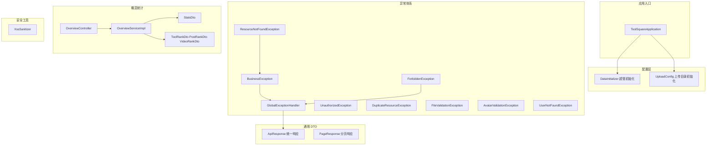
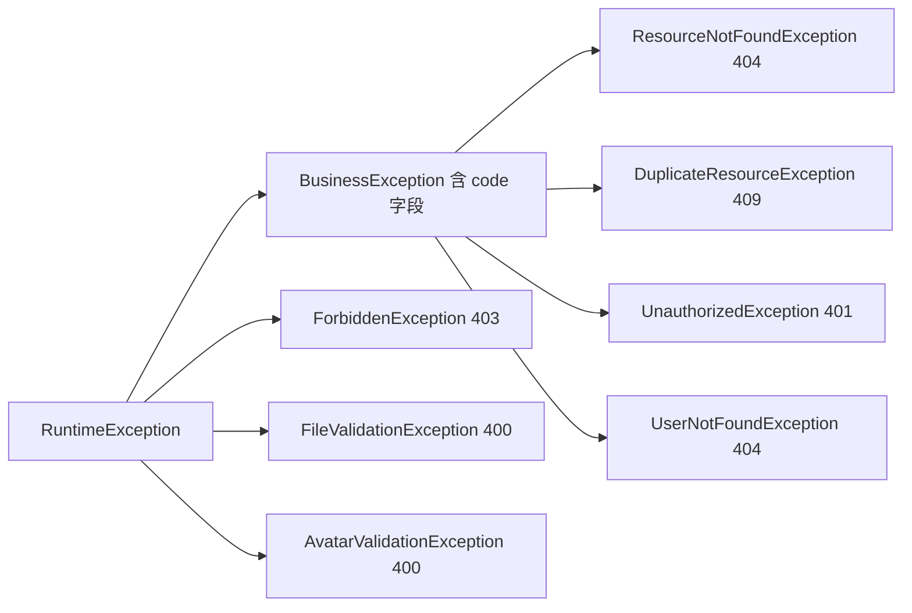
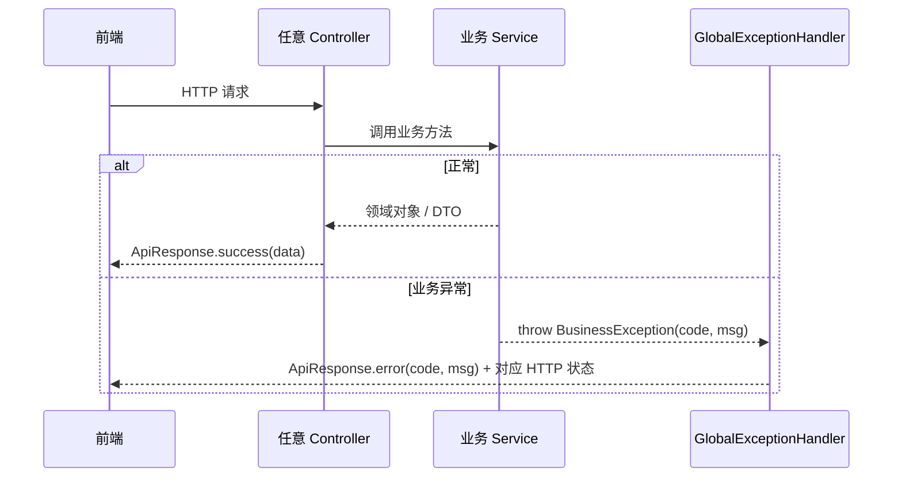

# 平台基础

## 模块概述

平台基础模块是 CodingHub 后端的横切支撑层，为所有业务模块提供统一的应用入口、全局异常处理、响应包装、XSS 防护、数据初始化以及平台概览统计能力。该模块不包含独立的业务领域，但被所有领域模块（[工具广场](工具广场.md)、[论坛社区](论坛社区.md)、[微课视频](微课视频.md)、[知识库与RAG](知识库与RAG.md) 等）直接依赖。

- **代码位置**: `backend/src/main/java/com/iaihub/toolbox/`（`ToolSquareApplication` + `config/`、`exception/`、`util/`、`dto/` 通用部分 + 概览统计三件套）
- **组件数量**: 75 个（1 个应用入口、2 个配置类、9 个异常类、1 个工具类、6 个通用 DTO、概览统计 Controller/Service/DTO）

## 架构图



## 核心组件

### 1. 应用入口 — ToolSquareApplication

标准 Spring Boot 3.2.5 启动类，`main` 方法引导整个后端应用（端口 8082）。启动时按激活 Profile（`mysql` / `postgresql`）连接对应数据库，Hibernate `ddl-auto: update` 自动维护 Schema。

### 2. 数据初始化 — DataInitializer

实现 `CommandLineRunner`，应用启动后自动创建超级管理员账户：

- 用户名/密码来自配置 `app.super-admin.username`（默认 `admin`）与 `app.super-admin.password`
- 若同名用户已存在：角色为 `SUPER_ADMIN` 则跳过；角色不符则仅打 WARN 日志，**不覆盖**，需人工修复
- 密码经 `PasswordEncoder`（BCrypt）加密存储

### 3. 上传目录初始化 — UploadConfig

`@PostConstruct init()` 在启动时确保文件上传根目录存在（工具文件、头像、图片、视频共用的上传基础设施），避免首次上传时因目录缺失失败。

### 4. 全局异常处理 — GlobalExceptionHandler

`@RestControllerAdvice` 统一将异常转译为 `ApiResponse` 结构，前端只需处理一种错误格式：

| 异常类型 | HTTP 状态 | 说明 |
|----------|-----------|------|
| `BusinessException` | `ex.getCode()` 动态 | 业务异常基类，自带状态码 |
| `MethodArgumentNotValidException` | 400 | Bean Validation 失败，聚合所有字段错误消息 |
| `ForbiddenException` | 403 | 权限不足（非 owner 且非管理员） |
| `IllegalArgumentException` | 400 | 参数非法 |
| `Exception`（兜底） | 500 | 打 ERROR 日志，返回 "Internal server error" |

**注意**: 兜底处理会将所有未捕获异常（包括 404 路由不存在）转译为 500 响应，因此 `/actuator/health` 未暴露时返回 500 而非 404。

### 5. 异常类层次



各业务模块**禁止返回 null**，统一通过抛出上述异常或返回 `Optional` 表达缺失语义（项目约束规则）。

### 6. 统一响应 — ApiResponse / PageResponse

`ApiResponse<T>` 是全局响应信封（`@JsonInclude(NON_NULL)` 省略空字段）：

```java
ApiResponse.success(data)          // 200 + data
ApiResponse.success(msg, data)     // 200 + 自定义消息
ApiResponse.created(data)          // 201（资源创建）
ApiResponse.error(code, message)   // 任意错误码
```

`PageResponse<T>` 封装分页结果（content / totalElements / totalPages / page / size），供工具列表、论坛帖子列表、视频列表等所有分页接口复用。

### 7. XSS 防护 — XssSanitizer

静态工具类，两个入口：

- `sanitize(html)`: 白名单过滤富文本（帖子内容、评论等允许安全标签）
- `sanitizePlainText(text)`: 纯文本转义（标题、昵称等不允许任何标签）

所有用户输入内容在 Service 层落库前必须经过该工具净化（项目安全约束）。

### 8. 概览统计 — Overview 三件套

`OverviewController` 暴露 `/api/overview` 前缀的只读统计接口（**无需认证**）：

| 端点 | 返回 | 说明 |
|------|------|------|
| `GET /api/overview/stats` | `StatsDto` | 全站计数：userCount / toolCount / postCount / videoCount |
| `GET /api/overview/tool-ranks` | `List<ToolRankDto>` | 工具热度排行（score 综合点赞/评论） |
| `GET /api/overview/post-ranks` | `List<PostRankDto>` | 帖子热度排行 |
| `GET /api/overview/video-ranks` | `List<VideoRankDto>` | 视频排行（viewCount / likeCount） |

`OverviewServiceImpl` 聚合各领域 Repository 的 count/rank 查询，是唯一被允许跨领域读取多个 Repository 的服务（只读统计场景）。前端 `OverviewPage` 首页大屏消费这些接口。

## 请求处理时序



## 依赖关系

- **被依赖**: 全部业务模块依赖 `ApiResponse`、`PageResponse`、异常体系与 `XssSanitizer`
- **依赖**: `DataInitializer` 依赖 [用户与认证](用户与认证.md) 的 `UserRepository` / `User` / `Role`（Spring 标准初始化用法，不算层级违规）；`OverviewServiceImpl` 只读依赖工具/帖子/视频/用户四个领域的 Repository

## 设计约定

1. **响应信封二元性**: 业务接口统一 `ApiResponse` 包装；但概览统计接口直接返回 DTO（历史原因，前端已适配）
2. **异常即错误码**: HTTP 状态码由异常自身携带（`BusinessException.code`），Controller 不手写错误分支
3. **启动自愈**: 超管账户与上传目录在每次启动时幂等检查，环境迁移无需手工准备
