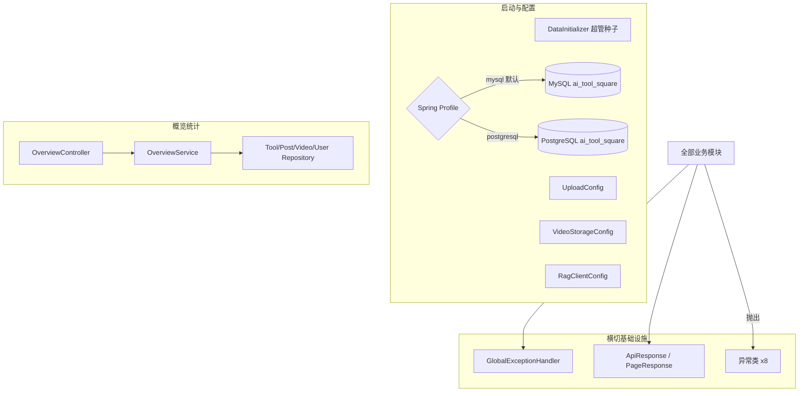

# 平台基础

## 模块概述

平台基础模块承载所有横切关注点（L0 层），被全部业务模块依赖：

- **统一响应与异常**：`ApiResponse<T>` / `PageResponse<T>` 响应信封 + 9 个异常类 + `GlobalExceptionHandler`
- **双数据库支持**：MySQL / PostgreSQL 配置切换（Spring Profile），业务代码零改动
- **启动初始化**：`DataInitializer` 幂等创建超级管理员
- **上传配置**：`UploadConfig` / `VideoStorageConfig` 文件上传目录与限制
- **概览统计**：`OverviewController` 首页统计与三类内容排行榜

## 架构总览

## 统一响应与异常体系

### 响应信封

- `ApiResponse<T>`：`{ code, message, data }` —— 所有 REST 接口统一外层
- `PageResponse<T>`：`{ items, total, page, size, totalPages }` —— 分页专用

### 异常类（exception/）

| 异常 | HTTP 状态 | 场景 |
|------|-----------|------|
| `BusinessException` | 自定义 code | 通用业务错误（携带状态码） |
| `ResourceNotFoundException` | 404 | 资源不存在 |
| `UserNotFoundException` | 404 | 用户不存在 |
| `DuplicateResourceException` | 409 | 名称重复（工具/知识库/用户名） |
| `UnauthorizedException` | 401 | 未认证 / token 失效 |
| `ForbiddenException` | 403 | 无权限（非 owner 且非 admin） |
| `FileValidationException` | 400 | 文件类型/大小校验失败 |
| `AvatarValidationException` | 400 | 头像校验失败 |

`GlobalExceptionHandler`（`@RestControllerAdvice`）统一捕获并转为 `ApiResponse` 错误响应；未知异常兜底 500。**项目约定：Service 层禁止返回 null，用抛异常或 `Optional` 代替** —— 异常体系是该约定的落地支撑。

## 双数据库配置

**核心思路**：同一套 JPA 实体 + Hibernate 6 方言自动探测，用 Spring Profile 切换数据源。

- `application.yml`：`spring.profiles.default: mysql`（种子数据在 MySQL）；`--spring.profiles.active=postgresql` 切换
- 两个 JDBC 驱动共存于 `build.gradle`；无硬编码方言
- PostgreSQL profile 独有：`globally_quoted_identifiers=true`（解决 `user` 保留字），**不放** common/test 段（H2 MODE=MySQL 会把双引号当字符串）
- 实体注意：`columnDefinition = "text"` 须小写（PG 全局引号会把 `TEXT` 引为无效标识符）
- Schema 由 Hibernate `ddl-auto: update` 生成；历史迁移脚本 Flyway V1~V11 位于 `backend/src/main/resources/db/migration/`
- 初始化命令：`make db`（MySQL）/ `make db-pg` + `make db-pg-seed`（PostgreSQL）

## 启动与配置组件

| 组件 | 职责 |
|------|------|
| `DataInitializer` | `CommandLineRunner`：启动时幂等创建超级管理员账号（已存在则跳过） |
| `UploadConfig` | 工具附件/图片上传目录、大小与类型白名单配置 |
| `VideoStorageConfig` | 视频存储目录配置 |
| `RagClientConfig` | RAG 服务地址配置（`app.rag.base-url` / `public-url`） |
| `ToolSquareApplication` | Spring Boot 启动类 |

> `SecurityConfig` / `JwtAuthenticationFilter` 见 [用户与认证](用户与认证.md)；`WebSocketConfig` 等聊天配置见 [实时聊天](实时聊天.md)；`McpSdkServerConfig` 见 [MCP服务](MCP服务.md)。

## 概览统计 (`/api/overview`)

| 端点 | 说明 |
|------|------|
| `GET /stats` | 全站统计（`StatsDto`：工具数、帖子数、视频数、用户数等） |
| `GET /tool-ranks` | 工具排行榜（`ToolRankDto`） |
| `GET /post-ranks` | 帖子排行榜（`PostRankDto`） |
| `GET /video-ranks` | 视频排行榜（`VideoRankDto`） |

`OverviewService` 聚合各 Repository 的统计查询（单次批量查询，不在循环中查库），供前端 OverviewPage 大屏展示。

## 编码约定（全模块生效）

1. **禁止循环依赖**：单向 controller → service → repository → model
2. **禁止在循环中查库/调接口**：列表组装一律批量查询
3. **遍历优先 for 循环**：避免 while/foreach/stream/iterator
4. **禁止返回 null**：抛异常或 `Optional`
5. **软删除**：内容实体删除均为状态标记
6. **XSS 防护**：用户输入统一 `XssSanitizer.sanitize()`

## 与其他模块的关系

- 本模块是 L0 层，被 [工具广场](工具广场.md)、[论坛社区](论坛社区.md)、[微课视频](微课视频.md)、[知识库与RAG](知识库与RAG.md)、[统一互动与通知](统一互动与通知.md)、[实时聊天](实时聊天.md)、[用户与认证](用户与认证.md)、[MCP服务](MCP服务.md) 全部依赖
- 不反向依赖任何业务模块（`OverviewService` 仅只读聚合 Repository）

<!-- crosslinks (auto-generated) -->
## Related Modules
- Depends on: [工具广场](工具广场.md), [微课视频](微课视频.md), [用户与认证](用户与认证.md), [论坛社区](论坛社区.md)
- Used by: [工具广场](工具广场.md), [微课视频](微课视频.md), [用户与认证](用户与认证.md), [知识库与RAG](知识库与rag.md), [统一互动与通知](统一互动与通知.md), [论坛社区](论坛社区.md)
