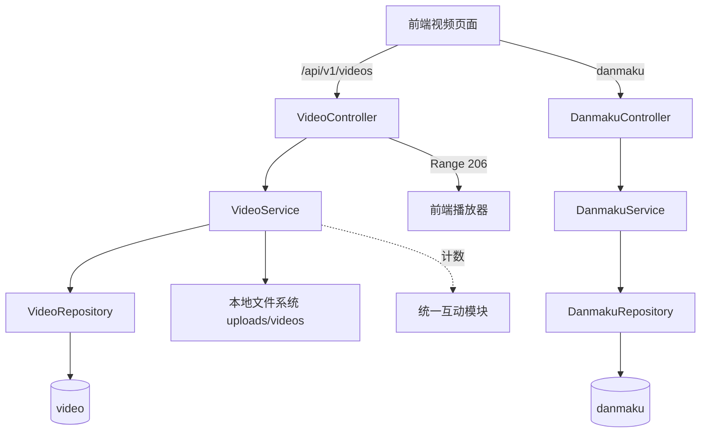

# 微课视频

## 模块概述

微课视频模块提供教学视频的完整生命周期管理：

- **上传与管理**：MultipartFile 上传、标题/描述/标签编辑、封面上传、软删除
- **流式播放**：`/stream` 端点支持 HTTP Range 分段请求（206 Partial Content，默认单次最多 1MB），前端 `<video>` 可拖动进度条
- **弹幕系统**：按视频时间轴发送/拉取弹幕，支持滚动/顶部/底部三种类型与自定义颜色
- **运营能力**：管理员置顶、热度 Top5 榜单（`score` 热度分）
- **互动**：点赞/评论/收藏复用 [统一互动与通知](统一互动与通知.md)（`targetType = VIDEO`）

## 架构总览

## REST API

### [VideoController](../../../backend/src/main/java/com/iaihub/toolbox/controller/video/VideoController.java) (`/api/v1/videos`)

| 端点 | 说明 |
|------|------|
| `POST /` | 上传视频（multipart：file + title + description + tagIds） |
| `GET /{id}` | 详情（含当前用户互动状态） |
| `PUT /{id}` | 更新元数据（owner 或 admin） |
| `DELETE /{id}` | 软删除（owner 或 admin） |
| `GET /{id}/stream` | **流式播放**：解析 `Range: bytes=` 头返回 206 分段内容 |
| `GET /my` | 我的视频 |
| `POST /{id}/cover` | 上传封面（owner） |
| `GET /{id}/cover-image` | 读取封面图 |
| `POST /{id}/pin` / `DELETE /{id}/pin` | 置顶/取消（admin） |
| `GET /hot-top5` | 热度 Top5 视频 ID |

### [DanmakuController](../../../backend/src/main/java/com/iaihub/toolbox/controller/video/DanmakuController.java) (`/api/v1/videos/{videoId}/danmaku`)

| 端点 | 说明 |
|------|------|
| `GET /` | 拉取该视频全部弹幕（按时间轴） |
| `POST /` | 发送弹幕（需登录；视频需 `danmakuEnabled=true`） |

## 核心组件

### [VideoService](../../../backend/src/main/java/com/iaihub/toolbox/service/video/VideoService.java)

**路径**: `backend/src/main/java/com/iaihub/toolbox/service/video/VideoService.java`

- `uploadVideo(file, title, description, uploaderId, tagIds)` — 校验类型/大小 → 落盘 `uploads/videos/` → 写 `video` 表 → 关联 `video_tag`
- `streamVideo` / `getVideoFilePath` — 供 Controller 做 Range 流式读取
- `getVideoList(sortBy, page, size)` — latest/hot 排序，置顶优先，批量组装作者信息（避免循环查库）
- `getVideoDetail(id, currentUserId)` — 详情 + 浏览计数 + 当前用户点赞/收藏状态
- `updateVideo` / `deleteVideo` — 权限 `isOwner || isAdmin`；删除为软删除（`VideoStatus.DELETED`）
- `uploadCover` / `getCoverFilePath` — 封面管理
- `pinVideo` / `unpinVideo` / `getHotTop5` — 运营功能

### [DanmakuService](../../../backend/src/main/java/com/iaihub/toolbox/service/video/DanmakuService.java)

发送弹幕（XSS 清洗、长度校验、检查 `danmakuEnabled`）与按视频拉取弹幕列表。

### HTTP Range 流式播放

`VideoController.streamVideo` 手动实现 Range 协议：

1. 无 `Range` 头 → 200 返回完整文件
2. `Range: bytes=start-end` → 206 + `Content-Range: bytes start-end/total`，单次默认最多 1MB
3. `rangeStart >= fileLength` → 416 Requested Range Not Satisfiable

该设计允许浏览器 `<video>` 标签流畅拖动进度条，且避免一次性加载大文件。

## 数据模型

**[Video](../../../backend/src/main/java/com/iaihub/toolbox/model/video/Video.java)**（`video` 表）：

| 字段 | 说明 |
|------|------|
| `title` / `description` | 标题与简介 |
| `filePath` / `fileName` / `fileSize` / `duration` | 文件元数据 |
| `coverUrl` | 封面路径 |
| `uploaderId` | 上传者 |
| `viewCount` / `likeCount` / `commentCount` | 冗余计数 |
| `score` / `pinned` | 热度分与置顶 |
| `danmakuEnabled` | 弹幕开关（默认 true） |
| `status` | `VideoStatus`: NORMAL / DELETED |

**[Danmaku](../../../backend/src/main/java/com/iaihub/toolbox/model/video/Danmaku.java)**（`danmaku` 表）：`videoId`、`user`（ManyToOne）、`content`、`timeSeconds`（时间轴位置）、`color`（默认 #FFFFFF）、`danmakuType`（SCROLL / TOP / BOTTOM）。

**DTO**（`dto/video/`）：`VideoUploadRequest`、`VideoUpdateRequest`、`VideoResponse`、`VideoListItem`、`VideoCommentRequest/Response`、`DanmakuDTO`、`SendDanmakuRequest`。

## 与其他模块的关系

- [统一互动与通知](统一互动与通知.md)：视频点赞/评论/收藏（`targetType = VIDEO`）
- [工具广场](工具广场.md)：共享统一标签系统（`tag` / `video_tag` 表，`TagService`）
- [用户与认证](用户与认证.md)：上传者信息与权限判定
- [前端应用](前端应用.md)：视频广场/播放页与 4 个 video 组件（含弹幕渲染）

<!-- crosslinks (auto-generated) -->
## Related Modules
- Depends on: [工具广场](工具广场.md), [平台基础](平台基础.md), [用户与认证](用户与认证.md), [统一互动与通知](统一互动与通知.md)
- Used by: [平台基础](平台基础.md), [统一互动与通知](统一互动与通知.md)
