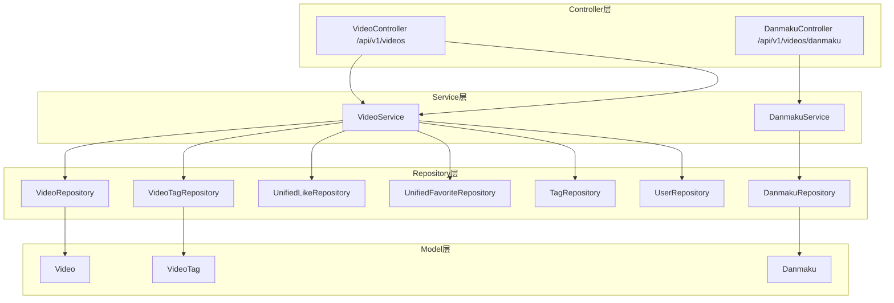
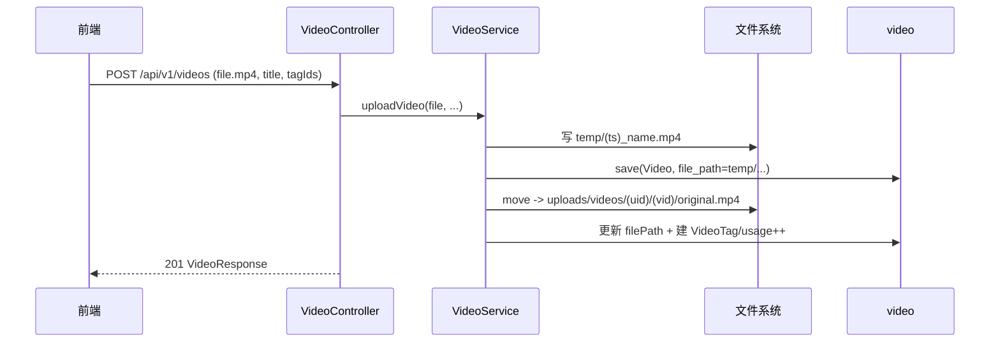

# 微课视频

微课视频模块提供教学视频的上传、播放与互动能力：MP4 上传（≤1GB）、基于 `RandomAccessFile` 的 HTTP Range 流式播放、详情浏览（含点赞/收藏态）、封面图管理、管理员置顶与热度 Top5，以及实时弹幕（Danmaku）。后端入口为 `/api/v1/videos` 与 `/api/v1/videos/{id}/danmaku`，数据表为 `video`、`video_comment`、`video_like`、`video_favorite`、`danmaku`。

## Component Constraint Index

| Component | Constraints | Risks | Summary |
|-----------|-------------|-------|---------|
| VideoService.uploadVideo | 3 | 1 | 仅 MP4，≤1GB，先落临时目录再移动 |
| VideoService.uploadCover | 2 | 0 | 封面 JPEG/PNG，≤5MB |
| VideoService.getVideoDetail | 2 | 0 | 浏览量+1，联动 like/favorite 态 |
| VideoService.updateVideo/deleteVideo | 2 | 1 | owner 或 ADMIN/SUPER_ADMIN |
| VideoService.streamVideo(Controller) | 2 | 1 | 支持 Range，单段默认 1MB |
| Video.updateScore | 1 | 0 | 热度分 = view*1+like*3+comment*5 |
| DanmakuService.sendDanmaku | 2 | 0 | 内容 XSS 清洗，默认 SCROLL/#FFFFFF |
| VideoController.pinVideo/unpinVideo | 1 | 0 | 置顶仅 ADMIN/SUPER_ADMIN |

## 架构总览 (Architecture Overview)

## 组件职责 (Component Responsibilities)

### VideoController (`/api/v1/videos`)

| 端点 | 方法 | 说明 | 鉴权 |
|------|------|------|------|
| `POST /` | uploadVideo | 上传 MP4（multipart） | JWT |
| `GET /` | getVideoList | 分页（sortBy=hot\|latest，默认 hot） | 公开 |
| `GET /{id}` | getVideoDetail | 详情（浏览量+1） | 公开(传 userId 查互动态) |
| `PUT /{id}` | updateVideo | 编辑（owner/admin） | JWT |
| `DELETE /{id}` | deleteVideo | 软删除（owner/admin） | JWT |
| `GET /{id}/stream` | streamVideo | 流式播放（支持 Range） | 公开 |
| `GET /my` | getMyVideos | 我的视频 | JWT |
| `POST /{id}/pin` `DELETE /{id}/pin` | pin/unpin | 置顶/取消 | ADMIN/SUPER_ADMIN |
| `POST /{id}/cover` `GET /{id}/cover-image` | 封面上传/读取 | 封面管理 | JWT / 公开 |
| `GET /hot-top5` | getHotTop5 | 热度 Top5 id | 公开 |

### VideoService

- **上传** `uploadVideo`：校验扩展名以 `.mp4` 结尾、大小 ≤ `1073741824L`(1GB)；先以 `System.currentTimeMillis()_原名` 落到 `temp/` 目录（因 `file_path` 有 NOT NULL 约束，需先存文件再建实体），保存实体后移动到 `uploads/videos/{userId}/{videoId}/original.mp4` 并更新 `filePath`；`tagIds` 非空前建 `VideoTag` 并 `Tag.usageCount++`。
- **列表** `getVideoList`：`sortBy=latest` 按 `createdAt DESC`，否则按 `hot`（`pinned DESC, score DESC`）；分页 `size` 上限 100（`Math.min(size,100)`）。
- **详情** `getVideoDetail`：`incrementViewCount()` + `save`；若 `currentUserId` 非空，从 `UnifiedLikeRepository`(targetType=VIDEO) 与 `UnifiedFavoriteRepository` 查询 `userLiked/userFavorited` 一并返回。
- **更新/删除**：owner/admin 守卫；更新支持改标题/描述/弹幕开关/`tagIds` 全量替换（同步 usage）；删除为 `status=DELETED` 软删除。
- **封面** `uploadCover`：仅 `image/jpeg` 或 `image/png`、≤5MB；落盘到 `uploads/covers/{videoId}.jpg|.png`，`coverUrl` 设为 `/api/v1/videos/{id}/cover-image`。

**Business Constraints — VideoService**

- 仅支持 MP4，单文件 ≤ 1GB (confidence: 0.95)
  > Evidence: `if (!originalFilename.toLowerCase().endsWith(".mp4")) throw new IllegalArgumentException("仅支持 MP4 格式视频")` 及 `file.getSize() > 1073741824L` 抛 "视频文件大小不能超过 1GB"。
- 封面仅 JPEG/PNG，≤ 5MB (confidence: 0.9)
  > Evidence: `uploadCover` 校验 `contentType` 为 `image/jpeg|image/png` 且 `file.getSize() > 5*1024*1024` 抛异常。
- 流式播放支持 HTTP Range，默认单段 1MB 精确 seek (confidence: 0.9)
  > Evidence: `streamVideo` 用 `RandomAccessFile` + `request.getHeader("Range")` 解析 `bytes=`，未指定时 `rangeEnd = min(rangeStart+1024*1024-1, fileLength-1)`，返回 `206 PARTIAL_CONTENT`。
- 视频写操作仅限上传者或 ADMIN/SUPER_ADMIN (confidence: 0.95)
  > Evidence: `updateVideo/deleteVideo/uploadCover` 中 `isOwner = video.getUploaderId().equals(user.getId()); isAdmin = ...; if (!isOwner && !isAdmin) throw new ForbiddenException("无权操作此内容")`。
- 热度分固定公式并随计数联动 (confidence: 0.95)
  > Evidence: `Video.updateScore()`：`score = viewCount*1 + likeCount*3 + commentCount*5`。
- 删除为软删除 (confidence: 0.9)
  > Evidence: `deleteVideo` 调 `video.setStatus(VideoStatus.DELETED)` 后 `save`。
- 上传先落临时目录再移动到最终路径（规避 NOT NULL 约束） (confidence: 0.85)
  > Evidence: `uploadVideo` 先写 `temp/` 再 `videoRepository.save`，最后 `Files.move(tempFile, targetFile)` 并更新 `filePath`。

### DanmakuService / DanmakuController

- `sendDanmaku`：对 `content` 调 `XssSanitizer.sanitize()`；`timeSeconds` 默认 0.0，`color` 默认 `#FFFFFF`，`danmakuType` 默认 `SCROLL`；关联 `User` 后存 `Danmaku`。
- `getDanmakuByVideoId`：通过 `findByVideoIdWithUser` 联查用户，映射为 `DanmakuDTO`（含 username/nickname）。

## 数据流：视频上传与文件落盘

## 接口契约与副作用

- 列表/详情返回 `PageResponse<VideoListItem>` / `VideoResponse`（见 [平台基础](平台基础.md)）；详情读取即计浏览量。
- 流式播放返回裸视频流（`video/mp4`），不参与 `ApiResponse` 包装，用于 `<video>` 直接消费。
- 标签替换与论坛一致：全量语义，`tagIds` 空数组清空、null 不动，并同步 `tag.usage_count`。

## 依赖关系 (Cross-References)

- [统一互动与通知](统一互动与通知.md) — 视频点赞/收藏走 `TargetType.VIDEO` 统一互动（`UnifiedLike/UnifiedFavorite`）。
- [用户与认证](用户与认证.md) — `@AuthenticationPrincipal User`、owner/admin 模型。
- [平台基础](平台基础.md) — `ApiResponse/PageResponse`、`XssSanitizer`、`VideoStorageConfig`。
- [前端应用](前端应用.md) — `frontend/src/services/video.ts`、`pages/video/*`、`components/video/*`。

## 约束、假设与边界情况

- 上传文件扩展名校验大小写不敏感（转 lowercase 后比对 `.mp4`）。
- 流式播放的 Range 解析：单段默认最多 1MB，有助于大视频边下边播；`Accept-Ranges: bytes` 始终返回。
- 详情页 `currentUserId` 为 null（未登录）时 `userLiked/userFavorited` 直接置 false，不做库查询。
- 封面读取按 `jpg → png` 顺序探测物理文件，缺失则抛 `ResourceNotFoundException`。
