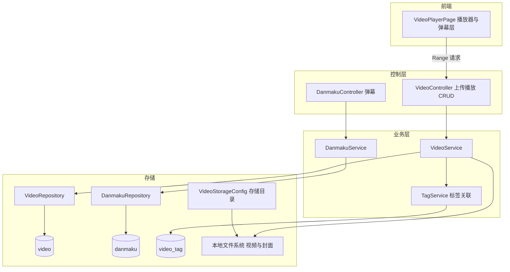
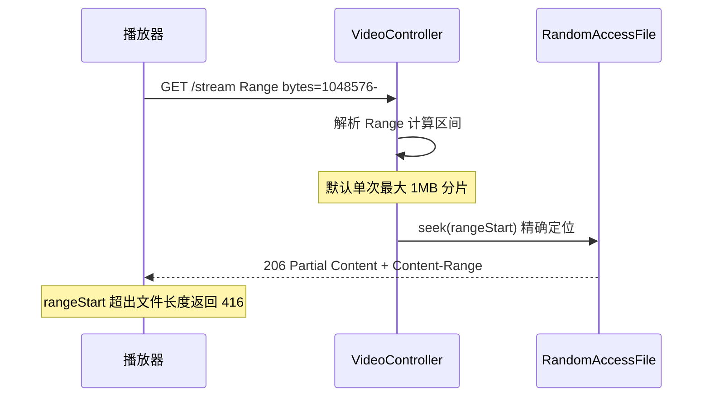

# 微课视频

## 模块概述

微课视频模块提供教学视频的上传、流式播放（HTTP Range 断点续传）、封面管理、标签关联与弹幕能力。视频的点赞/评论/收藏经 [统一互动与通知](统一互动与通知.md)（`targetType=VIDEO`）实现。

- **代码位置**: `controller/video/`（VideoController、DanmakuController）+ `service/video/`（VideoService、DanmakuService）+ `model/video/`（Video、Danmaku、VideoStatus）+ `config/VideoStorageConfig`
- **组件数量**: 96 个
- **API 前缀**: `/api/v1/videos`

## 架构图

## 数据模型

### video 表（Video 实体）

| 字段 | 说明 |
|------|------|
| `title` / `description` | 标题（200 字）/ 描述 |
| `file_path` / `file_name` / `file_size` | 物理文件三元组（本地存储） |
| `duration` | 时长（秒） |
| `cover_url` | 封面图 URL |
| `uploader_id` | Long 直存（同论坛风格，非 JPA 关联） |
| `status` | `NORMAL` / `DELETED`（VideoStatus，软删除） |
| `view_count` / `like_count` / `comment_count` / `favorite_count` | 计数冗余 |
| `score` | 综合热度分 |

索引：`(uploader_id, status)`、`(status, created_at DESC)`。

### danmaku 表（Danmaku 实体）

弹幕：`video_id`、`user_id`、`content`、`time_point`（视频内时间点，秒）、颜色/类型样式字段。按视频一次性全量拉取，前端按时间点渲染。

### 历史遗留表

`video_comment` / `video_like` / `video_favorite` 表与对应 Repository 仍存在（旧数据兼容），新互动一律走统一互动服务。

## REST 接口

### 视频（/api/v1/videos）

| 端点 | 权限 | 说明 |
|------|------|------|
| `POST /`（multipart） | 登录 | 上传视频（file + title + description + tagIds），201 |
| `GET /?sortBy=hot|latest` | 公开 | 分页列表（VideoListItem 含封面、计数、上传者） |
| `GET /{id}` | 公开 | 详情（自增 viewCount；登录用户附带互动状态） |
| `PUT /{id}` | owner 或 admin | 更新标题/描述/标签 |
| `DELETE /{id}` | owner 或 admin | 软删除 |
| `GET /{id}/stream` | 公开 | **流式播放**（HTTP Range） |
| `POST /{id}/cover` | owner | 上传封面图 |

### 弹幕（/api/v1/videos/{videoId}/danmaku）

| 端点 | 权限 | 说明 |
|------|------|------|
| `GET /` | 公开 | 拉取全部弹幕 |
| `POST /` | 登录 | 发送弹幕（content + timePoint + 样式） |

## 流式播放实现（HTTP Range）

`streamVideo` 直接操作 Servlet 响应流，支持播放器拖动进度条：

关键点：

1. **RandomAccessFile 精确 seek**: 避免顺序跳读大文件的 IO 浪费
2. **1MB 分片上限**: 客户端未指定结束位置时默认切 1MB，防止单请求长时间占用连接
3. **无 Range 时整文件输出**: 兼容不支持 Range 的客户端
4. **`Cache-Control: no-store`**: 避免代理缓存视频分片

## 依赖关系

- **依赖 [平台基础](平台基础.md)**: `ApiResponse` / `PageResponse`、异常体系、`XssSanitizer`（标题/描述净化）
- **依赖 [用户与认证](用户与认证.md)**: `User`、`isOwner || isAdmin` 鉴权、上传者信息装配
- **依赖 [统一互动与通知](统一互动与通知.md)**: TagService（`tagType=VIDEO`，`video_tag` 关联）
- **被依赖**: 统一互动的 `validateTargetExists(VIDEO)`；OverviewService 视频排行；前端 `pages/video/` + `components/video/` 经 [前端服务层](前端服务层.md) `video.ts`

## 设计要点

1. **本地存储 + DB 元数据**: 视频物理文件由 `VideoStorageConfig` 管理的本地目录存储，DB 只存路径元数据（与项目"本地裸机部署"约束一致，无对象存储依赖）
2. **上传即转存**: MultipartFile 落盘后生成唯一文件名，原始名保留在 `file_name` 供下载展示
3. **弹幕轻量化**: 无 WebSocket 推送，发送后由前端本地即时渲染 + 下次拉取全量合并，实现成本低
4. **播放公开、互动登录**: stream 与列表公开访问降低观看门槛，弹幕/点赞/收藏需要身份
