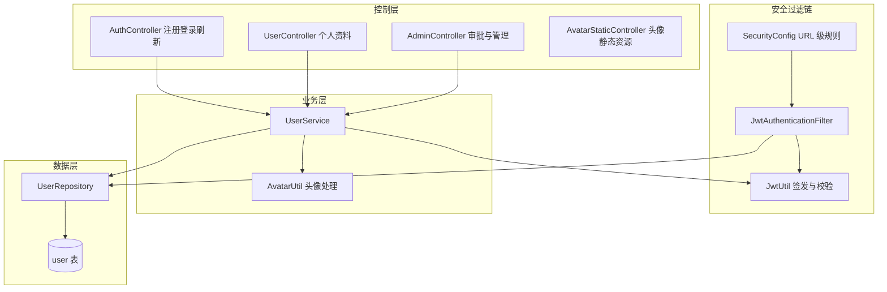
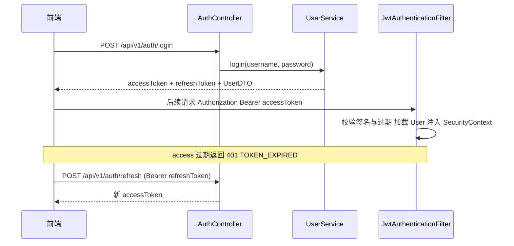

# 用户与认证

## 模块概述

用户与认证模块是 CodingHub 的安全基石，负责用户注册/登录/令牌刷新、JWT 无状态认证、角色权限体系（USER / ADMIN / SUPER_ADMIN）、个人资料与头像管理、管理员审批与用户管理，以及全站 URL 级安全策略（SecurityConfig）。

- **代码位置**: `AuthController` / `UserController` / `AdminController` / `AvatarStaticController` + `UserService` + `SecurityConfig` / `JwtAuthenticationFilter` + `JwtUtil` / `AvatarUtil` + `User` / `Role` / `AccountStatus`
- **组件数量**: 91 个
- **API 前缀**: `/api/v1/auth`、`/api/v1/users`、`/api/v1/admin`

## 架构图

## 数据模型

### user 表（User 实体）

表名带反引号 `` `user` ``（PostgreSQL 保留字兼容，postgresql profile 下启用 `globally_quoted_identifiers=true`）。

| 字段 | 说明 |
|------|------|
| `username` | 唯一，登录凭据 |
| `nickname` | 唯一，展示名 |
| `password` | BCrypt 加密 |
| `avatar_url` / `bio` | 头像与简介 |
| `role` | `USER` / `ADMIN` / `SUPER_ADMIN`（枚举字符串） |
| `status` | `ACTIVE` / `PENDING` / `DISABLED`（AccountStatus） |
| `last_login_at` | 登录时刷新 |

### 角色与状态语义

- **USER**: 普通用户，注册即 `ACTIVE`
- **ADMIN**: 管理员，注册后进入 `PENDING`，需 SUPER_ADMIN 审批（approve → ACTIVE / reject）
- **SUPER_ADMIN**: 超级管理员，由 [平台基础](平台基础.md) 的 `DataInitializer` 启动时创建（默认 admin），不可注册

## 认证流程

### JWT 双令牌机制（JwtUtil）

- **Access Token**: 15 分钟过期，`type=access`，subject 为 userId
- **Refresh Token**: 7 天过期，`type=refresh`
- HMAC-SHA 签名（`app.jwt.secret`），HS256

### JwtAuthenticationFilter

每请求执行一次：提取 `Authorization: Bearer <token>` → `JwtUtil.validateToken` → 按 userId 加载 `User` 实体 → 构建 `UsernamePasswordAuthenticationToken`（authorities 来自 `ROLE_{role}`）注入 `SecurityContext`。过期时在 request 标记 `jwt.expired`，由 SecurityConfig 的 entryPoint 区分返回 `TOKEN_EXPIRED` 与 `TOKEN_REQUIRED`。

## 安全策略（SecurityConfig）

全站策略：CSRF 关闭、CORS 全放行（allowedOriginPatterns `*` + credentials）、无状态 Session、`@EnableMethodSecurity` 支持方法级 `@PreAuthorize`。

URL 规则分类（节选，完整见 `SecurityConfig`）：

| 类别 | 规则 |
|------|------|
| 完全公开 | `/api/v1/auth/**`、`/mcp/**`、`/sse/**`、`/ws/**`、静态头像、公开用户主页 |
| 公开只读 | 工具/视频/知识库列表与详情 GET、论坛 hot-top5、标签、弹幕 GET、聊天历史 GET、留言 GET/POST |
| 匿名互动 | `/api/v1/interactions` 点赞 GET/POST、评论 GET/POST（支持游客） |
| 需登录 | 收藏、通知、图片上传 POST、工具/视频/用户写操作 |
| SUPER_ADMIN | `/api/v1/admin/approve|reject|pending-users|users/*/status`、用户删除 |
| ADMIN+ | 其余 `/api/v1/admin/**`、聊天消息删除 |
| 兜底 | `anyRequest().permitAll()` |

> 注意：兜底为 permitAll（而非 denyAll），新增敏感接口必须显式加规则或用 `@PreAuthorize`。

## REST 接口

### 认证（/api/v1/auth）

| 端点 | 说明 |
|------|------|
| `POST /register` | 注册。USER 即时激活并返回令牌；ADMIN 返回无令牌响应，等待审批 |
| `POST /login` | 登录，返回双令牌 + 用户信息，刷新 `last_login_at` |
| `POST /refresh` | 用 refresh token 换新 access token |

### 用户（/api/v1/users）

| 端点 | 说明 |
|------|------|
| `GET /me` | 当前用户信息（UserDTO） |
| `GET /me/tools` | 我发布的工具（分页/筛选，委托 [工具广场](工具广场.md) ToolService） |
| `POST /me/avatar` | 头像上传（multipart，AvatarUtil 校验尺寸/类型/压缩） |
| `DELETE /me/avatar` | 移除头像 |
| `PUT /me/profile` | 更新昵称/简介 |
| `PUT /me/password` | 修改密码（校验旧密码） |
| `GET /{id}` | 公开主页（PublicUserDTO，无需登录） |

### 管理（/api/v1/admin）

| 端点 | 权限 | 说明 |
|------|------|------|
| `GET /pending-users` | SUPER_ADMIN | 待审批 ADMIN 列表 |
| `POST /approve/{id}` / `POST /reject/{id}` | SUPER_ADMIN | 审批通过 / 拒绝 |
| `GET /users` | ADMIN+ | 用户分页查询（role/status/keyword 筛选） |
| `PUT /users/{id}/status` | SUPER_ADMIN | 启用/禁用账户 |
| `DELETE /users/{id}` | SUPER_ADMIN | 删除用户 |

`AvatarStaticController` 暴露 `GET /api/v1/static/avatars/**` 提供头像静态文件（公开）。

## 依赖关系

- **依赖 [平台基础](平台基础.md)**: `ApiResponse`、异常体系（`UnauthorizedException`、`UserNotFoundException`、`AvatarValidationException` 等）
- **被广泛依赖**: 所有业务模块通过 `@AuthenticationPrincipal User` 获取当前用户；[实时聊天](实时聊天.md) 复用 `JwtUtil` 做 WS 握手认证；[MCP服务](MCP服务.md) 写类工具复用 `UserService.login` 做凭据校验
- **前端配合**: [前端服务层](前端服务层.md) `http.ts` 拦截器负责携带 token 与 401 自动刷新重放

## 设计要点

1. **无状态认证**: 全部状态在 JWT 中，服务端不存 Session，水平扩展友好
2. **管理员准入审批**: ADMIN 注册走 PENDING 状态机，SUPER_ADMIN 人工审批，防止权限自授
3. **内容操作鉴权约定**: 全站统一 `isOwner || isAdmin` 判定（各业务 Service 实现），本模块提供角色载体
4. **头像本地存储**: 上传后压缩存盘（上传目录由 UploadConfig 初始化），DB 仅存 URL
