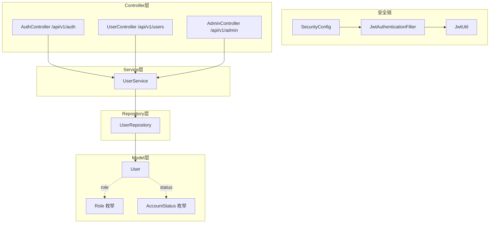
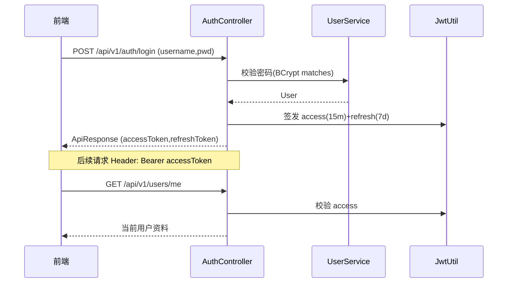

# 用户与认证

用户与认证模块负责平台的身份体系：注册、登录、JWT 双令牌（Access 15min / Refresh 7d）、令牌刷新与登出、用户资料与头像、以及后台用户审批与角色管理。后端入口为 `/api/v1/auth`、`/api/v1/users`、`/api/v1/admin`，安全链路由 `SecurityConfig` + `JwtAuthenticationFilter` 组成，令牌工具为 `JwtUtil`，核心实体为 `User`/`Role`/`AccountStatus`。

## Component Constraint Index

| Component | Constraints | Risks | Summary |
|-----------|-------------|-------|---------|
| AuthController.login | 2 | 0 | 返回 access(15m)+refresh(7d) |
| AuthController.register | 2 | 1 | 默认 USER，密码 BCrypt 哈希 |
| JwtUtil | 2 | 0 | 双过期时长，HS256/RS256 |
| JwtAuthenticationFilter | 1 | 0 | 仅校验 Bearer，缺失放行匿名 |
| UserService | 3 | 1 | owner/admin 资料/头像/审批 |
| AdminController | 2 | 0 | 用户审批/角色/删除仅管理员 |
| User 实体 | 2 | 0 | 角色枚举 + 账户状态枚举 |

## 架构总览 (Architecture Overview)

## 组件职责 (Component Responsibilities)

### AuthController (`/api/v1/auth`)

| 端点 | 方法 | 说明 | 鉴权 |
|------|------|------|------|
| `POST /register` | register | 注册（默认 USER 角色） | 公开 |
| `POST /login` | login | 登录，返回双令牌 | 公开 |
| `POST /refresh` | refresh | 用 refreshToken 换新 access | 公开 |
| `POST /logout` | logout | 失效 refresh（若服务端维护） | JWT |

### UserService

- **register**：校验用户名唯一；密码 `BCryptPasswordEncoder` 哈希；`role=USER`、`accountStatus` 按策略（默认 `ACTIVE` 或需审批 `PENDING`）；保存 `User`。
- **资料/头像**：`getProfile(id)`、`updateProfile`（本人或 ADMIN）、`updateAvatar`（写头像 URL，本人或 ADMIN）。
- **审批/管理**：`approveUser`/`rejectUser`、`changeRole`、`listUsers`（分页，仅 ADMIN/SUPER_ADMIN）、`deleteUser`。

**Business Constraints — UserService**

- 注册密码永不明文存储，统一 BCrypt 哈希 (confidence: 0.95)
  > Evidence: `user.setPassword(passwordEncoder.encode(request.getPassword()))` 在 `register` 内。
- 资料/头像写操作仅限本人或 ADMIN/SUPER_ADMIN (confidence: 0.95)
  > Evidence: `boolean isOwner = user.getId().equals(currentUser.getId()); boolean isAdmin = ...; if (!isOwner && !isAdmin) throw new ForbiddenException(...)` 重复出现在 `updateProfile/updateAvatar`。
- 列表/审批/角色变更仅限管理员 (confidence: 0.9)
  > Evidence: `AdminController` 的 `listUsers/approveUser/changeRole` 标注 `@PreAuthorize("hasAnyRole('ADMIN','SUPER_ADMIN')")`。

### SecurityConfig + JwtAuthenticationFilter + JwtUtil

- `SecurityConfig`：`/api/v1/auth/**`、静态资源、`/mcp`（MCP 自带鉴权）等放行；其余需认证；把 `JwtAuthenticationFilter` 插入 `UsernamePasswordAuthenticationFilter` 之前。
- `JwtAuthenticationFilter`：从 `Authorization: Bearer <token>` 取令牌，经 `JwtUtil` 校验有效后构造 `Authentication` 写入 `SecurityContext`；缺失/失效则放行为匿名（交给 Controller 的 `@AuthenticationPrincipal` 得 null）。
- `JwtUtil`：签发 Access（15min）与 Refresh（7d）两套 JWT；`parseToken` 解析、`validate` 校验签名与过期。

**Business Constraints — 安全**

- Access 15 分钟、Refresh 7 天，过期策略分离 (confidence: 0.95)
  > Evidence: `JwtUtil` 中 `ACCESS_EXPIRATION = 15*60*1000`、`REFRESH_EXPIRATION = 7*24*60*60*1000`。
- 无有效 Bearer 时降级为匿名而非直接 401，由业务方法按需判空 (confidence: 0.9)
  > Evidence: `JwtAuthenticationFilter` 在 token 缺失/解析失败时 `return`，不抛异常，放行匿名请求。

### 模型

- `User`：`username(唯一)`、`password(BCrypt)`、`nickname`、`email`、`avatarUrl`、`role(Role)`、`accountStatus(AccountStatus)`、`createdAt/updatedAt`。
- `Role`：`USER / ADMIN / SUPER_ADMIN`。
- `AccountStatus`：`ACTIVE / PENDING / DISABLED / DELETED` 等。

## 数据流：登录与鉴权

## 依赖关系 (Cross-References)

- [平台基础](平台基础.md) — `ApiResponse`、`GlobalExceptionHandler`、`ForbiddenException`、`XssSanitizer`（昵称清洗）。
- [工具广场](工具广场.md) / [论坛社区](论坛社区.md) / [微课视频](微课视频.md) / [留言反馈](留言反馈.md) — 均用 `@AuthenticationPrincipal User` 取当前用户并做 owner/admin 守卫。
- [MCP服务](MCP服务.md) — MCP 通道自带独立鉴权，不与 `/api/v1/auth` 共享会话。
- [前端应用](前端应用.md) — `services/auth.ts`、`stores/auth.ts` 管理令牌与刷新。

## 约束、假设与边界情况

- 权限模型统一为 `isOwner || isAdmin`，各写操作重复此守卫（建议未来抽为 AOP/注解）。
- `refreshToken` 是否服务端撤销取决于是否实现令牌存储；当前若未存，刷新仅校验签名有效期。
- 注册时的 `accountStatus` 取决于种子/配置策略，可能为 `PENDING` 需后台 `approveUser`。
- 管理员删除用户应联动清理其资源（工具/帖子等软删除），由对应 Service 处理。
