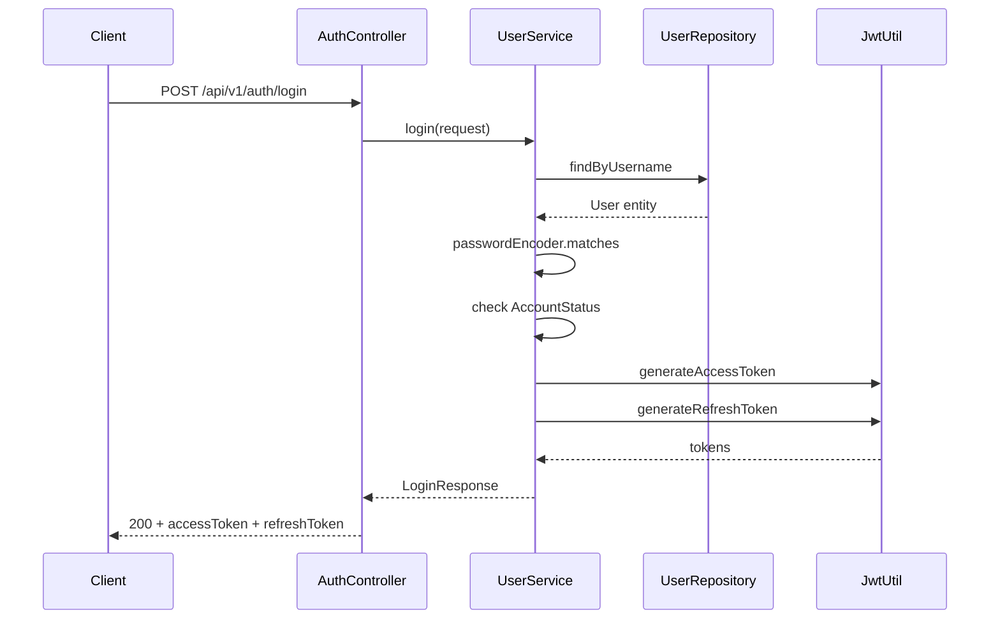
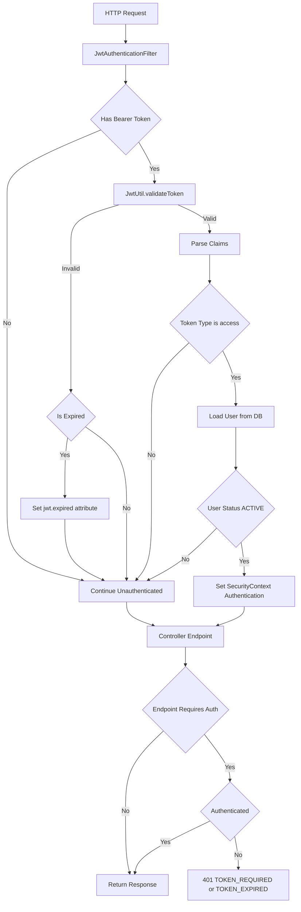

# 用户与认证

## 模块概述

用户与认证模块是 CodingHub 平台的安全基础设施，负责用户身份的全生命周期管理。该模块实现了基于 JWT（JSON Web Token）的无状态认证体系，涵盖用户注册、登录、令牌刷新、个人资料管理、头像上传以及基于角色的访问控制（RBAC）。

核心能力包括：

- **用户注册与登录**：支持普通用户直接注册和管理员注册审批流程
- **JWT 双令牌机制**：Access Token 用于接口鉴权，Refresh Token 用于无感续期
- **角色权限体系**：USER / ADMIN / SUPER_ADMIN 三级角色，配合账户状态管控
- **Spring Security 集成**：无状态会话、BCrypt 密码加密、CORS 配置
- **前端令牌管理**：Pinia Store 持久化 + Axios 拦截器自动刷新

技术栈：Spring Boot 3 + Spring Security 6 + JJWT + Vue 3 + Pinia + Axios

## 架构总览

### 登录流程

### JWT 验证链路

## 核心组件

### [AuthController](../../../backend/src/main/java/com/iaihub/toolbox/controller/AuthController.java)

**路径**：`backend/src/main/java/com/iaihub/toolbox/controller/AuthController.java`

认证入口控制器，映射 `/api/v1/auth/**`，提供三个公开端点：

| 方法 | 端点 | 功能 |
|------|------|------|
| POST | /register | 用户注册（USER 直接激活，ADMIN 进入审批） |
| POST | /login | 用户登录，返回双令牌 |
| POST | /refresh | 使用 Refresh Token 换取新 Access Token |

### [UserService](../../../backend/src/main/java/com/iaihub/toolbox/service/UserService.java)

**路径**：`backend/src/main/java/com/iaihub/toolbox/service/UserService.java`

核心业务逻辑层，职责包括：

- `register()`：校验用户名/昵称唯一性，解析角色，BCrypt 加密密码，按角色决定账户初始状态
- `login()`：验证凭据，检查账户状态（PENDING/REJECTED/DISABLED 均拒绝），更新最后登录时间
- `refreshToken()`：验证 Refresh Token 有效性，签发新 Access Token
- `updateProfile()`：修改昵称（唯一性校验）和个人简介
- `changePassword()`：验证旧密码后更新
- `uploadAvatar()` / `deleteAvatar()`：头像文件管理（校验格式/大小，磁盘存储）
- 管理员方法：`getPendingUsers()`、`approveUser()`、`rejectUser()`、`updateUserStatus()`、`deleteUser()`

### [JwtUtil](../../../backend/src/main/java/com/iaihub/toolbox/util/JwtUtil.java)

**路径**：`backend/src/main/java/com/iaihub/toolbox/util/JwtUtil.java`

JWT 令牌工具类，基于 JJWT 库实现：

- 使用 HMAC-SHA 对称密钥签名（密钥来自配置 `app.jwt.secret`）
- `generateAccessToken()`：签发 Access Token，含 userId（subject）、email、type=access
- `generateRefreshToken()`：签发 Refresh Token，type=refresh，过期时间更长
- `validateToken()`：验证签名和有效期
- `isTokenExpired()`：区分过期与无效
- `isRefreshToken()`：校验令牌类型
- `getUserIdFromToken()`：从 subject 提取用户 ID

### [SecurityConfig](../../../backend/src/main/java/com/iaihub/toolbox/config/SecurityConfig.java)

**路径**：`backend/src/main/java/com/iaihub/toolbox/config/SecurityConfig.java`

Spring Security 配置类，关键策略：

- **无状态会话**：`SessionCreationPolicy.STATELESS`，不使用 HttpSession
- **CSRF 禁用**：前后端分离架构无需 CSRF 防护
- **CORS 全开放**：允许所有来源、方法、头部，支持凭证
- **密码编码器**：BCryptPasswordEncoder
- **异常处理**：自定义 AuthenticationEntryPoint，区分 TOKEN_EXPIRED 和 TOKEN_REQUIRED
- **URL 权限规则**：公开端点（auth、工具列表、视频列表等）→ 管理员端点（hasRole）→ 认证端点（authenticated）

### [JwtAuthenticationFilter](../../../backend/src/main/java/com/iaihub/toolbox/config/JwtAuthenticationFilter.java)

**路径**：`backend/src/main/java/com/iaihub/toolbox/config/JwtAuthenticationFilter.java`

继承 `OncePerRequestFilter`，在每次请求时执行：

1. 从 `Authorization: Bearer <token>` 头提取 JWT
2. 验证令牌有效性，区分过期与无效
3. 校验 token type 必须为 `access`
4. 从数据库加载用户，确认状态为 ACTIVE
5. 构建 `UsernamePasswordAuthenticationToken` 并设置到 SecurityContext
6. 权限映射：`ROLE_` + 角色名（如 `ROLE_ADMIN`）

### 前端 Auth Store

**路径**：`frontend/src/stores/auth.ts`

基于 Pinia 的认证状态管理：

- 持久化 accessToken / refreshToken / user 到 localStorage
- 计算属性：`isLoggedIn`、`isAdmin`、`isSuperAdmin`
- `setTokens()`：登录/刷新后更新令牌
- `logout()`：清除所有认证状态
- `initFromStorage()`：应用启动时恢复会话

### 前端 Axios 拦截器

**路径**：`frontend/src/services/api.ts`

- **请求拦截器**：自动附加 `Authorization: Bearer <accessToken>`
- **响应拦截器**：401 时触发令牌刷新流程
  - 防并发：使用 `isRefreshing` 标志 + 订阅队列，避免多个请求同时刷新
  - 刷新成功：更新 Store 中的 accessToken，重放原始请求
  - 刷新失败：清除状态，重定向到登录页

## 认证流程

### JWT 签发

1. 用户提交用户名 + 密码至 `/api/v1/auth/login`
2. [UserService](../../../backend/src/main/java/com/iaihub/toolbox/service/UserService.java) 验证凭据和账户状态
3. [JwtUtil](../../../backend/src/main/java/com/iaihub/toolbox/util/JwtUtil.java) 使用 HMAC-SHA 密钥签发两个令牌：
   - **Access Token**：短有效期（配置 `app.jwt.access-token-expiration`），type=access
   - **Refresh Token**：长有效期（配置 `app.jwt.refresh-token-expiration`），type=refresh
4. 令牌 Claims 结构：`sub`=userId, `email`=username, `type`=access/refresh, `iat`, `exp`

### JWT 验证

1. 每个受保护请求经过 [JwtAuthenticationFilter](../../../backend/src/main/java/com/iaihub/toolbox/config/JwtAuthenticationFilter.java)
2. 提取 Bearer Token → 验证签名 → 检查有效期 → 确认 type=access
3. 从数据库加载用户实体，确认 [AccountStatus](../../../backend/src/main/java/com/iaihub/toolbox/model/AccountStatus.java)=ACTIVE
4. 将用户对象和角色权限注入 SecurityContext
5. 后续 Controller 通过 `@AuthenticationPrincipal User` 获取当前用户

### JWT 刷新

1. 前端 Axios 收到 401 响应
2. 检查是否有 refreshToken，发起 `POST /api/v1/auth/refresh`（Header 携带 Refresh Token）
3. 后端验证 Refresh Token 有效性和类型
4. 签发新 Access Token 返回
5. 前端更新 Store 和 localStorage，重放失败请求
6. 若刷新也失败，执行登出并跳转登录页

### 注册审批流程

- **USER 角色**：注册即激活，直接返回令牌
- **ADMIN 角色**：注册后状态为 PENDING，不返回令牌
  - SUPER_ADMIN 通过 `/api/v1/admin/approve/{id}` 审批通过 → 状态变为 ACTIVE
  - 或 `/api/v1/admin/reject/{id}` 拒绝 → 状态变为 REJECTED
  - 审批结果通过 [NotificationService](../../../backend/src/main/java/com/iaihub/toolbox/service/notification/NotificationService.java) 发送站内通知

## 用户模型

### [User](../../../backend/src/main/java/com/iaihub/toolbox/model/User.java) 实体

**路径**：`backend/src/main/java/com/iaihub/toolbox/model/User.java`

| 字段 | 类型 | 约束 | 说明 |
|------|------|------|------|
| id | Long | PK, 自增 | 用户唯一标识 |
| username | String(100) | NOT NULL, UNIQUE | 登录用户名 |
| password | String(255) | NOT NULL | BCrypt 加密密码 |
| nickname | String(50) | UNIQUE | 显示昵称 |
| avatarUrl | String(255) | 可空 | 头像 URL |
| bio | String(500) | 可空 | 个人简介 |
| role | [Role](../../../backend/src/main/java/com/iaihub/toolbox/model/Role.java)(enum) | NOT NULL, 默认 USER | 角色 |
| status | [AccountStatus](../../../backend/src/main/java/com/iaihub/toolbox/model/AccountStatus.java)(enum) | NOT NULL, 默认 ACTIVE | 账户状态 |
| createdAt | LocalDateTime | NOT NULL, 不可更新 | 创建时间 |
| updatedAt | LocalDateTime | NOT NULL | 更新时间 |
| lastLoginAt | LocalDateTime | 可空 | 最后登录时间 |

索引：`idx_user_username`（唯一）、`idx_user_nickname`（唯一）

### 角色枚举（[Role](../../../backend/src/main/java/com/iaihub/toolbox/model/Role.java)）

| 角色 | 权限范围 |
|------|----------|
| USER | 普通用户：浏览工具、发布评论、收藏、上传工具 |
| ADMIN | 管理员：用户管理、内容审核（需 SUPER_ADMIN 审批激活） |
| SUPER_ADMIN | 超级管理员：审批 ADMIN 注册、管理所有用户、不可被删除/禁用 |

### 账户状态枚举（[AccountStatus](../../../backend/src/main/java/com/iaihub/toolbox/model/AccountStatus.java)）

| 状态 | 含义 |
|------|------|
| ACTIVE | 正常可用 |
| PENDING | 等待审批（仅 ADMIN 注册时） |
| REJECTED | 注册申请被拒绝 |
| DISABLED | 被管理员禁用 |

## API 端点

### 认证端点（公开）

| 方法 | 路径 | 说明 | 请求体 |
|------|------|------|--------|
| POST | /api/v1/auth/register | 用户注册 | [RegisterRequest](../../../backend/src/main/java/com/iaihub/toolbox/dto/RegisterRequest.java){username, password, nickname, role?} |
| POST | /api/v1/auth/login | 用户登录 | [LoginRequest](../../../backend/src/main/java/com/iaihub/toolbox/dto/LoginRequest.java){username, password} |
| POST | /api/v1/auth/refresh | 刷新令牌 | Header: Authorization Bearer refreshToken |

### 用户端点（需认证）

| 方法 | 路径 | 说明 |
|------|------|------|
| GET | /api/v1/users/me | 获取当前用户信息 |
| PUT | /api/v1/users/me/profile | 更新个人资料 |
| PUT | /api/v1/users/me/password | 修改密码 |
| POST | /api/v1/users/me/avatar | 上传头像（multipart） |
| DELETE | /api/v1/users/me/avatar | 删除头像 |
| GET | /api/v1/users/me/tools | 获取我发布的工具 |
| GET | /api/v1/users/{id} | 获取用户公开资料（公开） |

### 管理端点

| 方法 | 路径 | 权限 | 说明 |
|------|------|------|------|
| GET | /api/v1/admin/pending-users | SUPER_ADMIN | 获取待审批用户列表 |
| POST | /api/v1/admin/approve/{id} | SUPER_ADMIN | 审批通过 |
| POST | /api/v1/admin/reject/{id} | SUPER_ADMIN | 审批拒绝 |
| GET | /api/v1/admin/users | ADMIN+ | 分页查询用户（支持角色/状态/关键词筛选） |
| PUT | /api/v1/admin/users/{id}/status | SUPER_ADMIN | 修改用户状态（封禁/解禁） |
| DELETE | /api/v1/admin/users/{id} | SUPER_ADMIN | 删除用户 |

## 交叉引用

- [工具广场](工具广场.md)：工具发布和管理依赖当前用户身份（`@AuthenticationPrincipal User`），工具的创建者关联 [User](../../../backend/src/main/java/com/iaihub/toolbox/model/User.java) 实体
- [统一互动](统一互动.md)：评论、点赞、收藏操作需要用户认证，互动记录关联 userId
- [通知系统](统一互动.md)：管理员审批结果通过 [NotificationService](../../../backend/src/main/java/com/iaihub/toolbox/service/notification/NotificationService.java) 推送站内通知
- [视频模块](工具广场.md)：视频上传和弹幕发送需要用户认证

<!-- crosslinks (auto-generated) -->
## Related Modules
- Depends on: [MCP服务](mcp服务.md), [工具广场](工具广场.md), [统一互动](统一互动.md)
- Used by: [MCP服务](mcp服务.md), [工具广场](工具广场.md), [知识库与RAG](知识库与rag.md), [统一互动](统一互动.md), [论坛社区](论坛社区.md)
