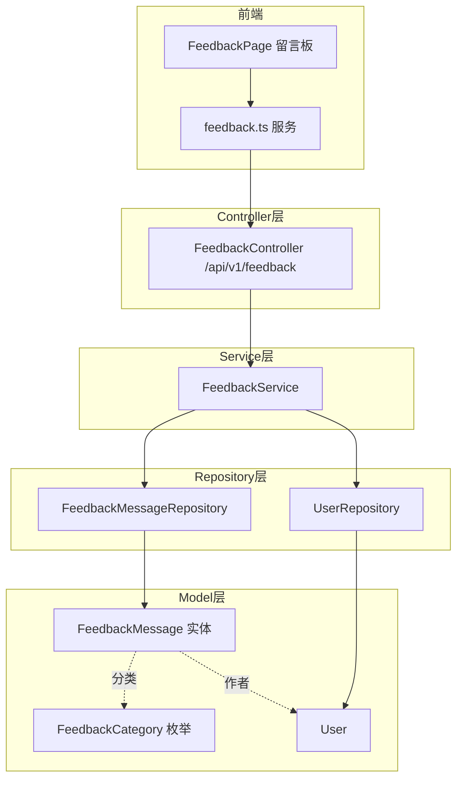
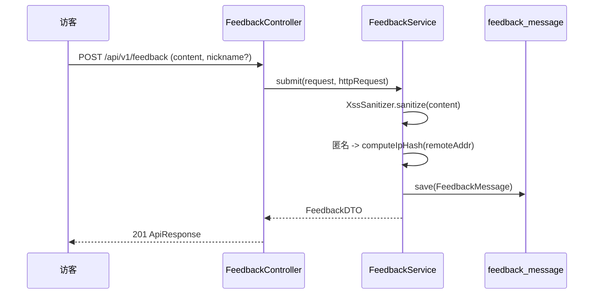

# 留言反馈

留言反馈模块提供一个轻量的用户留言板：普通访客（含匿名）可提交建议/吐槽/联系方式，登录用户自动关联账号；管理员可回复与删除。后端入口为 `/api/v1/feedback`，前端位于 `pages/feedback` + `components/feedback`，数据表为 `feedback_message`。

## Component Constraint Index

| Component | Constraints | Risks | Summary |
|-----------|-------------|-------|---------|
| FeedbackService.submit | 3 | 1 | 匿名用户用 SHA-256 ipHash 防刷，不存明文 IP |
| FeedbackService.list | 1 | 0 | 非法 category 返回空结果而非报错 |
| FeedbackService.reply | 1 | 0 | 仅 ADMIN/SUPER_ADMIN 可回复 |
| FeedbackService.delete | 1 | 0 | 仅 ADMIN/SUPER_ADMIN 可删除（软删除） |
| FeedbackController.* | 2 | 0 | 写操作均 @PreAuthorize ADMIN/SUPER_ADMIN |
| FeedbackMessage | 2 | 0 | 软删除状态 + 分类枚举 |

## 架构总览 (Architecture Overview)

## 组件职责 (Component Responsibilities)

### FeedbackController (`/api/v1/feedback`)

| 端点 | 方法 | 说明 | 鉴权 |
|------|------|------|------|
| `GET /` | getFeedbacks | 分页列表（按 category 过滤，仅 NORMAL） | 公开 |
| `POST /` | createFeedback | 提交留言（匿名/登录均可） | 公开 |
| `PUT /{id}/reply` | replyFeedback | 管理员回复 | ADMIN/SUPER_ADMIN |
| `DELETE /{id}` | deleteFeedback | 软删除留言 | ADMIN/SUPER_ADMIN |

> 注意：回复/删除通过 `@PreAuthorize("hasAnyRole('ADMIN','SUPER_ADMIN')")` 在方法入口强制，而非在 Service 内判断。

### FeedbackService

- **submit**：对 `content/nickname/contact` 全部调用 `XssSanitizer.sanitize()` 防 XSS；`category` 取请求值，非法值回退到 `SUGGESTION`；登录用户关联 `user` 并自动取昵称，匿名用户通过 `computeIpHash` 计算 SHA-256 哈希（取 `X-Forwarded-For` 首段，回退 `getRemoteAddr()`）写入 `ipHash`，**不持久化明文 IP**。
- **list**：按 `category + Status.NORMAL` 分页（`createdAt DESC`）；当 `category` 非法时返回空 `PageResponse` 而非抛错。
- **reply**：按 id + NORMAL 查找，设置 `adminReply / repliedBy / repliedAt`。
- **delete**：按 id + NORMAL 查找，`status = DELETED`（软删除）。

**Business Constraints — FeedbackService**

- 匿名留言以 SHA-256(ip) 作为 ipHash 存储，绝不保存明文 IP (confidence: 0.95)
  > Evidence: `computeIpHash` 用 `MessageDigest.getInstance("SHA-256")` 对解析后的 IP 求摘要；`catch` 异常时才回退明文 `ip`，正常路径仅存哈希。
- 所有用户提交文本均经 XSS 清洗 (confidence: 0.95)
  > Evidence: `builder.content(XssSanitizer.sanitize(request.content()))` 及 nickname/contact 同样处理。
- 回复/删除仅限 ADMIN 或 SUPER_ADMIN (confidence: 0.9)
  > Evidence: `FeedbackController` 的 `replyFeedback/deleteFeedback` 标注 `@PreAuthorize("hasAnyRole('ADMIN','SUPER_ADMIN')")`。
- 删除为软删除 (confidence: 0.9)
  > Evidence: `delete` 方法调用 `message.setStatus(FeedbackMessage.Status.DELETED)` 再 `save`，不物理删除行。
- 列表对非法 category 优雅降级为空 (confidence: 0.85)
  > Evidence: `list` 中 `catch (IllegalArgumentException e)` 返回 `content=List.of()`、`totalElements=0`。

### 数据模型

`FeedbackMessage` 关键字段：`content(text)`、`nickname(50)`、`contact(100)`、`category(FeedbackCategory 枚举, 默认 SUGGESTION)`、`user(ManyToOne, 可空)`、`ipHash(64, 匿名时填)`、`status(NORMAL/DELETED, 默认 NORMAL)`、`adminReply(text)`、`repliedBy/repliedAt`。`@PrePersist` 自动补 `createdAt/updatedAt` 与默认值。索引：`idx_feedback_status_created`、`idx_feedback_category_status`。

`FeedbackCategory` 为枚举（SUGGESTION 等），用于前端分类筛选。

## 数据流：匿名留言提交

## 接口契约与副作用

- 响应统一包裹 `ApiResponse<T>`，列表用 `PageResponse<T>`（见 [平台基础](平台基础.md)）。
- `submit` 副作用：可能写入 `ipHash` 或关联 `user`；无跨模块通知。
- 回复仅在管理端触发，前端留言板展示 `adminReply`。

## 依赖关系 (Cross-References)

- [用户与认证](用户与认证.md) — `User` 实体、`@AuthenticationPrincipal` 注入、`ResourceNotFoundException/ForbiddenException`。
- [平台基础](平台基础.md) — `ApiResponse/PageResponse`、`XssSanitizer`、`GlobalExceptionHandler`。
- [前端应用](前端应用.md) — `frontend/src/services/feedback.ts`、`pages/feedback`、`components/feedback`。

## 约束、假设与边界情况

- 匿名与登录用户的区分依据是 `SecurityContextHolder` 中 `principal` 是否为 `User` 实例；JWT 过期则为匿名。
- `ipHash` 仅作防重复/风控用途，无法反查真实 IP。
- `category` 不合法时列表静默返回空，避免暴露错误细节。
- 留言板的可见性为全量公开（仅 NORMAL），管理员删除后不再展示。
