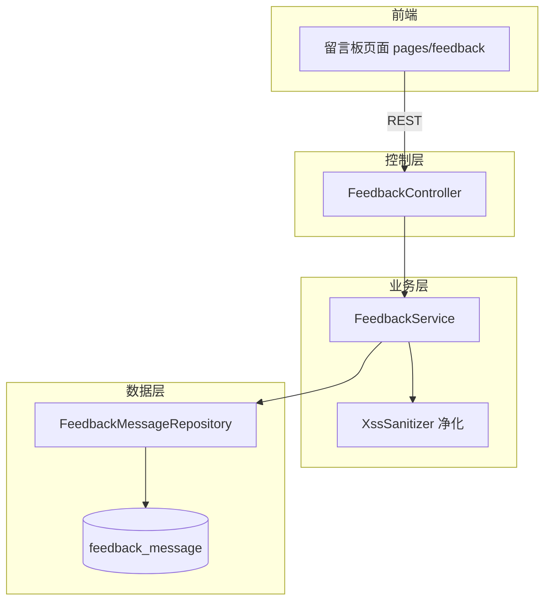
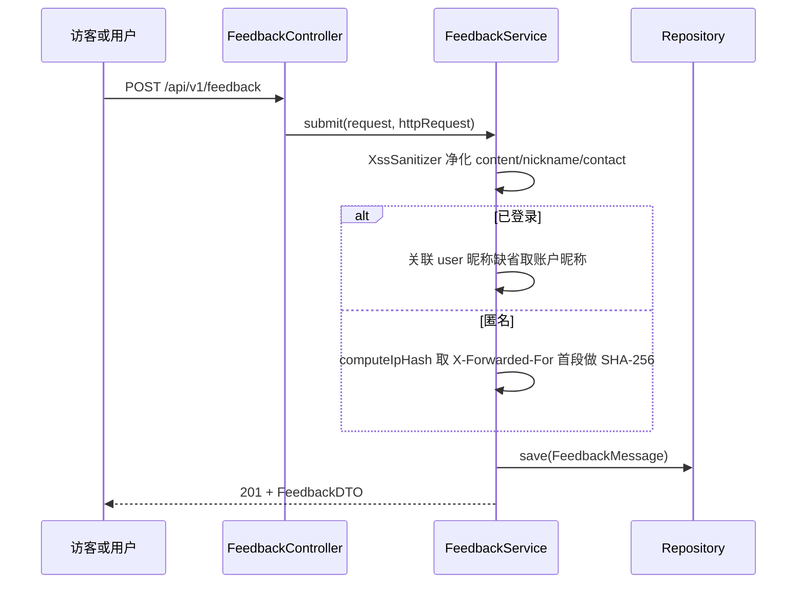

# 留言反馈

## 模块概述

留言反馈模块提供全站留言板功能：任何访客（登录或匿名）可提交建议/问题反馈，管理员可回复与删除。这是全站最简洁的领域模块，单 Controller + 单 Service + 单实体，适合作为理解项目分层规范的入门样例。

- **代码位置**: `controller/feedback/FeedbackController` + `service/feedback/FeedbackService` + `model/feedback/`（FeedbackMessage、FeedbackCategory）+ `repository/feedback/` + `dto/feedback/`
- **组件数量**: 35 个
- **API 前缀**: `/api/v1/feedback`

## 架构图

## 数据模型

### feedback_message 表（FeedbackMessage 实体）

| 字段 | 说明 |
|------|------|
| `content` | text，留言正文（XSS 净化后落库） |
| `nickname` | 展示昵称（匿名者手填；登录用户默认取账户昵称） |
| `contact` | 联系方式（可选） |
| `category` | 枚举 `FeedbackCategory`，默认 `SUGGESTION` |
| `user_id` | 登录用户关联；匿名为 NULL |
| `ip_hash` | 匿名用户 IP 的 SHA-256（隐私保护，不存明文 IP） |
| `status` | `NORMAL` / `DELETED`（软删除） |
| `admin_reply` / `replied_by` / `replied_at` | 管理员回复三元组 |

索引：`(status, created_at DESC)` 与 `(category, status, created_at DESC)`，匹配两条列表查询路径。

## REST 接口

| 端点 | 权限 | 说明 |
|------|------|------|
| `GET /api/v1/feedback?category=&page=&size=` | 公开 | 分页列表，仅返回 NORMAL 状态，按时间倒序；非法 category 返回空页而非报错 |
| `POST /api/v1/feedback` | 公开（含匿名） | 提交留言，201 Created |
| `PUT /api/v1/feedback/{id}/reply` | ADMIN / SUPER_ADMIN | 管理员回复（覆盖式，再次回复更新内容与时间） |
| `DELETE /api/v1/feedback/{id}` | ADMIN / SUPER_ADMIN | 软删除（status=DELETED） |

权限通过方法级 `@PreAuthorize("hasAnyRole('ADMIN', 'SUPER_ADMIN')")` 实现（而非 SecurityConfig URL 规则），GET/POST 在 [用户与认证](用户与认证.md) 的 SecurityConfig 中为公开放行。

## 提交流程

## 关键实现细节

1. **双身份提交**: `getCurrentUser()` 从 `SecurityContextHolder` 软取用户——有则关联 `user_id`，无则计算 `ip_hash`。与 [实时聊天](实时聊天.md) 的游客模式同思路但独立实现
2. **容错分类解析**: 提交时非法 category 静默回落 `SUGGESTION`；列表查询时非法 category 返回空分页——两处策略不同（写入宽容、读取严格）
3. **隐私设计**: 匿名用户仅存 IP 哈希（SHA-256 hex），无法反查原始 IP
4. **回复非追加**: `admin_reply` 为单字段覆盖语义，一条留言只保留最新一次管理员回复
5. **DTO 收敛**: `FeedbackDTO` 不暴露 `ip_hash`、`user_id`、`replied_by` 等内部字段，仅输出展示所需信息

## 依赖关系

- **依赖 [平台基础](平台基础.md)**: `ApiResponse` / `PageResponse` 响应包装、`ResourceNotFoundException`、`XssSanitizer`
- **依赖 [用户与认证](用户与认证.md)**: `User` 实体、`UserRepository`、Spring Security 上下文
- **前端配合**: [前端应用](前端应用.md) 的 `pages/feedback` 留言板页面与 `components/feedback` 组件，经 [前端服务层](前端服务层.md) 调用本模块接口
