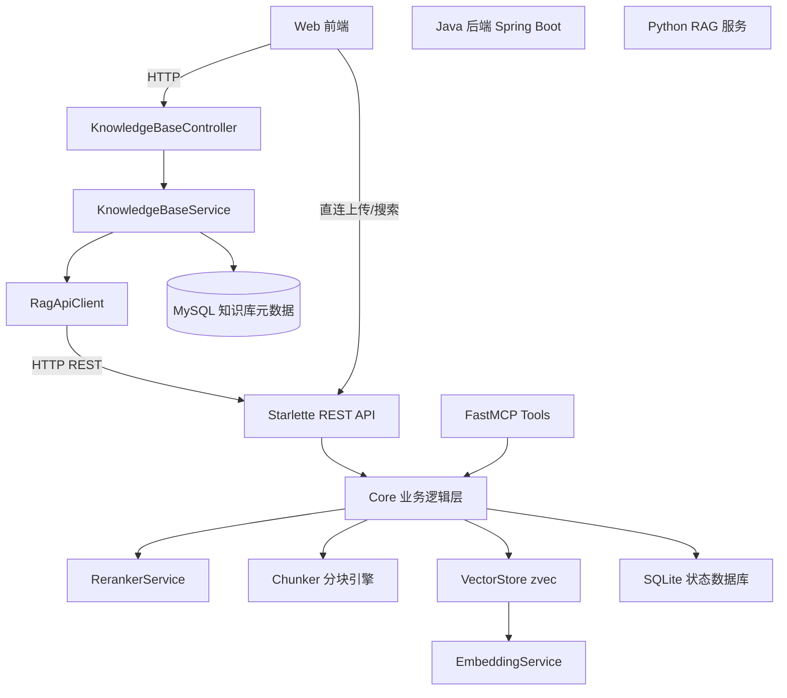
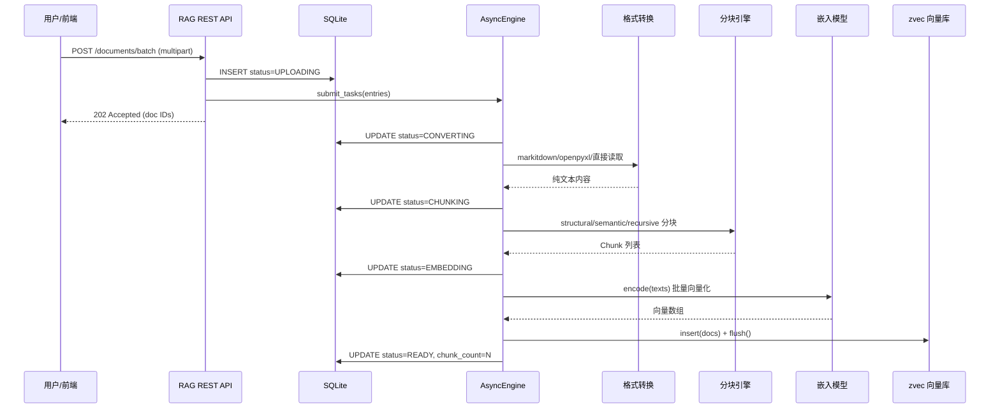

# 知识库与RAG

## 模块概述

本模块实现了 CodingHub 平台的**知识库管理与 RAG（Retrieval-Augmented Generation）语义检索**能力，采用双层架构设计：

- **Java 后端层**（Spring Boot）：负责知识库元数据的 CRUD 管理、用户权限校验、与前端交互，通过 `RagApiClient` 代理调用 Python RAG 服务。
- **Python RAG 服务层**（FastMCP + Starlette）：负责文档的格式转换、智能分块、向量嵌入、向量存储与语义检索，同时暴露 MCP Tools 和 REST API 双接口。

核心特性：
- 支持文本文件（md/txt/py/js 等 40+ 格式）与二进制文档（pdf/docx/pptx/xlsx）
- 自适应分块策略：递归字符分块、语义分块、结构化分块，由 `core/profiler.py` 根据文档画像（标题密度、代码占比、长度）自动选择最优策略（auto）
- 分块质量校验：`core/validator.py` 基于 5 条质量规则（非空、大文档非单块、碎片化率、超长块、非全碎片）校验分块结果，失败时触发降级重试
- 受保护片段：代码块、表格等结构通过 `protected_spans` 识别，避免在结构边界内被硬切（`_split_with_protection`）
- 混合检索：向量 ANN + FTS 全文检索（jieba 分词）+ RRF 重排（`core/vector_store.py`），FTS 索引缺失时自动回退纯向量检索
- 上下文标题（context_header）：为每个分块附加标题路径前缀，提升检索精度与可解释性
- Cross-Encoder 重排序提升检索精度
- 异步批量文档处理引擎（带并发控制与超时保护）
- 文件变更检测（SHA256 哈希），避免重复索引
- 上下文扩展（相邻分块合并）提供更完整的检索结果
- 分块预览：新增 `POST /api/collections/{name}/chunking/preview` 端点，无需嵌入即可预览分块结果与文档画像

## 架构总览



**数据流说明**：
1. 前端通过 Java 后端进行知识库的创建/查询/删除（元数据存 MySQL）
2. 文档上传与语义搜索可直连 Python RAG 服务的 REST API（`ragPublicUrl`）
3. Java 后端通过 `RagApiClient` 代理搜索请求和 collection 配置
4. Python 服务内部通过 `core/service.py` 统一调度分块、嵌入、存储

## Python RAG 服务

### 服务入口与传输模式

服务入口为 `rag/server.py`，基于 `FastMCP` 框架构建，支持三种传输模式：

| 模式 | 命令 | 用途 |
|------|------|------|
| stdio | `python server.py` | 本地 MCP 客户端（QoderWork/Claude Desktop） |
| sse | `python server.py --mode sse` | SSE + REST API，Web 前端集成 |
| streamable-http | `python server.py --mode streamable-http` | Streamable HTTP + REST API |

在 SSE/streamable-http 模式下，服务通过 `_create_combined_app()` 创建组合 ASGI 应用，将 REST API 路由（`/api/*`）与 MCP 路由（`/mcp`、`/sse`）挂载在同一端口。

> 近期重构：路由与业务逻辑拆分为 `rag/api/app.py`（Starlette 路由 + REST 端点）与 `rag/core/*`（分块、嵌入、检索、画像、校验等核心模块），`server.py` 仅负责传输模式（stdio/sse/streamable-http）的装配与启动。

### MCP Tools（12 个）

| 工具名 | 功能 |
|--------|------|
| `search` | 语义搜索，支持 rerank、glob 过滤、上下文扩展 |
| `ingest_file` | 导入单个文件 |
| `ingest_directory` | 批量导入目录 |
| `ingest_url` | 从 URL 下载并导入 |
| `upload_info` | 获取 HTTP 上传端点信息 |
| `document_status` | 查询文档处理状态 |
| `list_collections` | 列出所有集合 |
| `list_documents` | 列出集合内文档 |
| `delete_document` | 删除单个文档 |
| `delete_collection` | 删除整个集合 |
| `configure_collection` | 配置集合默认参数 |
| `get_collection_config` | 查看集合配置 |

### REST API 端点

| 方法 | 路径 | 功能 |
|------|------|------|
| GET | `/api/health` | 健康检查 |
| GET | `/api/collections` | 列出集合 |
| POST | `/api/collections/{name}/documents` | 单文件上传（同步） |
| POST | `/api/collections/{name}/documents/batch` | 批量上传（异步，最多 20 文件） |
| GET | `/api/collections/{name}/documents/status` | 文档状态列表 |
| GET | `/api/collections/{name}/documents/{id}/status` | 单文档状态 |
| GET | `/api/collections/{name}/documents/download` | 下载源文件 |
| DELETE | `/api/collections/{name}/documents` | 删除文档 |
| DELETE | `/api/collections/{name}` | 删除集合 |
| POST | `/api/collections/{name}/search` | 语义搜索 |
| GET/PUT | `/api/collections/{name}/config` | 读取/更新集合配置（新增 strategy、context_header 字段） |
| POST | `/api/collections/{name}/chunking/preview` | 分块预览：返回 chunks、统计与文档画像，无需嵌入 |

### 向量存储（zvec）

`core/vector_store.py` 封装了 zvec 嵌入式向量数据库：

- **Schema**：每个 collection 包含 `embedding`（VECTOR_FP32）、`text`（STRING）、`source`（STRING）、`chunk_index`（INT64）、`context_header`（STRING，分块所属标题路径前缀）
- **批量写入**：按 1024 条为一批插入，避免超出 zvec 限制
- **文档注册**：通过 `_registry.json` 维护文件路径→chunk 数量/哈希的映射
- **线程安全**：所有写操作通过 `threading.Lock` 保护
- **混合检索**：`search()` 优先执行向量 ANN + FTS 全文检索（jieba 分词建倒排索引）+ RRF 重排（rank_constant=60）；FTS 索引缺失时自动回退纯向量检索。`rebuild_fts_index()` 可在不重嵌的情况下为存量集合重建 FTS 倒排索引
- **Collection 配置**：每个集合独立的 `_config.json`，默认 chunk_mode=structural, chunk_size=800, chunk_overlap=50, rerank=True, strategy=auto, context_header=True

### 分块策略

`core/chunker.py` 实现三种分块模式，并由 `core/profiler.py` 与 `core/validator.py` 协同完成自适应选择和质量保障：

- **自适应策略选择**：`profile_document()` 单遍扫描文档提取特征（标题数/密度、代码占比、是否含表格、总长度），`select_strategy()` 据此在 `structural` 与 `recursive` 间自动抉择；文档过短（<200 字符）时回退 `recursive`
- **分块校验与降级**：`chunk_with_validation()` 在分块后调用 `validate_chunks()` 执行 5 条质量规则，不通过则尝试降级策略重新分块（最多降级两档）
- **受保护片段**：`_split_with_protection()` / `protected_spans()` 识别代码围栏与表格区间，避免在结构边界内硬切；必要时 `_split_protected_region_forced()` 强制拆分

**1. 递归字符分块（recursive）**
- 按段落 → 换行 → 句子 → 字符逐级拆分
- 支持中英文标点句子边界识别
- 可配置 chunk_size 和 chunk_overlap

**2. 语义分块（semantic）**
- 将文档拆为句子，用嵌入模型编码
- 计算相邻句子余弦相似度
- 动态阈值（mean - 1*std）检测话题边界
- 超大分块回退到递归分块

**3. 结构化分块（structural）** — 默认策略
- 识别 Markdown 标题、代码围栏、表格为结构边界
- 每个分块自动附加所属标题前缀，保留章节上下文
- 超大节内使用递归分块二次拆分

### 嵌入模型

`core/embeddings.py` — 单例懒加载模式：

- 默认模型：`sentence-transformers/all-MiniLM-L6-v2`（384 维，CPU 友好）
- 可通过 `RAG_EMBEDDING_MODEL` 环境变量切换为 Qwen3-Embedding 等高质量模型
- 查询编码自动添加 `query: ` 前缀（非对称检索优化）
- 批量编码大小通过 `RAG_EMBEDDING_BATCH_SIZE` 控制（默认 32）
- 首次使用从 HuggingFace 下载（支持 hf-mirror.com 镜像），后续离线使用

### 重排序器

`core/reranker.py` — Cross-Encoder 重排序：

- 默认模型：`BAAI/bge-reranker-v2-m3`
- 对向量检索的候选结果进行 (query, document) 配对打分
- 按 rerank_score 降序排列，返回 top_n 结果
- 通过 `RAG_RERANKER_MODEL` 环境变量可替换

### 异步处理引擎

`core/async_engine.py` — 批量文档异步处理：

- 基于 `asyncio.Semaphore` 控制并发（默认 1，CPU 模式避免争用）
- 单文档超时保护（默认 600s）
- 处理管线：UPLOADING → CONVERTING → CHUNKING → EMBEDDING → READY/FAILED
- 服务重启时自动恢复中断文档（源文件存在则重试，否则标记 FAILED）
- 状态持久化到 SQLite（WAL 模式，支持并发读写）

## Java 后端集成

### [KnowledgeBaseController](../../../backend/src/main/java/com/iaihub/toolbox/controller/kb/KnowledgeBaseController.java)

路径：`/api/v1/knowledge`

| 方法 | 端点 | 功能 |
|------|------|------|
| GET | `/api/v1/knowledge` | 分页列表（支持 sortBy=hot/latest, ownerId 过滤） |
| GET | `/api/v1/knowledge/{id}` | 获取详情 |
| POST | `/api/v1/knowledge` | 创建知识库 |
| PUT | `/api/v1/knowledge/{id}` | 更新知识库 |
| DELETE | `/api/v1/knowledge/{id}` | 删除知识库（软删除） |
| POST | `/api/v1/knowledge/{id}/search` | 语义搜索代理 |
| GET | `/api/v1/knowledge/{id}/config` | 获取 RAG 集合配置 |
| PUT | `/api/v1/knowledge/{id}/config` | 更新 RAG 集合配置（分块/策略/重排等） |

### [KnowledgeBaseService](../../../backend/src/main/java/com/iaihub/toolbox/service/kb/KnowledgeBaseService.java)

核心业务逻辑：

- **创建流程**：校验名称唯一 → 生成 ASCII 安全的 ragCollection 名（`name-id` 格式）→ 存 MySQL → 调用 `ragApiClient.configureCollection()` 初始化 RAG 集合配置
- **删除流程**：软删除 MySQL 记录（status=DELETED）→ best-effort 调用 `ragApiClient.deleteCollection()`
- **搜索代理**：通过 `ragApiClient.search()` 转发到 Python 服务，默认 expandContext=1
- **权限控制**：仅 Owner 或 ADMIN/SUPER_ADMIN 可修改/删除
- **响应构建**：返回 `ragBaseUrl` 和 `documentsUrl` 供前端直连 RAG 服务上传文档
- **集合配置代理**：`getCollectionConfig(kbId)` 与 `configureCollection(kbId, config, user)` 转发到 RAG 服务（仅 Owner/ADMIN），支持更新 chunkMode、chunkSize、chunkOverlap、rerank、strategy（auto/structural/recursive）、contextHeader

### [RagApiClient](../../../backend/src/main/java/com/iaihub/toolbox/service/RagApiClient.java)

基于 Java 11 `HttpClient` 的 RAG 服务客户端：

| 方法 | 对应 RAG 端点 | 超时 |
|------|---------------|------|
| `configureCollection()` | PUT /api/collections/{name}/config | 30s |
| `getCollectionConfig()` | GET /api/collections/{name}/config | 10s |
| `deleteCollection()` | DELETE /api/collections/{name} | 30s |
| `search()` | POST /api/collections/{name}/search | 60s |
| `getDocumentStatus()` | GET /api/collections/{name}/documents/status | 10s |
| `getDocumentStatusById()` | GET /api/collections/{name}/documents/{id}/status | 10s |

配置项：`app.rag.base-url`（内部通信地址）、`app.rag.public-url`（前端直连地址）。

### 数据模型

`KnowledgeBase` 实体（MySQL `knowledge_base` 表）：

| 字段 | 类型 | 说明 |
|------|------|------|
| id | Long | 主键自增 |
| name | String(100) | 知识库名称（唯一） |
| description | String(500) | 描述 |
| owner_id | Long | 所有者用户 ID |
| rag_collection | String(100) | RAG 集合标识（ASCII） |
| status | [KbStatus](../../../backend/src/main/java/com/iaihub/toolbox/model/kb/KbStatus.java) | NORMAL / DELETED |
| created_at | LocalDateTime | 创建时间 |

## 文档处理流程



**关键设计点**：
- 批量上传立即返回 202，后台异步处理，前端轮询状态
- 单文件上传为同步模式，处理完毕直接返回结果
- 幂等性：重新导入同一文件时先删除旧 chunks 再写入新 chunks
- 变更检测：SHA256 哈希比对，未变更文件跳过处理

## 配置与部署

### 环境变量

| 变量 | 默认值 | 说明 |
|------|--------|------|
| `RAG_MCP_MODE` | stdio | 传输模式 |
| `RAG_MCP_HOST` | 127.0.0.1 | 绑定地址 |
| `RAG_MCP_PORT` | 8000 | 绑定端口 |
| `RAG_DATA_DIR` | ./data/ | 数据存储目录 |
| `RAG_EMBEDDING_MODEL` | all-MiniLM-L6-v2 | 嵌入模型 |
| `RAG_EMBEDDING_BATCH_SIZE` | 32 | 嵌入批大小 |
| `RAG_RERANKER_MODEL` | bge-reranker-v2-m3 | 重排序模型 |
| `RAG_MAX_CONCURRENT` | 1 | 最大并发处理数 |
| `RAG_PROCESS_TIMEOUT` | 600 | 单文档超时(秒) |
| `RAG_CORS_ORIGINS` | * | CORS 允许源 |
| `HF_ENDPOINT` | hf-mirror.com | HuggingFace 镜像 |

### Java 后端配置

```yaml
app:
  rag:
    base-url: http://127.0.0.1:8000   # 内部通信
    public-url: http://localhost:8000  # 前端直连
```

### 集合默认配置

| 参数 | 默认值 | 说明 |
|------|--------|------|
| chunk_mode | structural | 分块模式（structural/semantic/recursive） |
| chunk_size | 800 | 最大字符数/块 |
| chunk_overlap | 50 | 重叠字符数 |
| rerank | true | 是否启用重排序 |
| strategy | auto | 分块策略（auto/structural/recursive；auto 由 profiler 自动选择） |
| context_header | true | 是否为每个分块附加标题路径前缀 |

### 部署建议

- **CPU 环境**：使用默认 all-MiniLM-L6-v2（22M 参数），`RAG_MAX_CONCURRENT=1`
- **GPU 环境**：切换 Qwen3-Embedding（600M 参数），可提高 `RAG_MAX_CONCURRENT` 和 `RAG_EMBEDDING_BATCH_SIZE`
- **生产部署**：SSE/streamable-http 模式 + uvicorn，配合 Nginx 反向代理
- **模型缓存**：首次启动需联网下载模型至 `~/.cache/huggingface/`，后续离线运行

## 交叉引用

- [工具广场](工具广场.md) — 知识库作为工具广场中的核心工具之一，为 AI 对话提供上下文增强
- [MCP服务](MCP服务.md) — RAG 服务通过 FastMCP 暴露 12 个 MCP Tools；同时 CodingHub 后端 MCP Server 提供 9 个 `h3_coding_hub_kb_*` 工具（含 kb_get_config / kb_configure）代理知识库能力


<!-- crosslinks (auto-generated) -->
## Related Modules
- Depends on: [MCP服务](mcp服务.md), [工具广场](工具广场.md), [用户与认证](用户与认证.md)
- Used by: [MCP服务](mcp服务.md), [前端应用](前端应用.md)
