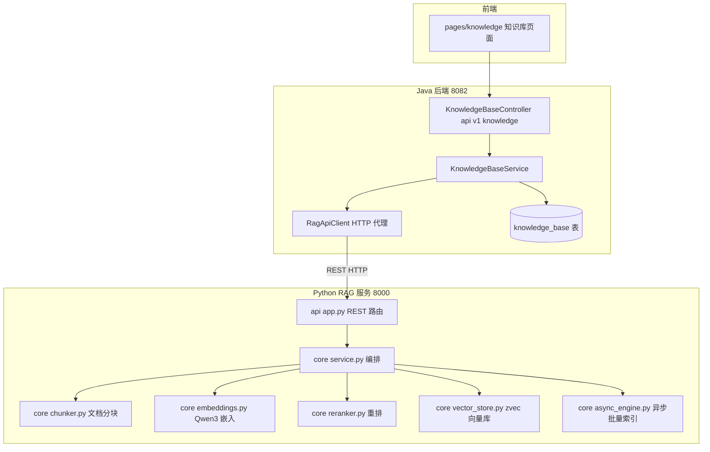
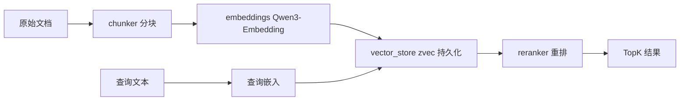
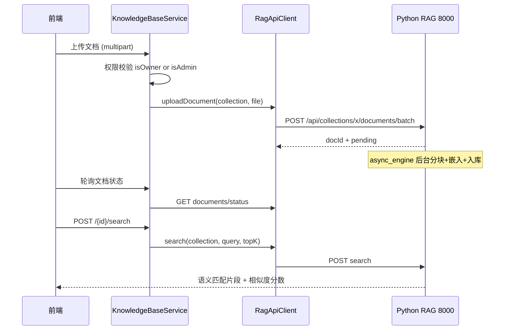

# 知识库与RAG

## 模块概述

知识库与 RAG 模块由两部分组成：

1. **Java 后端知识库层**（`/api/v1/knowledge`）：知识库元数据 CRUD、权限管理，并作为**代理**将文档上传/语义搜索请求转发给 Python RAG 服务
2. **Python RAG 服务**（`rag/` 目录，独立进程，默认 `127.0.0.1:8000`）：基于 zvec 向量库 + Qwen3-Embedding 的本地检索增强服务，暴露 REST API

这是全仓库唯一的多语言协作模块（Java ↔ Python HTTP 集成）。

- **组件数量**: 156 个（Java 后端 kb 相关 + rag/ 全部 Python 组件）
- **启动方式**: `cd rag && python3 server.py --host 127.0.0.1 --port 8000`（前端知识库功能依赖此服务在线）

## 架构图

## Java 后端知识库层

### knowledge_base 表（KnowledgeBase 实体）

| 字段 | 说明 |
|------|------|
| `name` / `description` | 知识库名称（100 字）/ 描述 |
| `owner_id` | 拥有者（Long 直存） |
| `rag_collection` | 对应 RAG 服务的 collection 名（一对一映射） |
| `status` | `NORMAL` / `DELETED`（KbStatus，软删除） |

### REST 接口（/api/v1/knowledge）

| 端点 | 权限 | 说明 |
|------|------|------|
| `GET /?ownerId=&sortBy=` | 公开 | 知识库分页列表 |
| `GET /{id}` | 公开 | 详情 |
| `POST /` | 登录 | 创建（同时初始化 RAG collection 配置） |
| `PUT /{id}` | owner 或 admin | 更新元数据 |
| `DELETE /{id}` | owner 或 admin | 软删除（联动删除 RAG collection） |
| `POST /{id}/search` | 公开 | **语义搜索**（代理到 RAG `/api/collections/{name}/search`） |

文档管理（上传/删除/状态查询）同样经 Controller → Service → RagApiClient 代理链路转发。

### RagApiClient（代理客户端）

- 基于 JDK 11 `HttpClient`，`app.rag.base-url` 配置目标地址（`RagClientConfig` 装配）
- 覆盖 collection 配置读写、文档上传（multipart）、批量异步上传、状态轮询、语义搜索、删除
- 错误策略：RAG 返回 >=400 抛 `RuntimeException`（含 RAG 错误消息）；连接失败统一转译为 "RAG 服务不可用"——**RAG 进程离线时知识库读元数据可用，涉及文档/搜索的操作报错**

## Python RAG 服务

### REST API（server.py 声明）

| 端点 | 说明 |
|------|------|
| `GET /api/health` | 健康检查 |
| `GET /api/collections` | collection 列表 |
| `POST /api/collections/{name}/documents` | 单文件同步上传索引 |
| `POST /api/collections/{name}/documents/batch` | 批量异步上传（async_engine 后台索引） |
| `GET /api/collections/{name}/documents/status` | 文档索引状态列表 |
| `POST /api/collections/{name}/search` | 语义搜索（嵌入 → 向量检索 → 可选重排） |
| `GET/PUT /api/collections/{name}/config` | 分块/嵌入配置读写 |
| `POST /api/collections/{name}/chunking/preview` | 分块预览（调参用） |

### 核心管线（core/）

| 组件 | 职责 |
|------|------|
| `chunker.py` | 文档解析与分块（chunk_size / overlap 可配） |
| `embeddings.py` | Qwen3-Embedding 文本嵌入（HuggingFace 模型，启动时强制 `HF_ENDPOINT=hf-mirror.com` 镜像加速） |
| `vector_store.py` | zvec 向量库封装（本地持久化，`rag/data/`） |
| `reranker.py` | 检索结果重排提升精度 |
| `async_engine.py` | 批量上传的后台异步索引引擎（状态：pending → indexing → completed / failed） |
| `service.py` | 上述组件的编排门面 |
| `validator.py` / `profiler.py` | 输入校验 / 性能剖析 |

### MCP 集成说明

RAG 服务本身**不直接暴露 MCP**——知识库类 MCP 工具（`kb_list` / `kb_create` / `kb_upload` / `kb_search` / `kb_document_status` 等 `h3_coding_hub_kb_*`）由 Java 后端 [MCP服务](MCP服务.md) 提供，内部同样走 RagApiClient 代理链路。

## 文档上传与搜索时序

## 依赖关系

- **依赖 [平台基础](平台基础.md)**: `ApiResponse` / `PageResponse`、异常体系
- **依赖 [用户与认证](用户与认证.md)**: `User`、owner 鉴权
- **被依赖**: [MCP服务](MCP服务.md) 的 6 个 kb_* 工具；前端 `pages/knowledge/` + `components/knowledge/` 经 [前端服务层](前端服务层.md) `knowledge.ts`
- **外部依赖**: HuggingFace 模型（首次启动下载，走 hf-mirror 镜像）、zvec 本地向量库

## 设计要点

1. **元数据与向量数据分离**: MySQL/PostgreSQL 存知识库元数据（权限、命名），zvec 存向量——Java 层永远不碰向量细节
2. **代理而非直连**: 前端不直接访问 8000 端口，所有 RAG 流量经 Java 后端转发，统一鉴权与错误格式
3. **同步/异步双上传**: 单文件走同步（小文档即时可搜），批量走异步（大量文档不阻塞请求）
4. **降级友好**: RAG 离线只影响文档与搜索功能，知识库列表/详情仍可用
