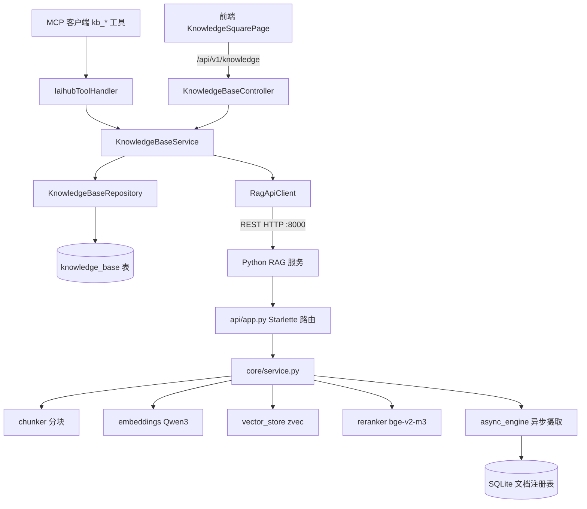

# 知识库与RAG

## 模块概述

知识库模块为 CodingHub 提供 RAG（检索增强生成）能力，由两部分组成：

1. **Java 后端知识库管理**（`controller/kb`、`service/kb`、`model/kb`）：知识库元数据 CRUD、权限控制、状态管理，将检索/文档操作代理到 Python RAG 服务
2. **Python RAG 服务**（`rag/`，独立进程，默认端口 8000）：基于 [zvec](https://github.com/alibaba/zvec) 嵌入式向量库 + Qwen3-Embedding-0.6B 本地嵌入模型的语义检索引擎，暴露 REST API

MCP 客户端通过 Java 后端的 `h3_coding_hub_kb_*` 工具（9 个）访问知识库，Java 后端经 REST 代理到 Python 服务 —— Python 服务本身不直接暴露 MCP。

## 架构总览

**核心流程**：
1. 用户创建知识库 → Java 侧写 `knowledge_base` 表，生成 ASCII 安全的 `ragCollection` 名（zvec 拒绝非 ASCII 集合名）
2. 上传文档 → Java 代理转发到 Python `/api/collections/{name}/documents`（单文件同步）或 `/batch`（批量异步）
3. Python 侧：读取/转换文件（支持 40+ 文本格式与 PDF/DOCX/PPTX/XLSX）→ 分块 → 嵌入 → 写入 zvec
4. 语义搜索 → 查询向量化 → HNSW 近邻检索 →（可选）reranker 重排 → 返回带得分的片段

## Java 后端组件

### [KnowledgeBaseController](../../../backend/src/main/java/com/iaihub/toolbox/controller/kb/KnowledgeBaseController.java)

**路径**: `backend/src/main/java/com/iaihub/toolbox/controller/kb/KnowledgeBaseController.java`

| 端点 | 说明 |
|------|------|
| `GET /api/v1/knowledge` | 分页列表（支持 `sortBy=hot` 热度排序、`ownerId` 过滤） |
| `GET /api/v1/knowledge/{id}` | 详情 |
| `POST /api/v1/knowledge` | 创建（需登录） |
| `PUT /api/v1/knowledge/{id}` | 更新（owner 或 admin） |
| `DELETE /api/v1/knowledge/{id}` | 删除（软删除 + 级联删除 RAG collection） |
| `POST /api/v1/knowledge/{id}/search` | 语义搜索 |

### [KnowledgeBaseService](../../../backend/src/main/java/com/iaihub/toolbox/service/kb/KnowledgeBaseService.java)

**路径**: `backend/src/main/java/com/iaihub/toolbox/service/kb/KnowledgeBaseService.java`

- 知识库 CRUD：名称唯一性校验（`DuplicateResourceException`）、权限校验（owner / ADMIN，否则 `ForbiddenException`）
- **集合名生成**：将中文知识库名转为小写 ASCII 连字符形式作为 zvec collection 名
- 组装 `KbResponse` 时注入 `ragPublicUrl`（配置项 `app.rag.public-url`），供前端直连 RAG 服务下载文档
- 删除时级联调用 `RagApiClient.deleteCollection` 清理向量数据

### [RagApiClient](../../../backend/src/main/java/com/iaihub/toolbox/service/RagApiClient.java)

**路径**: `backend/src/main/java/com/iaihub/toolbox/service/RagApiClient.java`

Python RAG 服务的 HTTP 客户端（`java.net.http.HttpClient`）：

- `search(collection, query, topK, ...)` — 语义搜索
- `configureCollection` / `getCollectionConfig` — 分块与检索参数配置
- `deleteCollection` — 删除集合
- `getDocumentStatus` / `getDocumentStatusById` — 异步摄取状态查询

### 数据模型

**[KnowledgeBase](../../../backend/src/main/java/com/iaihub/toolbox/model/kb/KnowledgeBase.java) 实体**（`knowledge_base` 表）：`id`、`name`（唯一）、`description`、`ownerId`、`ragCollection`（zvec 集合名）、`status`（`KbStatus`: NORMAL / DELETED）、时间戳。

**DTO**（`dto/kb/`）：`KbCreateRequest`、`KbUpdateRequest`、`KbResponse`、`KbSearchRequest`、`KbSearchResultResponse`、`KbConfigRequest`。

## Python RAG 服务 (rag/)

### 入口与 API 层

- `server.py` — 启动入口：CLI/环境变量配置（`RAG_HOST`/`RAG_PORT`/`RAG_DATA_DIR`），构建 Starlette ASGI 应用；自动将 HuggingFace 下载路由到 hf-mirror 镜像
- `api/app.py` — REST 路由与处理器：

| 端点 | 说明 |
|------|------|
| `GET /api/health` | 健康检查 |
| `GET /api/collections` | 集合列表 |
| `POST /api/collections/{name}/documents` | 单文件上传（同步摄取） |
| `POST /api/collections/{name}/documents/batch` | 批量上传（异步摄取） |
| `GET /api/collections/{name}/documents/status` | 摄取状态列表 |
| `POST /api/collections/{name}/search` | 语义搜索 |
| `POST /api/collections/{name}/chunking/preview` | 分块预览 |
| `GET/PUT /api/collections/{name}/config` | 集合配置读写 |
| `DELETE /api/collections/{name}` | 删除集合 |

### 核心引擎 (rag/core/)

| 模块 | 职责 |
|------|------|
| `service.py` | 门面：`ingest_file` / `ingest_content` / `search` / `delete_document` / `list_collections` / 集合配置；文件哈希去重、40+ 格式读取（markitdown 转换二进制文档） |
| `chunker.py` | 文本分块（按语义边界切分，支持上下文头 context header） |
| `embeddings.py` | Qwen3-Embedding-0.6B 本地嵌入（1024 维，中英双语，32K 上下文） |
| `vector_store.py` | zvec 封装：零配置嵌入式向量库、WAL 持久化、HNSW 索引 |
| `reranker.py` | 可选 bge-reranker-v2-m3 交叉编码器重排 |
| `async_engine.py` | 批量上传的异步摄取队列（后台线程处理，状态落 SQLite） |
| `database.py` | SQLite 文档注册表（文件哈希、状态、元数据） |
| `validator.py` | 上传文件校验（类型/大小/受保护模式） |
| `profiler.py` | 摄取与检索性能剖析 |

### 混合检索

`search()` 支持向量检索 + 关键词过滤的混合模式，可配置 `top_k`、`score_threshold`、是否启用 reranker。测试覆盖见 `rag/tests/`（hybrid_search、context_header、protected_patterns 等）。

## 配置

- Java 侧：`app.rag.base-url`（后端代理地址）、`app.rag.public-url`（前端可达地址）
- Python 侧：`RAG_HOST` / `RAG_PORT` / `RAG_DATA_DIR` / `RAG_CORS_ORIGINS` / `HF_ENDPOINT`

## 与其他模块的关系

- [MCP服务](MCP服务.md) 的 9 个 `kb_*` 工具直接调用本模块 `KnowledgeBaseService`
- [用户与认证](用户与认证.md) 提供 owner 权限模型（owner / ADMIN 可改删）
- [前端应用](前端应用.md) 的知识库页面（KnowledgeSquarePage 等 7 个组件）消费 `/api/v1/knowledge` API

<!-- crosslinks (auto-generated) -->
## Related Modules
- Depends on: [平台基础](平台基础.md), [用户与认证](用户与认证.md)
- Used by: [MCP服务](mcp服务.md)
