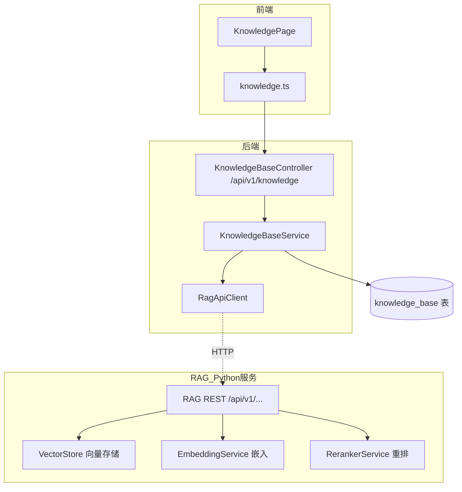
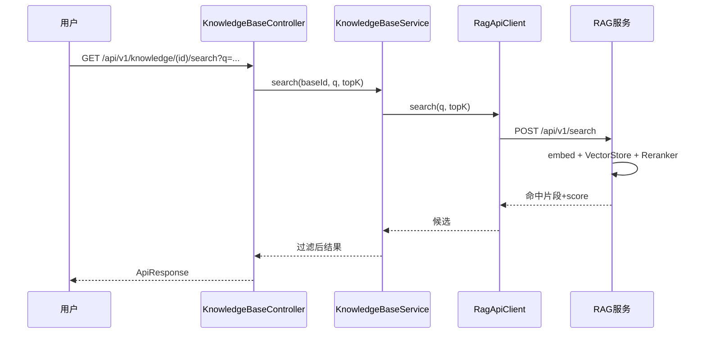

# 知识库与RAG

知识库与 RAG 模块为 CodingHub 提供领域知识的管理与语义检索能力。后端 `KnowledgeBaseService` 负责知识库/文档的元数据 CRUD、上传触发索引、检索代理；真正的向量化、向量存储与重排由独立的 Python RAG 服务（`rag/`）完成，二者通过 HTTP（REST）解耦。后端入口为 `/api/v1/knowledge`，Python 服务暴露 `/api/v1/index`、`/api/v1/search` 等端点。

## Component Constraint Index

| Component | Constraints | Risks | Summary |
|-----------|-------------|-------|---------|
| KnowledgeBaseService | 3 | 1 | CRUD + 索引/检索代理 |
| RagApiClient | 2 | 1 | HTTP 调 Python，超时/降级 |
| KnowledgeBase | 2 | 0 | 知识库元数据实体 |
| KnowledgeBaseController | 2 | 0 | REST 入口 |
| vector_store.py | 2 | 0 | 向量存储与 ANN 检索 |
| embeddings.py | 1 | 0 | 嵌入模型与维度 |
| reranker.py | 1 | 0 | 结果重排 |

## 架构总览 (Architecture Overview)

## 组件职责 (Component Responsibilities)

### KnowledgeBaseService

- **知识库 CRUD**：`create/list/get/update/delete` 知识库元数据（`name/description/ownerId/status`），软删除。
- **文档上传索引**：`uploadDocument` 把文件交给 `RagApiClient.index(baseId, file)` → Python 服务做分块、嵌入、写向量库；记录文档元数据（`kb_document`）。
- **语义检索**：`search(baseId, query, topK)` → 经 `RagApiClient.search` 拿到候选，后端做权限/来源过滤后返回；命中带 `score` 与原文片段。

**Business Constraints — KnowledgeBaseService**

- 检索与索引全部委托给 Python RAG 服务，后端只做编排与鉴权 (confidence: 0.95)
  > Evidence: `RagApiClient.index(...)` / `RagApiClient.search(...)` 被 `uploadDocument`/`search` 直接调用，后端不持有向量。
- 文档/知识库的删除为软删除，索引侧需同步清理 (confidence: 0.85)
  > Evidence: `delete` 置 `status=DELETED`；注释/逻辑提示需通知 RAG 服务清理对应 collection。

### RagApiClient

HTTP 客户端，`baseUrl` 来自配置（如 `rag.service.url`）。封装：
- `POST /api/v1/index`：上传文档并索引，返回 `documentId`。
- `POST /api/v1/search`：提交 `{baseId, query, topK}`，返回带 `score` 的命中文段。
- 统一超时与降级：服务不可用时抛 `RuntimeException` 并记日志，不拖垮主链路。

**Business Constraints**

- 调用 RAG 服务失败应降级而非阻断业务主流程 (confidence: 0.85)
  > Evidence: `catch (RestClientException e)` 记 `log.error` 并抛受控异常，由上层 `GlobalExceptionHandler` 收敛（见 [平台基础](平台基础.md)）。

### 数据模型

`KnowledgeBase`：`name(200)`、`description(text)`、`ownerId`、`status(NORMAL/DELETED)`、`createdAt/updatedAt`。`kb_document`：`baseId/documentName/chunkCount/status`。

### Python RAG 服务（`rag/`）

- **embeddings.py · EmbeddingService**：加载嵌入模型（如 `sentence-transformers` 或远程 Embedding API），输出固定维度向量（如 384/768），提供 `embed(texts)->List[float]`。
- **vector_store.py · VectorStore**：基于向量库（Chroma / FAISSI）的 `add(embeddings, metas)` 与 `search(query_vector, topK)` ANN 检索，返回候选 id + 距离。
- **reranker.py · RerankerService**：对向量召回候选做第二阶段重排（交叉编码器/规则），提升相关性，输出最终 `topK`。

## 数据流：语义检索

## 接口契约与副作用

- REST 响应统一包 `ApiResponse`（见 [平台基础](平台基础.md)）。
- 上传文档副作用：写入 `kb_document` 元数据 + 触发 Python 索引（异步/同步取决于配置）；检索为只读。
- RAG 服务返回的原始 `score` 直接透传给前端用于相关性排序。

## 依赖关系 (Cross-References)

- [平台基础](平台基础.md) — `ApiResponse`、`GlobalExceptionHandler`、异常兜底。
- [用户与认证](用户与认证.md) — `ownerId` 关联 `User`、管理端权限。
- [MCP服务](MCP服务.md) — MCP 工具未来可复用本模块检索能力（如 `h3_*` 扩展）。
- [前端应用](前端应用.md) — `frontend/src/services/knowledge.ts`、`pages/knowledge/*`、`components/knowledge/*`。

## 约束、假设与边界情况

- 后端不持有任何向量，重建索引必须依赖 Python 服务的持久化（向量库落盘）。
- `RagApiClient` 的 `baseUrl` 在测试/本地需指向运行中的 Python 服务，否则检索不可用。
- 知识库粒度即检索范围：`search` 限定在单个 `baseId` 内，不支持跨库混合检索（除非上层聚合）。
- 文档分块策略、嵌入模型与重排器均在 Python 侧配置，后端无感知。
