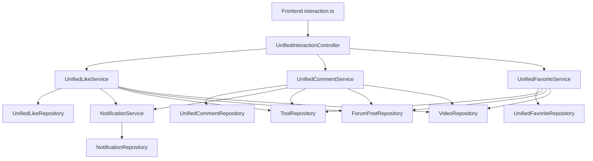

# 统一互动

## 模块概述

统一互动模块是 CodingHub 平台的核心社交互动基础设施，为工具广场（[Tool](../../../backend/src/main/java/com/iaihub/toolbox/model/Tool.java)）、论坛社区（Forum Post）、视频中心（[Video](../../../backend/src/main/java/com/iaihub/toolbox/model/video/Video.java)）三大内容模块提供统一的评论、点赞、收藏能力。通过多态目标类型（[TargetType](../../../backend/src/main/java/com/iaihub/toolbox/model/TargetType.java)）设计，一套 API 即可服务所有内容类型的互动操作，避免了为每种内容类型重复实现互动逻辑。

核心特性：
- **多态目标**：通过 `targetType + targetId` 组合定位任意内容实体
- **匿名友好**：点赞和评论支持未登录用户（基于 IP 哈希去重）
- **嵌套评论**：支持 parentId/rootId 的树形回复结构
- **通知联动**：评论和点赞自动触发站内通知
- **计数同步**：互动操作实时同步目标实体的 likeCount/commentCount 字段

## 架构总览



## 核心组件

### Controller 层

| 组件 | 路径 | 职责 |
|------|------|------|
| [UnifiedInteractionController](../../../backend/src/main/java/com/iaihub/toolbox/controller/UnifiedInteractionController.java) | `controller/UnifiedInteractionController.java` | 统一互动 REST 入口，路由 `/api/v1/interactions`，处理点赞/评论/收藏的 HTTP 请求 |
| [NotificationController](../../../backend/src/main/java/com/iaihub/toolbox/controller/notification/NotificationController.java) | `controller/notification/NotificationController.java` | 通知查询与管理，路由 `/api/v1/notifications` |

[UnifiedInteractionController](../../../backend/src/main/java/com/iaihub/toolbox/controller/UnifiedInteractionController.java) 通过 `SecurityContextHolder` 获取当前用户，对未登录用户计算 IP 的 SHA-256 哈希作为匿名标识（支持 X-Forwarded-For 代理头）。

### Service 层

| 组件 | 职责 |
|------|------|
| [UnifiedLikeService](../../../backend/src/main/java/com/iaihub/toolbox/service/UnifiedLikeService.java) | 点赞切换（toggle）、状态查询、我的点赞列表；支持登录用户（userId）和匿名用户（ipHash）双通道 |
| [UnifiedCommentService](../../../backend/src/main/java/com/iaihub/toolbox/service/UnifiedCommentService.java) | 评论发布（含嵌套回复）、分页查询、我的评论、删除（owner/admin 权限）；XSS 过滤；触发评论通知 |
| [UnifiedFavoriteService](../../../backend/src/main/java/com/iaihub/toolbox/service/UnifiedFavoriteService.java) | 收藏切换、状态查询、我的收藏列表；仅登录用户可用 |
| [NotificationService](../../../backend/src/main/java/com/iaihub/toolbox/service/notification/NotificationService.java) | 创建评论/点赞/管理员审批通知；查询、标记已读、全部已读 |

### Repository 层

| 组件 | 职责 |
|------|------|
| [UnifiedLikeRepository](../../../backend/src/main/java/com/iaihub/toolbox/repository/UnifiedLikeRepository.java) | 按 userId 或 ipHash 查询/删除点赞记录，分页查询用户点赞历史 |
| [UnifiedCommentRepository](../../../backend/src/main/java/com/iaihub/toolbox/repository/UnifiedCommentRepository.java) | 按目标分页查询评论（时间正序），按用户查询评论（时间倒序），统计评论数 |
| [UnifiedFavoriteRepository](../../../backend/src/main/java/com/iaihub/toolbox/repository/UnifiedFavoriteRepository.java) | 按用户+目标查询/删除收藏，分页查询收藏历史 |
| [NotificationRepository](../../../backend/src/main/java/com/iaihub/toolbox/repository/notification/NotificationRepository.java) | 按用户分页查询通知、统计未读数、批量标记已读 |

## 数据模型

### [TargetType](../../../backend/src/main/java/com/iaihub/toolbox/model/TargetType.java) 枚举

```java
public enum TargetType {
    TOOL,        // 工具广场中的工具
    FORUM_POST,  // 论坛社区中的帖子
    VIDEO;       // 视频中心的视频
}
```

通过 `TargetType.fromString(value)` 进行校验和解析，非法值抛出 400 业务异常。

### [UnifiedComment](../../../backend/src/main/java/com/iaihub/toolbox/model/UnifiedComment.java) 实体

| 字段 | 类型 | 说明 |
|------|------|------|
| id | Long | 主键自增 |
| targetType | String(20) | 目标类型（TOOL/FORUM_POST/VIDEO） |
| targetId | Long | 目标 ID |
| userId | Long | 评论者用户 ID（匿名时为 null） |
| userName | String(50) | 匿名评论者昵称 |
| parentId | Long | 直接父评论 ID（顶级评论为 null） |
| rootId | Long | 根评论 ID（用于嵌套回复归组） |
| content | TEXT | 评论内容（经 XSS 过滤） |
| likeCount | Integer | 评论获赞数（默认 0） |
| createdAt | LocalDateTime | 创建时间 |
| updatedAt | LocalDateTime | 更新时间 |

索引：`idx_comment_target(target_type, target_id, created_at)`、`idx_comment_root(root_id)`

### [UnifiedLike](../../../backend/src/main/java/com/iaihub/toolbox/model/UnifiedLike.java) 实体

| 字段 | 类型 | 说明 |
|------|------|------|
| id | Long | 主键自增 |
| targetType | String(20) | 目标类型 |
| targetId | Long | 目标 ID |
| userId | Long | 点赞用户 ID（登录用户） |
| ipHash | String(64) | IP 哈希（匿名用户，SHA-256） |
| createdAt | LocalDateTime | 创建时间 |

唯一约束：`uk_like_user(target_type, target_id, user_id)`、`uk_like_anon(target_type, target_id, ip_hash)`

### [UnifiedFavorite](../../../backend/src/main/java/com/iaihub/toolbox/model/UnifiedFavorite.java) 实体

| 字段 | 类型 | 说明 |
|------|------|------|
| id | Long | 主键自增 |
| targetType | String(20) | 目标类型 |
| targetId | Long | 目标 ID |
| userId | Long | 收藏者用户 ID（必填） |
| createdAt | LocalDateTime | 创建时间 |

唯一约束：`uk_fav(user_id, target_type, target_id)`

### [Notification](../../../backend/src/main/java/com/iaihub/toolbox/model/notification/Notification.java) 实体

| 字段 | 类型 | 说明 |
|------|------|------|
| id | Long | 主键自增 |
| user | [User](../../../backend/src/main/java/com/iaihub/toolbox/model/User.java) (ManyToOne) | 通知接收者 |
| type | [NotificationType](../../../backend/src/main/java/com/iaihub/toolbox/model/notification/NotificationType.java) | 通知类型枚举 |
| targetType | String(30) | 关联目标类型 |
| targetId | Long | 关联目标 ID |
| message | String(500) | 通知消息文本 |
| actorId | Long | 触发者用户 ID |
| actorName | String(100) | 触发者显示名 |
| isRead | Boolean | 是否已读（默认 false） |
| createdAt | LocalDateTime | 创建时间 |

## 通知与消息

### 通知类型（[NotificationType](../../../backend/src/main/java/com/iaihub/toolbox/model/notification/NotificationType.java)）

| 枚举值 | 触发场景 |
|--------|----------|
| COMMENT_REPLY | 用户评论了他人的工具/帖子/视频 |
| LIKE | 用户点赞了他人的工具/帖子/视频 |
| ADMIN_APPROVED | 管理员通过注册申请 |
| ADMIN_REJECTED | 管理员拒绝注册申请 |

### 通知触发机制

- 评论通知：`UnifiedCommentService.addComment()` 在保存评论后，解析目标所有者 ID，若与评论者不同则调用 `NotificationService.createCommentNotification()`
- 点赞通知：`UnifiedLikeService.toggleLike()` 仅在点赞动作（非取消）时触发 `NotificationService.createLikeNotification()`
- 通知发送为 best-effort，异常仅记录 warn 日志不影响主流程
- 自我操作不产生通知（ownerId == actorId 时跳过）

### 通知管理 API

通过 `NotificationController`（`/api/v1/notifications`）提供：
- 分页查询通知列表
- 获取未读数量
- 单条标记已读
- 全部标记已读

## API 端点

### 互动端点（/api/v1/interactions）

| 方法 | 路径 | 说明 | 认证要求 |
|------|------|------|----------|
| POST | /likes | 切换点赞状态（toggle） | 可选（匿名用 ipHash） |
| GET | /likes/status | 查询点赞状态与计数 | 可选 |
| GET | /likes/mine | 我的点赞列表（按 targetType 筛选） | 必须登录 |
| POST | /comments | 发表评论/回复 | 可选（匿名需 userName） |
| GET | /comments | 分页查询目标评论列表 | 无 |
| GET | /comments/mine | 我的评论列表 | 必须登录 |
| DELETE | /comments/{id} | 删除评论（owner 或 admin） | 必须登录 |
| POST | /favorites | 切换收藏状态（toggle） | 必须登录 |
| GET | /favorites | 我的收藏列表（按 targetType 筛选） | 必须登录 |
| GET | /favorites/status | 查询收藏状态 | 必须登录 |

### 通知端点（/api/v1/notifications）

| 方法 | 路径 | 说明 | 认证要求 |
|------|------|------|----------|
| GET | / | 分页查询通知列表 | 必须登录 |
| GET | /unread-count | 获取未读通知数 | 必须登录 |
| PUT | /{id}/read | 标记单条通知已读 | 必须登录 |
| PUT | /read-all | 全部标记已读 | 必须登录 |

### 请求/响应 DTO

**[InteractionRequest](../../../backend/src/main/java/com/iaihub/toolbox/dto/InteractionRequest.java)**（POST 请求体）：
- `targetType`（必填）：TOOL / FORUM_POST / VIDEO
- `targetId`（必填）：目标资源 ID
- `content`（评论时必填）：评论内容
- `parentId`（可选）：父评论 ID，用于嵌套回复
- `userName`（可选）：匿名评论者显示名

**[InteractionResponse](../../../backend/src/main/java/com/iaihub/toolbox/dto/InteractionResponse.java)**（统一响应）：
- 点赞场景：`liked` + `likeCount`
- 收藏场景：`favorited`
- 评论场景：完整评论对象（id, content, user 信息, parentId, rootId, createdAt）

## 前端集成

前端通过 `frontend/src/services/interaction.ts` 封装了完整的互动 API 调用：

```typescript
export type TargetType = 'TOOL' | 'FORUM_POST' | 'VIDEO'

export const interactionApi = {
  toggleLike(targetType, targetId)      // 切换点赞
  getLikeStatus(targetType, targetId)   // 查询点赞状态
  getComments(targetType, targetId, page, size)  // 获取评论列表
  addComment(targetType, targetId, content, parentId?, userName?)  // 发表评论
  deleteComment(commentId)              // 删除评论
  toggleFavorite(targetType, targetId)  // 切换收藏
  getMyFavorites(targetType, page, size) // 我的收藏
  getMyLikes(targetType, page, size)    // 我的点赞
  getMyComments(page, size)             // 我的评论
  getFavoriteStatus(targetType, targetId) // 查询收藏状态
}
```

## 业务规则

1. **点赞去重**：登录用户按 `(targetType, targetId, userId)` 唯一约束；匿名用户按 `(targetType, targetId, ipHash)` 唯一约束
2. **收藏仅限登录用户**：未登录调用收藏接口返回 401
3. **评论 XSS 防护**：所有评论内容经 `XssSanitizer.sanitize()` 过滤后存储
4. **目标存在性校验**：互动前校验目标实体存在且状态为 NORMAL，已删除目标不可互动
5. **计数同步**：点赞/评论操作同步更新目标实体的 likeCount/commentCount，论坛帖子还会触发 `updateScore()` 热度重算
6. **软删除兼容**：查询"我的点赞/收藏/评论"时，跳过已被软删除的目标实体
7. **分页限制**：单次查询最大 size 为 100

## 交叉引用

- [工具广场](工具广场.md) — [Tool](../../../backend/src/main/java/com/iaihub/toolbox/model/Tool.java) 实体作为 [TargetType](../../../backend/src/main/java/com/iaihub/toolbox/model/TargetType.java).TOOL 的互动目标
- [论坛社区](论坛社区.md) — [ForumPost](../../../backend/src/main/java/com/iaihub/toolbox/model/forum/ForumPost.java) 实体作为 [TargetType](../../../backend/src/main/java/com/iaihub/toolbox/model/TargetType.java).FORUM_POST 的互动目标
- [用户与认证](用户与认证.md) — [User](../../../backend/src/main/java/com/iaihub/toolbox/model/User.java) 实体提供身份识别，JWT 认证支撑登录态判断


<!-- crosslinks (auto-generated) -->
## Related Modules
- Depends on: [MCP服务](mcp服务.md), [工具广场](工具广场.md), [用户与认证](用户与认证.md), [论坛社区](论坛社区.md)
- Used by: [工具广场](工具广场.md), [用户与认证](用户与认证.md)
