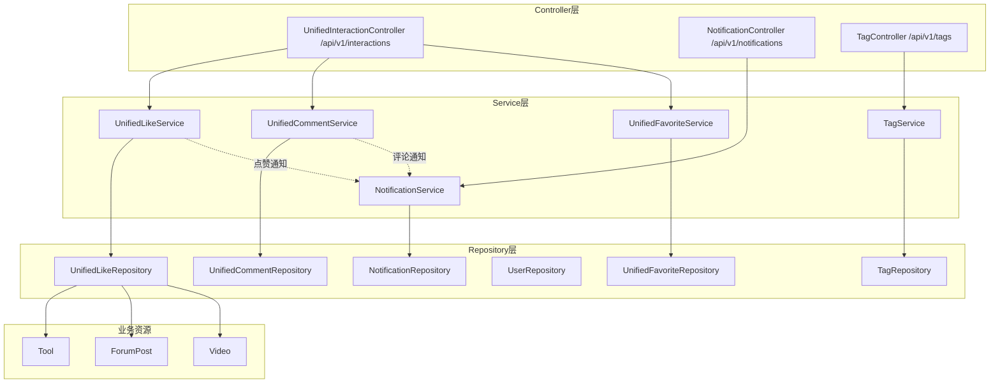
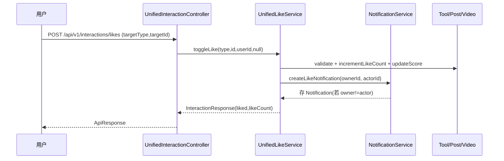

# 统一互动与通知

统一互动与通知模块把“点赞/评论/收藏/通知/标签”从各业务模块中抽离为**共享底座**，用 `TargetType`（TOOL / FORUM_POST / VIDEO）区分被互动的资源。这样工具、论坛、视频三类资源复用同一套互动 API 与数据表（`unified_like`、`unified_favorite`、`unified_comment`、`notification`、`tag`），避免每类资源各写一套。后端入口为 `/api/v1/interactions`、`/api/v1/notifications`、`/api/v1/tags`。

## Component Constraint Index

| Component | Constraints | Risks | Summary |
|-----------|-------------|-------|---------|
| UnifiedInteractionController | 3 | 0 | 点赞/评论/收藏统一入口 |
| UnifiedLikeService.toggleLike | 4 | 1 | 登录/匿名双通道，去重 toggle |
| UnifiedCommentService.addComment | 3 | 0 | 内容 XSS，支持父评论 |
| UnifiedFavoriteService.toggleFavorite | 2 | 0 | 仅登录用户可收藏 |
| NotificationService | 3 | 0 | 点赞/评论/审批三类通知，不通知自己 |
| TagService | 3 | 1 | 并发创建标签回退查询 |

## 架构总览 (Architecture Overview)

点赞/评论/收藏通过 `TargetType` 反向更新三类资源的计数列与热度分（见 [工具广场](工具广场.md)、[论坛社区](论坛社区.md)、[微课视频](微课视频.md) 的 `updateScore`）。

## 组件职责 (Component Responsibilities)

### UnifiedInteractionController (`/api/v1/interactions`)

| 端点 | 方法 | 说明 | 鉴权 |
|------|------|------|------|
| `POST /likes` | toggleLike | 点赞/取消（登录或匿名） | 公开(匿名靠 ipHash) |
| `GET /likes/status` | getLikeStatus | 当前用户是否已赞 | 公开 |
| `GET /likes/mine` | getMyLikes | 我的点赞（按类型） | JWT |
| `POST /comments` | addComment | 发表评论（支持 parentId） | 公开(匿名靠 ipHash) |
| `GET /comments` | getComments | 评论分页 | 公开 |
| `GET /comments/mine` | getMyComments | 我的评论 | JWT |
| `DELETE /comments/{id}` | deleteComment | 删评论（本人/admin） | JWT |
| `POST /favorites` | toggleFavorite | 收藏/取消 | JWT |
| `GET /favorites` | getMyFavorites | 我的收藏 | JWT |
| `GET /favorites/status` | getFavoriteStatus | 是否已收藏 | JWT |

### UnifiedLikeService

- **toggleLike**：`TargetType.fromString` 解析；`validateTargetExists` 校验目标存在且非软删除；登录用户按 `(targetType,targetId,userId)` toggle，匿名用户按 `(targetType,targetId,ipHash)` toggle（同一身份仅一条，再点即取消）；随后 `updateLikeCount` 在目标资源上 `increment/decrementLikeCount`（论坛额外 `updateScore()`），并返回最新 `likeCount`。
- **点赞通知**：仅在点赞动作（`liked && userId!=null`）且 `ownerId != actorId` 时，经 `resolveTargetOwnerId` 取资源 owner 并调 `NotificationService.createLikeNotification`（best-effort，`catch` 记日志）。

**Business Constraints — UnifiedLikeService**

- 登录与匿名双通道：匿名用 SHA-256(ipHash)，与 [留言反馈](留言反馈.md) 同一防刷口径 (confidence: 0.95)
  > Evidence: `toggleLike` 中 `if (userId != null) ... findByTargetTypeAndTargetIdAndUserId(...)` else `findByTargetTypeAndTargetIdAndIpHash(...)`；`computeIpHash` 同 [留言反馈](留言反馈.md) 实现。
- 同一身份对同资源只能有一条点赞记录（toggle 语义） (confidence: 0.95)
  > Evidence: 先 `findBy...` 存在则 `deleteBy...` 置 `liked=false`，否则 `save` 置 `liked=true`；唯一约束 `(targetType,targetId,userId|ipHash)` 兜底。
- 点赞仅更新目标资源 likeCount，论坛额外联动热度分 (confidence: 0.9)
  > Evidence: `updateLikeCount` 的 `FORUM_POST` 分支 `post.setLikeCount(...); post.updateScore();`；`TOOL`/`VIDEO` 仅 `increment/decrementLikeCount`。
- 点赞通知不通知自己，且发送失败不阻断主流程 (confidence: 0.9)
  > Evidence: `if (ownerId != null && !ownerId.equals(userId))` 才发；整段 `try/catch(Exception)` 仅 `log.warn`。

### UnifiedCommentService / UnifiedFavoriteService

- **addComment**：对 `content` 调 `XssSanitizer.sanitize()`；`parentId` 可空（楼中楼）；保存 `UnifiedComment`；同步目标资源 `commentCount++` 与热度分；向资源 owner 发评论通知（不通知自己）。
- **toggleFavorite**：仅登录用户（匿名直接 401）；按 `(targetType,targetId,userId)` toggle；更新目标 `favoriteCount`（`Tool`/`ForumPost`/`Video` 各自字段，由领域 Service 暴露 `increment/decrementFavoriteCount`）。

### NotificationService / NotificationController (`/api/v1/notifications`)

- 三类通知：`COMMENT_REPLY`（评论）、`LIKE`（点赞）、`ADMIN_APPROVED/REJECTED`（审批，由 [用户与认证](用户与认证.md) 的 `AdminController` 调 `createAdminNotification`）。
- `getNotifications(userId)` 分页、`getUnreadCount` 未读计数、`markAsRead/markAllAsRead`（校验 `n.user.id == userId`，否则 `ForbiddenException`）。
- `create*Notification` 在 `targetOwnerId==actorId` 时直接 return（不通知自己）。

**Business Constraints — NotificationService**

- 评论/点赞通知不通知资源作者本人 (confidence: 0.95)
  > Evidence: `if (targetOwnerId.equals(actorId)) return;` 出现在 `createCommentNotification` 与 `createLikeNotification` 开头。
- 标记已读仅限通知归属用户本人 (confidence: 0.9)
  > Evidence: `markAsRead` 中 `if (!n.getUser().getId().equals(userId)) throw new ForbiddenException("无权操作此通知")`。

### TagService / TagController (`/api/v1/tags`)

- `createTag(name,type)`：按 `(name,tagType)` 查重，存在则返回，否则新建（`usageCount=0`）。
- `getTagsByType` / `getHotTags(type,limit)`：按 `TagType` 列出 / 取 `usageCount` TopN（limit 上限 100）。
- `resolveOrCreateTags(names,tagType)`：批量按名解析为 id，不存在则创建；**并发冲突**捕获 `DataIntegrityViolationException` 后回退查询已有记录。
- 标签 `usageCount` 由 [工具广场](工具广场.md)/[论坛社区](论坛社区.md)/[微课视频](微课视频.md) 在关联/替换时 `increment/decrementUsage` 同步。

**Business Constraints — TagService**

- 标签按 (name, type) 唯一，并发创建回退查询而非抛错 (confidence: 0.9)
  > Evidence: `resolveOrCreateTags` 内 `catch (DataIntegrityViolationException e)` → `logger.warn(...)` → `tagRepository.findByNameAndTagType(...).orElseThrow(...)`。
- 热门标签受 limit 上限 100 约束 (confidence: 0.85)
  > Evidence: `int cappedLimit = Math.min(limit, 100);` 用于 `findTopByTagTypeOrderByUsageCountDesc`。

### 数据模型

- `UnifiedLike`：`targetType/targetId/userId(可空)/ipHash(可空)`，复合唯一。
- `UnifiedComment`：`targetType/targetId/userId/userName/content/parentId(可空)/createdAt`。
- `UnifiedFavorite`：`targetType/targetId/userId`，复合唯一。
- `Notification`：`user/targetType/targetId/type/message/actorId/actorName/isRead`。
- `Tag`：`name/tagType(TOOL/FORUM/VIDEO)/usageCount`。

## 数据流：点赞并触发通知

## 接口契约与副作用

- 统一返回 `ApiResponse<InteractionResponse>` / `PageResponse<?>`，契约见 [平台基础](平台基础.md)。
- 副作用：点赞/评论会改写目标资源计数列与热度分，并可能向 owner 推送通知；`/mine` 类接口跳过软删除目标。

## 依赖关系 (Cross-References)

- [工具广场](工具广场.md) / [论坛社区](论坛社区.md) / [微课视频](微课视频.md) — 三类资源被本模块反向更新 `likeCount/commentCount/favoriteCount/score`，标签 `usageCount` 亦由它们同步。
- [用户与认证](用户与认证.md) — `User`、`Role`、审批通过时调 `createAdminNotification`。
- [平台基础](平台基础.md) — `ApiResponse`、`XssSanitizer`、`GlobalExceptionHandler`、`ForbiddenException`。
- [前端应用](前端应用.md) — `services/interaction.ts`、`services/notification.ts`、`NotificationBell`。

## 约束、假设与边界情况

- `TargetType` 仅含 TOOL/FORUM_POST/VIDEO；新增资源类型须同步扩展枚举与 `UnifiedLikeService` 的 `switch`（否则 `validateTargetExists` 落入 `default` 抛 `ResourceNotFoundException`）。
- 匿名互动靠 `ipHash`，与登录态互斥；同一 IP 下的不同匿名访客会被视为同一身份。
- 收藏无匿名通道（必须登录），与点赞不同——前端需对未登录用户隐藏收藏按钮或引导登录。
- 通知为“尽力推送”：创建失败仅记日志，不影响主互动流程；通知不持久化离线未读以外的状态。
- 评论的 `parentId` 不做层级深度限制（可多层楼中楼），超长楼可能导致前端渲染压力。
