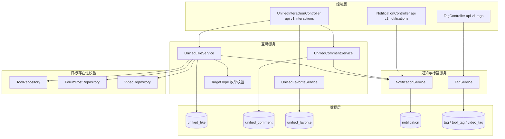
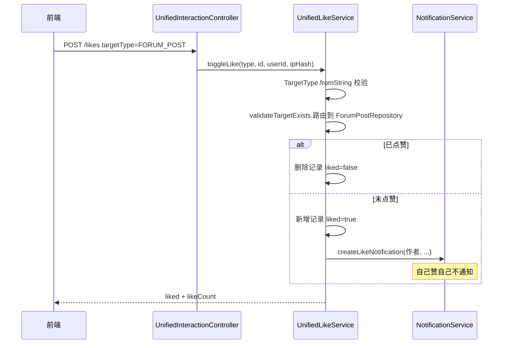

# 统一互动与通知

## 模块概述

统一互动与通知模块是跨领域的横向能力层，包含三个子系统：

1. **统一互动**（`/api/v1/interactions`）：以多态 `TargetType`（TOOL / FORUM_POST / VIDEO）为核心，为三大内容领域提供**统一的点赞、评论、收藏**实现——避免每个领域各建一套 `xxx_like` / `xxx_comment` 表（项目强制约定：新增互动能力必须复用本模块，禁止重复造轮子）
2. **通知**（`/api/v1/notifications`）：站内消息推送与未读计数
3. **统一标签**（`/api/v1/tags`）：跨 TOOL / FORUM / VIDEO 三域的标签管理与热门标签

- **组件数量**: 109 个
- **核心入口**: `UnifiedInteractionController` + `UnifiedLikeService` / `UnifiedCommentService` / `UnifiedFavoriteService` + `NotificationService` + `TagService`

## 架构图

## 多态互动设计（TargetType）

`TargetType` 枚举（TOOL / FORUM_POST / VIDEO）+ `targetId` 构成多态引用。`fromString()` 严格校验，非法值抛 `BusinessException(400)`。

三张互动表结构同构，均以 `(target_type, target_id, user_id | ip_hash)` 定位：

| 表 | 唯一性 | 匿名支持 |
|----|--------|---------|
| `unified_like` | (targetType, targetId, userId) 或 (targetType, targetId, ipHash) | 支持（IP 哈希） |
| `unified_comment` | 无唯一约束，支持 `parent_id` 两级回复 | 支持（userName 手填） |
| `unified_favorite` | (targetType, targetId, userId) | 仅登录用户 |

**目标存在性校验**: 每次互动前 `validateTargetExists` 按 targetType 路由到对应 Repository，且要求内容非软删除状态（如 `ForumPostStatus`、`VideoStatus` 正常）。

## REST 接口（/api/v1/interactions）

| 端点 | 权限 | 说明 |
|------|------|------|
| `POST /likes` | 公开（匿名走 ipHash） | 切换点赞（toggle 语义），返回 liked + likeCount |
| `GET /likes/status` | 公开 | 查询点赞状态与计数 |
| `GET /likes/mine?targetType=` | 登录 | 我点赞过的内容（返回对应领域摘要 DTO 分页） |
| `POST /comments` | 公开（匿名需 userName） | 发表评论/回复（parentId 可选） |
| `GET /comments` | 公开 | 目标评论分页（两级树） |
| `GET /comments/mine` | 登录 | 我的评论 |
| `DELETE /comments/{id}` | 登录 | 删除评论（`isOwner or isAdmin`） |
| `POST /favorites` | 登录 | 切换收藏 |
| `GET /favorites/status` | 登录 | 收藏状态 |
| `GET /favorites/mine?targetType=` | 登录 | 我的收藏（分页） |

匿名身份识别与 [留言反馈](留言反馈.md) 一致：`X-Forwarded-For` 首段 IP 做 SHA-256 哈希。

## 点赞时序（含通知联动）

## 通知子系统

### notification 表（Notification 实体）

字段：`user_id`（接收者）、`type`（NotificationType）、`target_type` / `target_id`（跳转定位）、`message`（预生成文案）、`actor_id` / `actor_name`（触发者）、`is_read`。

### NotificationType 事件

| 类型 | 触发方 | 文案模板 |
|------|--------|---------|
| `COMMENT_REPLY` | UnifiedCommentService | `{actor} 评论了: {预览80字}` |
| `LIKE` | UnifiedLikeService | `{actor} 赞了你的内容` |
| `ADMIN_APPROVED` / `ADMIN_REJECTED` | AdminController 审批 | 注册申请通过/拒绝 |

**防自扰**: `targetOwnerId.equals(actorId)` 时不生成通知。

### 通知接口（/api/v1/notifications，均需登录）

- `GET /` 分页列表（时间倒序）
- `GET /unread-count` 未读数（前端 `NotificationBell` 轮询）
- `PUT /{id}/read` 单条已读（仅本人，越权抛 `ForbiddenException`）
- `PUT /read-all` 全部已读

## 统一标签子系统

### 数据模型

- `tag` 表：`name` + `tag_type`（TOOL / FORUM / VIDEO）联合唯一 + `usage_count` 热度计数
- `tool_tag` / `video_tag`：工具、视频与标签的关联表（论坛用自己的 `forum_post_tag`，见 [论坛社区](论坛社区.md)）

### 核心方法（TagService）

- `resolveOrCreateTags(names, tagType)`: 批量"查找或创建"，捕获唯一约束冲突后回退查询（并发安全）；供工具/视频/帖子保存时解析标签名
- `getHotTags(type, limit)`: 按 usage_count 倒序，limit 上限 100
- `getOrCreateTag` / `createTag`: 幂等创建

### 标签接口（/api/v1/tags，GET 公开）

- `GET /?type=TOOL` 按类型全量列表
- `GET /hot?type=FORUM&limit=10` 热门标签

## 依赖关系

- **依赖 [平台基础](平台基础.md)**: `ApiResponse` / `PageResponse`、`BusinessException` / `ResourceNotFoundException` / `ForbiddenException`
- **依赖 [用户与认证](用户与认证.md)**: `User` / `Role`、Spring Security 上下文
- **依赖三大内容领域**（只读校验+摘要 DTO）: [工具广场](工具广场.md) `ToolRepository`、[论坛社区](论坛社区.md) `ForumPostRepository`、[微课视频](微课视频.md) `VideoRepository`
- **被依赖**: 三大内容领域的前端页面均通过 [前端服务层](前端服务层.md) `interactions.ts` 调用本模块；AdminController 审批时调 `NotificationService`

## 设计要点

1. **多态而非多表**: 用 `target_type` 字符串列 + 应用层枚举校验替代外键，跨域互动一套代码；代价是无数据库级引用完整性，靠 `validateTargetExists` 应用层守卫
2. **`getMyLikes` / `getMyFavorites` 跨域装配**: 按 targetType 返回不同领域的摘要 DTO（ToolSummaryDTO / 帖子摘要 / VideoListItem），Controller 层用 `PageResponse<?>` 泛型擦除承载
3. **通知内联生成**: 通知在互动事务内同步落库（无消息队列），与单机部署约束一致
4. **标签类型隔离**: 同名标签在不同 tagType 下是不同记录，各域热度独立统计
