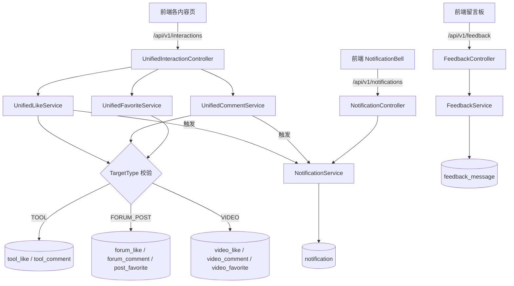

# 统一互动与通知

## 模块概述

本模块是平台互动能力的**唯一实现方**，包含三个子系统：

1. **统一互动**：点赞、评论、收藏，通过 `TargetType`（TOOL / FORUM_POST / VIDEO）多态支持所有内容类型 —— 项目铁律：**任何新内容类型的互动功能必须复用本模块，禁止重复造轮子**
2. **通知中心**：评论/点赞/管理员操作触发站内通知，未读计数、已读标记
3. **留言反馈**：留言板 + 管理员回复（支持匿名留言，IP 哈希防刷）

## 架构总览

## 统一互动 REST API (`/api/v1/interactions`)

| 端点 | 说明 |
|------|------|
| `POST /likes` | 点赞开关（body: targetType + targetId；登录用户按 userId，匿名按 ipHash 去重） |
| `GET /likes/status` | 当前用户/IP 点赞状态 |
| `GET /likes/mine` | 我点赞过的内容（分页，按 targetType） |
| `POST /comments` | 发表评论（支持父评论回复） |
| `GET /comments` | 目标内容的评论列表（分页） |
| `GET /comments/mine` | 我的评论（跨类型聚合，`MyCommentDTO`） |
| `DELETE /comments/{id}` | 删除评论（owner 或 admin） |
| `POST /favorites` | 收藏开关 |
| `GET /favorites` | 我的收藏列表 |
| `GET /favorites/status` | 收藏状态 |

## 核心组件

### [TargetType](../../../backend/src/main/java/com/iaihub/toolbox/model/TargetType.java)（多态目标）

**路径**: `backend/src/main/java/com/iaihub/toolbox/model/TargetType.java`

枚举 `TOOL / FORUM_POST / VIDEO`。`fromString()` 严格校验，非法值抛 `BusinessException(400)` —— 所有互动入口的第一道防线。

### [UnifiedLikeService](../../../backend/src/main/java/com/iaihub/toolbox/service/UnifiedLikeService.java)

- `toggleLike(targetType, targetId, userId, ipHash)` — 点赞开关：登录用户按 `userId` 去重，匿名访客按 `ipHash` 去重；根据 targetType 路由到对应的 like 表并同步冗余计数（`likeCount`）
- `getLikeStatus` / `getMyLikes` — 状态查询与个人点赞聚合
- 点赞成功后调用 `NotificationService.createLikeNotification` 通知内容作者

### [UnifiedCommentService](../../../backend/src/main/java/com/iaihub/toolbox/service/UnifiedCommentService.java)

- `addComment(targetType, targetId, userId, content, parentId)` — XSS 清洗 → 路由到对应 comment 表 → 更新冗余 `commentCount` → 触发评论通知
- `getComments` — 分页评论树（父子两级）
- `getMyComments` — 跨 TOOL/FORUM_POST/VIDEO 聚合个人评论（内部类 `MyCommentDTO` 附带目标标题）
- `deleteComment(commentId, userId, isAdmin)` — 权限 `isOwner || isAdmin`

### [UnifiedFavoriteService](../../../backend/src/main/java/com/iaihub/toolbox/service/UnifiedFavoriteService.java)

- `toggleFavorite` / `getFavoriteStatus` / `getMyFavorites` — 收藏开关与查询，路由到 `post_favorite` / `video_favorite` 等表

> 三个 Service 组装列表时均**批量查询**目标内容与用户信息，遵守「禁止循环内查库」约定。

## 通知中心

### [NotificationController](../../../backend/src/main/java/com/iaihub/toolbox/controller/notification/NotificationController.java) (`/api/v1/notifications`)

| 端点 | 说明 |
|------|------|
| `GET /` | 通知分页列表 |
| `GET /unread-count` | 未读数（前端 NotificationBell 轮询） |
| `PUT /{id}/read` | 单条已读 |
| `PUT /read-all` | 全部已读 |

### [NotificationService](../../../backend/src/main/java/com/iaihub/toolbox/service/notification/NotificationService.java)

- `createCommentNotification` / `createLikeNotification` — 由互动服务触发；**自己给自己的内容点赞/评论不产生通知**
- `createAdminNotification(userId, type)` — 管理员操作（如账号审批通过）通知
- `Notification` 实体（`notification` 表）：接收者、类型（`NotificationType`）、关联目标（targetType + targetId）、已读标记

## 留言反馈

### [FeedbackController](../../../backend/src/main/java/com/iaihub/toolbox/controller/feedback/FeedbackController.java) (`/api/v1/feedback`)

| 端点 | 说明 |
|------|------|
| `GET /` | 留言分页列表（含管理员回复） |
| `POST /` | 发布留言（登录或匿名 + 昵称/联系方式；`ipHash` 防刷） |
| `PUT /{id}/reply` | 管理员回复 |
| `DELETE /{id}` | 删除留言（admin，软删除） |

**[FeedbackMessage](../../../backend/src/main/java/com/iaihub/toolbox/model/feedback/FeedbackMessage.java)** 实体（`feedback_message` 表）：`content`、`nickname`/`contact`（匿名场景）、`user`（登录场景）、`category`（`FeedbackCategory`，默认 SUGGESTION）、`ipHash`、`adminReply` + `repliedBy` + `repliedAt`、`status` 软删除。

## 关键设计决策

1. **一套接口、多态路由**：前端所有内容类型的互动调用同一组 `/api/v1/interactions` 接口，仅 `targetType` 不同；后端按枚举路由到各自的表，冗余计数回写宿主实体
2. **匿名点赞**：未登录用户以 IP 哈希（`ipHash`）为身份键，兼顾体验与防刷
3. **通知解耦**：互动服务只调用 `NotificationService` 门面，通知细节（去重、自赞不通知）内聚在通知模块

## 与其他模块的关系

- 被 [工具广场](工具广场.md)、[论坛社区](论坛社区.md)、[微课视频](微课视频.md) 复用（互动 + 计数回写）
- [用户与认证](用户与认证.md)：用户身份、admin 判定
- [前端应用](前端应用.md)：`interactionService` 统一封装 + NotificationBell 组件 + 留言板页面

<!-- crosslinks (auto-generated) -->
## Related Modules
- Depends on: [工具广场](工具广场.md), [平台基础](平台基础.md), [微课视频](微课视频.md), [用户与认证](用户与认证.md), [论坛社区](论坛社区.md)
- Used by: [工具广场](工具广场.md), [微课视频](微课视频.md), [用户与认证](用户与认证.md)
