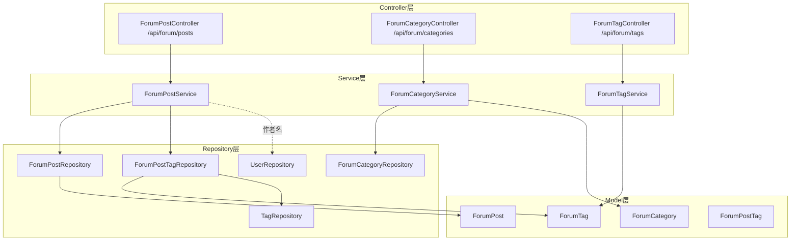
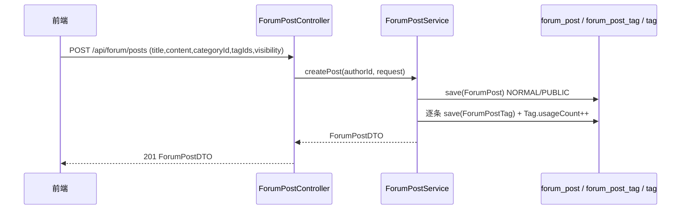

# 论坛社区

论坛社区是 CodingHub 的 UGC 讨论区，提供帖子的完整生命周期：发布（含标签关联、公开/私有可见性）、检索（分类/关键词/排序）、详情（浏览量+1、私有校验）、置顶、软删除，以及论坛分类与热门标签。后端入口为 `/api/forum/posts`、`/api/forum/categories`、`/api/forum/tags`（**注意：论坛接口不含 `/v1` 前缀**，与其余模块不同）。MCP 侧的 `h3_coding_hub_post_*` 工具复用本模块 Service 层（见 [MCP服务](MCP服务.md)）。

## Component Constraint Index

| Component | Constraints | Risks | Summary |
|-----------|-------------|-------|---------|
| ForumPostService.createPost/updatePost/deletePost | 3 | 1 | owner 或 ADMIN/SUPER_ADMIN 可写 |
| ForumPostService.getPostById | 2 | 1 | PRIVATE 帖子仅作者/管理员可见 |
| ForumPostService.getPostList | 2 | 0 | 仅返回 PUBLIC；默认 hot 排序 |
| ForumPostService.updatePost | 2 | 1 | 标签全量替换并同步 usage 计数 |
| ForumPost.updateScore | 1 | 0 | 热度分 = view*1+like*3+comment*5 |
| ForumCategoryController.getAllCategories | 1 | 0 | 分类只读 |
| ForumTagService.getHotTags | 1 | 0 | 按 usageCount 取热门 |
| ForumPostController.pinPost/unpinPost | 1 | 0 | 置顶仅 ADMIN/SUPER_ADMIN |

## 架构总览 (Architecture Overview)

## 组件职责 (Component Responsibilities)

### ForumPostController (`/api/forum/posts`)

| 端点 | 方法 | 说明 | 鉴权 |
|------|------|------|------|
| `GET /` | getPostList | 分页（category/keyword/sortBy=hot\|latest） | 公开 |
| `GET /my` | getMyPosts | 我的帖子 | JWT |
| `GET /{id}` | getPostById | 详情（浏览量+1，私有校验） | 公开(私有需登录) |
| `POST /` | createPost | 发帖（JWT，401 若未登录） | JWT |
| `PUT /{id}` | updatePost | 编辑（owner/admin） | JWT |
| `DELETE /{id}` | deletePost | 软删除（owner/admin） | JWT |
| `POST /{id}/pin` `DELETE /{id}/pin` | pin/unpin | 置顶/取消 | ADMIN/SUPER_ADMIN |
| `GET /hot-top5` | getHotTop5 | 热度 Top5 帖子 id | 公开 |

### ForumPostService

- **列表检索** `getPostList`：强制 `visibility = PUBLIC`，不对外暴露私有帖；`sortBy=latest` 按 `createdAt DESC`，否则按 `hot`（热度分）；keyword 走 `searchByTitle` 模糊匹配。
- **详情** `getPostById`：若帖子为 `PRIVATE`，未登录直接 `ForbiddenException("请登录后查看")`；登录后校验 `isOwner || isAdmin`，否则 `ForbiddenException("无权查看")`；通过后 `viewCount++` + `updateScore()` 并持久化。
- **创建** `createPost`：保存 `ForumPost`（默认 `NORMAL`、`PUBLIC`，可由请求设为 `PRIVATE`）；`tagIds` 非空前逐个建 `ForumPostTag` 并 `Tag.usageCount++`。
- **更新** `updatePost`：owner/admin 守卫；标题/内容/分类可改；`tagIds` 非 null 时**全量替换**——先删旧 `ForumPostTag` 并 `Tag.usageCount--`，再建新关联并 `++`。
- **删除** `deletePost`：owner/admin 守卫；`status = DELETED`（软删除）。
- **置顶** `pinPost/unpinPost`：仅按 id 调 Repository 的 `pinById/unpinById`（`@PreAuthorize` 已在 Controller 层限制角色）。

**Business Constraints — ForumPostService**

- 仅 PUBLIC 帖子对公开列表/检索可见，PRIVATE 仅作者与管理员可看 (confidence: 0.95)
  > Evidence: `getPostList` 始终以 `ForumPostVisibility.PUBLIC` 作为查询条件；`getPostById` 对 PRIVATE 做 `currentUser==null` 与 `!isOwner && !isAdmin` 双重 `ForbiddenException`。
- 帖子写操作仅限作者本人或 ADMIN/SUPER_ADMIN (confidence: 0.95)
  > Evidence: `updatePost/deletePost` 中 `boolean isOwner = post.getAuthorId().equals(user.getId()); boolean isAdmin = ...; if (!isOwner && !isAdmin) throw new ForbiddenException("无权操作此内容")`。
- 热度分固定公式并随计数联动 (confidence: 0.95)
  > Evidence: `ForumPost.updateScore()`：`score = viewCount*1 + likeCount*3 + commentCount*5`（BigDecimal）。
- 标签为全量替换语义，并同步 `Tag.usageCount` (confidence: 0.9)
  > Evidence: `updatePost` 先 `deleteByPostId` + 旧标签 `decrementUsage`，再逐个 `save(ForumPostTag)` + 新标签 `incrementUsage`。
- 删除为软删除 (confidence: 0.9)
  > Evidence: `deletePost` 调 `post.setStatus(ForumPostStatus.DELETED)` 后 `save`。
- 接口路径无 `/v1` 前缀 (confidence: 0.95)
  > Evidence: `ForumPostController` 标注 `@RequestMapping("/api/forum/posts")`，与 `/api/v1/...` 系列明显不同；调用时勿多写 `/v1`。

### 数据模型

- `ForumPost`：`title(200)`、`content(text)`、`authorId`、`categoryId`、`viewCount/likeCount/commentCount`、`score(BigDecimal)`、`pinned`、`visibility(PUBLIC/PRIVATE, 默认 PUBLIC)`、`status(NORMAL/DELETED)`；`updateScore()` 重算热度；`@PrePersist` 维护时间戳。
- `ForumCategory`：论坛分类（`name/icon/logoUrl` 等），`getAllCategories` 只读返回。
- `ForumTag`：统一标签在论坛域的投影，`getHotTags` 按 `usageCount` 取热门。
- `ForumPostTag`：帖子-标签关联（复合主键 `postId+tagId`）。

## 数据流：发帖与标签关联

## 接口契约与副作用

- `getPostList/getMyPosts/getPostById` 返回 `ForumPostDTO`（`Page<ForumPostDTO>` 由 Spring 分页直接返回，未包 `ApiResponse`，与 `/api/v1` 系列不同）；`create/update/delete/pin` 返回 `ApiResponse`/无内容。
- 详情读取即计浏览量并联动热度分；创建/更新标签会改写 `tag.usage_count`。

## 依赖关系 (Cross-References)

- [统一互动与通知](统一互动与通知.md) — 帖子点赞走 `TargetType.FORUM_POST` 的统一互动；`ForumLikeRequest` 复用统一互动契约。
- [MCP服务](MCP服务.md) — `h3_coding_hub_post_search/post_get` 工具复用 `ForumPostService`。
- [用户与认证](用户与认证.md) — `@AuthenticationPrincipal User`、`Role` 权限模型。
- [平台基础](平台基础.md) — `ApiResponse`、`ResourceNotFoundException/ForbiddenException`。
- [前端应用](前端应用.md) — `frontend/src/services/forum.ts`、`pages/forum/*`、`components/forum/*`。

## 约束、假设与边界情况

- 列表查询硬编码 `visibility=PUBLIC`，管理员也无法在公开列表看到私有帖（需走 `/my` 或详情直链）。
- `sortBy` 不接受其它值，非 `latest` 一律按 `hot`。
- 标签替换是全量语义：`tagIds` 传空数组清空全部标签；传 null 不动。
- 置顶（`pinned`）参与默认 hot 排序，但具体排序权重由 Repository 的 `OrderByHot` 决定（pinned 优先）。
