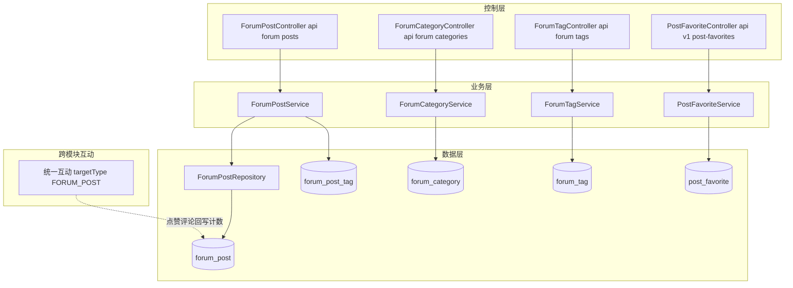
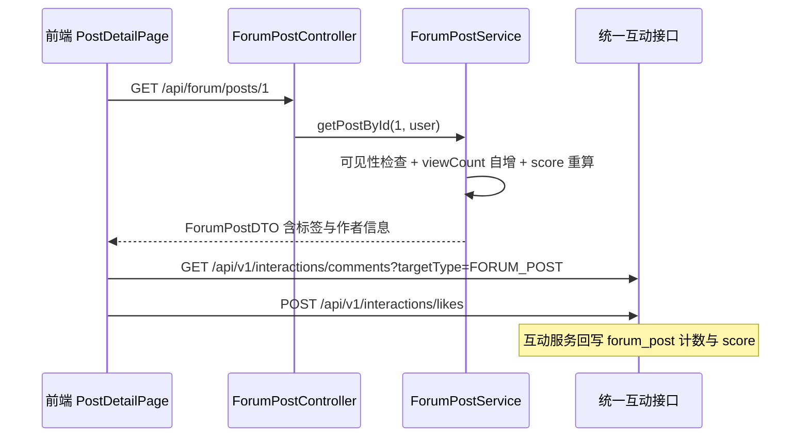

# 论坛社区

## 模块概述

论坛社区模块提供帖子发布、分类浏览、标签筛选、可见性控制与热度排序能力。帖子的点赞与评论通过 [统一互动与通知](统一互动与通知.md)（`targetType=FORUM_POST`）实现，收藏走独立的 `post_favorite`。

- **代码位置**: `controller/forum/`（ForumPostController、ForumCategoryController、ForumTagController）+ `service/forum/` + `model/forum/` + `repository/forum/`，另含核心包中的 `PostFavoriteController` / `PostFavoriteService`
- **组件数量**: 130 个
- **API 前缀**: **`/api/forum/...`**（注意：论坛是全站唯一**不含 `/v1`** 的 API 前缀）+ `/api/v1/post-favorites`

## 架构图

## 数据模型

### forum_post 表（ForumPost 实体）

| 字段 | 说明 |
|------|------|
| `title` / `content` | 标题（200 字）/ 富文本正文（XSS 净化） |
| `author_id` / `category_id` | **Long 型 ID 引用**（非 JPA 关联，区别于 Tool 的 `@ManyToOne`） |
| `view_count` / `like_count` / `comment_count` | 计数冗余 |
| `score` | 热度分 = viewCount×1 + likeCount×3 + commentCount×5 |
| `status` | `NORMAL` / `DELETED`（ForumPostStatus，软删除） |
| `pinned` | 管理员置顶 |
| `visibility` | `PUBLIC` / `PRIVATE`（ForumPostVisibility，私密帖仅作者与管理员可见） |

### 配套表

- `forum_category`: 论坛分类（与工具分类独立）
- `forum_tag`: 论坛标签（独立于统一 tag 表的历史设计）
- `forum_post_tag`: 帖子-标签多对多关联
- `post_favorite`: 帖子收藏（早于统一收藏的历史实现，独立保留）

## REST 接口

### 帖子（/api/forum/posts）

| 端点 | 权限 | 说明 |
|------|------|------|
| `GET /` | 公开 | 分页列表：category / tag / keyword 筛选，sortBy=hot(score)/latest；私密帖过滤 |
| `GET /my` | 登录 | 我的帖子（含私密） |
| `GET /{id}` | 公开 | 详情（自增 viewCount；私密帖鉴权：作者或管理员） |
| `POST /` | 登录 | 发帖（201；标签解析、XSS 净化） |
| `PUT /{id}` | owner 或 admin | 编辑 |
| `DELETE /{id}` | owner 或 admin | 软删除（204 No Content） |
| `POST /{id}/pin` / `DELETE /{id}/pin` | ADMIN+ | 置顶 / 取消 |
| `GET /hot-top5` | 公开 | 热度 Top5 帖子 ID |

### 分类与标签

- `GET /api/forum/categories` 公开；管理端维护
- `GET /api/forum/tags` 公开标签列表（发帖时可选）

### 收藏（/api/v1/post-favorites，均需登录）

- `POST /{postId}` / `DELETE /{postId}` 收藏 / 取消
- `GET /mine` 我的收藏分页
- `GET /{postId}/status` 收藏状态

## 帖子浏览与互动流程

## 响应风格差异（历史遗留）

论坛模块 Controller 与全站风格存在两处不一致，前端已适配、文档如实记录：

1. **路径前缀**: `/api/forum/...` 不含 `/v1`（其余模块为 `/api/v1/...`）
2. **响应信封**: 列表/详情直接返回 `Page<ForumPostDTO>` / `ForumPostDTO` 裸对象（不套 `ApiResponse`）；仅置顶等新接口使用 `ApiResponse` 包装

## 依赖关系

- **依赖 [平台基础](平台基础.md)**: 异常体系、`XssSanitizer`；置顶接口使用 `ApiResponse`
- **依赖 [用户与认证](用户与认证.md)**: `User`、作者信息装配（authorId → 昵称/头像）
- **被依赖**: [统一互动与通知](统一互动与通知.md) 的 `validateTargetExists` 与计数回写；[MCP服务](MCP服务.md) `post_search` / `post_create` 工具；[平台基础](平台基础.md) OverviewService 帖子排行
- **前端配合**: `pages/forum/`（列表/详情/编辑器）+ `components/forum/`（PostCard、CategoryFilter、CommentList 等），经 [前端服务层](前端服务层.md) `forum.ts`（**该文件路径常量不含 /v1**）

## 设计要点

1. **ID 引用而非 JPA 关联**: `author_id` / `category_id` 用 Long 直存，避免 N+1 与懒加载复杂度，DTO 装配时批量查询作者信息
2. **可见性状态机**: PUBLIC/PRIVATE 两级，私密帖在列表查询 SQL 层过滤、详情层鉴权，双重保护
3. **双标签体系**: 论坛保留自有 `forum_tag`（历史先行），统一 `tag` 表的 FORUM 类型用于热门标签统计——新功能建议走统一标签
4. **收藏双轨**: `post_favorite`（论坛专用）与 `unified_favorite`（统一）并存，帖子收藏走前者
