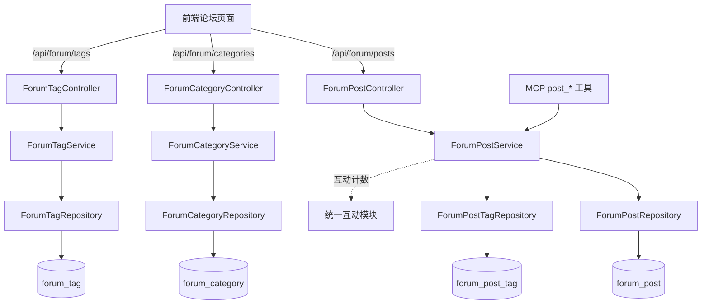

# 论坛社区

## 模块概述

论坛社区模块提供帖子发布、浏览、搜索、分类与标签管理能力，是平台的内容社区核心。特性：

- **帖子生命周期**：发布 → 编辑 → 软删除（`status = DELETED`），另有 `HIDDEN` 隐藏态
- **可见性控制**：`PUBLIC` / `PRIVATE`（私有帖仅作者与管理员可见）
- **运营能力**：管理员置顶（pin）、热度 Top5 榜单（按 `score` 热度分）
- **分类与标签**：固定分类（`forum_category`）+ 自由标签（`forum_tag`，多对多）
- **互动**：点赞/评论/收藏不在本模块实现，统一复用 [统一互动与通知](统一互动与通知.md)

> 注意：论坛 REST 前缀为 `/api/forum/...`（**不含 /v1**），与其他模块的 `/api/v1/...` 不同。

## 架构总览

## REST API

### [ForumPostController](../../../backend/src/main/java/com/iaihub/toolbox/controller/forum/ForumPostController.java) (`/api/forum/posts`)

| 端点 | 说明 |
|------|------|
| `GET /` | 帖子分页列表（categoryId / keyword / sortBy 过滤排序） |
| `GET /my` | 我的帖子（需登录，含私有帖） |
| `GET /{id}` | 帖子详情（自动增加浏览数；私有帖校验访问权限） |
| `POST /` | 发帖（需登录，XSS 清洗） |
| `PUT /{id}` | 编辑（owner 或 admin） |
| `DELETE /{id}` | 软删除（owner 或 admin） |
| `POST /{id}/pin` / `DELETE /{id}/pin` | 置顶/取消置顶（admin） |
| `GET /hot-top5` | 热度 Top5 帖子 ID 列表 |

### [ForumCategoryController](../../../backend/src/main/java/com/iaihub/toolbox/controller/forum/ForumCategoryController.java) (`/api/forum/categories`)

`GET /` — 论坛分类列表（种子数据 4 个分类）。

### [ForumTagController](../../../backend/src/main/java/com/iaihub/toolbox/controller/forum/ForumTagController.java) (`/api/forum/tags`)

| 端点 | 说明 |
|------|------|
| `GET /` | 全部标签 |
| `GET /hot` | 热门标签（按引用次数） |
| `POST /` | 创建标签（发帖时自动创建不存在的标签） |

## 核心组件

### [ForumPostService](../../../backend/src/main/java/com/iaihub/toolbox/service/forum/ForumPostService.java)

**路径**: `backend/src/main/java/com/iaihub/toolbox/service/forum/ForumPostService.java`

核心方法：

- `getPostList(categoryId, keyword, sortBy, pageable)` — 组合过滤 + 排序（latest/hot），置顶帖优先
- `getPostById(id, currentUser)` — 详情 + 浏览计数；`PRIVATE` 帖校验 `isOwner || isAdmin`
- `createPost` / `updatePost` — 内容经 `XssSanitizer` 清洗；标签经 `ForumPostTag` 关联表维护
- `deletePost` — 软删除（置 `DELETED`），权限 `isOwner || isAdmin`
- `pinPost` / `unpinPost` — 置顶开关（admin）
- `getHotTop5` — 返回热度分前 5 的帖子 ID

### 数据模型

**[ForumPost](../../../backend/src/main/java/com/iaihub/toolbox/model/forum/ForumPost.java)**（`forum_post` 表）：

| 字段 | 说明 |
|------|------|
| `title` / `content` | 标题与正文（Markdown） |
| `authorId` / `categoryId` | 作者与分类（ID 关联，无 JPA 级联） |
| `viewCount` / `likeCount` / `commentCount` | 冗余计数字段 |
| `score` | 热度分（BigDecimal，用于 hot 排序与 Top5） |
| `pinned` | 是否置顶 |
| `status` | `ForumPostStatus`: NORMAL / DELETED / HIDDEN |
| `visibility` | `ForumPostVisibility`: PUBLIC / PRIVATE |

**[ForumCategory](../../../backend/src/main/java/com/iaihub/toolbox/model/forum/ForumCategory.java)**（`forum_category`）：分类名称、描述、排序。
**[ForumTag](../../../backend/src/main/java/com/iaihub/toolbox/model/forum/ForumTag.java)**（`forum_tag`）+ **[ForumPostTag](../../../backend/src/main/java/com/iaihub/toolbox/model/forum/ForumPostTag.java)**（`forum_post_tag`）：标签与帖子多对多关联。

### DTO

`ForumPostDTO`（含作者昵称/头像、分类名、标签列表、当前用户互动状态）、`ForumPostCreateRequest`、`ForumCategoryDTO`、`ForumTagDTO`、`ForumCommentCreateRequest`、`ForumLikeRequest`。

## 关键设计决策

1. **互动复用**：帖子点赞/评论/收藏全部走统一互动表（`targetType = FORUM_POST`），本模块仅维护冗余计数字段 —— 禁止重复造轮子（见 repowiki 笔记《评论收藏点赞功能必须复用统一的已有实现》）
2. **ID 关联而非 JPA 关联**：实体间用外键 ID 字段而非 `@ManyToOne`，避免懒加载陷阱，DTO 组装时批量查询（避免循环内查库）
3. **软删除**：所有删除均为状态标记，列表查询默认过滤 `NORMAL`

## 与其他模块的关系

- [统一互动与通知](统一互动与通知.md)：点赞/评论/收藏/通知的实际实现方
- [MCP服务](MCP服务.md)：`h3_coding_hub_post_search/get/create` 三个工具调用本模块
- [用户与认证](用户与认证.md)：作者信息、权限判定（owner/admin）
- [前端应用](前端应用.md)：论坛页面（PostListPage、PostDetailPage、PostEditorPage）与 7 个 forum 组件

<!-- crosslinks (auto-generated) -->
## Related Modules
- Depends on: [工具广场](工具广场.md), [平台基础](平台基础.md), [用户与认证](用户与认证.md)
- Used by: [MCP服务](mcp服务.md), [平台基础](平台基础.md), [统一互动与通知](统一互动与通知.md)
