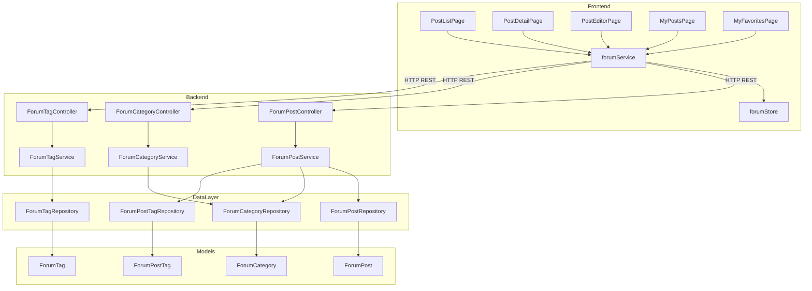

# 论坛社区

## 模块概述

论坛社区是 CodingHub 平台的核心互动模块，为用户提供一个围绕工具使用、技术分享、经验交流等话题的讨论空间。模块支持以下核心能力：

- **帖子发布与管理**：用户可创建、编辑、删除帖子，支持 Markdown 富文本内容
- **分类浏览**：帖子按 [ForumCategory](../../../backend/src/main/java/com/iaihub/toolbox/model/forum/ForumCategory.java) 分类组织，用户可按分类筛选浏览
- **标签筛选**：帖子支持多标签关联（多对多），通过标签实现精细化内容检索
- **热门排行**：基于加权评分算法（浏览、点赞、评论）自动计算帖子热度，支持 Hot Top5 排行
- **可见性控制**：帖子支持 PUBLIC / PRIVATE 两种可见性，私有帖子仅作者和管理员可见
- **置顶管理**：管理员可对帖子进行置顶/取消置顶操作
- **互动功能**：集成统一互动模块，支持点赞、评论、收藏等操作

## 架构总览



## 核心组件

### 后端组件

| 组件 | 路径 | 职责 |
|------|------|------|
| [ForumPostController](../../../backend/src/main/java/com/iaihub/toolbox/controller/forum/ForumPostController.java) | `controller/forum/ForumPostController.java` | 帖子 CRUD、置顶、热门排行 API |
| [ForumCategoryController](../../../backend/src/main/java/com/iaihub/toolbox/controller/forum/ForumCategoryController.java) | `controller/forum/ForumCategoryController.java` | 分类列表查询 |
| [ForumTagController](../../../backend/src/main/java/com/iaihub/toolbox/controller/forum/ForumTagController.java) | `controller/forum/ForumTagController.java` | 标签查询、热门标签、创建标签 |
| [ForumPostService](../../../backend/src/main/java/com/iaihub/toolbox/service/forum/ForumPostService.java) | `service/forum/ForumPostService.java` | 帖子核心业务逻辑（排序、权限、评分） |
| [ForumCategoryService](../../../backend/src/main/java/com/iaihub/toolbox/service/forum/ForumCategoryService.java) | `service/forum/ForumCategoryService.java` | 分类数据查询 |
| [ForumTagService](../../../backend/src/main/java/com/iaihub/toolbox/service/forum/ForumTagService.java) | `service/forum/ForumTagService.java` | 标签管理与热门标签 |
| [ForumPostRepository](../../../backend/src/main/java/com/iaihub/toolbox/repository/forum/ForumPostRepository.java) | `repository/forum/ForumPostRepository.java` | 帖子数据访问（含自定义排序查询） |

### 前端组件

| 组件 | 路径 | 职责 |
|------|------|------|
| PostListPage | `pages/forum/PostListPage.vue` | 帖子列表、分类筛选、搜索、排序、分页 |
| PostDetailPage | `pages/forum/PostDetailPage.vue` | 帖子详情、评论、点赞 |
| PostEditorPage | `pages/forum/PostEditorPage.vue` | 帖子创建/编辑表单 |
| MyPostsPage | `pages/forum/MyPostsPage.vue` | 我的帖子管理 |
| MyFavoritesPage | `pages/forum/MyFavoritesPage.vue` | 我的收藏 |
| forumService | `services/forum.ts` | API 请求封装（axios 实例 + Token 拦截器） |
| forumStore | `stores/forum.ts` | Pinia 状态管理（帖子列表、分页、分类、标签） |

## 数据模型

### [ForumPost](../../../backend/src/main/java/com/iaihub/toolbox/model/forum/ForumPost.java)（帖子）

| 字段 | 类型 | 说明 |
|------|------|------|
| id | Long | 主键，自增 |
| title | String(200) | 帖子标题，必填 |
| content | TEXT | 帖子内容，必填 |
| authorId | Long | 作者 ID，关联 [User](../../../backend/src/main/java/com/iaihub/toolbox/model/User.java) |
| categoryId | Long | 所属分类 ID，关联 [ForumCategory](../../../backend/src/main/java/com/iaihub/toolbox/model/forum/ForumCategory.java) |
| viewCount | Integer | 浏览次数，默认 0 |
| likeCount | Integer | 点赞次数，默认 0 |
| commentCount | Integer | 评论次数，默认 0 |
| status | [ForumPostStatus](../../../backend/src/main/java/com/iaihub/toolbox/model/forum/ForumPostStatus.java) | 状态枚举：NORMAL / DELETED / HIDDEN |
| visibility | [ForumPostVisibility](../../../backend/src/main/java/com/iaihub/toolbox/model/forum/ForumPostVisibility.java) | 可见性枚举：PUBLIC / PRIVATE |
| score | BigDecimal(10,2) | 热度评分，由算法自动计算 |
| pinned | Boolean | 是否置顶，默认 false |
| createdAt | LocalDateTime | 创建时间 |
| updatedAt | LocalDateTime | 更新时间 |

索引：`idx_forum_post_author`、`idx_forum_post_category`、`idx_forum_post_created`

### [ForumCategory](../../../backend/src/main/java/com/iaihub/toolbox/model/forum/ForumCategory.java)（分类）

| 字段 | 类型 | 说明 |
|------|------|------|
| id | Long | 主键，自增 |
| name | String(50) | 分类名称，唯一 |
| description | String(255) | 分类描述 |
| sortOrder | Integer | 排序权重，默认 0 |
| createdAt | LocalDateTime | 创建时间 |

### [ForumTag](../../../backend/src/main/java/com/iaihub/toolbox/model/forum/ForumTag.java)（标签）

| 字段 | 类型 | 说明 |
|------|------|------|
| id | Long | 主键，自增 |
| name | String(50) | 标签名称，唯一 |
| postCount | Integer | 关联帖子数，默认 0 |
| isSystem | Boolean | 是否系统标签，默认 false |
| createdAt | LocalDateTime | 创建时间 |

### [ForumPostTag](../../../backend/src/main/java/com/iaihub/toolbox/model/forum/ForumPostTag.java)（帖子-标签关联）

复合主键（postId + tagId），实现帖子与标签的多对多关系。

### 枚举类型

- **[ForumPostStatus](../../../backend/src/main/java/com/iaihub/toolbox/model/forum/ForumPostStatus.java)**：`NORMAL`（正常）、`DELETED`（已删除，软删除）、`HIDDEN`（隐藏）
- **[ForumPostVisibility](../../../backend/src/main/java/com/iaihub/toolbox/model/forum/ForumPostVisibility.java)**：`PUBLIC`（公开）、`PRIVATE`（私有，仅作者和管理员可见）

## 热门排行算法

帖子热度通过加权评分公式自动计算：

```
score = viewCount * 1 + likeCount * 3 + commentCount * 5
```

**权重设计思路**：
- 浏览（权重 1）：最基础的互动行为，门槛最低
- 点赞（权重 3）：表示用户认可，价值高于浏览
- 评论（权重 5）：深度互动，价值最高

**触发时机**：每次查看帖子详情时（`getPostById`），浏览数 +1 后调用 `updateScore()` 重新计算评分。

**排序规则**：热门排序时，置顶帖优先（`pinned DESC`），其次按评分降序（`score DESC`）。

**Hot Top5**：通过 `findTop5ByStatusOrderByScoreDesc` 查询公开且状态正常的帖子中评分最高的 5 篇，前端以火焰图标标记。

## API 端点

### 帖子管理

| 方法 | 路径 | 说明 | 权限 |
|------|------|------|------|
| GET | `/api/forum/posts` | 帖子列表（支持分类/关键词/排序/分页） | 公开 |
| GET | `/api/forum/posts/my` | 我的帖子 | 登录用户 |
| GET | `/api/forum/posts/{id}` | 帖子详情（自动增加浏览数） | 公开（私有帖需权限） |
| POST | `/api/forum/posts` | 创建帖子 | 登录用户 |
| PUT | `/api/forum/posts/{id}` | 编辑帖子 | 作者/管理员 |
| DELETE | `/api/forum/posts/{id}` | 删除帖子（软删除） | 作者/管理员 |
| POST | `/api/forum/posts/{id}/pin` | 置顶帖子 | ADMIN/SUPER_ADMIN |
| DELETE | `/api/forum/posts/{id}/pin` | 取消置顶 | ADMIN/SUPER_ADMIN |
| GET | `/api/forum/posts/hot-top5` | 热门 Top5 帖子 ID 列表 | 公开 |

### 分类与标签

| 方法 | 路径 | 说明 | 权限 |
|------|------|------|------|
| GET | `/api/forum/categories` | 获取所有分类（按 sortOrder 排序） | 公开 |
| GET | `/api/forum/tags` | 获取所有标签 | 公开 |
| GET | `/api/forum/tags/hot` | 热门标签 Top10（按 postCount 降序） | 公开 |
| POST | `/api/forum/tags` | 创建标签 | 登录用户 |

### 互动（评论与点赞）

| 方法 | 路径 | 说明 | 权限 |
|------|------|------|------|
| GET | `/api/forum/posts/{postId}/comments` | 获取帖子评论 | 公开 |
| POST | `/api/forum/posts/{postId}/comments` | 发表评论 | 登录用户 |
| DELETE | `/api/forum/comments/{commentId}` | 删除评论 | 作者/管理员 |
| POST | `/api/forum/likes` | 点赞（帖子/评论） | 登录用户 |
| DELETE | `/api/forum/likes` | 取消点赞 | 登录用户 |

### 查询参数说明

`GET /api/forum/posts` 支持以下查询参数：

| 参数 | 类型 | 默认值 | 说明 |
|------|------|--------|------|
| category | Long | - | 按分类 ID 筛选 |
| tag | Long | - | 按标签 ID 筛选 |
| keyword | String | - | 按标题关键词搜索 |
| sortBy | String | `hot` | 排序方式：`hot`（热门）/ `latest`（最新） |
| page | int | 0 | 页码（从 0 开始） |
| size | int | 10 | 每页条数 |

## 前端状态管理

forumStore（Pinia）管理以下状态：

- `posts`：当前帖子列表
- `currentPost`：当前查看的帖子详情
- `categories`：分类列表
- `tags`：标签列表
- `pagination`：分页信息（page, size, totalElements, totalPages）
- `loading`：加载状态

前端 API 层使用独立的 axios 实例，通过请求拦截器自动注入 JWT Token（从 authStore 获取）。

## 权限控制

| 操作 | 权限要求 |
|------|----------|
| 浏览公开帖子 | 无需登录 |
| 查看私有帖子 | 作者本人 / ADMIN / SUPER_ADMIN |
| 创建帖子 | 登录用户 |
| 编辑/删除帖子 | 作者本人 / ADMIN / SUPER_ADMIN |
| 置顶/取消置顶 | ADMIN / SUPER_ADMIN（@PreAuthorize） |
| 创建标签 | 登录用户 |

## 交叉引用

- [工具广场](工具广场.md)：论坛社区与工具广场共享用户体系和标签系统，用户可在论坛中讨论工具使用经验
- [统一互动](统一互动.md)：帖子的点赞、评论、收藏功能复用统一互动模块（[UnifiedLike](../../../backend/src/main/java/com/iaihub/toolbox/model/UnifiedLike.java)、[UnifiedComment](../../../backend/src/main/java/com/iaihub/toolbox/model/UnifiedComment.java)、[UnifiedFavorite](../../../backend/src/main/java/com/iaihub/toolbox/model/UnifiedFavorite.java)）
- [用户与认证](用户与认证.md)：论坛依赖用户认证体系（JWT Token），帖子权限控制基于用户角色（[Role](../../../backend/src/main/java/com/iaihub/toolbox/model/Role.java)）判定


<!-- crosslinks (auto-generated) -->
## Related Modules
- Depends on: [MCP服务](mcp服务.md), [工具广场](工具广场.md), [用户与认证](用户与认证.md)
- Used by: [MCP服务](mcp服务.md), [工具广场](工具广场.md), [统一互动](统一互动.md)
