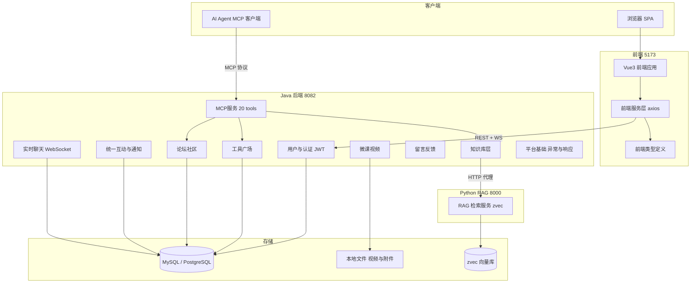
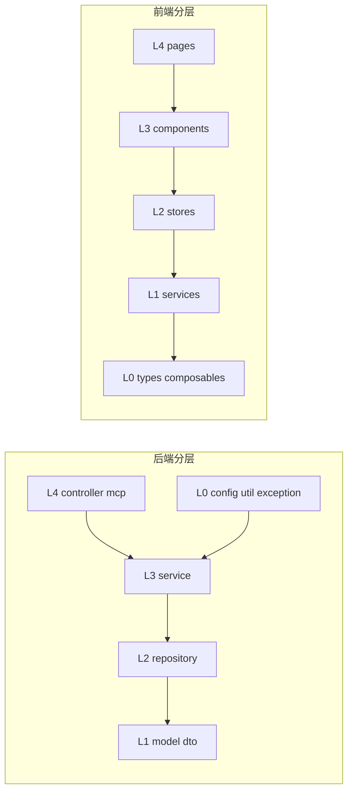

# CodingHub 仓库总览

## 项目简介

CodingHub（ai-tool-square）是一个面向 AI 工具生态的全栈社区平台：用户可以发布/检索 AI 工具（Skill、MCP、插件、Prompt），在论坛交流、观看微课视频、构建 RAG 知识库、实时聊天，并通过 MCP 协议让 AI Agent 直接接入平台能力。

| 维度 | 技术栈 |
|------|--------|
| 后端 | Java 17 / Spring Boot 3.2.5 / Gradle 8.5，端口 8082 |
| 前端 | Vue 3.4 / TypeScript 5.4 / Vite 5.2 / Pinia / Element Plus，端口 5173 |
| RAG 服务 | Python（zvec 向量库 + Qwen3-Embedding），端口 8000 |
| 数据库 | MySQL 8.x / PostgreSQL 双库共存（Profile 切换，默认 MySQL），库名 `ai_tool_square` |
| AI 集成 | MCP Java SDK 2.0.0（Streamable HTTP `/mcp` + SSE `/sse`，20 tools） |
| 部署 | 本地裸机，无 Docker/CI；`make run` 一键启动 |

## 系统架构



## 模块导航（13 个）

### 后端基础层

| 模块 | 职责 |
|------|------|
| [平台基础](modules/平台基础.md) | 应用入口、全局异常处理、ApiResponse/PageResponse、XSS 防护、概览统计 |
| [用户与认证](modules/用户与认证.md) | JWT 双令牌认证、USER/ADMIN/SUPER_ADMIN 角色、审批流、SecurityConfig 全站安全策略 |

### 后端内容域

| 模块 | 职责 |
|------|------|
| [工具广场](modules/工具广场.md) | AI 工具发布/检索/分类/附件分发，热度分排序，核心领域 |
| [论坛社区](modules/论坛社区.md) | 帖子/分类/标签/可见性控制（注意：API 前缀 `/api/forum` 不含 /v1） |
| [微课视频](modules/微课视频.md) | 视频上传、HTTP Range 流式播放、弹幕 |
| [知识库与RAG](modules/知识库与RAG.md) | 知识库元数据管理 + Java→Python 代理的语义搜索（唯一跨语言模块） |
| [留言反馈](modules/留言反馈.md) | 留言板与管理员回复（最简领域样例） |

### 后端横向能力

| 模块 | 职责 |
|------|------|
| [统一互动与通知](modules/统一互动与通知.md) | TOOL/FORUM_POST/VIDEO 多态点赞/评论/收藏 + 站内通知 + 统一标签（**新互动功能必须复用，禁止另建表**） |
| [实时聊天](modules/实时聊天.md) | STOMP over WebSocket 聊天室，登录/游客双模式，表情回应与撤回 |
| [MCP服务](modules/MCP服务.md) | 平台能力以 MCP 协议暴露给 AI Agent（20 工具/3 资源/6 Prompt） |

### 前端

| 模块 | 职责 |
|------|------|
| [前端类型定义](modules/前端类型定义.md) | L0：与后端 DTO 对齐的 TypeScript 接口 |
| [前端服务层](modules/前端服务层.md) | L1：axios 实例（401 自动刷新重放）+ 领域 API 封装 |
| [前端应用](modules/前端应用.md) | L2-L4：Pinia stores、composables、28 页面、36+ 组件、双主题设计系统 |

## 分层与依赖规则



- 单向依赖，禁止循环（`scripts/lint-arch.sh` 检查）
- 方法禁止返回 null（抛异常或 Optional）
- 软删除约定：`status=DELETED`（Tool / ForumPost / Video / KnowledgeBase / ChatMessage / FeedbackMessage）
- 内容操作鉴权：`isOwner || isAdmin`
- 用户输入落库前必经 `XssSanitizer`

## 关键横切设计

1. **多态互动**: 三大内容域共用 `unified_like` / `unified_comment` / `unified_favorite` 三表 + `TargetType` 枚举，通过 `validateTargetExists` 应用层守卫替代外键
2. **计数冗余 + 热度分**: 各内容实体直存五维计数与预计算 score，列表排序零 JOIN，互动服务同事务回写
3. **双身份体系**: 聊天/点赞/评论/留言均支持匿名参与（IP SHA-256 哈希标识），登录与游客共用同一套代码路径
4. **JWT 无状态 + 前端自动刷新**: access 15min / refresh 7 天，前端拦截器并发去重刷新与请求重放
5. **MCP 凭据即会话**: MCP 写工具每次调用独立 username/password 校验，无 token 管理

## API 入口速查

| 前缀 | 模块 | 前缀 | 模块 |
|------|------|------|------|
| `/api/v1/auth` `/users` `/admin` | 用户与认证 | `/api/forum/...` | 论坛社区（无 /v1） |
| `/api/v1/tools` `/categories` | 工具广场 | `/api/v1/videos` | 微课视频 |
| `/api/v1/interactions` `/notifications` `/tags` | 统一互动与通知 | `/api/v1/knowledge` | 知识库与RAG |
| `/api/v1/chat` + WS `/ws` | 实时聊天 | `/api/v1/feedback` | 留言反馈 |
| `/mcp` `/sse` | MCP服务 | `/api/overview` | 平台基础 |

## 快速命令

```bash
make db          # 创建 MySQL 数据库并初始化（PostgreSQL: make db-pg + db-pg-seed）
make install     # 安装前端依赖
make run         # 同时启动后端(8082)+前端(5173)
make stop        # 停止所有服务
make lint        # lint-arch + lint-quality + lint-deps
cd rag && python3 server.py --port 8000   # 启动 RAG 服务（知识库功能依赖）
```
