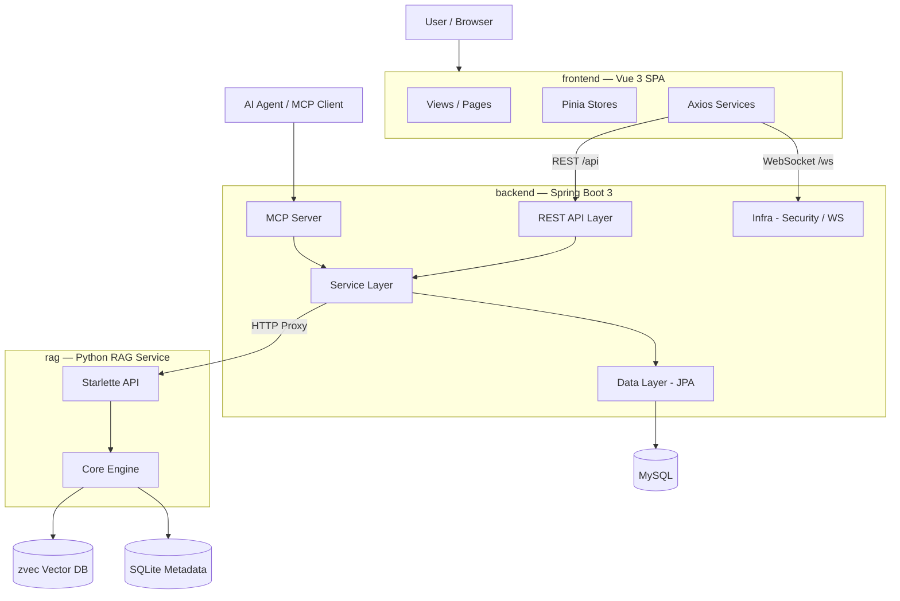

# CodingHub — 仓库级架构总览

## 项目简介

CodingHub（又名 AI [Tool](../../backend/src/main/java/com/iaihub/toolbox/model/Tool.java) Square）是一个 **AI 工具分享与社区平台**，为开发者提供 AI 工具的发现、分享、讨论与知识沉淀能力。平台包含四大核心功能域：

- **工具市场**：AI 工具的上传、浏览、搜索、分类、标签、文件管理
- **社区互动**：论坛帖子、评论、点赞、收藏、视频分享与弹幕
- **知识库**：基于 RAG 的语义搜索，支持文档摄入与智能检索
- **AI 聊天**：WebSocket 实时聊天，支持表情回应、编辑/撤回、在线状态

## 端到端架构图

## 跨服务调用摘要

| 调用方 | 被调用方 | 协议 | 说明 |
|--------|----------|------|------|
| frontend | backend | REST (HTTP) | 10 个业务域 API 调用（工具、用户、论坛、视频、知识库、聊天、互动、通知、反馈、管理） |
| frontend | backend | WebSocket (STOMP) | 实时聊天、在线状态、输入指示 |
| backend | rag | REST (HTTP) | 知识库搜索、文档管理代理（[RagApiClient](../../backend/src/main/java/com/iaihub/toolbox/service/RagApiClient.java)） |
| AI Agent | backend | MCP (Streamable HTTP / SSE) | 20 个 MCP 工具调用（工具管理、论坛、知识库） |

## 服务目录

| 服务 | 目录 | 技术栈 | 职责 | 文档 |
|------|------|--------|------|------|
| frontend | `frontend/` | Vue 3 + TS + Pinia + Vite | Web 前端 SPA | [frontend.md](frontend.md) |
| backend | `backend/` | Java 17 + Spring Boot 3 + JPA | 核心后端服务 | [backend.md](backend.md) |
| rag | `rag/` | Python + Starlette + zvec | RAG 知识库服务 | [rag.md](rag.md) |

### 后端子模块明细

| 子模块 | 职责 | 文档 |
|--------|------|------|
| backend-api | REST API 入口，23 Controller / 96 路由 | [backend-api.md](backend-api.md) |
| backend-service | 业务逻辑，21 文件 / 207 组件 | [backend-service.md](backend-service.md) |
| backend-data | 数据持久化，33 Entity / 10 业务域 | [backend-data.md](backend-data.md) |
| backend-mcp | MCP 协议服务端，20 Tools / 3 Resources | [backend-mcp.md](backend-mcp.md) |
| backend-infra | 安全 / WebSocket / 异常处理 | [backend-infra.md](backend-infra.md) |

### 前端子模块明细

| 子模块 | 职责 | 文档 |
|--------|------|------|
| frontend-services | API 通信层，86 组件 | [frontend-services.md](frontend-services.md) |
| frontend-types | TypeScript 类型系统，67 组件 | [frontend-types.md](frontend-types.md) |
| frontend-stores | Pinia 状态管理，4 Stores | [frontend-stores.md](frontend-stores.md) |

### RAG 子模块明细

| 子模块 | 职责 | 文档 |
|--------|------|------|
| rag-core | 核心引擎：摄入 / 向量化 / 检索 / 重排序 | [rag-core.md](rag-core.md) |
| rag-api | HTTP 接口：文档 CRUD / 语义搜索 | [rag-api.md](rag-api.md) |

## 技术栈总览

| 层次 | 技术 |
|------|------|
| 前端框架 | Vue 3 (Composition API) + TypeScript |
| 状态管理 | Pinia |
| 构建工具 | Vite |
| 后端框架 | Spring Boot 3.x (Java 17) |
| ORM | Spring Data JPA (Hibernate) |
| 主数据库 | MySQL |
| 认证授权 | Spring Security + JWT |
| 实时通信 | WebSocket (STOMP) |
| AI 协议 | MCP SDK 2.0.0 |
| RAG 服务 | Python + Starlette + uvicorn |
| 向量数据库 | zvec（嵌入式） |
| Embedding | Qwen3-Embedding-0.6B (1024d) |
| Reranker | bge-reranker-v2-m3 |
| 元数据存储 | SQLite (WAL) |

## 部署架构概要

平台由三个独立服务组成：

1. **frontend**：静态 SPA，由 Nginx 或 Vite Dev Server 托管
2. **backend**：Spring Boot 单体应用，监听 HTTP + WebSocket
3. **rag**：Python uvicorn 进程，独立端口运行

服务间通过 HTTP REST 通信，无消息队列依赖，适合单机或小规模集群部署。

## 相关文档

- [backend.md](backend.md) — 后端服务总览
- [frontend.md](frontend.md) — 前端服务总览
- [rag.md](rag.md) — RAG 知识库服务总览
