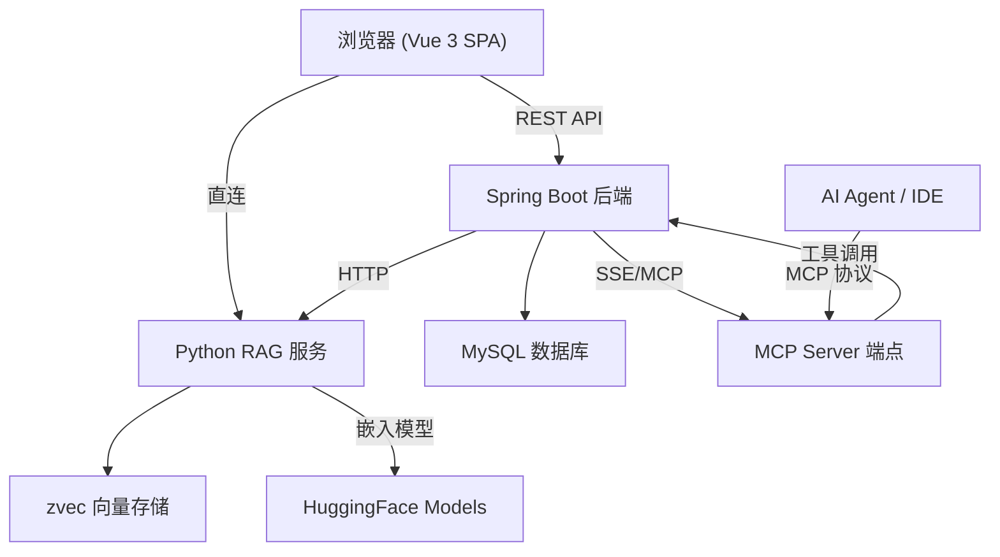
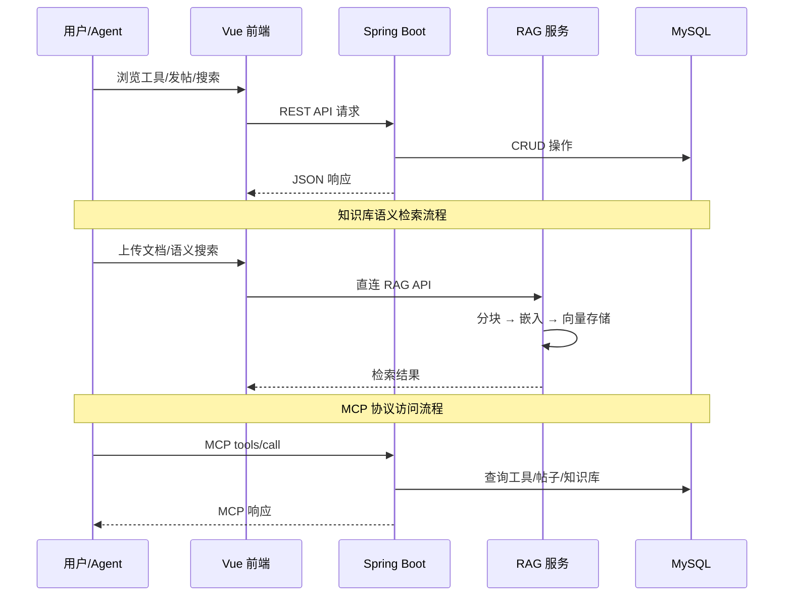
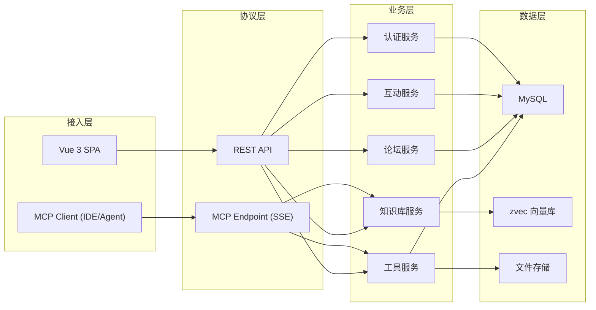

# CodingHub 项目总览

## 项目简介

CodingHub 是一个面向开发者的 AI 工具分享与协作平台。用户可以在工具广场发布和发现 AI 工具（MCP Server、Skill、Prompt 等），通过论坛社区交流使用经验，借助知识库进行语义检索，并通过标准 MCP 协议让 AI Agent 直接访问平台资源。

项目采用前后端分离的 Monorepo 架构：Java Spring Boot 提供核心业务 API，Python FastAPI 提供 RAG 语义检索服务，Vue 3 + TypeScript 构建单页前端应用。

## 端到端架构

## 核心数据流

## 模块结构

| 模块 | 技术栈 | 职责 |
|------|--------|------|
| [工具广场](modules/工具广场.md) | Java | 工具 CRUD、分类标签、视频教学、热度排行、后台管理 |
| [用户与认证](modules/用户与认证.md) | Java + Vue | JWT 认证、角色权限、用户资料、注册审批 |
| [统一互动](modules/统一互动.md) | Java + Vue | 跨内容类型的评论、点赞、收藏、通知 |
| [论坛社区](modules/论坛社区.md) | Java + Vue | 帖子发布、分类浏览、标签筛选、热门排行 |
| [知识库与RAG](modules/知识库与RAG.md) | Java + Python | 知识库管理、文档分块、向量嵌入、语义检索 |
| [MCP服务](modules/MCP服务.md) | Java | MCP 协议端点、20 个 AI 工具、搜索与推荐 |
| [前端应用](modules/前端应用.md) | Vue 3 + TS | SPA 路由、状态管理、API 服务层、页面组件 |

## 架构分层

## 关键架构决策

1. **统一互动模型**：评论、点赞、收藏通过 `TargetType` 枚举（TOOL/POST/VIDEO）实现跨内容类型复用，避免每种内容单独建表。热度公式统一为 `view×1 + like×3 + comment×5`。

2. **MCP 协议原生集成**：后端直接暴露 MCP Server 端点（SSE 传输），AI Agent 无需中间层即可搜索工具、访问知识库、发布帖子，共 20 个 MCP tools。

3. **RAG 服务独立部署**：Python RAG 服务与 Java 后端解耦，前端可直连 RAG API（文档上传/搜索），Java 后端通过 [RagApiClient](../../backend/src/main/java/com/iaihub/toolbox/service/RagApiClient.java) 做服务端调用。支持 CPU-only 部署。

4. **前后端分离 + Monorepo**：frontend/、backend/、rag/ 三个子项目共存于一个仓库，通过 Nginx 反向代理统一入口（/api → Java, /rag → Python）。

5. **软删除与审批机制**：工具删除为软删除（status=DELETED），新用户注册需管理员审批（[AccountStatus](../../backend/src/main/java/com/iaihub/toolbox/model/AccountStatus.java): PENDING → APPROVED）。

## 技术栈

- 后端：Java 17 + Spring Boot 3.x + Spring Security + Spring Data JPA
- 前端：Vue 3 + TypeScript + Pinia + Vue Router + Axios
- RAG：Python 3.13 + FastMCP + zvec + Qwen3-Embedding + Cross-Encoder Reranker
- 数据库：MySQL 8.0
- 协议：MCP (Model Context Protocol) over SSE
- 部署：Nginx 反向代理 + 本地文件存储
