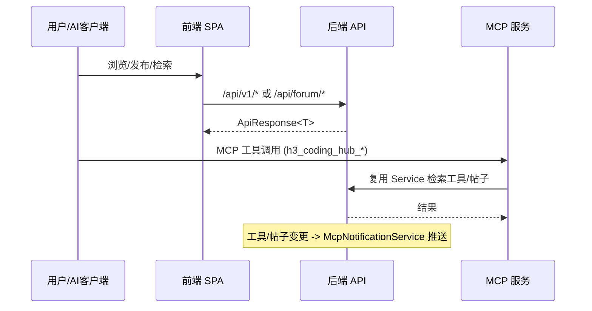

# CodingHub 仓库总览

CodingHub（ai-tool-square）是一个 AI 工具导航/社区的全栈应用：后端 Java 17 / Spring Boot 3.2.5，前端 Vue 3.4 / TypeScript / Vite，数据库 MySQL 8 与 PostgreSQL 双库共存（Profile 切换）。后端端口 8082、前端 5173。本仓库 LLM Wiki 由 [CodeWiki](https://github.com/mambo-wang/CodeWiki-CN) 生成，模块文档见 `repowiki/wiki/modules/`。

## 技术栈与分层

```mermaid
graph TD
    subgraph 前端 SPA
        FE[Vue3 + TS + Vite :5173]
        SRV[services/ 调 API]
        PG[pages/ 渲染]
    end
    subgraph 后端 Spring Boot :8082
        CTRL[Controller /api/v1/* + /api/forum/*]
        SVC[Service 业务]
        REPO[Repository JPA]
        MDL[Model 实体]
        MCP[MCP 服务 /mcp]
        RAG[知识库服务 -> Python RAG]
    end
    subgraph 存储
        MYSQL[(MySQL 8 :3306)]
        PGDB[(PostgreSQL :5432)]
        VEC[(向量库 Chroma/FAISSI)]
    end
    FE -->|HTTP/WS| CTRL
    CTRL --> SVC --> REPO --> MDL
    MDL --> MYSQL
    MDL --> PGDB
    MCP -.工具调用.-> SVC
    RAG -.HTTP.-> VEC
```

后端采用标准四层 `Controller → Service → Repository → Model`，依赖严格单向（详见 [平台基础](modules/平台基础.md) 的约束规则）；前端采用 `types(L0) → services(L1) → stores(L2) → components(L3) → pages(L4)` 单向分层（见 [前端类型定义](modules/前端类型定义.md)、[前端服务层](modules/前端服务层.md)）。约定：**禁止循环依赖、方法不返回 null（抛异常或 Optional）、禁止在循环中查库/调接口**（见项目 `AGENTS.md`）。

## 模块地图

| 模块 | 领域 | 文档 |
|------|------|------|
| 工具广场 | 工具 CRUD / 分类 / 附件 / 热度 | [工具广场](modules/工具广场.md) |
| 论坛社区 | 帖子 / 评论 / 标签 / 置顶 | [论坛社区](modules/论坛社区.md) |
| 微课视频 | 视频上传 / 流式播放 / 弹幕 | [微课视频](modules/微课视频.md) |
| 知识库与RAG | 知识库元数据 + 向量语义检索 | [知识库与RAG](modules/知识库与RAG.md) |
| 留言反馈 | 匿名留言 / 管理员回复 | [留言反馈](modules/留言反馈.md) |
| 实时聊天 | WebSocket/STOMP 即时通讯 | [实时聊天](modules/实时聊天.md) |
| 统一互动与通知 | 点赞/评论/收藏/通知/标签底座 | [统一互动与通知](modules/统一互动与通知.md) |
| 用户与认证 | 注册/登录/JWT/角色权限 | [用户与认证](modules/用户与认证.md) |
| MCP服务 | 嵌入式 MCP（5 工具 + 推送） | [MCP服务](modules/MCP服务.md) |
| 平台基础 | ApiResponse/异常/XSS/概览/上传配置 | [平台基础](modules/平台基础.md) |
| 前端类型定义 | L0 TS 接口/DTO | [前端类型定义](modules/前端类型定义.md) |
| 前端服务层 | L1–L4 服务/状态/组件/页面 | [前端服务层](modules/前端服务层.md) |
| 前端应用 | SPA 总装 + 设计系统 | [前端应用](modules/前端应用.md) |

> 接口路径注意：论坛相关接口为 `/api/forum/...`（**不含 /v1**），其余模块为 `/api/v1/...`（见 [论坛社区](modules/论坛社区.md)）。

## 跨切面约束（全局适用）

- **认证与权限**：JWT 双令牌（Access 15min / Refresh 7d）；写操作统一 `isOwner || isAdmin` 守卫；角色 `USER/ADMIN/SUPER_ADMIN`。详情见 [用户与认证](modules/用户与认证.md)。
- **热度分公式**：五因子加权 `score = view×1 + (download×2) + like×3 + favorite×4 + comment×5`，计数变更即同步重算。工具见 [工具广场](modules/工具广场.md)，论坛见 [论坛社区](modules/论坛社区.md)，视频见 [微课视频](modules/微课视频.md)。
- **软删除**：工具/论坛帖/视频/留言均 `status = DELETED`，不物理删行；删除前清理关联资源（附件、文件）。见各业务模块。
- **XSS 防护**：所有用户输入落库前经 `XssSanitizer.sanitize()`（留言、评论、聊天、昵称等）。见 [平台基础](modules/平台基础.md)。
- **统一互动**：点赞/评论/收藏通过 `TargetType`（TOOL/FORUM_POST/VIDEO）走 [统一互动与通知](modules/统一互动与通知.md)，避免各资源各写一套。
- **双库共存**：业务代码零改动，Profile（`mysql` 默认 / `postgresql`）切换方言；实体反引号与 `@Lob`/`text` 等按 PG 引号规则处理。见项目 `AGENTS.md`。

## 关键工作流

## 文档约定

- 每个叶模块文档含：Component Constraint Index、Architecture Overview（Mermaid）、Component Responsibilities（含 Business Constraints + Evidence）、数据流（Mermaid）、Cross-References、约束与边界。
- 模块间用 wikilink 式交叉引用（例如「模块名」指向 modules/模块名.md），节点 ID 仅字母数字、标签用方括号。
- 完整架构、实体关系、API 设计与安全机制见 `docs/ARCHITECTURE.md`；环境搭建见 `docs/DEVELOPMENT.md`；设计系统见 `design-system/`。
