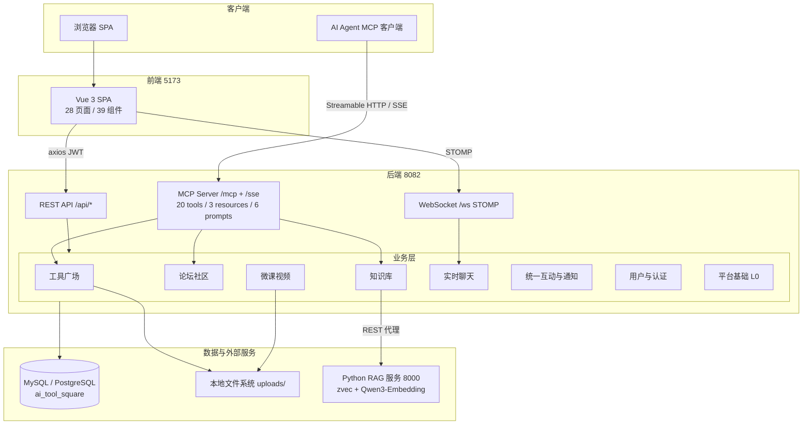
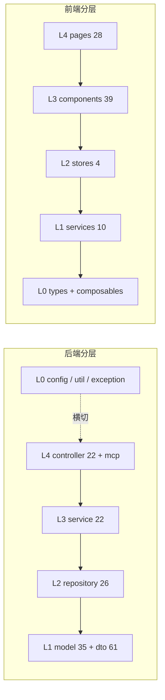
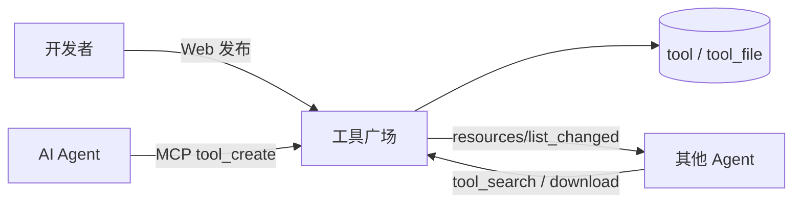

# CodingHub 仓库总览

## 项目定位

CodingHub（ai-tool-square）是面向团队的 **AI 工具广场平台**：开发者可以发布/检索/下载 AI 工具（Agent 技能、MCP 服务器、提示词包），围绕工具展开论坛讨论、微课教学、知识库沉淀与实时聊天。平台同时以 **MCP 协议**将全部能力暴露给 AI Agent（CodeBuddy、Claude Code 等），实现「人用 Web、Agent 用 MCP」的双入口形态。

**技术栈**：Java 17 / Spring Boot 3.2.5 + Gradle 8.5 · Vue 3.4 / TypeScript 5.4 / Vite 5.2 · MySQL 8.x / PostgreSQL 双库（Profile 切换，默认 MySQL）· Python RAG 服务（zvec + Qwen3-Embedding）

**端口**：后端 8082 · 前端 5173 · RAG 8000 · MySQL 3306 / PostgreSQL 5432

## 端到端架构



## 分层设计



严格单向依赖：`controller → service → repository → model`，禁止循环依赖与循环内查库（`scripts/lint-arch.sh` 校验）。

## 核心模块

| 模块 | 职责 | 文档 |
|------|------|------|
| 工具广场 | 工具发布/检索/版本/文件分发 + 统一标签系统，平台核心领域 | [工具广场](modules/工具广场.md) |
| 用户与认证 | JWT 双令牌、注册审批流、三级角色 RBAC、个人中心、管理后台 | [用户与认证](modules/用户与认证.md) |
| 统一互动与通知 | 跨模块点赞/评论/收藏（TargetType 多态）+ 通知中心 + 留言反馈 | [统一互动与通知](modules/统一互动与通知.md) |
| 论坛社区 | 帖子/分类/标签，置顶与热度榜，可见性控制 | [论坛社区](modules/论坛社区.md) |
| 微课视频 | 视频上传、HTTP Range 流式播放、弹幕系统 | [微课视频](modules/微课视频.md) |
| 知识库与RAG | 知识库管理 + Python 语义检索服务（zvec 向量库） | [知识库与RAG](modules/知识库与RAG.md) |
| 实时聊天 | STOMP over WebSocket 全局聊天室：回应/编辑/撤回/在线数 | [实时聊天](modules/实时聊天.md) |
| MCP服务 | 20 个 MCP 工具 + Prompt + Resource，Streamable HTTP/SSE 双传输 | [MCP服务](modules/MCP服务.md) |
| 平台基础 | 全局异常/统一响应/双数据库配置/种子初始化/概览统计 | [平台基础](modules/平台基础.md) |
| 前端应用 | Vue 3 SPA，双主题设计系统，统一互动组件三件套 | [前端应用](modules/前端应用.md) |

## 关键数据流

### 1. 工具发布与 Agent 消费



### 2. 统一互动

所有内容类型（工具/帖子/视频）的点赞、评论、收藏走同一组 `/api/v1/interactions` 接口，后端按 `TargetType` 路由到各自的表并回写冗余计数，互动事件触发站内通知 —— **一套实现、三域复用，禁止重复造轮子**。

### 3. RAG 检索

知识库文档上传 → Java 代理转发 Python 服务 → 分块/嵌入/入 zvec → MCP `kb_search` 或 Web 语义搜索 → 向量检索（可选 reranker 重排）→ 返回带分片段。

## 关键架构决策

1. **双数据库共存**：Hibernate 6 方言自动探测 + Spring Profile 切换 MySQL/PostgreSQL，业务代码零改动；`user` 保留字用 PG 段的 `globally_quoted_identifiers` 解决
2. **MCP 与 REST 同源**：MCP 工具直接复用 Service 层，无独立业务逻辑，保证 Web 与 Agent 行为一致
3. **统一互动抽象**：`TargetType` 枚举多态是平台最重要的复用设计，新内容类型接入互动零成本
4. **软删除全覆盖**：Tool / ForumPost / Video / ChatMessage / Feedback 均为状态标记删除
5. **本地裸机部署**：无 Docker/CI，文件存本地 `uploads/`，聊天用内存 SimpleBroker，符合内网小团队形态

## 快速命令

```bash
make db          # 初始化 MySQL 数据库
make install     # 安装前端依赖
make run         # 同时启动后端(8082)+前端(5173)
make lint        # 架构/质量/依赖检查
```

## 安全机制

- JWT：access 15min + refresh 7 天，`Authorization: Bearer`
- 权限：USER / ADMIN / SUPER_ADMIN；内容操作 `isOwner || isAdmin`
- XSS：所有用户输入经 `XssSanitizer.sanitize()`
- 注册审批制：新用户需管理员审批后才能登录
