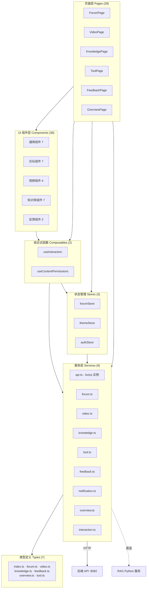

## 前端概述

CodingHub 前端基于 **Vue 3.4 / TypeScript 5.4 / Vite 5.2** 构建，采用组件化开发模式，为平台提供工具展示、论坛交流、微课视频、知识库管理、留言反馈及概览统计等完整功能。前端通过 Axios 与后端 Java API（端口 8082）通信，并支持直连 RAG Python 服务实现知识库语义检索。设计系统采用双主题方案——Cyberpunk Dark 与 Glassmorphism Light，由 Pinia 状态管理驱动主题切换。

---

### 架构总览

---

### 前端分层说明

| 层级 | 目录 | 文件数 | 职责 |
|------|------|--------|------|
| L0 | `types/` + `composables/` | 9 | 类型契约与可复用逻辑（无内部依赖） |
| L1 | `services/` | 9 | 封装 HTTP 请求，统一 API 通信 |
| L2 | `stores/` | 3 | Pinia 状态管理（论坛、主题、认证） |
| L3 | `components/` | 36 | UI 组件（通用 + 论坛 + 视频 + 知识库 + 反馈） |
| L4 | `pages/` | 28 | 页面路由入口，组装下层模块 |

### 子模块文档

| 子模块 | 说明 |
|--------|------|
| [服务与状态](前端_服务与状态.md) | 服务层（9 个 API 服务）、状态管理（3 个 Pinia Store）、组合式函数（2 个）、类型定义（7 个）及 Vite 构建配置的详细设计 |
