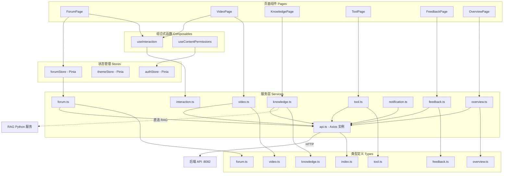
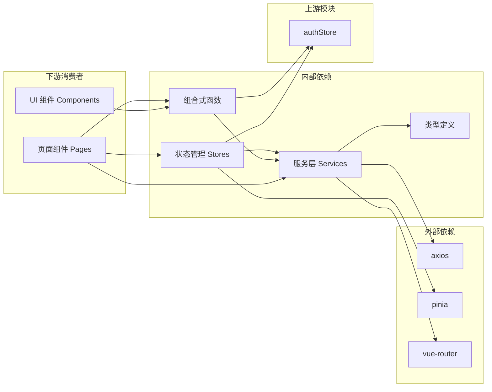

## 前端/服务与状态

本模块是 CodingHub 前端应用的核心数据层，涵盖了所有与后端 API 通信的**服务层（Services）**、基于 Pinia 的**状态管理（Stores）**、可复用的**组合式函数（Composables）**、全局**类型定义（Types）**以及**构建配置（Vite Config）**。它负责封装 HTTP 请求、管理应用状态、定义数据契约，并为页面组件和 UI 层提供统一的数据访问接口。

---

### 架构总览



---

### 核心组件职责

#### 1. 服务层（Services）

服务层是前端与后端通信的桥梁，每个服务文件对应一个业务领域，封装了具体的 HTTP 请求细节。

##### `api.ts` — Axios 全局实例与 JWT 令牌刷新

这是整个服务层的基础，提供全局 Axios 实例配置和 JWT 认证机制：

- **令牌自动刷新**：当收到 401 响应时，自动尝试刷新 JWT Token，并重新发送失败的请求
- **订阅刷新机制**：通过 `subscribeTokenRefresh()` 和 `onTokenRefreshed()` 实现多请求并发时的令牌刷新队列，避免重复刷新
- **登录重定向**：`redirectToLogin()` 在认证失败时调用 `authStore.logout()` 并跳转到登录页，同时携带 `redirect` 参数以支持登录后回跳

##### `forum.ts` — 论坛服务

封装论坛相关的全部 API 调用，使用独立的 `forumApi` 实例（基础路径 `/api/forum`）：

| 方法 | HTTP | 端点 | 说明 |
|------|------|------|------|
| `getPostList()` | GET | `/posts` | 分页获取帖子列表，支持分类/标签/关键词/排序筛选 |
| `getPostById()` | GET | `/posts/{id}` | 获取帖子详情 |
| `createPost()` | POST | `/posts` | 创建帖子 |
| `updatePost()` | PUT | `/posts/{id}` | 更新帖子 |
| `deletePost()` | DELETE | `/posts/{id}` | 删除帖子 |
| `getMyPosts()` | GET | `/posts/my` | 获取当前用户的帖子 |
| `pinPost()` / `unpinPost()` | POST/DELETE | `/posts/{id}/pin` | 置顶/取消置顶 |
| `getHotTop5()` | GET | `/posts/hot-top5` | 获取热门帖子 Top5 ID 列表 |
| `getComments()` | GET | `/posts/{id}/comments` | 获取帖子评论 |
| `createComment()` | POST | `/posts/{id}/comments` | 创建评论 |
| `deleteComment()` | DELETE | `/comments/{id}` | 删除评论 |
| `like()` / `unlike()` | POST/DELETE | `/likes` | 点赞/取消点赞 |
| `getCategories()` | GET | `/categories` | 获取论坛分类列表 |
| `getTags()` / `getHotTags()` | GET | `/tags`、`/tags/hot` | 获取标签列表/热门标签 |
| `createTag()` | POST | `/tags` | 创建标签 |

##### `video.ts` — 微课视频服务

封装视频上传、播放和管理相关 API：

| 方法 | HTTP | 端点 | 说明 |
|------|------|------|------|
| `getVideoList()` | GET | `/videos` | 分页获取视频列表，支持排序 |
| `getVideoDetail()` | GET | `/videos/{id}` | 获取视频详情 |
| `uploadVideo()` | POST | `/videos` | 上传视频（multipart/form-data，超时 10 分钟） |
| `uploadCover()` | POST | `/videos/{id}/cover` | 上传视频封面 |
| `updateVideo()` | PUT | `/videos/{id}` | 更新视频信息 |
| `deleteVideo()` | DELETE | `/videos/{id}` | 删除视频 |
| `getMyVideos()` | GET | `/videos/my` | 获取当前用户的视频 |
| `getStreamUrl()` | — | — | 拼接视频流播放地址 |
| `pinVideo()` / `unpinVideo()` | POST/DELETE | `/videos/{id}/pin` | 置顶/取消置顶 |
| `getHotTop5()` | GET | `/videos/hot-top5` | 获取热门视频 Top5 ID 列表 |

##### `knowledge.ts` — 知识库服务

知识库服务较为特殊，它同时与**后端 Java API** 和 **RAG Python 服务**通信：

- **通过后端 API**（`api` 实例）：知识库的 CRUD 操作（`create`、`update`、`delete`、`getList`、`getDetail`、`search`）
- **直连 RAG 服务**（`axios` 直接调用）：文档上传（`uploadDocument`、`batchUpload`）、文档管理（`getDocuments`、`deleteDocument`）、配置管理（`getConfig`、`updateConfig`）、文档状态查询（`getDocumentStatus`、`getSingleDocumentStatus`）

RAG 服务的请求地址来自知识库实体中的 `ragBaseUrl` 和 `documentsUrl` 字段，实现了前端与 RAG Python 服务的直接通信。

##### `tool.ts` — 工具服务

提供 AI 工具相关 API：

- `getTool()` / `getToolDetail()`：获取工具详情，返回 `ToolDetailVO`
- `getHotTop5()`：获取热门工具 Top5 ID 列表
- `pinTool()` / `unpinTool()`：置顶/取消置顶

##### `feedback.ts` — 留言反馈服务

- `getFeedbacks()`：分页获取留言列表，支持分类筛选
- `createFeedback()`：创建留言
- `replyFeedback()`：管理员回复留言
- `deleteFeedback()`：删除留言

##### `notification.ts` — 通知服务

- `getNotifications()`：分页获取通知列表
- `getUnreadCount()`：获取未读通知数量
- `markAsRead()`：标记单条通知为已读
- `markAllAsRead()`：标记全部通知为已读

##### `overview.ts` — 概览统计服务

- `fetchStats()`：获取全站统计数据（用户数、帖子数、工具数、视频数）
- `fetchToolRanks()`：获取工具排行榜
- `fetchPostRanks()`：获取帖子排行榜
- `fetchVideoRanks()`：获取视频排行榜

##### `interaction.ts` — 统一互动服务

定义了统一互动系统的接口类型，支持三种目标类型的点赞、收藏和评论：

- **目标类型**（`TargetType`）：`'TOOL' | 'FORUM_POST' | 'VIDEO'`
- **请求结构**（`InteractionRequest`）：包含 `targetType`、`targetId`、`content`、`parentId`、`userName`

---

#### 2. 状态管理（Stores）

##### `forumStore` — 论坛状态管理

基于 Pinia 的论坛状态仓库，管理帖子、分类、标签等核心状态：

| State | 类型 | 说明 |
|-------|------|------|
| `posts` | `ForumPost[]` | 当前帖子列表 |
| `currentPost` | `ForumPost \| null` | 当前查看的帖子详情 |
| `categories` | `ForumCategory[]` | 论坛分类列表 |
| `tags` | `ForumTag[]` | 标签列表 |
| `pagination` | `{ page, size, totalElements, totalPages }` | 分页信息 |
| `loading` | `boolean` | 加载状态 |

核心 Actions：

- `fetchPosts(params?)`：获取帖子列表并更新分页状态
- `fetchPostById(id)`：获取帖子详情
- `fetchMyPosts()`：获取当前用户帖子
- `fetchCategories()`：获取分类列表
- `fetchTags()`：获取标签列表
- `deletePost(id)`：删除帖子并本地移除，返回 `{ success, errorCode? }`
- `_mapErrorToCode(error)`：将 HTTP 错误映射为业务错误码（`AUTH`、`FORBIDDEN`、`NOT_FOUND`、`UNKNOWN`）

##### `themeStore` — 主题状态管理

管理应用的双主题切换：

- **Theme 类型**：`'dark' | 'light'`
- 对应 Cyberpunk Dark 和 Glassmorphism Light 两套设计系统

---

#### 3. 组合式函数（Composables）

##### `useInteraction` — 统一互动逻辑

为工具、帖子、视频三种内容类型提供统一的点赞、收藏、评论交互逻辑：

```typescript
useInteraction(targetType: TargetType, targetId: number)
```

**返回的响应式状态与方法**：

| 分组 | 状态/方法 | 说明 |
|------|----------|------|
| 点赞 | `liked`, `likeCount`, `likeLoading` | 点赞状态响应式数据 |
| | `loadLikeStatus()`, `toggleLike()` | 加载/切换点赞 |
| 收藏 | `favorited`, `favoriteLoading` | 收藏状态响应式数据 |
| | `loadFavoriteStatus()`, `toggleFavorite()` | 加载/切换收藏 |
| 评论 | `comments`, `commentsTotalElements`, `commentsTotalPages`, `commentsPage`, `commentsLoading`, `commentSubmitting` | 评论列表与分页状态 |
| | `loadComments(page, size)`, `addComment(content, parentId?, userName?)`, `deleteComment(commentId)` | 评论 CRUD |

该组合式函数通过闭包封装了防重复提交（`likeLoading`/`favoriteLoading`）和自动刷新列表等通用逻辑。

##### `useContentPermissions` — 内容权限判断

根据当前登录用户和内容所有者判断编辑/删除权限：

```typescript
useContentPermissions(ownerId: () => number | undefined | null)
```

返回 `canEdit` 和 `canDelete`（两者等价），判断规则：
- 未登录 → 无权限
- 当前用户 ID === 内容所有者 ID → 有权限
- 当前用户为管理员（`authStore.isAdmin`）→ 有权限

---

#### 4. 类型定义（Types）

##### `types/index.ts` — 全局基础类型

| 类型 | 说明 |
|------|------|
| `ApiResponse<T>` | 统一 API 响应封装：`{ code, message, data }` |
| `User` | 用户实体：id, username, nickname, avatarUrl, role, status 等 |
| `LoginRequest` | 登录请求：`{ username, password }` |
| `RegisterRequest` | 注册请求：`{ username, nickname, password, role? }` |
| `AdminUser` | 管理后台用户视图 |
| `PendingUser` / `ApprovalResponse` | 用户审批相关类型 |
| `Category` | 工具分类：`{ id, name, icon, sortOrder }` |
| `Tag` | 统一标签类型 |
| `ToolSummary` | 工具列表摘要视图（含 score、pinned、tags 等） |
| `ToolDetail` | 工具详情（含上传者信息、标签等） |
| `ToolFile` | 工具附件：originalName, storedPath, fileSize, contentType |
| `FileUploadResponse` | 文件上传响应：toolId, files, readmeSaved |
| `CreateToolRequest` / `UpdateToolRequest` | 工具创建/更新请求 |
| `PageResponse<T>` | 通用分页响应：content, totalElements, totalPages, page, size |

##### `types/forum.ts` — 论坛类型

| 类型 | 说明 |
|------|------|
| `ForumPost` | 论坛帖子：标题、内容、作者信息、分类、统计量（浏览/点赞/评论）、标签、置顶/可见性、收藏状态 |
| `ForumPostCreateRequest` | 创建帖子请求：title, content, categoryId, tagIds?, visibility? |
| `ForumComment` | 评论：支持嵌套（parentId, rootId），含点赞数 |
| `ForumCommentCreateRequest` | 创建评论请求：content, parentId?, authorName? |
| `ForumCategory` | 分类：name, description, sortOrder, postCount |
| `ForumTag` | 标签：name, postCount, isSystem |
| `ForumLikeRequest` | 点赞请求：postId? 或 commentId? |
| `PageResponse<T>` | 论坛分页响应（与全局略有不同，使用 `number` 而非 `page`） |

##### `types/video.ts` — 微课视频类型

| 类型 | 说明 |
|------|------|
| `VideoDetail` | 视频详情：含 duration, fileSize, 弹幕开关（danmakuEnabled）、用户互动状态（userLiked, userFavorited） |
| `VideoListItem` | 视频列表项：精简版，含 score, pinned |
| `VideoComment` | 视频评论 |
| `VideoUploadRequest` | 上传请求元数据：title, description?, tagIds? |
| `VideoUpdateRequest` | 更新请求：title, description?, tagIds?, danmakuEnabled? |
| `VideoPageResponse` | 视频分页响应 |
| `VideoInteractionResponse` | 互动状态响应：liked, favorited, likeCount, commentCount |

##### `types/knowledge.ts` — 知识库类型

| 类型 | 说明 |
|------|------|
| `KnowledgeBase` | 知识库实体：name, description, ownerId, ragCollection, ragBaseUrl, documentsUrl |
| `KbCreateRequest` | 创建请求：支持配置分块模式（chunkMode/chunkSize/chunkOverlap）和重排序（rerank） |
| `KbUpdateRequest` | 更新请求：name?, description? |
| `KbConfig` / `KbConfigRequest` | RAG 配置：chunk_mode, chunk_size, chunk_overlap, rerank |
| `KbSearchRequest` | 搜索请求：query, topK?, rerank?, expandContext? |
| `KbSearchResult` | 搜索结果：text, source, score, chunkIndex |
| `KbPageResponse` | 知识库分页响应 |
| `RagDocument` | RAG 文档：source, chunk_count |
| `RagDocumentStatus` | 文档处理状态：含完整处理流水线信息 |
| `DocumentStatus` | 文档状态枚举：`UPLOADING → CONVERTING → CHUNKING → EMBEDDING → READY \| FAILED` |

##### `types/feedback.ts` — 留言反馈类型

| 类型 | 说明 |
|------|------|
| `FeedbackMessage` | 留言消息：content, nickname, contact, category, adminReply, repliedAt |
| `FeedbackCreateRequest` | 创建留言：content, nickname?, contact?, category? |
| `FeedbackReplyRequest` | 管理员回复：adminReply |
| `FeedbackPageResponse` | 留言分页响应 |
| `FeedbackCategory` | 留言分类枚举：`SUGGESTION \| BUG_REPORT \| PRAISE \| OTHER` |

##### `types/overview.ts` — 概览统计类型

| 类型 | 说明 |
|------|------|
| `StatsDto` | 全站统计：userCount, postCount, toolCount, videoCount |
| `ToolRankDto` | 工具排行：id, category, toolName, score |
| `PostRankDto` | 帖子排行：id, category, postTitle, score |
| `VideoRankDto` | 视频排行：id, videoTitle, viewCount, likeCount |

##### `types/tool.ts` — 工具专用类型

| 类型 | 说明 |
|------|------|
| `ToolDetailDTO` | 工具详情 DTO：基础字段 + 统计量 |
| `ToolSummary` | 工具列表摘要：id, name, categoryName, score, pinned 等 |

---

#### 5. 构建配置

##### `vite.config.ts` — Vite 开发服务器配置

```
端口: 5173，监听 0.0.0.0
```

**API 代理规则**：

| 前端路径 | 代理目标 | 说明 |
|----------|----------|------|
| `/api/v1/*` | 后端 `localhost:8082` | 核心业务 API |
| `/api/forum/*` | 后端 `localhost:8082` | 论坛 API |
| `/api/overview/*` | 后端 `localhost:8082` | 概览统计 API |
| `/rag/*` | RAG Python 服务 | 知识库 RAG 服务（路径重写去除 `/rag` 前缀） |

##### `vite-env.d.ts` — 环境变量类型声明

声明了 `VITE_API_BASE_URL` 环境变量，用于配置 API 基础地址。

---

### 依赖关系



**关键外部依赖**：

| 依赖 | 用途 |
|------|------|
| `axios` | HTTP 客户端，服务层的核心通信工具 |
| `pinia` | Vue 3 状态管理库，Stores 的基础框架 |
| `vue-router` | 路由管理，`api.ts` 中用于登录重定向 |
| `authStore` | 认证状态仓库，被 `useContentPermissions` 和 `api.ts` 引用 |

---

### 重要设计模式

1. **统一响应封装**：后端返回 `{ code, message, data }` 格式，服务层负责解包 `data` 字段
2. **双 API 实例**：`api`（通用实例，基础路径 `/api/v1`）和 `forumApi`（论坛实例，基础路径 `/api/forum`），分离不同业务域
3. **RAG 直连模式**：知识库服务中，前端通过 `axios` 直接请求 RAG Python 服务，绕过 Java 后端，通过 Vite 代理解决跨域
4. **乐观更新与防抖**：`useInteraction` 通过 `loading` 标志防止重复提交
5. **权限即计算属性**：`useContentPermissions` 使用 `computed()` 实现响应式权限判断
6. **文档处理流水线**：RAG 文档状态枚举体现了完整的文档处理生命周期（上传 → 转换 → 分块 → 向量化 → 就绪/失败）
