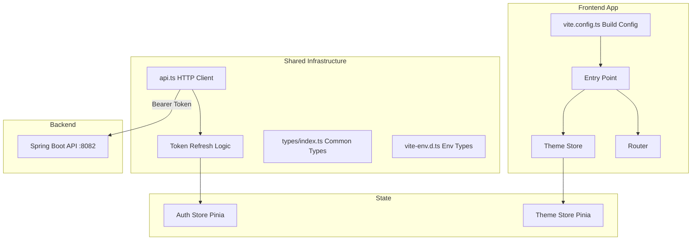
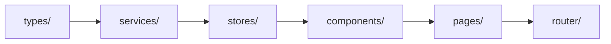

# 前端基础模块

## 模块概述

前端基础模块包含 CodingHub 前端应用的共享基础设施，包括 API 客户端配置、认证令牌管理、主题系统、通用类型定义和构建配置。基于 Vue 3.4 + TypeScript 5.4 + Vite 5.2 构建，提供双主题（Cyberpunk Dark / Glassmorphism Light）支持。

## 架构图

## 核心组件

### api.ts — HTTP 客户端

Axios 实例配置，核心功能：

- `redirectToLogin()` — 令牌过期时跳转登录页
- `subscribeTokenRefresh()` / `onTokenRefreshed()` — 令牌刷新订阅模式，多个并发请求共享同一次刷新结果
- 自动添加 `Authorization: Bearer <token>` 请求头

### types/index.ts — 通用类型定义

前端全局 TypeScript 类型：

- `User` / `LoginRequest` / `RegisterRequest` — 用户相关
- `PageResponse<T>` / `ApiResponse<T>` — 通用响应包装
- `ToolSummary` / `ToolDetail` / `Category` — 工具市场类型
- `PendingUser` / `AdminUser` / `ApprovalResponse` — 管理类型
- `Tag` — 统一标签类型

### vite-env.d.ts — 环境变量类型

Vite 环境变量 TypeScript 声明：

- `ImportMetaEnv` — 自定义环境变量接口
- `ImportMeta` — 扩展 ImportMeta

### vite.config.ts — 构建配置

Vite 构建配置，包括代理设置（开发环境代理 `/api` 到后端 8082 端口）。

### theme.ts — 主题状态管理

Pinia Store 管理应用主题：

- 支持 Cyberpunk Dark 和 Glassmorphism Light 双主题
- 主题状态持久化

### 设计系统

CodingHub 遵循 `design-system/` 中定义的双主题规范：

- **Cyberpunk Dark** — 暗色主题，霸天虎风格
- **Glassmorphism Light** — 亮色主题，玻璃拟态风格

## 前端项目结构

## 设计要点

- **令牌刷新订阅模式**：多个并发 401 请求共享同一次令牌刷新，避免重复刷新
- **双主题系统**：通过 Pinia Store 管理，支持主题切换
- **类型安全**：TypeScript 严格类型定义，覆盖所有 API 响应
- **代理配置**：开发环境通过 Vite 代理转发 API 请求，避免跨域

## 交叉引用

- [认证与用户](认证与用户.md) — 后端认证 API
- [工具市场](工具市场.md) — 工具类型定义
- [论坛社区](论坛社区.md) — 论坛类型定义