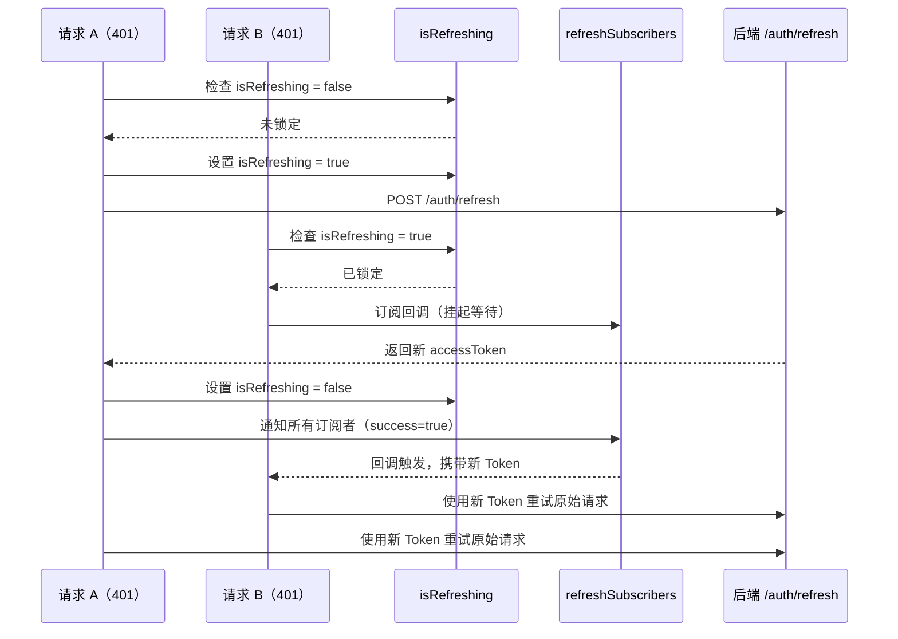
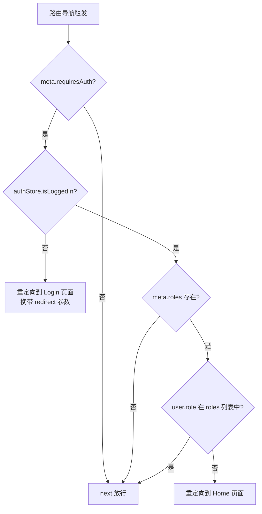
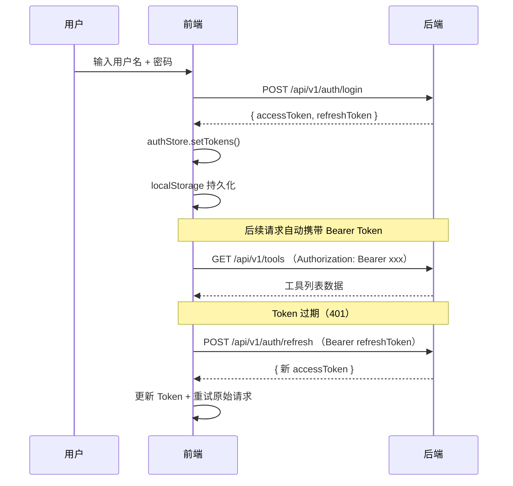

# 前端应用

## 1. 模块概述

前端应用是 CodingHub 平台的客户端层，基于 **Vue 3 + TypeScript + Vite** 构建，采用 **Pinia** 进行状态管理、**Vue Router** 处理路由导航。前端通过 axios 封装的 API 客户端与后端 Spring Boot 服务（端口 8082）通信，实现了完整的 JWT 认证流程、并发 Token 刷新锁机制、基于角色的权限校验，以及覆盖工具管理、论坛社区、微课视频、数据概览四大业务领域的 API 调用封装。

### 技术栈一览

| 技术 | 版本 | 用途 |
|------|------|------|
| Vue | 3.4 | 响应式 UI 框架 |
| TypeScript | 5.4 | 类型安全 |
| Vite | 5.2 | 开发服务器与构建工具 |
| Pinia | - | 全局状态管理 |
| Vue Router | - | SPA 路由与导航守卫 |
| axios | - | HTTP 客户端 |
| Element Plus | - | UI 组件库 |

### 目录结构

```
frontend/src/
├── services/          # API 调用封装层
│   ├── api.ts         # axios 实例、拦截器、Token 刷新
│   ├── tool.ts        # 工具 CRUD + 点赞 + 评论
│   ├── forum.ts       # 论坛帖子/分类/标签/评论/点赞
│   ├── video.ts       # 微课视频上传/播放/互动
│   ├── interaction.ts # 统一互动 API（点赞/评论/收藏）
│   └── overview.ts    # 数据概览统计与排行
├── stores/            # Pinia 状态管理
│   ├── auth.ts        # 认证状态（Token、用户信息）
│   ├── theme.ts       # 主题切换（dark/light）
│   └── forum.ts       # 论坛数据状态
├── types/             # TypeScript 类型定义
│   ├── index.ts       # 核心类型（User、ApiResponse 等）
│   ├── tool.ts        # 工具相关 DTO
│   ├── forum.ts       # 论坛相关类型
│   ├── video.ts       # 微课视频相关类型
│   └── overview.ts    # 概览统计类型
├── router/
│   └── index.ts       # 路由配置与导航守卫
├── pages/             # 页面组件
├── components/        # 可复用 UI 组件
└── vite-env.d.ts      # Vite 环境变量类型声明
```

---

## 2. API 客户端（`api.ts`）

`api.ts` 是整个前端应用的 HTTP 通信核心，基于 axios 创建了一个全局单例实例，并配置了请求拦截器和响应拦截器来实现自动鉴权和错误处理。

### 2.1 axios 实例配置

```typescript
const API_BASE_URL = import.meta.env.VITE_API_BASE_URL || '/api/v1'

const api: AxiosInstance = axios.create({
  baseURL: API_BASE_URL,
  timeout: 60000,
  headers: {
    'Content-Type': 'application/json'
  }
})
```

- **baseURL**：优先读取环境变量 `VITE_API_BASE_URL`，默认指向 `/api/v1`。
- **timeout**：全局超时 60 秒。
- **Content-Type**：默认 `application/json`，文件上传时单独覆盖为 `multipart/form-data`。

### 2.2 请求拦截器

请求拦截器在每次 HTTP 请求发出前自动从 Pinia 的 `useAuthStore` 中读取 `accessToken`，并将其附加到 `Authorization` 请求头：

```typescript
api.interceptors.request.use(
  (config: InternalAxiosRequestConfig) => {
    const authStore = useAuthStore()
    if (authStore.accessToken) {
      config.headers.Authorization = `Bearer ${authStore.accessToken}`
    }
    return config
  },
  (error) => Promise.reject(error)
)
```

### 2.3 响应拦截器

响应拦截器负责统一处理 HTTP 错误：

| 状态码 | 处理策略 |
|--------|----------|
| **401** | 尝试使用 refresh Token 刷新；刷新失败则登出并重定向到登录页 |
| **403** | 通过 Element Plus 提示「没有权限执行此操作」 |
| **其他** | 显示服务端返回的错误消息或默认提示「请求失败」 |

### 2.4 文件上传与下载

`api.ts` 还导出了 `fileUploadApi` 对象，封装了工具文件的完整生命周期：

- `uploadFiles(toolId, files, readme, onProgress)` — 支持多文件上传与进度回调
- `getToolFiles(toolId)` — 获取工具关联的文件列表
- `deleteFile(toolId, fileId)` — 删除指定文件
- `downloadFile(toolId, fileId, fileName)` — 通过 Blob + 临时 `<a>` 标签触发浏览器下载

### 2.5 帖子收藏 API

`postFavoriteApi` 对象封装了帖子收藏操作：

- `addFavorite(postId)` / `removeFavorite(postId)` — 添加 / 移除收藏
- `getMyFavorites()` — 获取当前用户收藏列表
- `checkFavorite(postId)` — 检查收藏状态
- `toggleFavorite(postId)` — 切换收藏状态（内部先查询再操作）

---

## 3. 并发 Token 刷新锁机制

当多个 API 请求同时收到 401 响应时，如果每个请求都独立发起 refresh 请求，会导致 Token 被多次刷新甚至失效。`api.ts` 通过 **锁标志 + 订阅者队列** 模式优雅地解决了这个问题。

### 3.1 核心状态

```typescript
let isRefreshing = false
let refreshSubscribers: Array<(success: boolean) => void> = []
```

- `isRefreshing` — 标识是否已有 refresh 请求正在进行。
- `refreshSubscribers` — 等待 refresh 结果的请求回调队列。

### 3.2 工作流程



### 3.3 关键函数

| 函数 | 作用 |
|------|------|
| `subscribeTokenRefresh(callback)` | 将回调推入等待队列 |
| `onTokenRefreshed(success)` | 遍历执行队列中的所有回调，然后清空队列 |
| `redirectToLogin()` | 清除认证状态，携带 `redirect` 参数跳转至登录页 |

### 3.4 刷新失败处理

当 refresh Token 本身也已过期或无效时：

1. 捕获 refresh 请求的异常。
2. 将 `isRefreshing` 重置为 `false`。
3. 调用 `onTokenRefreshed(false)` 通知所有等待中的请求刷新失败。
4. 调用 `redirectToLogin()` 登出并跳转。

---

## 4. 认证 Store（`auth.ts`）

认证 Store 使用 Pinia Composition API 风格定义，管理整个应用的认证状态。

### 4.1 状态字段

| 字段 | 类型 | 持久化 | 说明 |
|------|------|--------|------|
| `accessToken` | `string \| null` | localStorage | JWT 访问令牌（15 分钟过期） |
| `refreshToken` | `string \| null` | localStorage | JWT 刷新令牌（7 天过期） |
| `user` | `User \| null` | localStorage | 当前登录用户信息 |

### 4.2 计算属性

| 属性 | 逻辑 |
|------|------|
| `isLoggedIn` | `!!accessToken.value` |
| `isAdmin` | `user.role === 'ADMIN' \|\| user.role === 'SUPER_ADMIN'` |
| `isSuperAdmin` | `user.role === 'SUPER_ADMIN'` |

### 4.3 操作方法

- **`setTokens(access, refresh)`** — 同时更新内存和 localStorage 中的 Token。
- **`setUser(userData)`** — 保存用户信息到响应式状态和 localStorage。
- **`logout()`** — 清除所有认证数据（内存 + localStorage）。
- **`initFromStorage()`** — 应用启动时从 localStorage 恢复状态，用于页面刷新后保持登录。

---

## 5. 主题 Store（`theme.ts`）

主题 Store 管理应用的暗色 / 亮色主题切换。

- **默认主题**：`dark`（暗色）。
- **持久化**：通过 `localStorage.getItem('theme')` 读取，`watch` 监听变化后自动保存。
- **实现方式**：通过 `document.documentElement` 的 `data-theme` 属性控制 CSS 主题变量。
- **API**：`toggleTheme()` 切换主题，`setTheme(newTheme)` 设置指定主题。

---

## 6. 路由守卫（`router/index.ts`）

路由配置使用 `createWebHistory` 模式（HTML5 History API），所有页面组件均通过动态 `import()` 实现懒加载。

### 6.1 路由总览

| 路径 | 名称 | 认证 | 角色 |
|------|------|------|------|
| `/` | Home | 否 | - |
| `/tools/:id` | ToolDetail | 否 | - |
| `/tools/upload` | UploadTool | 是 | - |
| `/me/tools` | MyTools | 是 | - |
| `/me/favorites` | MyToolFavorites | 是 | - |
| `/me/profile` | Profile | 是 | - |
| `/me/tools/:id/edit` | EditTool | 是 | - |
| `/login` | Login | 否 | - |
| `/register` | Register | 否 | - |
| `/forum` | ForumList | 否 | - |
| `/forum/editor` | ForumEditor | 是 | - |
| `/forum/posts/:id` | ForumPostDetail | 否 | - |
| `/forum/posts/:id/edit` | EditPost | 是 | - |
| `/forum/my-posts` | MyPosts | 是 | - |
| `/forum/my-favorites` | MyFavorites | 是 | - |
| `/overview` | Overview | 否 | - |
| `/videos` | VideoList | 否 | - |
| `/videos/upload` | VideoUpload | 是 | - |
| `/videos/:id` | VideoDetail | 否 | - |
| `/videos/:id/edit` | EditVideo | 是 | - |
| `/videos/my-videos` | MyVideos | 是 | - |
| `/videos/my-favorites` | MyVideoFavorites | 是 | - |
| `/admin/approvals` | AdminApprovals | 是 | SUPER_ADMIN |
| `/admin/users` | AdminUsers | 是 | ADMIN, SUPER_ADMIN |
| `/:pathMatch(.*)*` | NotFound | 否 | - |

### 6.2 导航守卫逻辑



守卫分两层校验：

1. **认证校验** — 如果目标路由标记了 `meta.requiresAuth` 且用户未登录，则重定向到登录页并携带 `redirect` 查询参数，登录成功后可跳回原始页面。
2. **角色校验** — 如果目标路由指定了 `meta.roles` 数组，则检查当前用户的 `role` 是否在允许列表中，不匹配则重定向到首页。

---

## 7. 类型系统（`types/`）

TypeScript 类型定义按业务领域拆分为 5 个文件，为整个前端提供统一的类型契约。

### 7.1 核心类型（`types/index.ts`）

| 类型 | 说明 |
|------|------|
| `User` | 用户实体，包含 id、username、nickname、avatarUrl、role、status 等 |
| `Category` | 工具分类（id、name、icon、sortOrder） |
| `ToolSummary` | 工具列表摘要（用于卡片展示） |
| `ToolDetail` | 工具完整详情（含 content、时间戳） |
| `PageResponse<T>` | 通用分页响应（content、totalElements、totalPages、page、size） |
| `ApiResponse<T>` | 通用 API 响应包装（code、message、data） |
| `LoginRequest` | 登录请求体（username、password） |
| `RegisterRequest` | 注册请求体（username、nickname、password、role） |
| `CreateToolRequest` / `UpdateToolRequest` | 工具创建 / 更新请求体 |
| `ToolFile` | 工具文件元数据 |
| `FileUploadResponse` / `FileListResponse` | 文件上传 / 列表响应 |
| `PendingUser` / `AdminUser` | 管理后台用户类型 |
| `ApprovalResponse` | 审批操作响应 |

### 7.2 工具类型（`types/tool.ts`）

- `ToolDetailDTO` — 后端返回的工具详情 DTO，含 viewCount、likeCount 等统计字段。
- `ToolSummary` — 工具列表视图的精简类型。

### 7.3 论坛类型（`types/forum.ts`）

| 类型 | 说明 |
|------|------|
| `ForumPost` | 帖子实体（含 author 信息、统计字段、收藏状态） |
| `ForumPostCreateRequest` | 发帖请求（title、content、categoryId、tagIds） |
| `ForumComment` / `ForumCommentCreateRequest` | 评论与评论请求（支持 parentId 嵌套回复） |
| `ForumCategory` | 论坛分类（含 postCount） |
| `ForumTag` | 论坛标签（含 isSystem 系统标签标识） |
| `ForumLikeRequest` | 点赞请求（postId 或 commentId） |
| `PageResponse<T>` | 论坛专用分页响应 |

### 7.4 视频类型（`types/video.ts`）

| 类型 | 说明 |
|------|------|
| `VideoListItem` | 视频列表项（含 coverUrl、duration、统计字段） |
| `VideoDetail` | 视频详情（含 userLiked、userFavorited 用户互动状态） |
| `VideoComment` | 视频评论 |
| `VideoUploadRequest` / `VideoUpdateRequest` | 视频上传 / 更新请求 |
| `VideoInteractionResponse` | 互动操作响应 |
| `VideoPageResponse` | 视频分页响应 |

### 7.5 概览类型（`types/overview.ts`）

- `StatsDto` — 全站统计（userCount、postCount、toolCount）。
- `ToolRankDto` — 工具排行榜（id、category、toolName、score）。
- `PostRankDto` — 帖子排行榜（id、category、postTitle、score）。

### 7.6 环境变量类型（`vite-env.d.ts`）

声明了 `ImportMetaEnv` 接口，为 `import.meta.env.VITE_API_BASE_URL` 提供类型支持；同时声明了 `.vue` 文件的模块类型，确保 TypeScript 正确识别 Vue 单文件组件。

---

## 8. 服务层（`services/`）

服务层对 API 调用进行了领域划分，每个服务文件封装了对应业务模块的全部 HTTP 操作。

### 8.1 工具服务（`services/tool.ts`）

| 方法 | HTTP | 说明 |
|------|------|------|
| `getToolDetail(id)` | GET `/tools/{id}` | 获取工具详情 |
| `likeTool(id)` | POST `/tools/{id}/like` | 点赞 |
| `unlikeTool(id)` | DELETE `/tools/{id}/like` | 取消点赞 |
| `getLikeStatus(id)` | GET `/tools/{id}/like-status` | 查询点赞状态 |
| `getComments(id)` | GET `/tools/{id}/comments` | 获取评论列表 |
| `addComment(id, content)` | POST `/tools/{id}/comments` | 发表评论 |

### 8.2 论坛服务（`services/forum.ts`）

论坛服务创建了独立的 axios 实例（`forumApi`，baseURL 为 `/api/forum`），单独配置了 Token 注入拦截器。

| 方法 | HTTP | 说明 |
|------|------|------|
| `getPostList(params)` | GET `/posts` | 获取帖子列表（支持分类/标签/关键词/分页） |
| `getMyPosts()` | GET `/posts/my` | 获取我的帖子 |
| `getPostById(id)` | GET `/posts/{id}` | 获取帖子详情 |
| `createPost(data)` | POST `/posts` | 发帖 |
| `updatePost(id, data)` | PUT `/posts/{id}` | 编辑帖子 |
| `deletePost(id)` | DELETE `/posts/{id}` | 删除帖子 |
| `getCategories()` | GET `/categories` | 获取分类列表 |
| `getTags()` / `getHotTags()` | GET `/tags` / `/tags/hot` | 获取标签 |
| `createTag(name, isSystem)` | POST `/tags` | 创建标签 |
| `getComments(postId)` | GET `/posts/{id}/comments` | 获取评论 |
| `createComment(postId, data)` | POST `/posts/{id}/comments` | 发表评论 |
| `deleteComment(commentId)` | DELETE `/comments/{id}` | 删除评论 |
| `like(data)` / `unlike(data)` | POST/DELETE `/likes` | 点赞 / 取消点赞 |

### 8.3 视频服务（`services/video.ts`）

| 方法 | HTTP | 说明 |
|------|------|------|
| `uploadVideo(file, title, desc, onProgress)` | POST `/videos` | 上传视频（支持进度回调，超时 10 分钟） |
| `getVideoList(page, size)` | GET `/videos` | 获取视频列表 |
| `getVideoDetail(id)` | GET `/videos/{id}` | 获取视频详情（自动增加播放量） |
| `getStreamUrl(id)` | — | 拼接视频流地址 `/api/v1/videos/{id}/stream` |
| `updateVideo(id, data)` | PUT `/videos/{id}` | 更新视频信息 |
| `deleteVideo(id)` | DELETE `/videos/{id}` | 删除视频（软删除） |
| `getMyVideos(page, size)` | GET `/videos/my` | 获取我上传的视频 |
| `toggleLike(id)` | POST `/videos/{id}/like` | 切换点赞 |
| `toggleFavorite(id)` | POST `/videos/{id}/favorite` | 切换收藏 |
| `getComments(id, page, size)` | GET `/videos/{id}/comments` | 获取评论 |
| `addComment(id, content)` | POST `/videos/{id}/comments` | 发表评论 |
| `getMyFavorites(page, size)` | GET `/videos/my/favorites` | 获取我收藏的视频 |

### 8.4 统一互动服务（`services/interaction.ts`）

提供了跨领域（TOOL / FORUM_POST / VIDEO）的统一互动 API：

| 方法 | 说明 |
|------|------|
| `toggleLike(targetType, targetId)` | 切换点赞 |
| `getLikeStatus(targetType, targetId)` | 查询点赞状态 |
| `getComments(targetType, targetId, page, size)` | 分页获取评论 |
| `addComment(targetType, targetId, content, parentId, userName)` | 发表评论（支持嵌套回复） |
| `deleteComment(commentId)` | 删除评论 |
| `toggleFavorite(targetType, targetId)` | 切换收藏 |
| `getMyFavorites(targetType, page, size)` | 获取我的收藏 |
| `getFavoriteStatus(targetType, targetId)` | 查询收藏状态 |

### 8.5 概览服务（`services/overview.ts`）

概览服务创建了独立的 axios 实例（baseURL 为 `/api`），用于访问全站统计数据：

- `fetchStats()` — 获取全站统计（用户数、帖子数、工具数）。
- `fetchToolRanks()` — 获取工具排行榜。
- `fetchPostRanks()` — 获取帖子排行榜。

---

## 9. Vite 配置

`vite.config.ts` 配置了开发服务器和代理规则：

| 配置项 | 值 | 说明 |
|--------|-----|------|
| 插件 | `@vitejs/plugin-vue` | Vue 3 SFC 支持 |
| 路径别名 | `@` → `src/` | 简化模块导入路径 |
| 开发服务器 | `0.0.0.0:5173` | 监听所有网络接口 |
| 代理 `/api/v1` | `http://localhost:8082` | 核心 API |
| 代理 `/api/forum` | `http://localhost:8082` | 论坛 API |
| 代理 `/api/overview` | `http://localhost:8082` | 概览 API |

后端端口可通过环境变量 `BACKEND_PORT` 覆盖，默认 8082。

---

## 10. 架构全景图

```mermaid
graph TD
    subgraph 用户浏览器
        VP[Vue 页面组件<br/>pages/]
        VC[可复用 UI 组件<br/>components/]
    end

    subgraph 前端基础设施
        Router[Vue Router<br/>导航守卫 + 角色校验]
        AuthStore[Auth Store<br/>Token + 用户状态]
        ThemeStore[Theme Store<br/>dark/light 主题]
        ForumStore[Forum Store<br/>论坛数据状态]
    end

    subgraph 服务层
        API[api.ts<br/>axios 实例 + 拦截器<br/>+ Token 刷新锁]
        ToolSvc[tool.ts<br/>工具服务]
        ForumSvc[forum.ts<br/>论坛服务]
        VideoSvc[video.ts<br/>视频服务]
        InterSvc[interaction.ts<br/>统一互动服务]
        OverviewSvc[overview.ts<br/>概览服务]
    end

    subgraph 类型系统
        Types[types/<br/>TypeScript 类型定义]
    end

    subgraph 后端 Spring Boot :8082
        AuthAPI[/api/v1/auth]
        ToolAPI[/api/v1/tools]
        ForumAPI[/api/forum]
        VideoAPI[/api/v1/videos]
        OverviewAPI[/api/overview]
    end

    VP --> Router
    VP --> VC
    VP --> AuthStore
    VP --> ThemeStore
    VP --> ForumStore
    VP --> ToolSvc
    VP --> ForumSvc
    VP --> VideoSvc
    VP --> InterSvc
    VP --> OverviewSvc

    Router --> AuthStore
    AuthStore --> API

    ToolSvc --> API
    ForumSvc --> API
    VideoSvc --> API
    InterSvc --> API

    API -->|Bearer Token| AuthAPI
    API --> ToolAPI
    API --> VideoAPI
    ForumSvc -->|独立 axios| ForumAPI
    OverviewSvc -->|独立 axios| OverviewAPI

    Types -.->|类型约束| VP
    Types -.->|类型约束| ToolSvc
    Types -.->|类型约束| ForumSvc
    Types -.->|类型约束| VideoSvc
    Types -.->|类型约束| InterSvc
    Types -.->|类型约束| OverviewSvc
```

---

## 11. 与后端 API 的对接说明

### 11.1 认证流程



### 11.2 API 前缀映射

| 前端服务文件 | 后端 API 前缀 | 后端 Controller |
|-------------|--------------|----------------|
| `api.ts` + `tool.ts` | `/api/v1/tools` | ToolController |
| `api.ts` + `interaction.ts` | `/api/v1/interactions` | InteractionController |
| `api.ts` + `video.ts` | `/api/v1/videos` | VideoController |
| `forum.ts` | `/api/forum/*` | ForumPostController 等 |
| `overview.ts` | `/api/overview` | OverviewController |
| 认证流程 | `/api/v1/auth` | AuthController |
| 文件操作 | `/api/v1/tools/{id}/files` | ToolFileController |
| 帖子收藏 | `/api/v1/post-favorites` | PostFavoriteController |

### 11.3 统一响应格式

后端 API 返回的数据统一封装在 `ApiResponse<T>` 结构中：

```json
{
  "code": 200,
  "message": "success",
  "data": { ... }
}
```

前端服务层在拿到响应后通常通过 `response.data.data` 解包，直接返回业务数据。分页接口返回 `PageResponse<T>`，包含 `content`、`totalElements`、`totalPages`、`page`、`size` 字段。

### 11.4 权限模型

| 角色 | 前端标识 | 可访问功能 |
|------|---------|----------|
| 游客 | 未登录 | 浏览工具列表、帖子、视频、概览 |
| USER | `isLoggedIn = true` | 上传工具/视频、发帖、评论、点赞、收藏、编辑自己的内容 |
| ADMIN | `isAdmin = true` | 管理用户列表 |
| SUPER_ADMIN | `isSuperAdmin = true` | 用户审批 + 用户管理 |
