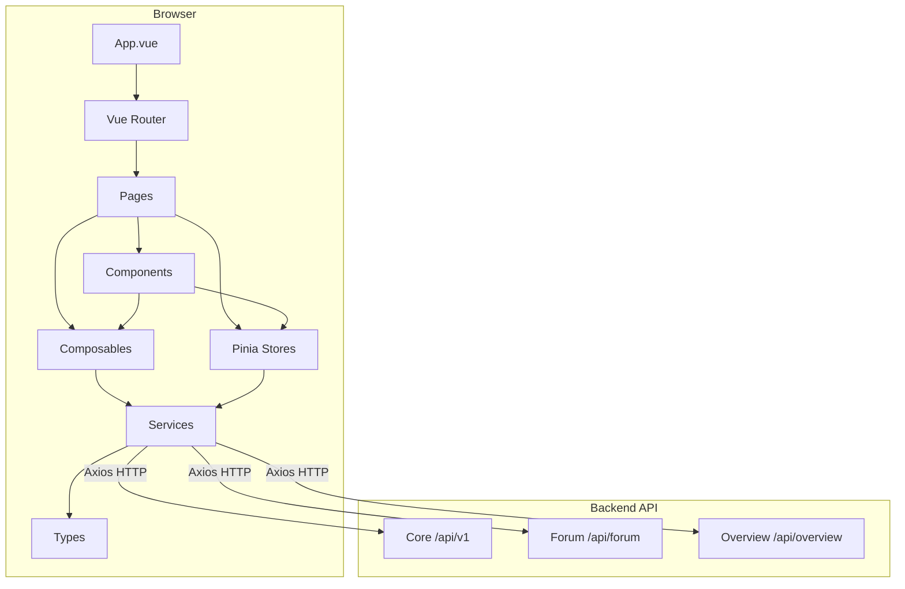
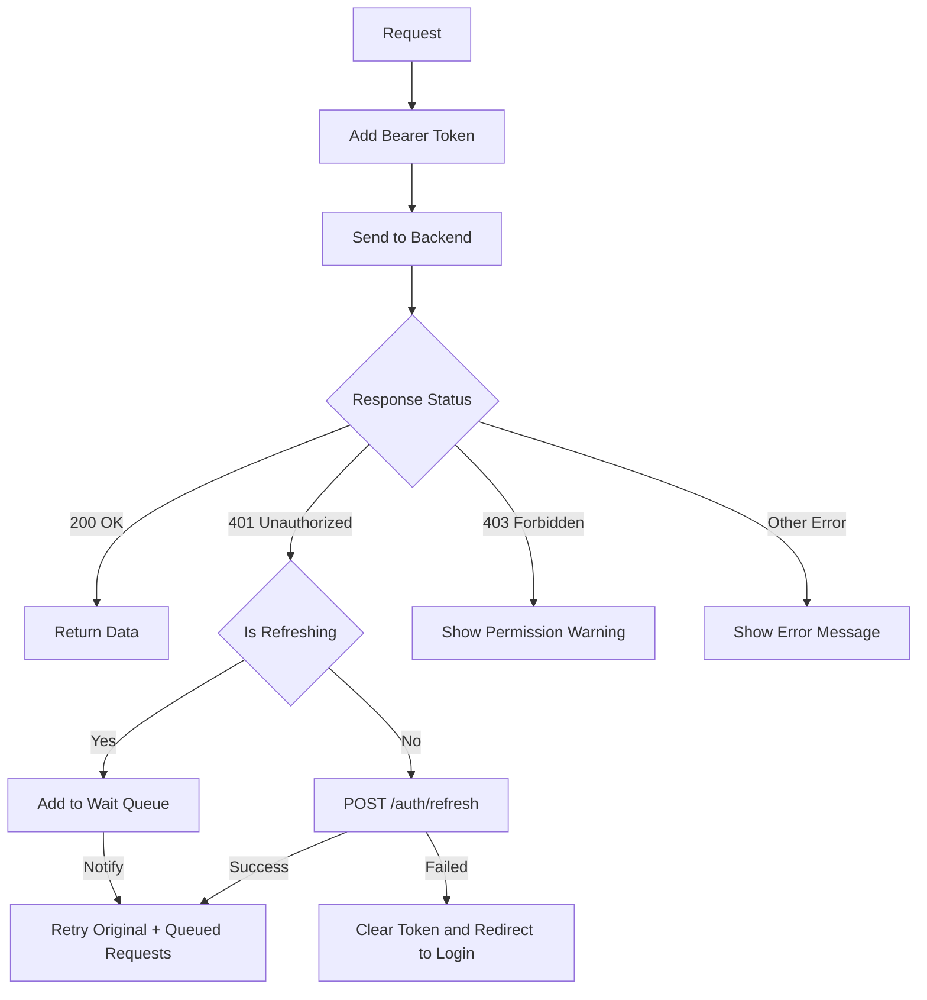
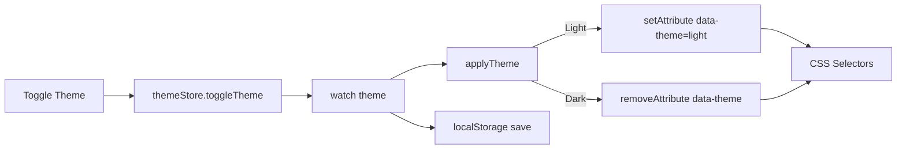
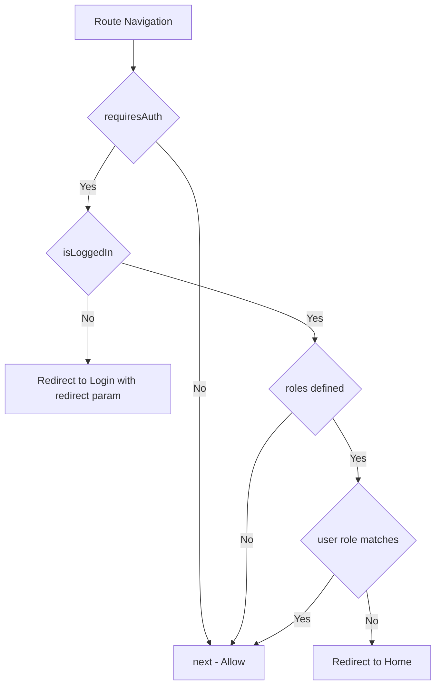
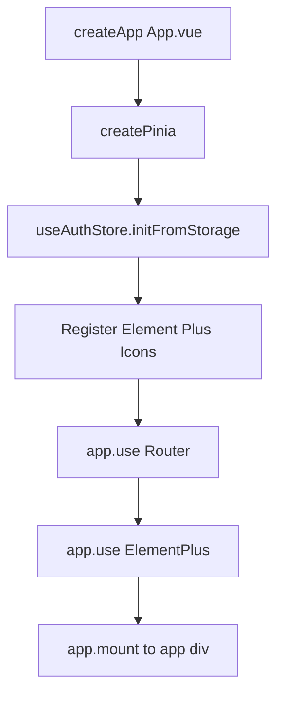

# 前端应用

## 1. 模块简介

前端应用是 CodingHub（ai-tool-square）项目的用户界面层，基于 **Vue 3.4 + TypeScript 5.4 + Vite 5.2 + Pinia** 构建。它提供了一个完整的单页应用（SPA），涵盖 AI 工具展示与发布、技术论坛、微课视频、平台概览、用户管理及后台管理等功能。

### 核心功能

| 功能域 | 说明 |
|--------|------|
| 工具广场 | 工具浏览、详情查看、上传发布、文件管理、点赞评论 |
| 技术论坛 | 帖子 CRUD、分类/标签筛选、嵌套评论、点赞、收藏 |
| 微课视频 | 视频上传（带进度）、流式播放、互动（点赞/收藏/评论） |
| 平台概览 | 统计数据、工具/帖子/视频排行榜 |
| 用户中心 | 登录注册、个人资料、头像、我的发布/收藏 |
| 后台管理 | 用户审批（SUPER_ADMIN）、用户列表管理（ADMIN+） |
| 主题系统 | 暗色/亮色主题切换，持久化至 localStorage |

---

## 2. 架构图

### 2.1 前端整体架构



### 2.2 API 请求与 Token 刷新流程



---

## 3. 技术栈

| 类别 | 技术 | 版本 | 用途 |
|------|------|------|------|
| 框架 | Vue | ^3.4.21 | 响应式 UI 框架（Composition API） |
| 语言 | TypeScript | ^5.4.5 | 静态类型检查 |
| 构建 | Vite | ^5.2.8 | 开发服务器 + 生产构建 |
| 状态管理 | Pinia | ^2.1.7 | 全局状态管理（auth、theme、forum） |
| 路由 | Vue Router | ^4.3.0 | SPA 客户端路由 |
| UI 库 | Element Plus | ^2.7.0 | 组件库（表单、表格、弹窗等） |
| HTTP | Axios | ^1.6.8 | API 请求客户端 |
| Markdown | markdown-it | ^14.1.0 | Markdown 渲染 |
| 代码高亮 | highlight.js | ^11.9.0 | 代码块语法高亮 |
| 图标 | @element-plus/icons-vue | ^2.3.1 | Element Plus 图标集 |
| 图标 | @lucide/vue | ^1.17.0 | Lucide 图标集 |
| 工具 | @vueuse/core | ^10.9.0 | Vue 组合函数工具集 |
| CSS | github-markdown-css | ^5.9.0 | GitHub 风格 Markdown 样式 |

---

## 4. 前端分层架构

前端采用严格的 5 层依赖规则，自下而上依次为：

```
L0  types/ + composables/       类型定义 + 组合函数（无内部依赖）
L1  services/                   API 服务层（仅依赖 L0）
L2  stores/                     Pinia 状态管理（依赖 L0, L1）
L3  components/                 UI 组件（依赖 L0, L1, L2）
L4  pages/                      页面视图（依赖 L3）
```

### 4.1 层级详情

| 层级 | 目录 | 文件 | 说明 |
|------|------|------|------|
| L0 | `types/` | `index.ts`, `tool.ts`, `forum.ts`, `video.ts`, `overview.ts` | 全局 TypeScript 接口定义 |
| L0 | `composables/` | `useContentPermissions.ts`, `useInteraction.ts` | 可复用组合函数 |
| L1 | `services/` | `api.ts`, `tool.ts`, `forum.ts`, `video.ts`, `interaction.ts`, `overview.ts` | 封装 HTTP 请求 |
| L2 | `stores/` | `auth.ts`, `theme.ts`, `forum.ts` | Pinia 全局状态 |
| L3 | `components/` | 21 个 `.vue` 组件（含 `common/`, `forum/`, `video/` 子目录） | 可复用 UI 组件 |
| L4 | `pages/` | 24 个 `.vue` 页面（含 `admin/`, `forum/`, `video/` 子目录） | 路由级页面 |

### 4.2 依赖规则

- **禁止反向依赖**：下层不得导入上层模块
- **L0 无内部依赖**：`types/` 和 `composables/` 不依赖其他内部层
- **services 仅依赖 types**：服务层只引用类型定义
- **stores 依赖 services + types**：状态管理通过服务层获取数据
- **components 可依赖 stores**：组件可读取/写入全局状态
- **pages 作为入口**：页面组件组装子组件并连接 store

---

## 5. API 客户端

### 5.1 Axios 实例配置

文件：`src/services/api.ts`

主 Axios 实例作为核心 API 客户端，配置如下：

| 配置项 | 值 | 说明 |
|--------|-----|------|
| `baseURL` | `import.meta.env.VITE_API_BASE_URL \|\| '/api/v1'` | 环境变量或默认值 |
| `timeout` | 60000ms（普通）/ 600000ms（文件上传） | 请求超时 |
| `Content-Type` | `application/json`（默认）/ `multipart/form-data`（上传） | 内容类型 |

> **注意**：论坛服务 `forum.ts` 和概览服务 `overview.ts` 各自创建了独立的 Axios 实例，分别使用 `/api/forum` 和 `/api` 作为 baseURL，以适配不同的后端路由前缀。

### 5.2 JWT 请求拦截器

每个请求自动从 `authStore` 读取 `accessToken` 并附加到 `Authorization` 头：

```typescript
api.interceptors.request.use((config) => {
  const authStore = useAuthStore()
  if (authStore.accessToken) {
    config.headers.Authorization = `Bearer ${authStore.accessToken}`
  }
  return config
})
```

### 5.3 Token 刷新队列

当收到 **401** 响应时，拦截器启动自动刷新流程：

1. **单请求刷新**：首个 401 请求触发 `POST /auth/refresh`（使用 refreshToken）
2. **队列机制**：后续并发 401 请求通过 `subscribeTokenRefresh()` 加入等待队列
3. **刷新成功**：更新 token，重试原请求，并通过 `onTokenRefreshed(true)` 通知队列中所有请求
4. **刷新失败**：调用 `redirectToLogin()` 清除状态并跳转登录页，携带 `redirect` 参数

关键变量：
- `isRefreshing: boolean` — 标记是否正在刷新，防止并发刷新
- `refreshSubscribers: Array<(success: boolean) => void>` — 等待队列回调列表

### 5.4 错误处理策略

| HTTP 状态码 | 处理方式 |
|------------|----------|
| 401 | Token 刷新 -> 失败则跳转登录页 |
| 403 | `ElMessage.warning('没有权限执行此操作')`（排除 auth 路由） |
| 其他 | `ElMessage.error(message)` 显示后端返回的错误消息 |

### 5.5 文件上传/下载

`fileUploadApi` 对象封装了工具文件的完整操作：

| 方法 | 说明 |
|------|------|
| `uploadFiles(toolId, files, readme, onProgress)` | 多文件上传，支持进度回调 |
| `getToolFiles(toolId)` | 获取工具关联文件列表 |
| `deleteFile(toolId, fileId)` | 删除单个文件 |
| `downloadFile(toolId, fileId, fileName)` | 通过 Blob + 临时 `<a>` 标签触发下载 |

### 5.6 帖子收藏 API

`postFavoriteApi` 对象封装了帖子收藏操作：

| 方法 | 说明 |
|------|------|
| `addFavorite(postId)` | 添加收藏 |
| `removeFavorite(postId)` | 移除收藏 |
| `getMyFavorites()` | 获取我的收藏列表 |
| `checkFavorite(postId)` | 检查是否已收藏 |
| `toggleFavorite(postId)` | 切换收藏状态 |

---

## 6. 服务层详解

### 6.1 工具服务 (`services/tool.ts`)

基于主 `api` 实例，提供工具详情与互动操作：

| 函数 | HTTP | 说明 |
|------|------|------|
| `getToolDetail(id)` | `GET /tools/{id}` | 获取工具详情（含统计） |
| `likeTool(id)` | `POST /tools/{id}/like` | 点赞 |
| `unlikeTool(id)` | `DELETE /tools/{id}/like` | 取消点赞 |
| `getLikeStatus(id)` | `GET /tools/{id}/like-status` | 查询点赞状态 |
| `getComments(id)` | `GET /tools/{id}/comments` | 获取评论列表 |
| `addComment(id, content)` | `POST /tools/{id}/comments` | 添加评论 |

### 6.2 论坛服务 (`services/forum.ts`)

使用独立 Axios 实例（baseURL: `/api/forum`），提供完整的论坛 CRUD：

| 分类 | 方法 | 说明 |
|------|------|------|
| 帖子 | `getPostList(params)` | 分页查询，支持分类/标签/关键词筛选 |
| 帖子 | `getMyPosts()` | 获取我的帖子 |
| 帖子 | `getPostById(id)` | 获取帖子详情 |
| 帖子 | `createPost(data)` | 创建帖子 |
| 帖子 | `updatePost(id, data)` | 更新帖子 |
| 帖子 | `deletePost(id)` | 删除帖子 |
| 分类 | `getCategories()` | 获取论坛分类列表 |
| 标签 | `getTags()` / `getHotTags()` | 获取标签/热门标签 |
| 标签 | `createTag(name, isSystem)` | 创建标签 |
| 评论 | `getComments(postId)` | 获取帖子评论 |
| 评论 | `createComment(postId, data)` | 添加评论（支持嵌套） |
| 评论 | `deleteComment(commentId)` | 删除评论 |
| 点赞 | `like(data)` / `unlike(data)` | 帖子/评论点赞 |

### 6.3 视频服务 (`services/video.ts`)

基于主 `api` 实例（路径前缀 `/videos`），提供微课视频完整功能：

| 方法 | 说明 |
|------|------|
| `uploadVideo(file, title, desc, onProgress)` | 视频上传，支持进度回调，超时 10 分钟 |
| `getVideoList(page, size)` | 分页获取视频列表 |
| `getVideoDetail(id)` | 获取视频详情（自动增加播放量） |
| `getStreamUrl(id)` | 返回视频流 URL（`/api/v1/videos/{id}/stream`） |
| `updateVideo(id, data)` | 更新视频信息 |
| `deleteVideo(id)` | 软删除视频 |
| `getMyVideos(page, size)` | 获取我上传的视频 |
| `toggleLike(id)` | 切换点赞 |
| `toggleFavorite(id)` | 切换收藏 |
| `getComments(id, page, size)` | 分页获取评论 |
| `addComment(id, content)` | 添加评论 |
| `getMyFavorites(page, size)` | 获取我收藏的视频 |

### 6.4 统一互动服务 (`services/interaction.ts`)

提供跨内容类型（TOOL / FORUM_POST / VIDEO）的统一互动 API：

| 方法 | 说明 |
|------|------|
| `toggleLike(targetType, targetId)` | 切换点赞 |
| `getLikeStatus(targetType, targetId)` | 查询点赞状态 |
| `getComments(targetType, targetId, page, size)` | 分页获取评论 |
| `addComment(targetType, targetId, content, parentId, userName)` | 添加评论（支持嵌套回复） |
| `deleteComment(commentId)` | 删除评论 |
| `toggleFavorite(targetType, targetId)` | 切换收藏 |
| `getMyFavorites(targetType, page, size)` | 获取我的收藏 |
| `getFavoriteStatus(targetType, targetId)` | 查询收藏状态 |

### 6.5 概览服务 (`services/overview.ts`)

使用独立 Axios 实例（baseURL: `/api`），调用概览统计接口：

| 函数 | 端点 | 说明 |
|------|------|------|
| `fetchStats()` | `GET /overview/stats` | 平台统计（用户/帖子/工具/视频数） |
| `fetchToolRanks()` | `GET /overview/tool-ranks` | 工具排行榜 |
| `fetchPostRanks()` | `GET /overview/post-ranks` | 帖子排行榜 |
| `fetchVideoRanks()` | `GET /overview/video-ranks` | 视频排行榜 |

---

## 7. 状态管理（Pinia Stores）

### 7.1 Auth Store (`stores/auth.ts`)

管理用户认证状态，采用 Composition API 风格（`defineStore` + `setup`）：

| 状态 | 类型 | 持久化 | 说明 |
|------|------|--------|------|
| `accessToken` | `string \| null` | localStorage | JWT 访问令牌（15min 过期） |
| `refreshToken` | `string \| null` | localStorage | 刷新令牌（7 天过期） |
| `user` | `User \| null` | localStorage | 当前用户信息 |

| 计算属性 | 说明 |
|----------|------|
| `isLoggedIn` | 是否有 accessToken |
| `isAdmin` | 角色为 ADMIN 或 SUPER_ADMIN |
| `isSuperAdmin` | 角色为 SUPER_ADMIN |

| 方法 | 说明 |
|------|------|
| `setTokens(access, refresh)` | 保存双 token 到 state + localStorage |
| `setUser(userData)` | 保存用户信息 |
| `logout()` | 清除所有认证状态 |
| `initFromStorage()` | 应用启动时从 localStorage 恢复状态 |

### 7.2 Theme Store (`stores/theme.ts`)

管理暗色/亮色主题切换：

| 状态 | 类型 | 说明 |
|------|------|------|
| `theme` | `'dark' \| 'light'` | 当前主题，默认 `light` |

**主题应用策略**：
- **亮色模式**：设置 `document.documentElement.setAttribute('data-theme', 'light')`
- **暗色模式**：移除 `data-theme` 属性（`removeAttribute`）

**持久化**：通过 `localStorage` 存取，`watch` 监听自动同步。

### 7.3 Forum Store (`stores/forum.ts`)

管理论坛全局状态，采用 Options API 风格：

| 状态 | 类型 | 说明 |
|------|------|------|
| `posts` | `ForumPost[]` | 当前帖子列表 |
| `currentPost` | `ForumPost \| null` | 当前查看的帖子 |
| `categories` | `ForumCategory[]` | 论坛分类列表 |
| `tags` | `ForumTag[]` | 论坛标签列表 |
| `pagination` | `object` | 分页信息 |
| `loading` | `boolean` | 加载状态 |

**Actions**：`fetchPosts`、`fetchPostById`、`fetchCategories`、`fetchTags`、`fetchMyPosts`、`deletePost`，均委托 `forumService` 执行。

---

## 8. 组合函数（Composables）

### 8.1 `useContentPermissions`

文件：`src/composables/useContentPermissions.ts`

提供内容编辑/删除权限的响应式计算：

```typescript
const { canEdit, canDelete } = useContentPermissions(() => post.authorId)
```

**权限规则**：当前用户已登录 且（`userId === ownerId` 或 `isAdmin`）。

### 8.2 `useInteraction`

文件：`src/composables/useInteraction.ts`

封装统一互动逻辑（点赞、收藏、评论），适用于任何 `TargetType`（TOOL / FORUM_POST / VIDEO）：

```typescript
const {
  liked, likeCount, toggleLike, loadLikeStatus,
  favorited, toggleFavorite, loadFavoriteStatus,
  comments, loadComments, addComment, deleteComment
} = useInteraction('VIDEO', videoId)
```

内部调用 `interactionApi`，提供防重复点击（loading 锁）、自动刷新评论列表等能力。

---

## 9. 主题系统

### 9.1 工作原理



### 9.2 CSS 选择器策略

- **暗色（默认）**：`:root:not([data-theme="light"])` — 当 `data-theme` 属性不存在时生效
- **亮色**：`:root[data-theme="light"]` — 当属性值为 `light` 时生效

这种「暗色为基础」的策略意味着如果 JavaScript 尚未执行（如首次加载闪烁），页面默认呈现暗色主题。

---

## 10. 路由配置

### 10.1 路由列表

| 路径 | 名称 | 页面组件 | 认证 | 角色 |
|------|------|----------|------|------|
| `/` | Home | `HomePage.vue` | - | - |
| `/tools/:id` | ToolDetail | `DetailPage.vue` | - | - |
| `/tools/upload` | UploadTool | `UploadPage.vue` | 需要 | - |
| `/me/profile` | Profile | `ProfilePage.vue` | 需要 | - |
| `/me/tools/:id/edit` | EditTool | `EditToolPage.vue` | 需要 | - |
| `/login` | Login | `LoginPage.vue` | - | - |
| `/register` | Register | `RegisterPage.vue` | - | - |
| `/forum` | ForumList | `forum/PostListPage.vue` | - | - |
| `/forum/posts/:id/edit` | EditPost | `forum/PostEditorPage.vue` | 需要 | - |
| `/forum/posts/:id` | ForumPostDetail | `forum/PostDetailPage.vue` | - | - |
| `/forum/editor` | ForumEditor | `forum/PostEditorPage.vue` | 需要 | - |
| `/forum/my-posts` | MyPosts | `forum/MyPostsPage.vue` | 需要 | - |
| `/forum/my-favorites` | MyFavorites | `forum/MyFavoritesPage.vue` | 需要 | - |
| `/overview` | Overview | `OverviewPage.vue` | - | - |
| `/quickstart` | QuickStart | `QuickStartPage.vue` | - | - |
| `/about` | About | `AboutPage.vue` | - | - |
| `/videos` | VideoList | `video/VideoListPage.vue` | - | - |
| `/videos/upload` | VideoUpload | `video/VideoUploadPage.vue` | 需要 | - |
| `/videos/:id/edit` | EditVideo | `video/VideoEditPage.vue` | 需要 | - |
| `/videos/:id` | VideoDetail | `video/VideoDetailPage.vue` | - | - |
| `/videos/my-videos` | MyVideos | `video/MyVideosPage.vue` | 需要 | - |
| `/videos/my-favorites` | MyVideoFavorites | `video/MyVideoFavoritesPage.vue` | 需要 | - |
| `/admin/approvals` | AdminApprovals | `admin/ApprovalPage.vue` | 需要 | SUPER_ADMIN |
| `/admin/users` | AdminUsers | `admin/UserListPage.vue` | 需要 | ADMIN, SUPER_ADMIN |
| `/:pathMatch(.*)*` | NotFound | `NotFoundPage.vue` | - | - |

### 10.2 路由守卫

全局前置守卫 `router.beforeEach` 实现两层鉴权：



1. **认证守卫**：`meta.requiresAuth` 为 `true` 的页面，未登录时重定向到 `/login?redirect=<原路径>`
2. **角色守卫**：`meta.roles` 定义了允许的角色列表，不匹配时重定向到首页

所有页面组件均使用**懒加载**（`() => import(...)`），确保按需分包。

---

## 11. 类型系统

### 11.1 核心类型 (`types/index.ts`)

基础公共类型定义，被多个模块引用：

| 接口 | 说明 |
|------|------|
| `User` | 用户信息（id, username, nickname, avatarUrl, role, status） |
| `Category` | 工具分类（id, name, icon, sortOrder） |
| `ToolSummary` | 工具列表项（精简字段） |
| `ToolDetail` | 工具详情（含 content, updatedAt） |
| `PageResponse<T>` | 通用分页响应（content, totalElements, totalPages, page, size） |
| `ApiResponse<T>` | 通用 API 响应包装（code, message, data） |
| `LoginRequest` / `RegisterRequest` | 认证请求体 |
| `CreateToolRequest` / `UpdateToolRequest` | 工具 CRUD 请求体 |
| `ToolFile` | 工具关联文件（id, originalName, fileSize, contentType） |
| `FileUploadResponse` / `FileListResponse` | 文件上传/列表响应 |
| `PendingUser` / `AdminUser` / `ApprovalResponse` | 管理后台用户相关 |

### 11.2 工具类型 (`types/tool.ts`)

| 接口 | 说明 |
|------|------|
| `ToolDetailDTO` | 工具详情 DTO（含 viewCount, likeCount, commentCount, score, isLiked） |
| `ToolSummary` | 工具列表精简 DTO |

### 11.3 论坛类型 (`types/forum.ts`)

| 接口 | 说明 |
|------|------|
| `ForumPost` | 帖子（含 author, category, 统计, isFavorited） |
| `ForumPostCreateRequest` | 创建帖子请求（title, content, categoryId, tagIds） |
| `ForumComment` | 评论（支持嵌套：parentId, rootId） |
| `ForumCommentCreateRequest` | 创建评论请求 |
| `ForumCategory` | 论坛分类（含 postCount） |
| `ForumTag` | 标签（含 isSystem 标记） |
| `ForumLikeRequest` | 点赞请求（postId 或 commentId） |
| `PageResponse<T>` | 论坛分页响应（number 字段区别于核心的 page） |

### 11.4 视频类型 (`types/video.ts`)

| 接口 | 说明 |
|------|------|
| `VideoListItem` | 视频列表项（coverUrl, duration, 统计, uploader 信息） |
| `VideoDetail` | 视频详情（含 userLiked, userFavorited 状态） |
| `VideoComment` | 视频评论 |
| `VideoUploadRequest` / `VideoUpdateRequest` | 上传/更新请求 |
| `VideoInteractionResponse` | 互动响应（liked, favorited, likeCount, commentCount） |
| `VideoPageResponse` | 视频分页响应 |

### 11.5 概览类型 (`types/overview.ts`)

| 接口 | 说明 |
|------|------|
| `StatsDto` | 平台统计（userCount, postCount, toolCount, videoCount） |
| `ToolRankDto` | 工具排行（category, toolName, score） |
| `PostRankDto` | 帖子排行（category, postTitle, score） |
| `VideoRankDto` | 视频排行（videoTitle, viewCount, likeCount） |

---

## 12. 页面与组件清单

### 12.1 页面（24 个）

**核心页面（11 个）**

| 文件 | 路由 | 说明 |
|------|------|------|
| `HomePage.vue` | `/` | 首页，工具列表 |
| `DetailPage.vue` | `/tools/:id` | 工具详情 |
| `UploadPage.vue` | `/tools/upload` | 工具上传 |
| `EditToolPage.vue` | `/me/tools/:id/edit` | 编辑工具 |
| `LoginPage.vue` | `/login` | 登录 |
| `RegisterPage.vue` | `/register` | 注册 |
| `ProfilePage.vue` | `/me/profile` | 个人资料 |
| `OverviewPage.vue` | `/overview` | 平台概览与排行 |
| `QuickStartPage.vue` | `/quickstart` | 快速开始指南 |
| `AboutPage.vue` | `/about` | 关于页面 |
| `NotFoundPage.vue` | `/*` | 404 页面 |

**管理页面（2 个）**

| 文件 | 路由 | 说明 |
|------|------|------|
| `admin/ApprovalPage.vue` | `/admin/approvals` | 用户审批（SUPER_ADMIN） |
| `admin/UserListPage.vue` | `/admin/users` | 用户列表管理 |

**论坛页面（5 个）**

| 文件 | 路由 | 说明 |
|------|------|------|
| `forum/PostListPage.vue` | `/forum` | 帖子列表 |
| `forum/PostDetailPage.vue` | `/forum/posts/:id` | 帖子详情 |
| `forum/PostEditorPage.vue` | `/forum/editor`, `/forum/posts/:id/edit` | 帖子编辑（创建+编辑复用） |
| `forum/MyPostsPage.vue` | `/forum/my-posts` | 我的帖子 |
| `forum/MyFavoritesPage.vue` | `/forum/my-favorites` | 我的收藏 |

**视频页面（6 个）**

| 文件 | 路由 | 说明 |
|------|------|------|
| `video/VideoListPage.vue` | `/videos` | 视频列表 |
| `video/VideoDetailPage.vue` | `/videos/:id` | 视频详情与播放 |
| `video/VideoUploadPage.vue` | `/videos/upload` | 视频上传 |
| `video/VideoEditPage.vue` | `/videos/:id/edit` | 视频编辑 |
| `video/MyVideosPage.vue` | `/videos/my-videos` | 我的视频 |
| `video/MyVideoFavoritesPage.vue` | `/videos/my-favorites` | 我收藏的视频 |

### 12.2 组件（21 个）

**全局组件（7 个）**

| 文件 | 说明 |
|------|------|
| `AppHeader.vue` | 全局顶部导航栏 |
| `AuthorBadge.vue` | 作者标识徽章 |
| `UserAvatar.vue` | 用户头像组件 |
| `StatsCard.vue` | 统计数据卡片 |
| `ToolRankList.vue` | 工具排行列表 |
| `PostRankList.vue` | 帖子排行列表 |
| `VideoRankList.vue` | 视频排行列表 |

**通用组件（4 个, `common/`）**

| 文件 | 说明 |
|------|------|
| `common/ConfirmDialog.vue` | 确认对话框 |
| `common/GeneralizedSidebar.vue` | 通用侧边栏 |
| `common/UnifiedCommentSection.vue` | 统一评论区（适配多种内容类型） |
| `common/UnifiedFavoriteButton.vue` | 统一收藏按钮 |
| `common/UnifiedLikeButton.vue` | 统一点赞按钮 |

**论坛组件（7 个, `forum/`）**

| 文件 | 说明 |
|------|------|
| `forum/PostCard.vue` | 帖子卡片 |
| `forum/PostContent.vue` | 帖子内容渲染（Markdown） |
| `forum/CategoryFilter.vue` | 分类筛选器 |
| `forum/TagInput.vue` | 标签输入组件 |
| `forum/CommentEditor.vue` | 评论编辑器 |
| `forum/CommentItem.vue` | 单条评论 |
| `forum/CommentList.vue` | 评论列表（支持嵌套） |

**视频组件（2 个, `video/`）**

| 文件 | 说明 |
|------|------|
| `video/VideoCard.vue` | 视频卡片 |
| `video/VideoPlayer.vue` | 视频播放器 |

---

## 13. 应用入口

### 13.1 `main.ts` 启动流程



1. 创建 Vue 应用实例
2. 初始化 Pinia 状态管理
3. 从 localStorage 恢复认证状态（`initFromStorage`）
4. 全局注册所有 Element Plus 图标组件
5. 挂载 Vue Router 和 Element Plus
6. 导入全局样式（`main.css` + `github-markdown-combined.css`）
7. 挂载到 `#app`

### 13.2 `App.vue` 布局结构

```
<div id="app">
  <AppHeader />              // 全局导航栏
  <main class="main-content">
    <RouterView />           // 路由出口
  </main>
</div>
```

`main-content` 区域设置 `min-height: calc(100vh - 60px)`，确保内容区域至少占满视口（减去导航栏 60px 高度）。

---

## 14. 构建与部署配置

### 14.1 Vite 配置 (`vite.config.ts`)

| 配置项 | 值 | 说明 |
|--------|-----|------|
| 插件 | `@vitejs/plugin-vue` | Vue 3 SFC 支持 |
| 别名 | `@` -> `src/` | 简化导入路径 |
| 开发端口 | 5173 | 前端开发服务器 |
| 绑定地址 | `0.0.0.0` | 允许外部访问 |

**代理配置**（开发环境转发到后端 8082 端口）：

| 路径前缀 | 目标 | 说明 |
|----------|------|------|
| `/api/v1` | `http://localhost:8082` | 核心 API |
| `/api/forum` | `http://localhost:8082` | 论坛 API |
| `/api/overview` | `http://localhost:8082` | 概览 API |

后端端口可通过环境变量 `BACKEND_PORT` 覆盖。

### 14.2 NPM 脚本

| 命令 | 说明 |
|------|------|
| `npm run dev` | 启动 Vite 开发服务器 |
| `npm run build` | TypeScript 类型检查 + Vite 生产构建 |
| `npm run preview` | 预览生产构建产物 |
| `npm run lint` | ESLint 检查并自动修复 |
| `npm run type-check` | 仅执行 TypeScript 类型检查（不输出文件） |

### 14.3 构建产物

`vue-tsc && vite build` 生成静态文件，输出到 `dist/` 目录。构建时自动进行：
- TypeScript 类型检查（通过 `vue-tsc`）
- 代码分割（路由懒加载自动分包）
- CSS 提取与压缩
- 静态资源哈希命名

---

## 15. 环境配置

### 15.1 环境变量 (`.env`)

| 变量 | 值 | 说明 |
|------|-----|------|
| `VITE_API_BASE_URL` | `/api/v1` | API 基础路径（**必须使用相对路径**） |

> **重要约束**：`VITE_API_BASE_URL` 必须配置为相对路径（如 `/api/v1`），而非绝对 URL。这是因为：
> - 开发环境通过 Vite proxy 代理到后端
> - 生产环境通过 Nginx 等反向代理转发
> - 使用绝对路径会导致跨域问题

### 15.2 运行时环境

| 环境 | 前端地址 | API 代理方式 |
|------|----------|-------------|
| 开发 | `http://localhost:5173` | Vite dev server proxy -> `:8082` |
| 生产 | 由 Web 服务器托管 `dist/` | 反向代理 `/api/*` -> `:8082` |

---

## 16. 交叉引用

本文档描述的前端应用模块与以下模块存在交互关系：

| 关联模块 | 关系说明 |
|----------|----------|
| **后端核心 API** | 前端通过 `services/api.ts` 调用 `/api/v1/*` 端点，涵盖认证、工具 CRUD、文件管理、用户管理 |
| **后端论坛 API** | 前端通过 `services/forum.ts` 调用 `/api/forum/*` 端点，涵盖帖子、评论、分类、标签、点赞 |
| **后端微课 API** | 前端通过 `services/video.ts` 调用 `/api/v1/videos/*` 端点，涵盖视频上传/播放/互动 |
| **后端概览 API** | 前端通过 `services/overview.ts` 调用 `/api/overview/*` 端点，获取统计与排行数据 |
| **后端 MCP 模块** | 前端不直接调用 MCP（`/mcp/sse`），MCP 面向外部 AI 客户端 |
| **后端安全配置** | 前端 JWT 认证机制与后端 SecurityConfig + JwtTokenProvider 配合，遵循 15min access + 7 天 refresh 的令牌策略 |
