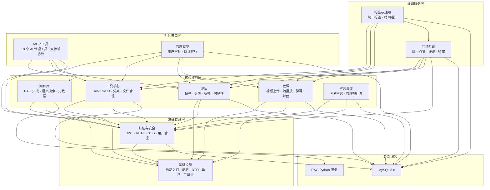

# 后端

## 后端概述

CodingHub 后端基于 Java 17 / Spring Boot 3.2.5 构建，采用经典的 Controller - Service - Repository - Model 四层架构，运行端口 8082。后端共包含 22 个控制器、22 个服务、26 个数据仓库和 35 个实体模型，通过 MySQL 8.x 持久化数据，使用 Flyway 管理数据库迁移（V1~V9）。系统实现了 JWT 无状态认证、RBAC 三级角色权限（USER / ADMIN / SUPER_ADMIN）、全局 XSS 防护和统一异常处理体系。业务上覆盖 AI 工具管理、社区论坛、微课视频、RAG 知识库、留言反馈、标签、通知、MCP AI 代理接口及后台管理等完整功能域。

---

## 架构全景

---

## 子模块一览

| 子模块 | 简要说明 | 详情 |
|--------|---------|------|
| **基础设施** | 应用启动入口（`ToolSquareApplication`）、文件上传与视频存储配置、61 个 DTO、9 个异常类的分层异常体系、`ApiResponse`/`PageResponse` 统一响应封装、`AvatarUtil` 工具类 | [基础设施](后端_基础设施.md) |
| **认证与安全** | Spring Security + JWT 双令牌（access/refresh）无状态认证、BCrypt 密码哈希、RBAC 三级角色、`JwtAuthenticationFilter` 过滤器链、`XssSanitizer` 全局 XSS 防护、用户注册审批流程、头像管理 | [认证与安全](后端_认证与安全.md) |
| **MCP 工具** | 基于 MCP 2.0.0 标准暴露 18 个 AI 代理工具，支持 Streamable HTTP 和 SSE 双传输协议，覆盖工具管理（11 个）、社区论坛（3 个）、知识库（6 个）三大领域，通过 `RagApiClient` 桥接 RAG 服务 | [MCP 工具](后端_MCP工具.md) |
| **管理概览** | `AdminController` 用户审批/封禁/删除，`OverviewController` 平台统计（用户/工具/帖子/微课计数）与三类排行榜 Top 10（按热度评分或播放量排序） | [管理概览](后端_管理概览.md) |
| **工具核心** | AI 工具完整生命周期管理——创建（同名查重）、更新（权限 + 查重）、软删除（级联文件清理）、分页查询（hot/latest/name 三种排序）、热度评分算法（浏览 x1 + 点赞 x3 + 评论 x5）、附件文件上传下载、分类管理 | [工具核心](后端_工具核心.md) |
| **互动系统** | 统一点赞/评论/收藏三大互动能力，通过 `TargetType`（TOOL/FORUM_POST/VIDEO）将三种资源统一到同一套表和接口；支持匿名点赞（IP 哈希去重）、嵌套评论（parentId + rootId 两级嵌套）、收藏列表多态返回 | [互动系统](后端_互动系统.md) |
| **留言反馈** | 用户意见收集系统，支持匿名和登录用户提交留言（建议/Bug/表扬/其他），管理员回复与软删除，分类筛选分页查询，XSS 防护与 IP 哈希隐私保护 | [留言反馈](后端_留言反馈.md) |
| **论坛** | 社区帖子完整生命周期——创建/编辑/软删除/搜索/置顶，公开/私有可能性控制，双排序策略（hot/latest），帖子-标签多对多关联，热度分数实时计算，论坛分类与标签管理 | [论坛](后端_论坛.md) |
| **知识库** | RAG 知识库管理——MySQL 元数据 + RAG Python 服务向量存储的混合架构，支持创建/查询/更新/软删除/语义搜索，RAG 配置容错（失败不阻断），集合名称 ASCII 安全转换，文档管理旁路设计（前端直连 RAG） | [知识库](后端_知识库.md) |
| **标签与通知** | 统一标签系统（[TagType](../backend/src/main/java/com/iaihub/toolbox/model/tag/TagType.java): TOOL/FORUM/VIDEO，幂等创建，使用计数安全增减）+ 站内通知系统（评论/点赞/审批事件驱动，自我通知过滤，未读计数，批量标记已读 JPQL 优化） | [标签与通知](后端_标签与通知.md) |
| **微课** | 视频上传（MP4, <=1GB）与 HTTP Range 流式播放（每次 1MB）、弹幕互动（SCROLL/TOP/BOTTOM 三种类型，XSS 过滤）、封面管理（24h 缓存）、热度排行、置顶、标签关联、软删除 | [微课](后端_微课.md) |

---

## 跨模块交互模式

### 1. 统一互动联动

互动系统作为横切服务，通过 `TargetType + targetId` 统一操作工具、帖子、视频三种资源。每次点赞/评论变化时同步更新目标资源的 `likeCount`/`commentCount` 反范式字段，并触发热度分数重算（`updateScore()`）。收藏列表根据 `TargetType` 多态返回不同类型的 DTO（`ToolSummaryDTO` / `ForumPostSummaryDTO` / `VideoListItem`）。

### 2. 标签系统联动

统一标签（`Tag`）通过 `TagType` 区分 TOOL/FORUM/VIDEO 三个领域，各业务模块在创建/更新资源时通过 `ToolTagRepository`、`VideoTagRepository`、`ForumPostTagRepository` 管理关联关系，并调用 `incrementUsage()`/`decrementUsage()` 维护使用计数。标签模块提供"查找或创建"幂等接口供其他 Service 调用。

### 3. 通知事件驱动

通知系统由用户互动事件驱动创建：评论服务调用 `createCommentNotification()`，点赞服务调用 `createLikeNotification()`，管理审批调用 `createAdminNotification()`。所有通知创建前检查操作者是否为内容所有者，避免自我通知。

### 4. MCP 聚合代理

MCP 模块作为平台对外 AI 代理入口，聚合调用工具服务（`ToolService`/`ToolFileService`）、论坛服务（`ForumPostService`）、知识库服务（`KnowledgeBaseService`）和认证服务（`UserService`），将核心能力封装为 18 个标准 MCP 工具。MCP 写操作通过工具参数传入 `username`/`password` 完成身份验证。

### 5. 管理概览数据聚合

概览服务（`OverviewServiceImpl`）横向聚合四个 Repository（`UserRepository`、`ToolRepository`、`ForumPostRepository`、`VideoRepository`）的数据，提供平台级统计和排行榜。管理控制器（`AdminController`）通过 `UserService` 间接操作用户数据，遵循控制器不直接访问 Repository 的分层原则。

### 6. RAG 服务桥接

知识库模块和 MCP 模块均通过 `RagApiClient` 与外部 Python RAG 服务通信。知识库采用"MySQL 优先"双写策略——RAG 配置失败仅记录警告不阻断主流程。文档管理采用旁路设计，前端直接调用 RAG 服务 API，Java 后端仅负责元数据管理和搜索代理。

### 7. 共享权限模型

所有业务模块遵循统一的权限规则：内容创建需要登录，内容修改/删除需要 `isOwner || isAdmin`，置顶操作需要 `ADMIN` 或 `SUPER_ADMIN` 角色（`@PreAuthorize`）。认证模块提供 `JwtAuthenticationFilter` 和 `SecurityConfig` 作为全局安全基础设施，被所有模块复用。
