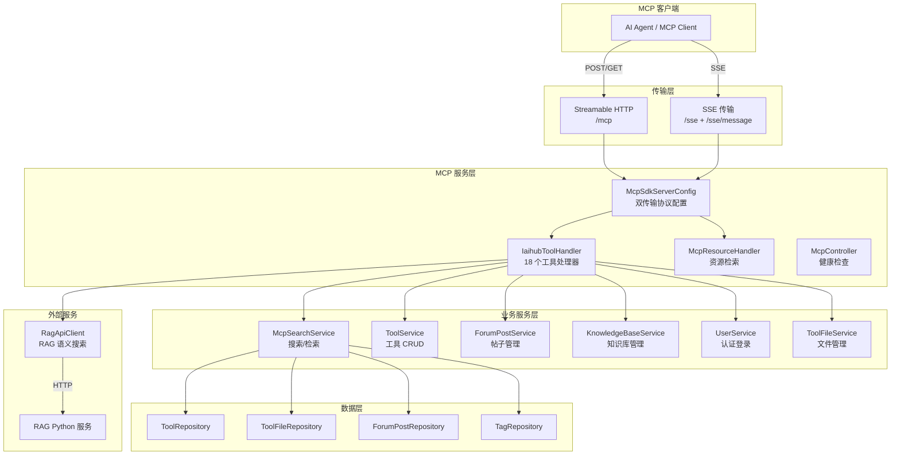
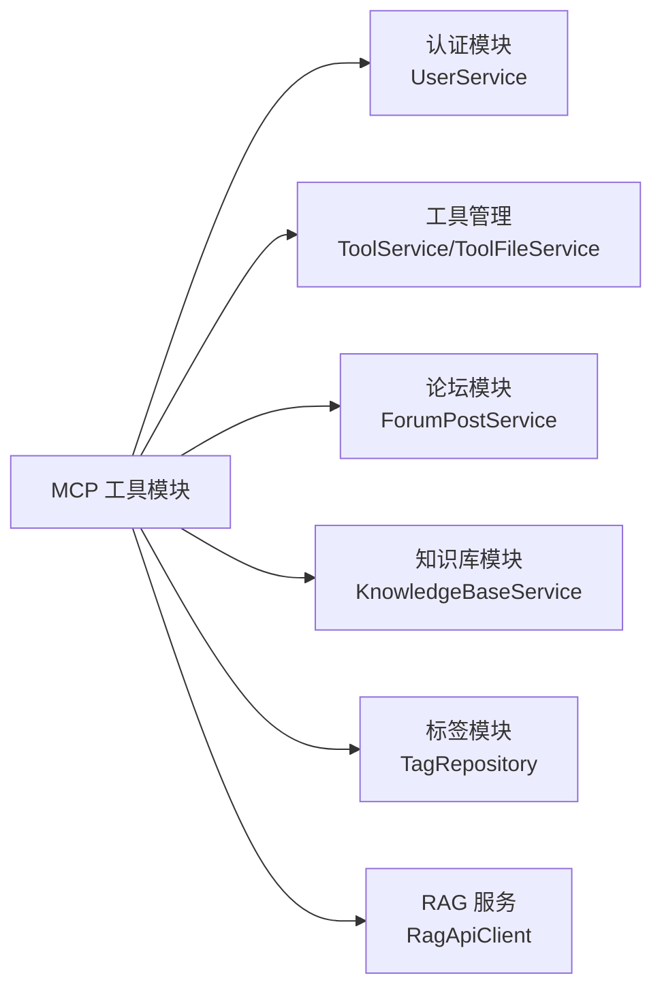

# 后端/MCP工具

## 模块简介

MCP工具模块是 CodingHub 平台的 AI 代理接口层，基于 Model Context Protocol (MCP) 2.0.0 标准实现。该模块将平台的工具管理、社区论坛、知识库等核心能力封装为 18 个 MCP 工具，供 AI 客户端（如 Claude Desktop、Cursor、QoderCN 等）通过标准化协议远程调用。模块同时支持 Streamable HTTP 和 SSE 两种传输协议，兼顾新版和旧版 MCP 客户端的兼容性。

---

## 架构概览



---

## 核心组件

### 1. [McpSdkServerConfig](../backend/src/main/java/com/iaihub/toolbox/mcp/McpSdkServerConfig.java) — MCP SDK 服务器配置

**文件**: `backend/src/main/java/com/iaihub/toolbox/mcp/McpSdkServerConfig.java`

核心配置类，使用 MCP Java SDK 2.0.0 初始化服务器，同时注册两种传输协议：

| Bean | 端点 | 说明 |
|------|------|------|
| `streamableTransportProvider` | `/mcp` | MCP 协议 2025-03-26 新版传输，单一端点处理 POST/GET |
| `sseTransportProvider` | `/sse`, `/sse/message` | 旧版 SSE 传输，兼容不支持 streamable-http 的客户端 |
| `streamableMcpServer` | — | 主 McpServer 实例（@Primary），注册 18 个工具 |
| `sseMcpServer` | — | 备用 McpServer 实例，注册相同的 18 个工具 |
| `mcpJsonMapper` | — | Jackson JSON 映射器 |

工具注册通过 `registerTool()` 方法完成，每个工具包含名称、描述、JSON Schema 输入参数定义和处理函数。

### 2. [IaihubToolHandler](../backend/src/main/java/com/iaihub/toolbox/mcp/IaihubToolHandler.java) — 工具处理器

**文件**: `backend/src/main/java/com/iaihub/toolbox/mcp/IaihubToolHandler.java`

模块的核心业务逻辑类，处理全部 18 个 MCP 工具调用。依赖以下服务：

- `McpSearchService` — 搜索/检索操作
- `ToolService` / `ToolFileService` — 工具和文件管理
- `ForumPostService` — 帖子管理
- `UserService` — 用户认证
- `KnowledgeBaseService` — 知识库管理
- `RagApiClient` — RAG 语义搜索

**认证机制**: 写操作（创建/修改/删除）要求 MCP 客户端传入 `username` 和 `password` 参数，处理器内部调用 `userService.login()` 验证身份后执行操作。

**版本自增**: 修改工具时若未指定版本号，自动对当前版本最后一段数字 +1（如 `1.0.0` → `1.0.1`）。

### 3. [McpSearchService](../backend/src/main/java/com/iaihub/toolbox/service/McpSearchService.java) — MCP 搜索服务

**文件**: `backend/src/main/java/com/iaihub/toolbox/service/McpSearchService.java`

封装只读查询操作，提供工具和帖子的搜索与检索能力：

| 方法 | 说明 |
|------|------|
| `searchTools(query, category, limit)` | 搜索工具列表，批量解析标签避免 N+1 查询 |
| `getToolById(toolId)` | 获取工具详情（仅返回 NORMAL 状态） |
| `getToolFiles(toolId)` | 获取工具文件列表 |
| `getToolFile(toolId, fileId)` | 获取单个文件详情 |
| `searchPosts(query, limit)` | 搜索帖子（仅 NORMAL + PUBLIC） |
| `getPostById(postId)` | 获取帖子详情 |
| `getToolTags(toolId)` | 获取单个工具的标签 |
| `resolveTagsForTools(tools)` | 批量解析工具标签（性能优化） |

### 4. [McpResourceHandler](../backend/src/main/java/com/iaihub/toolbox/mcp/McpResourceHandler.java) — MCP 资源处理器

**文件**: `backend/src/main/java/com/iaihub/toolbox/mcp/McpResourceHandler.java`

提供 MCP 资源层接口（list/search/get），将平台工具映射为 MCP 资源供客户端浏览。

### 5. [McpController](../backend/src/main/java/com/iaihub/toolbox/controller/McpController.java) — HTTP 端点

**文件**: `backend/src/main/java/com/iaihub/toolbox/controller/McpController.java`

轻量级 REST 控制器，仅提供健康检查端点 `/mcp/health`。实际 MCP 协议通信由 SDK 的 TransportProvider 通过 ServletRegistrationBean 直接处理。

### 6. [McpConnectionManager](../backend/src/main/java/com/iaihub/toolbox/mcp/McpConnectionManager.java) — 连接管理器（已弃用）

**文件**: `backend/src/main/java/com/iaihub/toolbox/mcp/McpConnectionManager.java`

早期自实现的 SSE 连接管理器，包含连接注册、广播、心跳、关闭等功能。现已标记 `@Deprecated`，连接管理由 MCP SDK 内置处理。

### 7. [RagApiClient](../backend/src/main/java/com/iaihub/toolbox/service/RagApiClient.java) — RAG 服务客户端

**文件**: `backend/src/main/java/com/iaihub/toolbox/service/RagApiClient.java`

HTTP 客户端，与 RAG Python 服务通信，提供知识库语义搜索和文档管理能力：

| 方法 | RAG API | 说明 |
|------|---------|------|
| `configureCollection()` | PUT `/api/collections/{name}/config` | 创建/更新 collection 配置 |
| `getCollectionConfig()` | GET `/api/collections/{name}/config` | 获取 collection 配置 |
| `deleteCollection()` | DELETE `/api/collections/{name}` | 删除 collection（容错） |
| `search()` | POST `/api/collections/{name}/search` | 语义搜索 |
| `getDocumentStatus()` | GET `/api/collections/{name}/documents/status` | 查询全部文档状态 |
| `getDocumentStatusById()` | GET `.../documents/{docId}/status` | 查询单个文档状态 |

### 8. 配置类

| 类 | 文件 | 说明 |
|----|------|------|
| `McpServerConfig` | `config/McpServerConfig.java` | MCP 服务器配置（端口、主机、最大连接数、超时），绑定 `mcp.server.*` |
| `RagClientConfig` | `config/RagClientConfig.java` | RAG HTTP 客户端 Bean，连接超时 10 秒 |

---

## MCP 工具清单

模块共注册 **18 个 MCP 工具**，分为三大领域：

### 工具管理（11 个）

| 工具名 | 说明 | 认证 |
|--------|------|------|
| `h3_coding_hub_tool_search` | 搜索工具列表，支持关键词和分类过滤 | 否 |
| `h3_coding_hub_tool_get` | 获取工具详情，含完整 markdown 文档和标签 | 否 |
| `h3_coding_hub_tool_files` | 获取工具附件文件列表 | 否 |
| `h3_coding_hub_tool_download` | 获取文件下载链接（相对路径，需拼接服务器地址） | 否 |
| `h3_coding_hub_tool_create` | 创建新工具，返回工具 ID | 是 |
| `h3_coding_hub_tool_modify` | 修改工具，支持部分更新，版本号自动递增 | 是 |
| `h3_coding_hub_tool_file_upload` | 获取文件上传 REST API 信息（Multipart POST） | 否 |
| `h3_coding_hub_tool_file_delete` | 删除工具附件，同时清理物理文件 | 是 |

### 社区论坛（3 个）

| 工具名 | 说明 | 认证 |
|--------|------|------|
| `h3_coding_hub_post_search` | 搜索社区帖子 | 否 |
| `h3_coding_hub_post_get` | 获取帖子详情和完整内容 | 否 |
| `h3_coding_hub_post_create` | 创建新帖子 | 是 |

### 知识库（6 个）

| 工具名 | 说明 | 认证 |
|--------|------|------|
| `h3_coding_hub_kb_list` | 获取知识库列表，支持分页和热度排序 | 否 |
| `h3_coding_hub_kb_search` | 对指定知识库执行语义搜索 | 否 |
| `h3_coding_hub_kb_create` | 创建知识库，可配置分块模式和 RAG 参数 | 是 |
| `h3_coding_hub_kb_update` | 更新知识库名称/描述/RAG 配置 | 是 |
| `h3_coding_hub_kb_delete` | 删除知识库 | 是 |
| `h3_coding_hub_kb_upload_document` | 获取文档批量上传 REST API 信息（直连 RAG 服务） | 否 |
| `h3_coding_hub_kb_document_status` | 查询文档处理状态（上传/转换/分块/向量化/完成） | 否 |

---

## 重要数据结构

### [McpSearchRequest](../backend/src/main/java/com/iaihub/toolbox/dto/McpSearchRequest.java)（搜索请求 DTO）

```java
public class McpSearchRequest {
    String query;      // 搜索关键词，最长 200 字符
    String category;   // 分类名称
    Integer limit;     // 返回数量限制，1~100，默认 20
}
```

### MCP 响应 DTO（内部类）

[IaihubToolHandler](../backend/src/main/java/com/iaihub/toolbox/mcp/IaihubToolHandler.java) 内定义了多个私有 DTO 类用于序列化 MCP 工具响应：

| DTO | 用途 |
|-----|------|
| `ToolSearchResponse` | 工具搜索结果，含 tools 列表和 count |
| `ToolDetailResponse` | 工具详情，含 id/name/version/content/category/tags |
| `ToolFilesResponse` | 文件列表，含 files 和 toolId |
| `FileInfo` | 单个文件信息：fileName/fileSize/downloadUrl/createdAt |
| `PostSearchResponse` | 帖子搜索结果 |
| `PostDetailResponse` | 帖子详情 |
| `FileDownloadResponse` | 文件下载信息 |
| `FileUploadInfoResponse` | 文件上传 API 说明 |
| `FileDeleteResponse` | 文件删除确认 |
| `ErrorResponse` | 错误信息 |
| `KbListResponse` | 知识库列表（分页） |
| `KbSearchResponse` | 知识库语义搜索结果 |
| `KbDeleteResponse` | 知识库删除确认 |
| `KbUploadDocumentInfoResponse` | 知识库文档上传 API 说明（含 curl 示例） |
| `KbDocumentStatusResponse` | 文档处理状态列表 |

### MCP 服务器配置

```java
// McpServerConfig — 绑定 mcp.server.* 前缀
int port = 8082;               // 服务端口
String host = "0.0.0.0";       // 绑定地址
boolean enabled = true;         // 是否启用
int maxConnections = 10;        // 最大连接数
int connectionTimeoutMs = 30000; // 连接超时
```

---

## 依赖关系

### 内部依赖



### 外部依赖

| 依赖 | 用途 |
|------|------|
| `io.modelcontextprotocol:mcp-sdk` | MCP 协议 SDK 2.0.0，提供 McpServer、Transport、Schema |
| `com.fasterxml.jackson` | JSON 序列化/反序列化 |
| `java.net.http.HttpClient` | 与 RAG Python 服务 HTTP 通信 |
| Spring Boot `ServletRegistrationBean` | 注册 MCP Transport Servlet |

### 被依赖

MCP 模块作为平台对外暴露 AI 代理能力的入口，不直接被其他后端模块调用，而是被外部 MCP 客户端通过标准协议访问。

---

## API 端点

| 端点 | 方法 | 说明 |
|------|------|------|
| `/mcp` | POST/GET | Streamable HTTP MCP 协议端点（SDK 管理） |
| `/sse` | GET | SSE 连接端点（SDK 管理） |
| `/sse/message` | POST | SSE 消息端点（SDK 管理） |
| `/mcp/health` | GET | 健康检查，返回状态/版本/时间戳 |

---

## 关键设计决策

1. **双传输协议支持**: 同时部署 Streamable HTTP（新版）和 SSE（旧版）两种 MCP 传输，两个 McpServer 实例各自注册相同的 18 个工具，确保所有 MCP 客户端均可连接。

2. **MCP 内认证**: MCP 协议本身无认证机制，模块通过在工具参数中要求 `username`/`password` 并在服务端调用 `userService.login()` 实现身份验证。密码默认 `123456`。

3. **文件上传走 REST**: MCP 协议不支持二进制传输，文件上传（工具附件和知识库文档）通过告知客户端 REST API 地址，由客户端直接 HTTP Multipart POST 完成。

4. **N+1 查询优化**: `McpSearchService.resolveTagsForTools()` 批量获取所有工具的标签关联和标签实体，避免列表查询时逐个工具查标签导致的 N+1 问题。

5. **RAG 解耦**: 知识库语义搜索和文档管理通过 `RagApiClient` 调用独立的 Python RAG 服务，MCP 模块仅作为中间代理转发。
