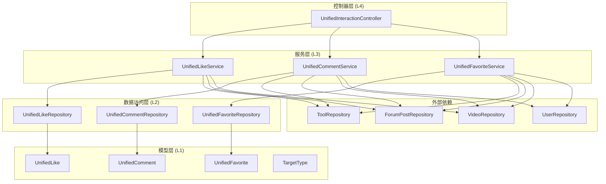
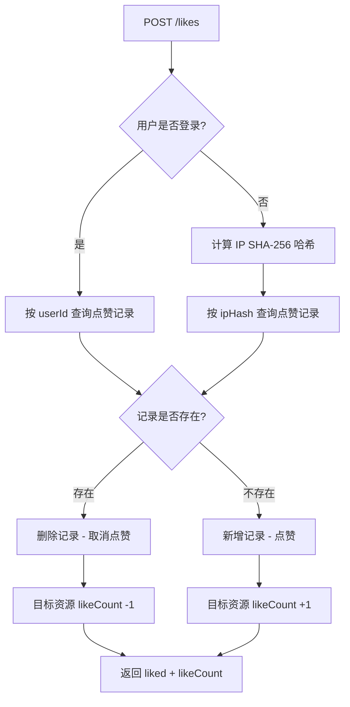
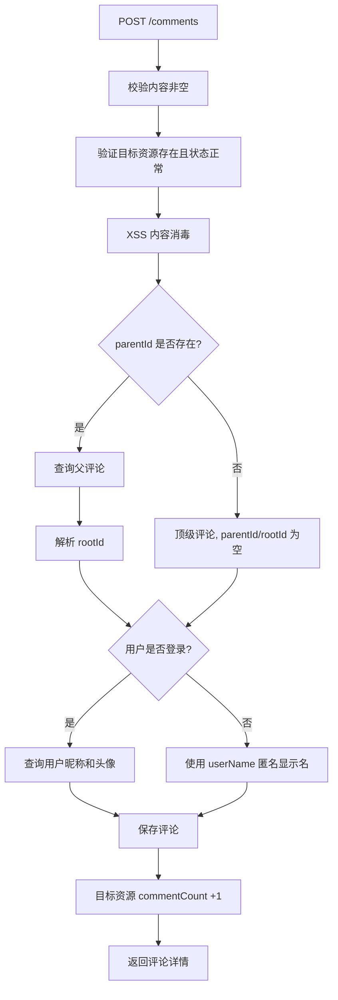

# 后端互动系统

## 模块概述

互动系统是 CodingHub 平台的核心社交功能模块，提供统一的点赞（Like）、评论（Comment）和收藏（Favorite）三大互动能力。该模块采用"统一目标"设计模式，通过 `TargetType` 枚举将互动行为抽象为通用操作，支持对工具（TOOL）、论坛帖子（FORUM_POST）和微课视频（VIDEO）三种资源类型的统一互动。

**基础路径**: `/api/v1/interactions`

---

## 架构概览



---

## 分层结构

| 层级 | 组件 | 职责 |
|------|------|------|
| **控制器层** | `UnifiedInteractionController` | REST API 入口，处理 HTTP 请求、用户认证、IP 哈希计算 |
| **服务层** | `UnifiedLikeService` | 点赞/取消点赞业务逻辑，支持登录用户和匿名用户 |
| **服务层** | `UnifiedCommentService` | 评论的增删查，支持嵌套回复和匿名评论 |
| **服务层** | `UnifiedFavoriteService` | 收藏/取消收藏，获取用户收藏列表（需登录） |
| **数据访问层** | `UnifiedLikeRepository` | 点赞数据 CRUD，区分登录用户和匿名用户的查询 |
| **数据访问层** | `UnifiedCommentRepository` | 评论数据分页查询和计数 |
| **数据访问层** | `UnifiedFavoriteRepository` | 收藏数据的查询、存在性检查和删除 |
| **模型层** | `UnifiedLike` / `UnifiedComment` / `UnifiedFavorite` | JPA 实体，映射数据库表 |
| **枚举** | `TargetType` | 目标资源类型枚举（TOOL / FORUM_POST / VIDEO） |

---

## 核心组件详解

### 1. [TargetType](../backend/src/main/java/com/iaihub/toolbox/model/TargetType.java) -- 目标资源类型枚举

定义互动行为可作用的资源类型，是整个互动系统的基石。

| 枚举值 | 说明 |
|--------|------|
| `TOOL` | AI 工具资源 |
| `FORUM_POST` | 论坛帖子 |
| `VIDEO` | 微课视频 |

提供 `fromString(String)` 静态方法进行安全解析，对无效值抛出 `BusinessException(400)`。内部使用 `VALID_VALUES` 集合做快速校验。

### 2. [UnifiedInteractionController](../backend/src/main/java/com/iaihub/toolbox/controller/UnifiedInteractionController.java) -- 统一互动控制器

**路径前缀**: `/api/v1/interactions`

统一暴露点赞、评论、收藏三组 REST API，内部通过 `getCurrentUser()` 获取 Spring Security 认证信息，通过 `computeIpHash()` 为匿名用户生成 IP 指纹。

**IP 哈希算法**: 使用 SHA-256 对客户端 IP 地址进行哈希处理，支持 `X-Forwarded-For` 代理头。匿名用户使用 IP 哈希代替 `userId` 进行点赞去重。

### 3. [UnifiedLikeService](../backend/src/main/java/com/iaihub/toolbox/service/UnifiedLikeService.java) -- 统一点赞服务

**核心特性**:
- **Toggle 模式**: 点赞/取消点赞通过同一接口实现，已有记录则删除（取消），无记录则新增（点赞）
- **双身份支持**: 登录用户按 `userId` 去重，匿名用户按 `ipHash` 去重
- **计数同步**: 点赞/取消后同步更新目标资源的 `likeCount` 字段
- **分数联动**: 对论坛帖子的点赞会触发 `post.updateScore()` 更新帖子排序分数

### 4. [UnifiedCommentService](../backend/src/main/java/com/iaihub/toolbox/service/UnifiedCommentService.java) -- 统一评论服务

**核心特性**:
- **嵌套回复**: 支持通过 `parentId` 进行评论回复，自动解析 `rootId` 实现两级嵌套结构
- **匿名评论**: 未登录用户可通过 `userName` 字段提供显示名称
- **XSS 防护**: 评论内容经过 `XssSanitizer.sanitize()` 消毒处理
- **计数同步**: 新增/删除评论时自动更新目标资源的 `commentCount`，论坛帖子额外触发 `updateScore()`
- **权限控制**: 删除评论需要 `isOwner || isAdmin` 权限校验
- **分页查询**: 评论按创建时间升序排列，单页最大 100 条

### 5. [UnifiedFavoriteService](../backend/src/main/java/com/iaihub/toolbox/service/UnifiedFavoriteService.java) -- 统一收藏服务

**核心特性**:
- **强制登录**: 所有收藏操作均要求用户登录，未登录返回 401
- **Toggle 模式**: 收藏/取消收藏通过同一接口实现
- **收藏列表**: `getMyFavorites` 按目标类型返回实际资源 DTO（而非收藏记录本身），按收藏时间降序排列
- **多态返回**: 根据 `TargetType` 返回不同类型的 DTO：
  - `TOOL` -> `ToolSummaryDTO`（工具摘要）
  - `FORUM_POST` -> `ForumPostSummaryDTO`（帖子摘要，内部静态类）
  - `VIDEO` -> `VideoListItem`（视频列表项）
- **软删除过滤**: 查询收藏列表时自动过滤已删除的资源（`status == NORMAL`）

---

## 数据模型

### 数据库表结构

#### unified_like (统一点赞表)

| 字段 | 类型 | 说明 |
|------|------|------|
| `id` | BIGINT (PK) | 自增主键 |
| `target_type` | VARCHAR(20) | 目标类型（TOOL/FORUM_POST/VIDEO） |
| `target_id` | BIGINT | 目标资源 ID |
| `user_id` | BIGINT | 登录用户 ID（可为空） |
| `ip_hash` | VARCHAR(64) | 匿名用户 IP 哈希（SHA-256） |
| `created_at` | DATETIME | 创建时间 |

**唯一约束**:
- `uk_like_user`: `(target_type, target_id, user_id)` -- 登录用户唯一
- `uk_like_anon`: `(target_type, target_id, ip_hash)` -- 匿名用户唯一

**索引**: `idx_like_target` on `(target_type, target_id)`

#### unified_comment (统一评论表)

| 字段 | 类型 | 说明 |
|------|------|------|
| `id` | BIGINT (PK) | 自增主键 |
| `target_type` | VARCHAR(20) | 目标类型 |
| `target_id` | BIGINT | 目标资源 ID |
| `user_id` | BIGINT | 评论用户 ID（匿名可为空） |
| `user_name` | VARCHAR(50) | 匿名用户显示名 |
| `parent_id` | BIGINT | 父评论 ID（回复时使用） |
| `root_id` | BIGINT | 根评论 ID（用于两级嵌套） |
| `content` | TEXT | 评论内容（经 XSS 过滤） |
| `like_count` | INT | 评论点赞数（默认 0） |
| `created_at` | DATETIME | 创建时间 |
| `updated_at` | DATETIME | 更新时间 |

**索引**:
- `idx_comment_target` on `(target_type, target_id, created_at)`
- `idx_comment_root` on `(root_id)`

#### unified_favorite (统一收藏表)

| 字段 | 类型 | 说明 |
|------|------|------|
| `id` | BIGINT (PK) | 自增主键 |
| `target_type` | VARCHAR(20) | 目标类型 |
| `target_id` | BIGINT | 目标资源 ID |
| `user_id` | BIGINT | 收藏用户 ID |
| `created_at` | DATETIME | 收藏时间 |

**唯一约束**: `uk_fav` on `(user_id, target_type, target_id)` -- 用户对同一资源只能收藏一次

**索引**: `idx_fav_user` on `(user_id, target_type)`

---

## DTO 数据结构

### [InteractionRequest](../backend/src/main/java/com/iaihub/toolbox/dto/InteractionRequest.java) (互动请求)

| 字段 | 类型 | 校验 | 说明 |
|------|------|------|------|
| `targetType` | String | @NotBlank | 目标类型 |
| `targetId` | Long | @NotNull | 目标资源 ID |
| `content` | String | -- | 评论内容（仅评论时使用） |
| `parentId` | Long | -- | 父评论 ID（嵌套回复时使用） |
| `userName` | String | -- | 匿名用户显示名（仅评论时使用） |

### [InteractionResponse](../backend/src/main/java/com/iaihub/toolbox/dto/InteractionResponse.java) (互动响应)

通用响应 DTO，根据不同互动类型返回不同字段组合，使用 `@JsonInclude(NON_NULL)` 避免返回空字段。

| 字段 | 适用场景 | 说明 |
|------|---------|------|
| `liked` | 点赞 | 当前是否已点赞 |
| `likeCount` | 点赞 | 总点赞数 |
| `favorited` | 收藏 | 当前是否已收藏 |
| `id` | 评论 | 评论 ID |
| `targetType` / `targetId` | 评论 | 目标资源 |
| `userId` / `userName` / `userNickname` / `userAvatarUrl` | 评论 | 评论者信息 |
| `parentId` / `rootId` | 评论 | 嵌套关系 |
| `content` | 评论 | 评论内容 |
| `commentLikeCount` | 评论 | 评论点赞数 |
| `createdAt` | 评论 | 创建时间 |

提供两个工厂方法：
- `likeToggle(boolean liked, int likeCount)` -- 构造点赞响应
- `favoriteToggle(boolean favorited)` -- 构造收藏响应

---

## API 端点

### 点赞相关

| 方法 | 路径 | 说明 | 认证 |
|------|------|------|------|
| `POST` | `/api/v1/interactions/likes` | 切换点赞状态 | 可选（支持匿名） |
| `GET` | `/api/v1/interactions/likes/status` | 查询点赞状态和计数 | 可选 |

**POST /likes 请求体**:
```json
{
  "targetType": "TOOL",
  "targetId": 42
}
```

**响应示例**:
```json
{
  "code": 200,
  "data": {
    "liked": true,
    "likeCount": 128
  }
}
```

### 评论相关

| 方法 | 路径 | 说明 | 认证 |
|------|------|------|------|
| `POST` | `/api/v1/interactions/comments` | 发表评论/回复 | 可选（支持匿名） |
| `GET` | `/api/v1/interactions/comments` | 获取评论列表（分页） | 无 |
| `DELETE` | `/api/v1/interactions/comments/{id}` | 删除评论 | 必须（Owner 或 Admin） |

**POST /comments 请求体**:
```json
{
  "targetType": "FORUM_POST",
  "targetId": 10,
  "content": "这是一条评论内容",
  "parentId": null,
  "userName": "匿名用户"
}
```

**GET /comments 查询参数**:
- `targetType` (String, 必填) -- 目标类型
- `targetId` (Long, 必填) -- 目标 ID
- `page` (int, 默认 0) -- 页码
- `size` (int, 默认 20, 最大 100) -- 每页数量

### 收藏相关

| 方法 | 路径 | 说明 | 认证 |
|------|------|------|------|
| `POST` | `/api/v1/interactions/favorites` | 切换收藏状态 | 必须 |
| `GET` | `/api/v1/interactions/favorites` | 获取我的收藏列表 | 必须 |
| `GET` | `/api/v1/interactions/favorites/status` | 查询收藏状态 | 必须 |

**GET /favorites 查询参数**:
- `targetType` (String, 必填) -- 收藏类型（TOOL/FORUM_POST/VIDEO）
- `page` (int, 默认 0) -- 页码
- `size` (int, 默认 10, 最大 100) -- 每页数量

---

## 业务流程图

### 点赞 Toggle 流程



### 评论嵌套回复流程



---

## 模块依赖关系

### 内部依赖

互动系统作为横切关注点，依赖以下领域模块的 Repository：

| 依赖模块 | Repository | 用途 |
|---------|-----------|------|
| 工具模块 | `ToolRepository` | 验证工具存在、更新点赞/评论计数 |
| 论坛模块 | `ForumPostRepository` | 验证帖子存在、更新点赞/评论计数、更新排序分数 |
| 微课模块 | `VideoRepository` | 验证视频存在、更新点赞/评论计数 |
| 用户模块 | `UserRepository` | 获取评论者昵称和头像 |

### 外部依赖

| 组件 | 用途 |
|------|------|
| Spring Security | 用户认证（`SecurityContextHolder`） |
| `XssSanitizer` | 评论内容 XSS 过滤 |
| `PageResponse` | 通用分页响应 DTO |
| `ApiResponse` | 通用 API 响应包装 |

### 异常处理

| 异常类型 | 触发场景 |
|---------|---------|
| `BusinessException(400)` | 无效的 `targetType`、评论内容为空 |
| `BusinessException(401)` | 收藏操作未登录 |
| `ResourceNotFoundException` | 目标资源不存在或已删除、父评论不存在、评论不存在 |
| `ForbiddenException` | 非 Owner 且非 Admin 尝试删除评论 |

---

## 设计要点

1. **统一互动模型**: 通过 `targetType + targetId` 组合将三种资源类型的互动统一到同一套表和接口中，避免为每种资源重复创建独立的点赞/评论/收藏表。

2. **双身份点赞**: 点赞功能同时支持登录用户（`userId` 去重）和匿名用户（`ipHash` 去重），通过数据库双唯一约束保证数据一致性。

3. **计数反范式设计**: 点赞数和评论数冗余存储在目标资源表中（`likeCount` / `commentCount`），避免每次展示都需要 COUNT 查询，提升读取性能。

4. **两级嵌套评论**: 通过 `parentId` + `rootId` 实现最多两级的评论嵌套结构，`rootId` 始终指向顶级评论，便于前端按主题分组展示。

5. **软删除兼容**: 所有 `validateTargetExists` 方法均检查资源的 `status` 字段，确保已软删除的资源不可被互动。

6. **分数联动更新**: 论坛帖子的点赞和评论变化时会触发 `updateScore()` 方法，用于社区排序算法。
